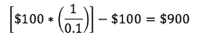
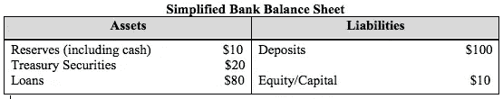
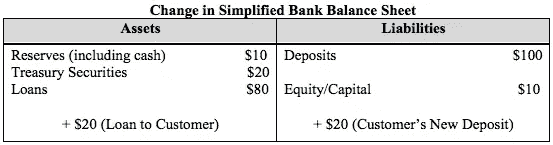
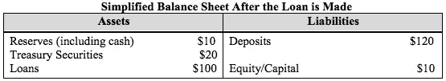

# 加拿大银行也创造货币

> 原文：<https://medium.com/coinmonks/canadian-banks-create-money-too-6c69e2c3d8f5?source=collection_archive---------0----------------------->

显然，很多人似乎不知道钱是如何创造出来的，其中一些人应该知道。据英国《卫报》一个多月前发表的一篇文章称，多达 85%的英国议员不知道英国经济中的大部分资金是由私人银行创造的，每次贷款都是如此。

这篇文章让我想起了我在阅读杰弗里·英厄姆的《T2》*【货币的本质】* 时偶然发现的一句凯恩斯名言:“我只知道三个人真正了解货币。另一所大学的教授；我的一个学生；和一个相当初级的英格兰银行职员。”我想事情没有太大变化。

谈到英格兰银行，我认为他们早在 2014 年就在一篇名为“现代经济中的货币创造”的论文中澄清了这一点，作者在论文的第一页就明确指出，“每当银行贷款时，它同时会在借款人的银行账户中创造匹配的存款，从而创造新的货币。”但是，我想英国议员们与其担心钱从哪里来，还不如花时间做些更好的事情，比如抱怨政府预算赤字会给未来几代人带来难以承受的负担，以及诸如此类的重要事情。

这一切让我不仅想知道加拿大国会议员是否也同样不知道，还想知道加拿大银行是否发布了任何像英国银行一样披露的文件。不幸的是，我没有看到任何明确的东西。至于加拿大议员对我们货币体系的了解情况，谁知道呢？然而，我确实发现了加拿大议会图书馆在 2015 年发布的一篇名为《加拿大银行如何为联邦政府创造财富:运营和法律方面》的[简报](https://lop.parl.ca/sites/PublicWebsite/default/en_CA/ResearchPublications/201551E)

**钱从哪里来在加拿大**

在讨论了加拿大银行如何通过参与政府的证券拍卖并购买其债务来为联邦政府创造货币后，简报的作者 Penny Becklumb 和 Mathieu Frigon 继续解释了私人银行如何通过有效地做同样的事情来创造货币——在拍卖中购买政府的债务。但这还不是全部。

私人银行也通过向私人家庭和企业发放贷款来创造货币。以下是贝克伦布和弗里贡[所说的话](https://lop.parl.ca/Content/LOP/ResearchPublications/2015-51-e.html?cat=economics#a3):“值得注意的是，每当银行发放新的贷款，比如房屋抵押贷款或商业贷款时，私人银行系统内也会创造出货币。每当银行发放贷款时，它就同时在借款人的账户上创造一笔相应的存款，从而创造出新的货币。”

不管是不是巧合，第二句话几乎和英国央行报告中的那一行一字不差。我想读完那份报告后，Becklumb 和 Frigon 和我一样，想知道加拿大的情况如何，然后决定值得向议会报告。如果三年后，85%的英国议员仍然不明白，我想加拿大议员也不会更接近事实。我可能错了。

不管怎样，与英国和加拿大的议员们脑海中浮现的相反，是银行贷款创造了银行存款，而不是相反。这对其他人来说可能是新闻，也可能不是。如果你上过一门经济学课，这门课的一部分是关于货币和银行的，这可能是旧闻了，这正是部分准备金银行体系所隐含的货币乘数所解释的，或者说是试图解释的。

我同意这实际上是旧闻，但我不同意这一消息正是货币乘数、部分准备金银行和准备金率所解释的。事实上，部分准备金模型的假设正好相反——存款创造贷款。

**部分准备金银行模式**

假设有人将 100 美元现金存入他们的银行账户。根据部分准备金模型，银行现在可以贷出这 100 美元中的一部分，并且必须将其余部分保留在准备金中。保留在准备金上的金额由准备金率决定，在这个例子中，我将遵循标准的宏观教科书，并说它是 10%。这意味着银行可以贷出 90%，即 90 美元，并且必须保留 10%，即 10 美元的准备金。这里重要的是假设最初的 100 美元存款是为了银行发放贷款而首先需要的——存款创造贷款。

银行借给别人的这 90 美元现在被认为是新创造的货币，因为第一个在银行存了 100 美元的人仍然有 100 美元，而借钱的人现在有 90 美元。总共 190 美元，最初是 100 美元。如果这个借款人拿了钱，然后存入他们的银行账户，整个过程可以重复一个新的借款人。这一次，9 美元将被保留，只有 81 美元可以借出。

你可以看到，这个过程每重复一次，能借出去的量就越来越少。最初的 100 美元可以创造出的新货币总量可以用准备金率的倒数(1/0.1)来计算，也就是货币乘数。将最初的 100 美元乘以乘数，然后减去相同的初始金额，将得到从初始存款中创造的新货币的总数。

就这些，900 美元的新钱，不多不少。如果银行想借出更多的钱，他们要么需要吸引新的存款，要么等待央行提供更多的准备金。银行可以创造有限数量的新货币，但受到准备金率的约束，最终是央行通过增加或减少银行准备金来控制货币供应。这就是部分准备金银行模型，你可以在大多数标准的宏观经济学教科书中找到。但这并不是银行系统的实际运作方式。

**金钱的等级制度**

要知道为什么，让我们从引用约瑟夫·熊彼特于 1954 年死后出版的《经济分析史》**开始。他写道，“说银行‘创造信用’，也就是说，它们通过放贷行为创造存款，比说它们贷出委托给它们的存款，要现实得多。”虽然与我们其他两位主角的说法不完全相同，但精神是相同的。**

**值得思考这些差异。注意，熊彼特说银行创造的是“信用”而不是“货币”，英格兰银行和议会图书馆都使用这个词。然而，他立即用“存款”一词代替了“信用”，使他更接近我们所熟悉的。但是到底是哪个呢？存款最好被认为是信用还是货币？**

**这完全取决于视角。从银行的角度来看，这笔新的存款是一种承诺，即支付我们都同意无疑是钱的东西——现金。然而，因为这笔存款代表着*承诺* *支付*金钱，一种欠条，似乎最好将这笔存款称为信用而不是金钱。**

**这是银行的观点。从存款人的角度来看，因为存款可以用来清偿债务，也可以用来购买商品和服务，而不必转换成现金，所以它也可以是货币。虽然一般公众可能不会将存款本身称为金钱(更多地将其视为某种安全存放其金钱的容器)，但这种一般公众肯定会将其存款帐户的余额视为其金钱的代表。再次，它可以用来支付东西和解决债务。从普通大众的角度来看，是钱。**

**这种观点上的分歧让人们相信[货币体系是分等级的](http://ieor.columbia.edu/files/seasdepts/industrial-engineering-operations-research/pdf-files/Mehrling_P_FESeminar_Sp12-02.pdf)。在像加拿大这样的国家，加拿大银行发行的货币(即现金和储备)位于该层级的顶端。银行存款是由私人银行发行的，等级较低。我发给朋友和家人的借条在等级上要低得多。人们可以把所有的钱都看作是一种信用形式，尽管并不是所有的信用都被认为是钱。这完全取决于你所处的层级。**

**货币的这种等级制度常常被这样一个事实所掩盖，即我们用货币这个词来指中央银行发行的东西和私人银行发行的东西。这里是[英格兰银行的](http://www.bankofengland.co.uk/publications/Documents/quarterlybulletin/2014/qb14q1prereleasemoneycreation.pdf):[广义货币](https://www.investopedia.com/terms/b/broad-money.asp)由银行存款和货币构成，银行存款实质上是商业银行给家庭和公司的借条，而货币主要是中央银行的借条。通过将货币(即现钞和硬币)和银行存款都称为货币，银行认识到这样一个事实，即对于公众来说，银行存款可以像实物现金一样购买商品和服务。有人可能会说，存款实际上在这些方面做得更好，因为现金对于大额购物来说变得很尴尬(在物理上和社会上)。**

**由于存款更适合大额购买，因此有理由认为经济中的大部分货币都是以这种形式出现的。这种假设是正确的，因为议会图书馆的简报[上写着](https://lop.parl.ca/Content/LOP/ResearchPublications/2015-51-e.html?cat=economics#a3)，“事实上，经济中的大部分货币都是在私人银行系统内创造的。”英国银行甚至更加具体“在这两种广义货币中，银行存款占了绝大部分——占目前流通总量的 97%。”**

****现实世界中的银行业****

**当我们转向研究私人银行实际上是如何创造经济中的大部分货币时，有必要再举一个银行不做什么的例子。**

**假设我借给一个朋友 20 美元。我给我的朋友 20 美元现金，期望在将来的某一天我的朋友会还我 20 美元。这类似于部分准备金模型中的银行所做的；虽然，如果我真的是一家银行，并且我只有 20 美元，那么我只能借出 18 美元，并且必须把另外 2 美元存起来。但这恰恰是银行不会做的事情。银行不向客户出借储备或现金。**

**相反，当银行发放贷款时，它同时在资产负债表上创造了一项资产和一项负债。这里有一个简化的银行资产负债表的例子来说明我所说的。**

****

**这里有几件重要的事情需要注意。首先，注意资产负债表的两边是相等的:负债端的 110 美元与资产端的 110 美元相匹配。其次，请注意准备金正好是存款的 10%，这意味着在发放贷款之前满足了监管准备金要求(即使我证明部分准备金模型是不正确的，银行仍然必须遵守监管要求)。**

**假设银行贷款 20 美元。该过程显示在下面的资产负债表中。**

****

**正如你所看到的，资产负债表的顶部仍然和以前一样，但是现在，我们看到银行在资产负债表的资产端和负债端都增加了 20 美元来表示发放新贷款的过程。请注意，在资产端，我们记录了一笔新的贷款，而在负债端，我们创造了一笔新的存款，这当然是新的资金。现在我们来看看贷款发放后的资产负债表。**

****

**注意资产负债表仍然是平衡的。此外，请注意，在延长贷款时，准备金的数量没有变化。没有提取准备金来发放贷款。换句话说，正如部分准备金模型所假设的那样，没有准备金被借出。银行只是创造了一项资产和一项抵消负债，而这项负债就是存款，也就是钱，全新的钱。这就是英格兰银行和加拿大议会图书馆所说的私人银行创造新货币的含义。**

**如果我想借 20 美元给我的朋友，按照这个银行模型的逻辑，我必须给我的朋友写一张 20 美元的借据。这张借据将是一个承诺，即按要求支付 20 美元现金。正如你所看到的，这就是金钱等级制度强有力地维护自己的地方。除非我的朋友可以用这 20 美元购买商品和服务，偿还债务，否则这对她没什么好处。银行借条(即存款)不存在这个问题。这是作为一家银行的特权。**

****银行贷款不受准备金约束****

**然而，上面的“贷款发放后的简化资产负债表”有一个问题。请注意，现在准备金不到总存款的 10%:10/120 = 0.833 或 8.3%。我们的银行现在违反了监管要求，或者说，如果它不纠正这种情况，至少最终会违反监管要求。**

**这里值得一提的是，上述银行不会违反加拿大以及[其他几个](https://www.federalreserve.gov/pubs/feds/2007/200754/200754pap.pdf)国家的任何准备金要求。这是因为这些国家的存款准备金率是 0%。没错，没有准备金要求。如果部分准备金模型是正确的，那么银行放贷的唯一限制将是准备金总额。一旦一家银行把所有的准备金都借出去，就这样，不再贷款了。但是，正如我一直认为的那样，这是不正确的。无论是否有准备金要求，银行都不受准备金约束。**

**原因很简单:在央行以利率水平为目标的货币体系中，央行将向银行体系提供任何必要的准备金，以维持其利率目标。我们会回来的。**

**看起来我们上面的例子不可能在现实世界中发生，因为一旦银行贷出 20 美元，它就违反了准备金要求。为了避免这种违规行为，银行将不得不拒绝该客户。然而，银行从来不会因为这个原因拒绝客户。他们可能会因为其他原因拒绝他们，但不是因为他们的储备将低于法定最低水平。**

**银行发放他们认为有利可图的贷款，然后寻找必要的准备金。纽约美联储银行前高级副总裁 Alan Holmes 在 1969 年说道:“在现实世界中，银行发放信贷，在这个过程中创造存款，然后寻找储备。”然后是欧洲央行副行长 vítor const ncio 在 2011 年[的一次演讲](https://www.ecb.europa.eu/press/key/date/2011/html/sp111208.en.html#footnote.8)“事实上，顺序更倾向于相反的方向，银行首先做出信贷决定，然后寻找必要的融资和央行资金储备。”**

**上述银行贷款的例子实际上是相当准确的。银行首先发放贷款，然后寻找准备金，它们可以在隔夜银行间拆借市场找到准备金。储备不足的银行将从储备过剩的银行借款。如果一家准备金不足的银行无法在银行间市场找到一个交易对手来借给他们准备金，他们总是可以求助于央行的[贴现窗口](https://www.investopedia.com/terms/d/discountwindow.asp)。**

**如果银行体系作为一个整体由于贷款活动增加而储备不足，这将对银行间利率产生上行压力，银行间利率是央行在实施货币政策时的关键利率。因为央行希望维持关键利率的特定水平，它将提供银行系统所需的必要准备金，以缓解上行压力(我告诉过你我们会回到这一点)。央行在储备供应方面是被动的，而不是主动的。**

**国际清算银行的 Claudio Borio 和 P. Disyatat 在 2009 年的一篇论文中证实了准备金要求不会像部分准备金模型假设的那样限制银行贷款的事实，他写道:“准备金水平几乎不会影响银行的贷款决策，”中央银行将提供银行需要的任何准备金:“为了避免利率的极端波动，中央银行根据系统(强调他们的观点)的要求提供准备金*。如果准备金是按需提供的，那么银行就不会受到准备金的约束。***

****结束语****

**贷款创造存款，对银行来说，这是一种信贷形式，对公众来说，这是钱。银行通过在资产负债表上同时创造资产和负债来创造这些钱，而不是通过分发现金或提取准备金。他们首先创造贷款，然后寻找必要的储备。中央银行向银行系统提供任何必要的储备，以维持其利率目标。**

**当然，是什么限制了银行贷款和货币供应总量——如果不是存款准备金率的话——这个问题仍然没有答案。这将不得不等待另一个职位。与此同时，希望议员们有机会补上他们的货币教育，如果他们还没有补上的话。**

> **[直接在您的收件箱中获得最佳软件交易](https://coincodecap.com/?utm_source=coinmonks)**

****