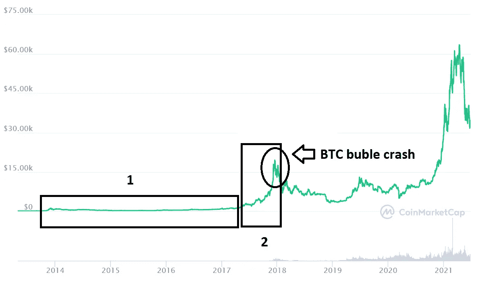

# 第一章:发现比特币和区块链技术(第二部分)

> 原文：<https://medium.com/coinmonks/cap-1-discovering-bitcoin-and-blockchain-technology-part-2-2ba3071d319a?source=collection_archive---------5----------------------->

Source: [Pixabay](https://pixabay.com/photos/network-astronomy-planet-space-3152677/)

欢迎来到第一章的第二部分！这里是[第一部](https://blockchaincopywriter.medium.com/cap-1-discovering-bitcoin-and-blockchain-technology-8994e3c3bb35?sk=f1558069366d3f92b9330d2691b3369f)。

# 我在 2017 年的比特币泡沫中

我非常幸运(当时我并不知道)在这个时候，蓬勃发展的密码行业迎来了第一个大明星时刻。在历史性的 2017 年 12 月 17 日，比特币触及 19783 美元。

在那个辉煌的 12 月，每一天，你都看到比特币的价格每天上涨 2000 美元。这太疯狂了，就在那个月，我第一次看到了我认为会在更长时间内发生的事情:福克斯直播了关于加密市场中这样一个里程碑的新闻。我永远不会记得那个画面。这里有一个关于它的视频，当时比特币是 9612 美元。

加密 YouTubers 疯狂地收集浏览记录和评论。为数不多的加密货币投资平台处于巅峰状态；大众媒体开始向秘密影响者咨询这一现象。很多书面媒体开始制作关于比特币的内容。

我感到不知所措，你能想象在我之前发现这一切的人，开发人员和生态系统的所有其他成员在 2017 年 12 月的整个月里完全匿名工作多年后的感受吗？

> 简而言之，世界开始转向，开始看着我们和我们，生态系统也没有为这样的展览做好准备，我会告诉你为什么。

Source: [Coinmarketcap](https://coinmarketcap.com/currencies/bitcoin/)

## 1)比特币的可扩展性

就像我在本章第一部分解释的那样，比特币区块链的稳定性是每秒 7 次交易(这个瓶颈用[闪电网络](https://es.wikipedia.org/wiki/Lightning_Network)解决方案解决了，尽管它还不够流行)。

如果在正常情况下，主要比特币区块链上的几笔 satoshis 交易可能需要几分钟才能得到确认，那么想象一下，当许多人看到一些耸人听闻的新闻或在他们最喜欢的新闻广播中看到这些新闻时，他们几乎同时决定购买比特币。我记得我在 2017 年 12 月进行了一次比特币交易，大约 3 小时后我收到了转账。

## 2)太年轻的行业

虽然这个行业诞生于 2009 年，但正如你在上面的比特币价格图表中看到的那样，它的价格一直很稳定，但从它的概念到 2017 年初，很少有预测会稳步上升(上图的第一部分)。

这意味着该行业的业务发展是分散的，没有像现在这样的投资浪潮。这些大多是孤立的努力，主要是因为他们最大的指标，比特币的价格，并没有表明它会像后来那样上涨。

> 因此，很少有企业家在这项技术上下赌注，因为当时的经济激励措施非常少。但是，正如耶稣基督曾经说过的那样:“那些看不见却能相信的人有福了”，这一次，梦想家们站在了历史的正确一边。

## 3)比特币的泡沫

那个月可能是我一生中职业发展最快的月份之一，因为我不仅每天沉浸在超过 12 个小时的自学中，几乎没有免费和可靠的资源可供我使用，而且还试图找到快速将我的知识货币化的方法。另一方面，我也了解了与加密货币和区块链技术相关的全球问题——这是一个完全不同寻常的月份。

这种情绪的过山车在很大程度上是由一个泡沫造成的，这个泡沫是为了让少数买家充分利用比特币来提高比特币的价值。当时，你真的不知道发生了什么，我认为没有人希望它破裂。

直到最后发生，从 2017 年 12 月的最后几天到 2018 年 2 月初，比特币的价格达到了 7000 美元。每个人都开始担心，我们不知道发生了什么。我们感觉就像是我们的母亲在周一早上叫醒我们去上学，而我们只想继续睡觉。

但是到底发生了什么？有很多理论。然而，最一致的一个是由 [The Independent](https://www.independent.co.uk/life-style/gadgets-and-tech/news/bitcoin-price-record-2017-buy-cryptocurrency-whale-a9185451.html) 提交的一份报告，德克萨斯大学(约翰·格里芬)的一名教授和俄亥俄州助理教授 Amin Shams 声称，他们对 2017 年 3 月至 2018 年 3 月期间比特币交易的最新研究表明，比特币是通过大量交易操纵的，这些交易推动了价格上涨。另一个[在其他著名媒体平台发表的研究](https://www.cnbc.com/2018/06/13/much-of-bitcoins-2017-boom-was-market-manipulation-researcher-says.html)称，Tether(使用最多的稳定币)购买了大量的比特币，并且数量增加。

***希望你喜欢我有幸经历的这段历史。如果你经历了这一刻，请在评论中告诉我你是如何经历的！下一章见！***

 [## 最佳免费加密交易机器人——前 16 名比特币交易机器人[2021]

### 2021 年币安、比特币基地、库币和其他密码交易所的最佳密码交易机器人。四进制，位间隙…

medium.com](/coinmonks/crypto-trading-bot-c2ffce8acb2a)  [## 最佳 6 个加密交易信号电报通道

### 这是乏味的找到正确的加密交易信号提供商。因此，在本文中，我们将讨论最好的…

medium.com](/coinmonks/best-crypto-signals-telegram-5785cdbc4b2b)  [## BlockFi 评论 2021 —通过您的加密获得 8.6%的利率

### 让你的密码发挥作用，获得比特币和其他加密货币的最佳利率

medium.com](/coinmonks/blockfi-review-53096053c097)  [## 加密税务软件——五大最佳比特币税务计算器[2021]

### 不管你是刚接触加密还是已经在这个领域呆了一段时间，你都需要交税。

medium.com](/coinmonks/best-crypto-tax-tool-for-my-money-72d4b430816b)