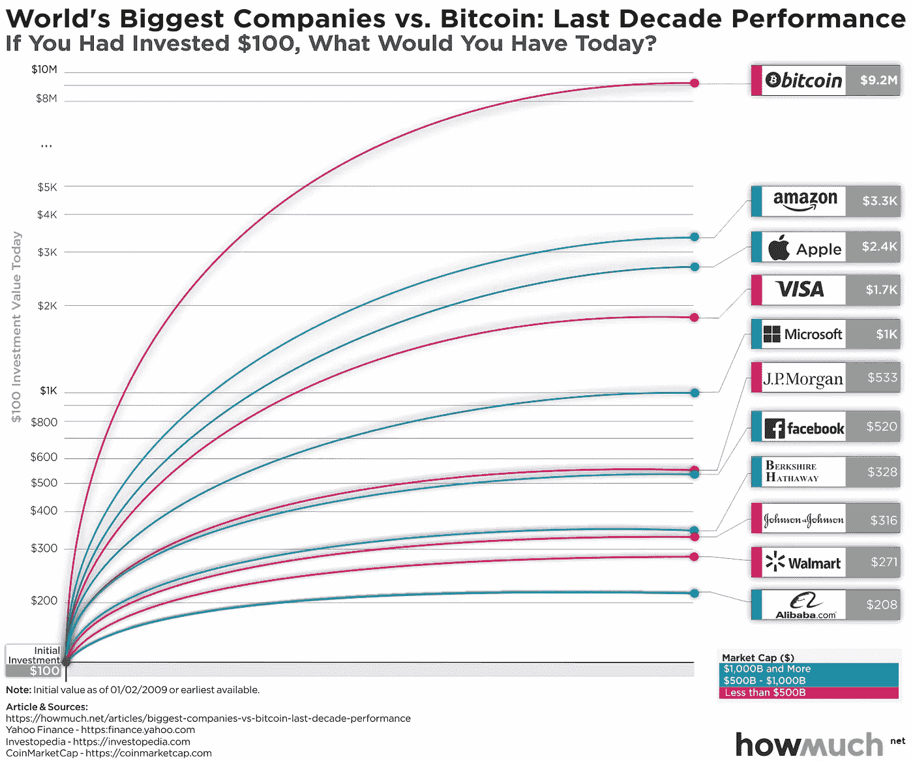
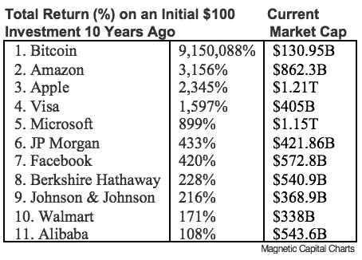
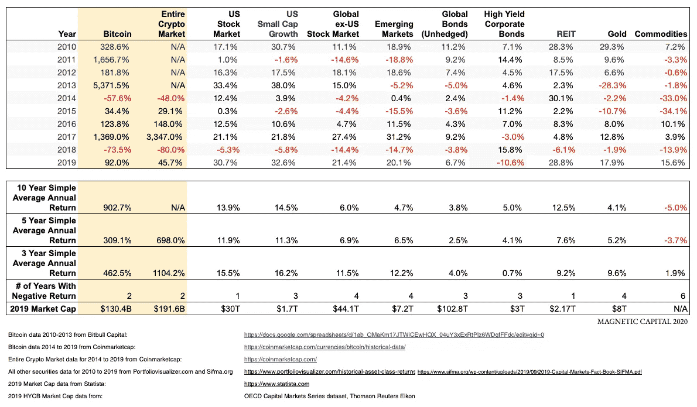
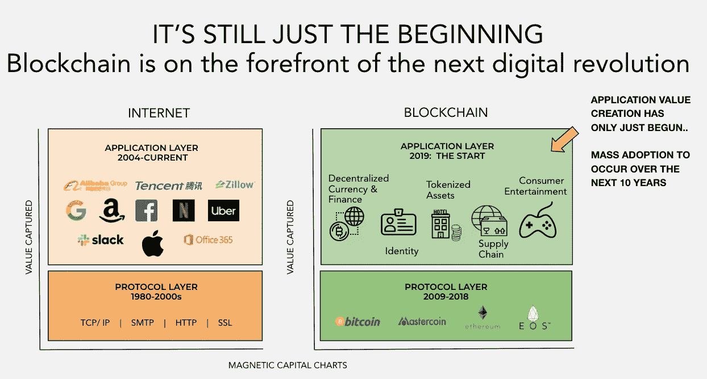

# 利用新的全球资产类别

> 原文：<https://medium.com/coinmonks/capitalizing-on-a-new-global-asset-class-bb5958f0a8d4?source=collection_archive---------2----------------------->

## **2020 年**投资机会——e**未来十年合并不相关的资产类别**

## 密码的兴起

迄今为止，整个[加密](https://medium.com/coinmonks/crypto/home)资产类别在过去 10 年中经历了超过 1850 亿美元的市值增长，2018 年的 ATH 为 8150 亿美元。(1)如果你 10 年前在比特币上投资 100 美元，今天你将获得 9150088%的回报，即 920 万美元。(2)在过去十年中，在全球最大的 10 家公司中，比特币的表现远远超过所有公司，迄今为止市值最低。

**就市值而言，比特币是领先的** [**加密**](https://medium.com/coinmonks/crypto/home) **，尽管自 6 月下旬以来下跌了+45%,但它仍然拥有全球所有资产中最好的 2019 年回报之一。**

**无论你看过去 10 年、5 年还是 3 年，加密作为一种资产类别，在全球所有主要资产类别中产生了最高的回报。**[加密](https://medium.com/coinmonks/crypto/home)资产类别的市值是当今其他投资类别市值的零头。未来十年将会有很大的发展空间。

Crypto vs traditional asset class returns & market caps

世界经济论坛的一项调查显示，到 2027 年，全球 GDP 的 10%将储存在区块链。(3)

## 这仅仅是个开始。

大众消费者和企业尚未采用，从宏观角度来看， [crypto](https://medium.com/coinmonks/crypto/home) 正变得越来越好，越来越强大。

像富达和纳斯达克这样的机构金融公司正在增加产品

像高盛和摩根大通这样的投资银行计划推出他们自己的稳定账户。

养老基金和捐赠基金正在向秘密基金投资

像脸书和三星这样的科技公司正在发布面向消费者的加密应用

中国政府正在发行由中央银行支持的稳定货币。

或许更重要的是，该资产类别背后的技术的真实用例正在出现。例如创新的分散式消费借贷，通过智能合约将金融和现实世界的资产令牌化，以及通过比特币上的闪电网络进行即时小额转账。

除了投机和价格之外，还有一些可以证明的真实理由让人们对[加密](https://medium.com/coinmonks/crypto/home)资产的长期增长感到兴奋。最令人兴奋的时尚连锁消费品将带来数万亿美元的机会。

**这一资产类别的定位是，通过在应用层创造新的和下一代用例、行为和业务模式，通过一系列颠覆，在全球最大的行业中创造价值。**

Blockchain technology’s inevitable disruptive

*“今天在华尔街交易的股票和债券可以 100%被令牌化，五年后，华尔街的股票和债券将 100%被令牌化。”—罗伯特·格雷费尔德，纳斯达克前首席执行官*

(1)[https://messari.io/c/market-overview](https://messari.io/c/market-overview)，[https://coinmarketcap.com/charts/](https://coinmarketcap.com/charts/)

(2)[https://messari.io/asset/bitcoin](https://messari.io/asset/bitcoin)，[https://coinmarketcap.com/currencies/bitcoin/](https://coinmarketcap.com/currencies/bitcoin/)

(3)[http://www3 . weforum . org/docs/WEF _ GAC 15 _ technical _ Tipping _ Points _ report _ 2015 . pdf](http://www3.weforum.org/docs/WEF_GAC15_Technological_Tipping_Points_report_2015.pdf)

> [直接在您的收件箱中获得最佳软件交易](https://coincodecap.com/?utm_source=coinmonks)

