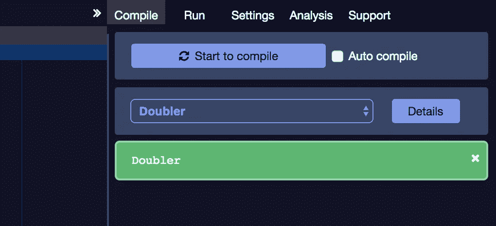

# 卡尔达诺 101——你的第一份合同

> 原文：<https://medium.com/coinmonks/cardano-101-your-first-contract-ab22ec32e870?source=collection_archive---------5----------------------->


在[上一篇文章](/coinmonks/cardano-smart-contracts-101-testnets-f9dc7ac24635)中，我们讨论了使用 Mallet CLI 连接到 KEVM 和 IELE 测试网。我们将在此基础上为这两个网络创建、编译和部署一个可靠的契约。虽然我们将为 KEVM 网络部署一份合同，但我们将花大部分时间检查 IELE 网络的部署，因为这是 Cardano 的旗舰选项。

## 合同

我们的超级简单的 *Doubler.sol* 契约接受一个数字并返回它的 double 值，如下所示。

我们将用 solc node.js 包编译它，并用 Mallet 部署它。

## 设置和编译

```
# Create a project dir in the same root as your mallet repo
mkdir doubler && cd doubler# You should have
# <Project Dir>
#    - mallet
#    - doubler# Save the Doubler.sol file from the gist into the doubler dir# You should have
# <Project Dir>
#    - mallet
#    - doubler
#      - Doubler.sol# Install the solc npm package
npm install -g solc# Verify it was installed
solcjs --help# Compile Doubler.sol
solcjs --bin --abi Doubler.sol# You should have
# <Project Dir>
#    - mallet
#    - doubler
#      - Doubler.sol
#      - Doubler_sol_Doubler.abi
#      - Doubler_sol_Doubler.bin
```

## 用木槌进行 KEVM 部署

```
# Make sure you are using Node 10.4.x(See previous article)
nvm use 10# Open Mallet CLI
cd ../mallet && ./mallet kevm# Create an Account - note we are assigning a variable to use later
mallet> account1 = newAccount(<secret password>)# Select account - note we are using our variable we set earlier
mallet> selectAccount(account1)# Request Funds from faucet - note we are using the selected acct
mallet> requestFunds()# Get balance - make sure you have a balance before proceeding
mallet> getBalance()# Import the node.js fs module
mallet> fs = require('fs')# Get the binary code
mallet> myContract = fs.readFileSync('../doubler/Doubler_sol_Doubler.bin', 'utf8')# Create the transaction
mallet> tx = {
// gas limit, mandatory
    gas: 470000,
// the variable with our smart contract binary                      
    data: myContract
};# Deploy the contract
mallet> deploymentHash = sendTransaction(tx)# Verify the contract deployed
mallet> myContractAddress = getReceipt(deploymentHash).contractAddress
```

因此，这基本上是一个以太坊契约部署，您可以通过创建如下所示的自定义事务来与之交互:

```
mallet> sendTransaction({to: myContractAddress, 
    gas:, 
    arguments: args});
```

## IELE 用木槌展开

```
# Make sure you are using Node 10.4.x(See previous article)
nvm use 10# Open Mallet CLI
./mallet iele# Create an Account - note we are assigning a variable to use later
mallet> account1 = newAccount(<secret password>)# Select account - note we are using our variable we set earlier
mallet> selectAccount(account1)# Request Funds from faucet - note we are using the selected acct
mallet> requestFunds()# Get balance - make sure you have a balance before proceeding
mallet> getBalance()# Compile the Solidity contract
mallet> myBytecode = iele.compile('../doubler/Doubler.sol').bytecode# Deploy contract
mallet> contractHash = iele.createContract({gas: 1000000, value: 0, code: myBytecode, args: []})# Get Deployed contract address
mallet> theContractAddress = getReceipt(contractHash).contractAddress# Interact with deployed contract
mallet> iele.contractCall({to: theContractAddress, gas: 1000000, func: 'doubleMe()', args: [5]})
```

iele 过程类似于 kevm 部署，但是值得注意的是，当你编译一个 solidity 文件到 iele 时，它是一个两步过程。实体转化为 iele，然后从 iele 转化为 iele 装配。iele.compile 命令也可以将 iele 源代码编译成 iele 程序集，这是 Cardano 的首选方法。

## 混合 IELE 部署

不久前，我写了一个名为[以太坊绝地指南](/@cipherz/super-simple-ethereum-part-1-7e363dbc1c65)的系列文章。在第四篇文章中，我们谈了一些关于混音的内容，所以如果你想更深入地了解它，我建议你看看这里的。Remix 是一个 IDE(集成开发环境),由以太坊基金会提供，用于帮助 Solidity 开发和部署到区块链。Cardano 分叉 Remix 是为了让你我这样的人在熟悉的部署和开发环境中编写 Solidity 代码。分叉混音环境只使用你的 Solidity 代码部署到 IELE 网络，它编译成 IELE 程序集。

## 编制

在 Chrome 中打开 remix 应用程序—[https://iele-testnet.iohkdev.io/remix/](https://iele-testnet.iohkdev.io/remix/#optimize=false)。看起来不错，不是吗？

单击屏幕左上角的文件夹图标，浏览到我们在上一节中使用的现有 *Doubler.sol* 合同。展开*浏览器*文件夹，点击 *Doubler.sol* 契约将其带入编辑器。


接下来，转到屏幕的右上方，点击显示*开始编译*的按钮。这将编译合同，当它成功完成时，您将在下面看到绿色的合同。



## 账户

Cardano 版本的 Remix 内置了账户管理——这是一个很好的功能。我们可以在 remix 中创建一个新的测试帐户，而不是使用 Mallet。


*   切换到*运行*选项卡，点击*创建账户*
*   输入密码并确认(记下它，您稍后会用到)
*   从*账户*下拉列表中选择已创建的账户
*   点击*获取资金*从水龙头为您的新账户申请资金

## 部署


现在，我们已经编辑好合同，等待部署，并有一个帐户加满乙醚来部署它。您应该会看到类似于左侧图像的内容。请注意，我们设置了一个气体限制，值为 0(因为这不是一个可支付的 tx)，并且我们的*倍增*合同已准备好进入合同下拉列表。您可以点击*部署(IELEVM)* ，它会提示您验证它自动设置的一个*气价*。一旦您确认了这一点，您应该会看到一个挂起的事务，并最终看到一个已部署的契约。

## 互动

现在您已经在 IELE 测试网上部署了一个契约，让我们通过 remix 与它进行交互。展开*Doubler*deployed contract，在 *doubleMe* 方法中输入一个数值，点击 *Return* 。您应该会看到 10 的结果显示在方法的下面。


## 摘要

我们在这篇文章中已经做了很多，所以让我们回顾一下

*   通过 **Mallet CLI** 为 **KEVM** 测试网创建、编译和部署一个可靠性合同
*   通过 **Mallet CLI** 为 **IELE** 测试网创建、编译和部署一个可靠性合同
*   通过 **Cardano Remix IDE** 为 **IELE** 测试网创建、编译和部署一个可靠性合同

卡尔达诺是一个令人兴奋的项目，如果你知道去哪里找，它会有很多事情要做。我的感觉是，这是一个简单地做工作，并不把它当回事的团队。我希望你喜欢这篇文章，它向你介绍了我认为是行业中沉睡的巨人之一。

> [直接在您的收件箱中获得最佳软件交易](https://coincodecap.com/?utm_source=coinmonks)

[](https://coincodecap.com/?utm_source=coinmonks)