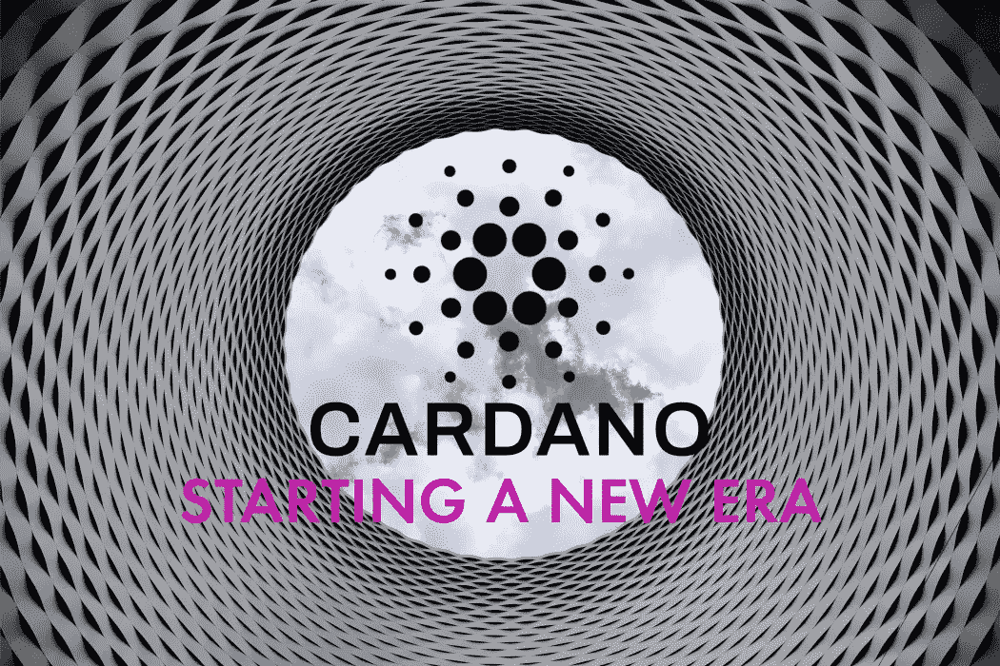

# 卡尔达诺“阿隆佐”:进入新时代——智能合同

> 原文：<https://medium.com/coinmonks/cardano-alonzo-into-a-new-era-smart-contracts-96a181b957d7?source=collection_archive---------1----------------------->

当比特币和以太坊下跌时，接下来的三个 T2 潜力保持强劲，甚至接近历史最高水平。当然，我们谈论的是:

*   [波尔卡多](/coinmonks/polkadot-dot-will-it-outperform-ethereum-analysis-outlook-d0e6ff84281f)
*   [索拉纳](/coinmonks/solana-record-growth-of-the-ethereum-competitor-invest-now-71b442b4271)
*   [卡尔达诺](/coinmonks/cardano-ada-is-now-in-the-top-3-good-moment-to-buy-ada-7d7e21e1b5cb)

凭借硬分叉“阿隆佐”，**卡尔达诺网络成功完成了 Goguen 首次展示的最后一部分**。

Cardano — [pexels.com](https://www.pexels.com/de-de/foto/low-angle-fotografie-des-grauen-und-schwarzen-tunnels-mit-blick-auf-weissen-bewolkten-und-blauen-himmel-210158/) and edited by the author