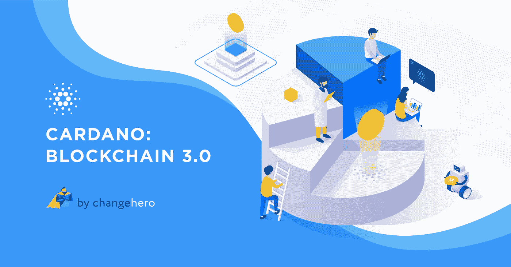
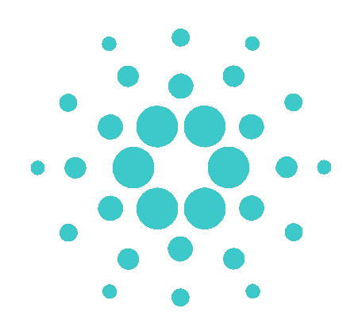
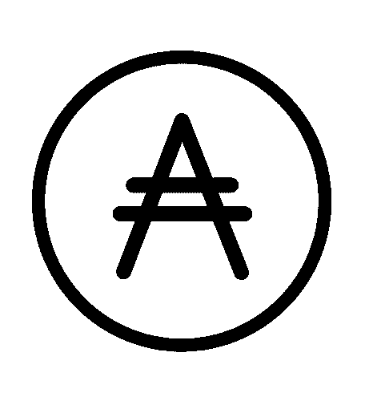

# 卡尔达诺:区块链 3.0

> 原文：<https://medium.com/coinmonks/cardano-blockchain-3-0-c95fe18f66c1?source=collection_archive---------2----------------------->

加密货币的出现是为了消除在进行价值交易时对中间人的需求。中本聪能够在区块链技术的帮助下实现这一目标。虽然它给了世界比特币，但它仅限于支付，还没有发展到更大的程度。以太坊利用了区块链技术，推出了革命性的智能合约。虽然这标志着第二代区块链的开始，但一些挑战仍未解决。Cardano 采取了一种独特的方法来解决持续存在的问题，即建立在现有的有意义的东西上，并在新技术和创新的帮助下添加可持续的功能。在本帖中， [ChangeHero](https://changehero.io/) 将介绍给大家一个关于[卡丹诺](https://www.cardano.org/en/home/)的快速总结。

## 起源

Cardano 是一个分散的区块链，旨在为 DApps 和可验证智能合同的开发搭建一个平台。Cardano 被称为第三代区块链，旨在解决可扩展性、互操作性和可持续性等棘手问题。以太坊的联合创始人查尔斯·霍斯金森于 2015 年推出了 Cardano。此外，有三个组织支持并促进生态系统的发展。卡尔达诺基金会是一家总部位于瑞士的非营利组织，负责监督和管理生态系统的发展。Input Output HK (IOHK)是一家独立公司，承包设计和建造网络。最后，Emurgo 被雇佣来通过其商业投资促进采用。

Source: Cardano

这是第一个基于科学哲学并由世界各地的学者和工程师开发的区块链。与传统的加密货币项目不同，Cardano 不是从白皮书开始的，而是从一套原则开始的。Cardano 是一种多层协议——Cardano 结算层(CSL ),用于结算 ADA 的交易，其功能类似于记录交易的其他网络。第二层称为 Cardano 控制层(CCL ),用于智能合约。这种使用不同层的策略能够分别存储元数据，并增强了网络的安全性。该平台使用 Haskell 编码语言，智能合同在普路托斯进行编码。此外，Marlowe 是一种新语言，专门为开发中的新生设计，用于构建智能合同之类的金融工具。这些是函数式编程语言，它们增强了安全性，并在未来更新的情况下适应快速变化。

## 与大毒蛇一起伸缩

可扩展性是所有加密货币都面临的一个难题。Cardano network 本身采用分层结构构建，以应对可扩展性问题。如前所述，交易和智能合约发生在不同的层，信息不会在彼此之间共享。此外，Cardano 用一个被称为 Ouroboros 的利益相关证明共识的修改版本来解决这个问题，这是一个被证明是安全的利益相关证明。与比特币不同，Cardano 中的所有节点都不需要拥有区块链的完整副本。取而代之的是，在达成共识的过程中，一个槽领导人将所有这些节点聚集在一起。虽然像代达罗斯钱包这样的完整节点可以达成共识，但只有槽领导人有能力创建和添加一个区块链。在大毒蛇中，时间被划分成纪元，纪元又被进一步划分成时间段。这些时间段很短，通常持续 20 秒。每个槽都有自己的槽头，其工作方式类似于矿工，负责确认交易并向链中添加块。他们可以在每个时间段创建不超过一个区块，交易费用以及该时段的区块奖励将被集中在一起，并分配给这些领导者以及利益相关者。

理论上，即使是持有 1 ADA 的用户也能成为槽头但概率相当低。目前还没有阿达的准确数字可以押上来获得加挡的机会。我们还听说，要成为一个老虎机的领导者，ADA 需要 100 万到 200 万美元。但很明显，赌注越高，成为老虎机领袖的机会就越大。这些合格的候选人被认为是下一个时代的选民。选举将通过随机数生成方法进行，硬币的主人将成为下一个时代的槽领袖。Cardano 还采用了 RINA(递归网络间架构)来提高可扩展性。最重要的是，该团队倾向于用户只能拥有一大块区块链的分区，并打算通过侧链来实现这一点。

## 与侧链的互操作性

即使在 2020 年，不同的区块链也很难相互理解，与传统金融服务沟通更是难上加难。尽管加密货币交易所弥合了这一差距，但它们容易受到攻击，并可能受到监管政策的影响。Cardano 设想建立区块链互联网，使用户能够在侧链的帮助下进行跨链交易。Cardano 支持 Kiayias、Miller 和 Zindros (KMZ)的工作证明，以便将资金从 CSL 转移到 CCL 和其他区块链。此外，Cardano 还在研究一种机制，以加密的方式将元数据合并到交易中。

## 可持续性

区块链领域有大量的项目。要在这片红海中生存，持续创新和强大的治理体系是必不可少的。可持续发展是卡尔达诺创始原则的核心。生态系统有一个名为国库的拨款基金。每当链条上增加一块，奖励的一部分就会加入国库。有意开发该平台的人可以提交一份赠款投票，由利益攸关方通过投票决定。随着网络的发展和交易的增加，金库的资金不断增加。这使得网络的发展始终有资金可用。

此外，该网络将使用液体民主进行治理，为利益相关方提供更多空间。此外，该团队的目标是为协议建立一个宪法，以避免任何无意的硬分叉。Cardano 遵循 era 形式的时间表来部署平台的重要升级。2 月 20 日，该团队已经成功完成了 OBFT 硬分叉，这是一个预先计划好的分叉。这是对已经存在的共识机制——大毒蛇经典的发展。随着这一升级计划的实施，卡尔达诺开始向以社区和分权为重点的谢利时代过渡。

## 自动数据采集（Automaticdataacquisitions）

Source: Cardano

ADA 是卡尔达诺网络的原生加密货币。Cardano 的唯一目的是借助 ADA 数字货币实现真正的点对点支付。简而言之，ADA 可用于个人之间的价值交易，无需任何中间人。它允许开发人员创建智能合同，并为治理的持有人提供投票权。截至发稿时，ADA 的交易价格为 0.0581 美元，根据 CoinMarketCap 的数据，其总市值为 15 亿美元。此外，该团队专门设计了代达罗斯钱包，用于存放和交易 ADA。

## 区块链 3.0

尽管其共识机制和网络升级的延迟受到了批评，但 Cardano 正在兑现其承诺。综上所述，Cardano 是一个独特的项目，通过融合现有链中的要素，并通过科学方法的创新添加可持续的特征，提供最佳效果。对于区块链 3.0，最好的选择是等待未来的升级，并见证事情如何发展。

最后，对 Reddit 上的 [Cardano 社区](https://www.reddit.com/r/cardano/)大声喊出来，感谢他们对这篇文章的评论和反馈。

如果你喜欢这篇文章，请鼓掌并评论。一如既往，关注 [Twitter](https://twitter.com/Changehero_io?lang=en) 和 [Medium](/@changehero) 上的 [ChangeHero](https://changehero.io/) ，获取更多关于加密的此类信息丰富且有趣的文章。

> [直接在您的收件箱中获得最佳软件交易](https://coincodecap.com/?utm_source=coinmonks)

