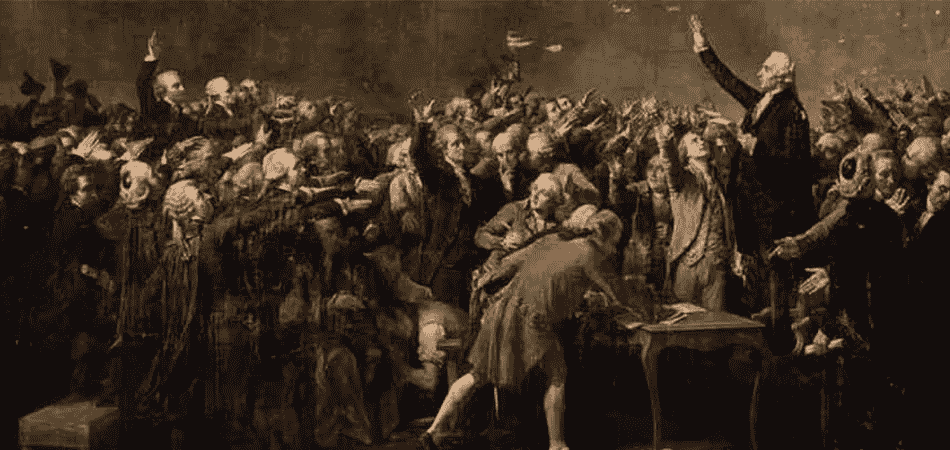

# 卡尔达诺赋予个人权力

> 原文：<https://medium.com/coinmonks/cardano-empowers-individuals-de172e1f29e4?source=collection_archive---------2----------------------->

卡尔达诺有赋予个人权力的潜力，但为了平衡这一点，它可能会削弱机构、银行和国家的地位。技术可以帮助新的权力再分配，给人们更大的自由。但这只能在特定的条件下发生，成功将取决于人民自己。不是技术上的。

# 我们和当局之间的合同