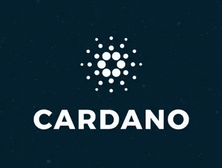

# Cardano Fund 4 概述和主要提案—第 1 部分

> 原文：<https://medium.com/coinmonks/cardano-fund-4-overview-and-top-proposals-part-1-5555b5f7f96?source=collection_archive---------7----------------------->

我之前已经详细解释了 Cardano 是如何通过其项目 Catalyst 开创去中心化的。通过多轮融资，Cardano 已经开始分发 ADA 来促进重要项目的开发，这些项目将有助于整个生态系统的发展。

项目催化剂是一系列的实验，旨在产生最高水平的社区创新。Catalyst 通过允许社区自行决定增长的优先级，将链上治理引入到卡达诺区块链。它还允许参与者为解决挑战和利用 Cardano 生命周期中出现的机会的提案配置资金。

基金 4 侧重于激励解决方案，使开发者更容易在 Cardano 的基础上进行构建。为了实现这一点，**选民投票时的指导性问题将是**

确定需要优先考虑的工具

吸引现有社区之外的开发者

为开发人员提供必要的支持

什么会吸引开发人员浏览 Cardano 文档和代码

为内部或商业的企业发展经理建立？

**基金 4 的基本支柱分类如下:**

**开发者生态系统挑战:**创造积极的应用开发者体验。分配 ADA 中的 40 万

**DApps 和集成挑战:**如何帮助应用开发者在 2021 年推动 Cardano 的采用。分配 ADA 中的 20 万

**分布式决策挑战:**在接下来的两轮 Catalyst 中制定更好的分布式决策。分配 ADA 中的 50k

**提议者外联:**鼓励 Cardano 生态系统之外的企业家向 Catalyst 提交下两个基金的提议。分配 ADA 中的 5 万美元

**Catalyst value on boarding:**鼓励社区成员参与未来两个基金的项目 Catalyst。分配 ADA 中的 5 万美元

**当地社区中心:**利用 Cardano 动员社区解决当地问题。当地社区中心模式。分配 ADA 中的 5 万美元

这些将通过以下方式进行跟踪:

由受资助的提案每两周报告一次

链上注释

新用户调查

增长指标

**活动时间表**

**见解分享:**查看社区成员在挑战开始时分享的所有见解。有效期至 2011 年 2 月 25 日

**提交提案:**成功提交提案后，社区开始提供反馈。有效期至 21 年 3 月 4 日

**提炼:**在这一阶段，社区成员为提案提供反馈并帮助提案发展。有效期至 2011 年 3 月 11 日

**最终确定:**在这一阶段，创意团队需要提供更多关于其创意的细节。团队回答问题，提供对想法的见解，并将其提炼为实施提案。有效期至 21 年 3 月 18 日

**评估:**在这个阶段，创意由你所在社区的专家进行评估。评估人员根据一套特定的标准对创意进行评级，以帮助发现最有潜力的创意。有效期至 2011 年 3 月 25 日

**评估 QA:** 在投票应用中查看提案。现在讨论的是哪些提议应该得到资助，并向提议者提问&,而不是如何进一步改进它们。有效期至 2011 年 4 月 1 日

**治理阶段:**在这个阶段，投票者讨论提案的优点，并向提案者提问。

**存档:**存储非活动提案的地方

**见解分享储备:**查看挑战开始时社区成员必须分享的所有见解，有效期至 2011 年 2 月 25 日

请注意，在 Fund 4 中，人们将能够使用他们的移动应用程序投票(Catalyst Voting，而不是 Yoroi)。Yoroi chrome 版本已经增加了投票功能，可以与 catalyst 应用程序同步进行投票。我将在后面写一个单独的指南。

在下一篇文章中，我们将回顾不同支柱下的一些提议。我也将选择一些我喜欢的提议，我想投票。这将让您了解 Cardano 生态系统的早期开发，即核心链开发和应用程序上线后的状态。

**阅读上一篇文章:** [如何玩黑暗森林，zkSNARK powered MMO 游戏—第一部分](https://tulip311bit.medium.com/how-to-play-dark-forest-the-zksnark-powered-mmo-game-part-1-7222e2c3ab4)

***注:*** *本帖最初发表于* [*此处*](https://www.voice.com/post/@tulip/cardano-fund-4-overview-and-top-proposals-part-1-1614196666-1698014392) *为与 voice.com 有关联的密码作者。*

**通过我的推荐加入**

[Crypto.com](https://binance.com/en/register?ref=E8PCD3AF)——[币安](https://platinum.crypto.com/r/sut3pd9bzn)

跟我来

**👉** [推特](https://twitter.com/rumadas123)

**👉** [Linkedin](https://www.linkedin.com/in/ruma-das-a1439320/)

> 加入 Coinmonks [Telegram group](https://t.me/joinchat/EPmjKpNYwRMsBI4p) 学习加密交易和投资

## 另外，阅读

*   最好的[密码交易机器人](/coinmonks/crypto-trading-bot-c2ffce8acb2a)
*   [印度比特币交易所](/coinmonks/bitcoin-exchange-in-india-7f1fe79715c9)
*   [比特币储蓄账户](/coinmonks/bitcoin-savings-account-e65b13f92451)
*   最好的[加密税务软件](/coinmonks/best-crypto-tax-tool-for-my-money-72d4b430816b)
*   [电网交易](https://blog.coincodecap.com/grid-trading)
*   [最佳加密交易所](/coinmonks/crypto-exchange-dd2f9d6f3769)

> 加入 T21 电报集团，学习加密交易和投资

## 另外，阅读

*   最好的[密码交易机器人](/coinmonks/crypto-trading-bot-c2ffce8acb2a) | [网格交易](https://blog.coincodecap.com/grid-trading)
*   [3 商业评论](/coinmonks/3commas-review-an-excellent-crypto-trading-bot-2020-1313a58bec92) | [Pionex 评论](/coinmonks/pionex-review-exchange-with-crypto-trading-bot-1e459d0191ea) | [Coinrule 评论](/coinmonks/coinrule-review-2021-a-beginner-friendly-crypto-trading-bot-daf0504848ba)
*   [AAX 交易所评论](/coinmonks/aax-exchange-review-2021-67c5ea09330c) | [德里比特评论](/coinmonks/deribit-review-options-fees-apis-and-testnet-2ca16c4bbdb2) | [FTX 交易所评论](/coinmonks/ftx-crypto-exchange-review-53664ac1198f)
*   [n 零审核](/coinmonks/ngrave-zero-review-c465cf8307fc) | [Phemex 审核](/coinmonks/phemex-review-4cfba0b49e28) | [PrimeXBT 审核](/coinmonks/primexbt-review-88e0815be858)
*   [Bybit Exchange 审查](/coinmonks/bybit-exchange-review-dbd570019b71) | [Bityard 审查](/coinmonks/bityard-review-7d104239be35) | [CoinSpot 审查](https://blog.coincodecap.com/coinspot-review)
*   [3 commas vs Cryptohopper](/coinmonks/3commas-vs-pionex-vs-cryptohopper-best-crypto-bot-6a98d2baa203)|[赚取加密利息](/coinmonks/earn-crypto-interest-b10b810fdda3)
*   最好的比特币[硬件钱包](/coinmonks/the-best-cryptocurrency-hardware-wallets-of-2020-e28b1c124069?source=friends_link&sk=324dd9ff8556ab578d71e7ad7658ad7c) | [BitBox02 回顾](/coinmonks/bitbox02-review-your-swiss-bitcoin-hardware-wallet-c36c88fff29)
*   [总账 vs n 平均](/coinmonks/ledger-vs-ngrave-zero-7e40f0c1d694) | [总账 nano s vs x](/coinmonks/ledger-nano-s-vs-x-battery-hardware-price-storage-59a6663fe3b0)
*   [密码本交易平台](/coinmonks/top-10-crypto-copy-trading-platforms-for-beginners-d0c37c7d698c)
*   [Vauld Review](/coinmonks/vauld-review-2021-lend-trade-and-buy-bitcoin-in-india-e37a96374961)|[you hodler Review](/coinmonks/youhodler-4-easy-ways-to-make-money-98969b9689f2)|[BlockFi Review](/coinmonks/blockfi-review-53096053c097)
*   最好的[加密税务软件](/coinmonks/best-crypto-tax-tool-for-my-money-72d4b430816b) | [硬币追踪评论](/coinmonks/cointracking-review-a-reliable-cryptocurrency-tax-software-5114e3eb5737)
*   最佳[加密借贷平台](/coinmonks/top-5-crypto-lending-platforms-in-2020-that-you-need-to-know-a1b675cec3fa) | [杠杆代币](/coinmonks/leveraged-token-3f5257808b22)
*   [block fi vs Celsius](/coinmonks/blockfi-vs-celsius-vs-hodlnaut-8a1cc8c26630)|[Hodlnaut Review](/coinmonks/hodlnaut-review-best-way-to-hodl-is-to-earn-interest-on-your-bitcoin-6658a8c19edf)
*   [Bitsgap 审查](/coinmonks/bitsgap-review-a-crypto-trading-bot-that-makes-easy-money-a5d88a336df2) | [Quadency 审查](/coinmonks/quadency-review-a-crypto-trading-automation-platform-3068eaa374e1) | [Bitbns 审查](/coinmonks/bitbns-review-38256a07e161)
*   [埃利帕尔泰坦评论](/coinmonks/ellipal-titan-review-85e9071dd029) | [赛克斯斯通评论](/coinmonks/secux-stone-hardware-wallet-review-15-discount-coupon-2020-7577032faa6e)
*   [本地比特币评论](/coinmonks/localbitcoins-review-6cc001c6ed56)
*   最佳[区块链分析](https://bitquery.io/blog/best-blockchain-analysis-tools-and-software)工具| [赚比特币](/coinmonks/earn-bitcoin-6e8bd3c592d9)
*   [加密套利](/coinmonks/crypto-arbitrage-guide-how-to-make-money-as-a-beginner-62bfe5c868f6)指南| [如何做空比特币](/coinmonks/how-to-short-bitcoin-568a2d0b4ae5)
*   最佳[加密制图工具](/coinmonks/what-are-the-best-charting-platforms-for-cryptocurrency-trading-85aade584d80) | [最佳加密交易所](/coinmonks/crypto-exchange-dd2f9d6f3769)
*   [如何在印度购买比特币？](/coinmonks/buy-bitcoin-in-india-feb50ddfef94) | [WazirX 审查](/coinmonks/wazirx-review-5c811b074f5b)
*   [印度比特币交易所](/coinmonks/bitcoin-exchange-in-india-7f1fe79715c9) | [比特币储蓄账户](/coinmonks/bitcoin-savings-account-e65b13f92451)
*   [CoinDCX 评论](/coinmonks/coindcx-review-8444db3621a2)

> [直接在您的收件箱中获得最佳软件交易](/coinmonks/newsletters/coinmonks)

包括附属链接