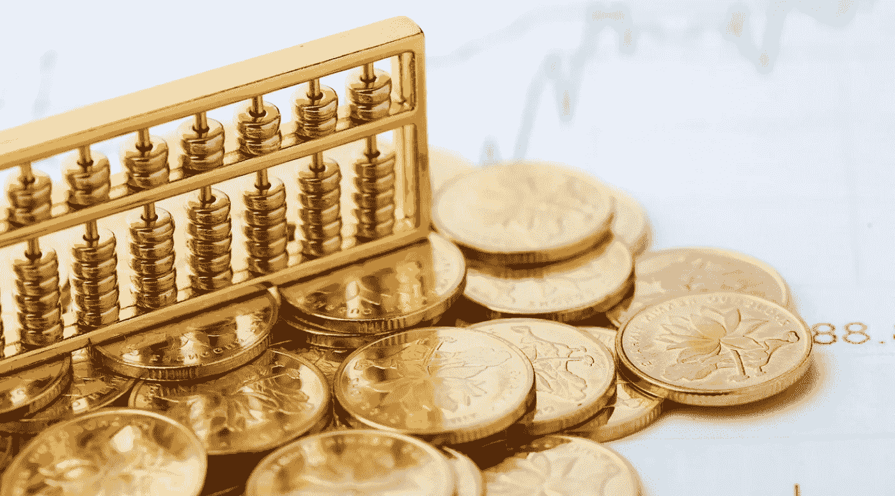

# 卡尔达诺有公平分配阿达硬币

> 原文：<https://medium.com/coinmonks/cardano-has-a-fair-distribution-of-ada-coins-a8479853eb44?source=collection_archive---------1----------------------->

每个区块链网络都需要自己的硬币才能存在。硬币要有价值，就必须有需求。很多事情都会影响这一点。在本文中，我们将讨论 ADA 硬币分配在 Cardano 项目中的重要性。

# 团队层面的权力下放与协议