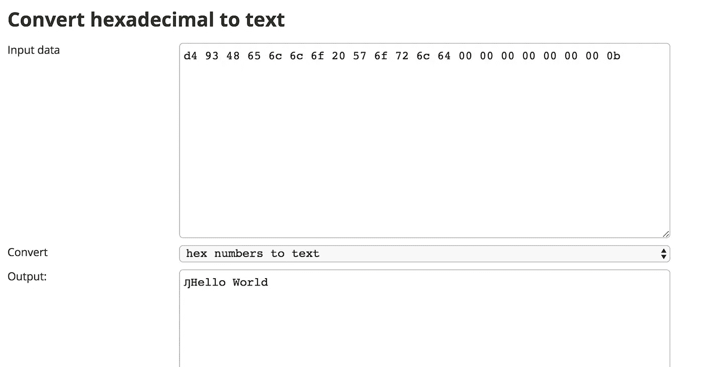

# Cardano 安装 Mallet 以在 IELE 测试网上部署智能合约并与之交互

> 原文：<https://medium.com/coinmonks/cardano-install-mallet-to-deploy-and-interact-with-smart-contract-on-iele-testnet-fe7972e1caf8?source=collection_archive---------3----------------------->


# 木槌

最小钱包 Mallet 是一个命令行实用程序，用于部署智能合约并与 IOHK 开发的**卡尔达诺 IELE** 和 KEVM 测试网([https://testnet.iohkdev.io/](https://testnet.iohkdev.io/))进行交互。Mallet 是用 Javascript 编写的，基于 Node.js REPL，所以它提供了一些方便的函数和库，如 Web3。Mallet 也可以作为一个库包含在您自己的 JavaScript 程序中。

# 安装

Mallet 需要 Node.js 版本 10.4.0 或更高版本。在两个地方有更详细的安装 Node.js 和 Mallet 的说明。

首先打开一个文件夹，使用 git clone 下载工具包

```
$ mkdir mallet && cd mallet
$ git clone [https://github.com/input-output-hk/mallet.git](https://github.com/input-output-hk/mallet.git)
```

第二，使用 npm 安装 mallat cli

```
$ npm install
```

# 运行命令行界面

键入以下内容以查看 Mallet 的帮助文件:

```
$ ./mallet — help
```

mallet 会显示我们需要的所有信息

```
mallet 2.0.0 — command line utility for KEVM/IELE testnets

 USAGE

 mallet <testnet>

 ARGUMENTS <testnet> JSON RPC endpoint to connect. Possible values are: ‘kevm’, ‘iele’, or a custom HTTP(S) URL required

 OPTIONS

 -d, — datadir Specify data directory optional default: “/Users/johnnyhsieh/.mallet2”

 GLOBAL OPTIONS

 -h, — help Display help
 -V, — version Display version
 — no-color Disable colors
 — quiet Quiet mode — only displays warn and error messages
 -v, — verbose Verbose mode — will also output debug messages
```

在我们开始与卡尔达诺互动之前

```
$ ./mallet iele
```

让我们检查一下木槌的所有命令

```
mallet> listCommands()
 [ ‘currentAccount’,
 ‘getBalance’,
 ‘getNonce’,
 ‘getReceipt’,
 ‘help’,
 ‘iele.contractCall’,
 ‘iele.createContract, iele.compile’,
 ‘iele.simpleTransfer’,
 ‘importPrivateKey’,
 ‘lastTransaction’,
 ‘listAccounts’,
 ‘listCommands’,
 ‘newAccount’,
 ‘requestFunds’,
 ‘rlp’,
 ‘selectAccount’,
 ‘sendTransaction’,
 ‘web3’ ]
```

# 账户管理

现在，我们准备创建一个帐户，并采取一些测试令牌

```
 mallet> myAccount = newAccount(‘johnnyhsieh’)
 ‘0x13be17a380a63755d4f9c57fe848accc07760723’mallet> listAccounts()
 [ ‘0x13be17a380a63755d4f9c57fe848accc07760723’ ]mallet> selectAccount(myAccount)
 ‘0x13be17a380a63755d4f9c57fe848accc07760723’

mallet> getBalance()
 ‘0’mallet> requestFunds()
 ‘0x27e2e4d47d5474f599fa9a676d819e39e36a5684c550ddce28606ef6035ef01c’mallet> getBalance()
 ‘30000000000000000’ 
```

您也可以使用`getReceipt `检查交易收据

```
mallet> getReceipt(‘0xe45a5ec488933b01f615af5771eabec642c95024b16aafdeda8256393857b231’)
 { transactionHash:
 ‘0xe45a5ec488933b01f615af5771eabec642c95024b16aafdeda8256393857b231’,
 transactionIndex: 0,
 blockNumber: 336842,
 blockHash:
 ‘0x4fc2575c0b5b44778b42be907355b2e1129183acdce9b2ddab44b4606d78501e’,
 cumulativeGasUsed: 21680,
 gasUsed: 21680,
 contractAddress: null,
 logs: [],
 statusCode: ‘0x00’,
 status: 1,
 returnData: ‘0xc0’ } 
```

# 部署合同

在卡达诺有两种不同的合同

## IELE

IELE 可以直接部署，但是可靠性需要被转换成字节码然后部署。

使用 iele.compile('/path ')

## 固态

Mallet 也支持部署 solidity 契约，但是它需要编译成字节码才能部署你的契约。

你好世界

```
 mallet> iele.compile(‘test/contracts/helloworld.sol’){ source: rt.storage.copy.to.memory(%from, %to, %size) {\ncopy.loop:\n %done = iszero %size\n br %done, exit\n %data //not showing the full source here’,
 bytecode:
 ‘00000352630469000F6128616464726573732C75696E742969000C68656C6C6F776F726C64282969001568656C6C6F776F726C6428292E696E7465726E616C69001669656C6572742E6D656D6F72792E616C6C6F6361746569001269656C6572742E6D656D6F72792E66696C6C69001369656C6572742E73746F726167652E66696C6C69001C69656C6572742E6D656D6F72792E636F70792E746F2E6D656D6F727969001D69656C6572742E6D656D6F72792E636F70792E746F2E73746F7261676569001D69656C6572742E73746F726167652E636F70792E746F2E6D656D6F727969001E69656C6572742E73746F726167652E636F70792E746F2E73746F726167656900076465706F7369746700000000660000660001F600006800010002660000340265000402618003100304650004046194FFFFFFFFFFFFFFFFFFFFFFFFFFFFFFFFFFFFFFFF03110304650004046180031003156500040565000101618208FC06640002660001618006660002F2000B000000001067157830096114030C093A31AB60BC640003660003F600010C660004620103F7036800020000660000340065000100F80003000000010161010251236101020102346101025324610102010244618005511661080752754601075561010201021851890D096A52654A010655514BF600010B660001620102F7026700030000660000610200F8000400010001016012610200F800040001000103610B005330610100010034618B646C726F57206F6C6C65480053406032640001660001F6000102670004000166000061010151126102010101230100226101015312F600010367000500036600001513650001035302610104010400610104030411640000660001F6000067000600036600001513650001035502610104010400610104030411640000660001F60000670007000366000015236500010351045314610105010500610105010511610105030522640000660001F60000670008000366000015236500010351045514610105010500610105010511610105030522640000660001F60000670009000366000015236500010354045314610105010500610105010511610105030522640000660001F6000067000A000366000015236500010354045514610105010500610105010511610105030522640000660001F60000’ } 
```

它将返回我们需要的字节码,`$ iele.createContract '并将字节码放在代码:

```
 mallet> iele.createContract({gas:1000000,value:0,code: ‘00000352630469000F6128616464726573732C75696E742969000C68656C6C6F776F726C64282969001568656C6C6F776F726C6428292E696E7465726E616C69001669656C6572742E6D656D6F72792E616C6C6F6361746569001269656C6572742E6D656D6F72792E66696C6C69001369656C6572742E73746F726167652E66696C6C69001C69656C6572742E6D656D6F72792E636F70792E746F2E6D656D6F727969001D69656C6572742E6D656D6F72792E636F70792E746F2E73746F7261676569001D69656C6572742E73746F726167652E636F70792E746F2E6D656D6F727969001E69656C6572742E73746F726167652E636F70792E746F2E73746F726167656900076465706F7369746700000000660000660001F600006800010002660000340265000402618003100304650004046194FFFFFFFFFFFFFFFFFFFFFFFFFFFFFFFFFFFFFFFF03110304650004046180031003156500040565000101618208FC06640002660001618006660002F2000B000000001067157830096114030C093A31AB60BC640003660003F600010C660004620103F7036800020000660000340065000100F80003000000010161010251236101020102346101025324610102010244618005511661080752754601075561010201021851890D096A52654A010655514BF600010B660001620102F7026700030000660000610200F8000400010001016012610200F800040001000103610B005330610100010034618B646C726F57206F6C6C65480053406032640001660001F6000102670004000166000061010151126102010101230100226101015312F600010367000500036600001513650001035302610104010400610104030411640000660001F6000067000600036600001513650001035502610104010400610104030411640000660001F60000670007000366000015236500010351045314610105010500610105010511610105030522640000660001F60000670008000366000015236500010351045514610105010500610105010511610105030522640000660001F60000670009000366000015236500010354045314610105010500610105010511610105030522640000660001F6000067000A000366000015236500010354045514610105010500610105010511610105030522640000660001F60000’,arg:[]})
 Enter password:
 ‘0x71223273c1d6ed354980f3b009c463df4522fb2ccb7e4da86e9b1bdb0c8b8be1’
 mallet> getReceipt(‘0x71223273c1d6ed354980f3b009c463df4522fb2ccb7e4da86e9b1bdb0c8b8be1’)
 { transactionHash: ‘0x71223273c1d6ed354980f3b009c463df4522fb2ccb7e4da86e9b1bdb0c8b8be1’, transactionIndex: 1, blockNumber: 337179, blockHash: ‘0x63d54af4025838a11439f4b9f9f28b4b5fd00c548519cbd23c41f04846cb6c0a’, cumulativeGasUsed: 294492, gasUsed: 272812, contractAddress: ‘0x3509b432d0011bde48eaebe1ab07c88183da3dcd’, logs: [], statusCode: ‘0x00’,
 status: 1,
 returnData: ‘0xd5943509b432d0011bde48eaebe1ab07c88183da3dcd’ } 
```

# 与合同互动

我们使用“$ iele contractCall”来调用函数“' helloworld()'”

```
 mallet> iele.contractCall({to: ‘0x3509b432d0011bde48eaebe1ab07c88183da3dcd’, gas: 1000000, func: ‘helloworld()’, args: []})Enter password:’0x0908f144a705790b03e5500c46685cadfdf84f822133b38bd3358721139bc4cc’mallet> getReceipt(‘0x0908f144a705790b03e5500c46685cadfdf84f822133b38bd3358721139bc4cc’){ transactionHash: ‘0x0908f144a705790b03e5500c46685cadfdf84f822133b38bd3358721139bc4cc’, transactionIndex: 0, blockNumber: 337190, blockHash: ‘0x0ce4faeb09e909168934ddcf6b72198c5459c06462c13ea5dc744a02a47866a2’, cumulativeGasUsed: 22338, gasUsed: 22338, contractAddress: null, logs: [], statusCode: ‘0x00’,
 status: 1,
 returnData: ‘0xd49348656c6c6f20576f726c64000000000000000b’ } 
```

并且约定返回“0xd 49348656 c6c6f 20576 f 726 c 640000000000000 b”，让翻译成字符串



现在我们已经在 cardano 上部署了契约并与之交互。