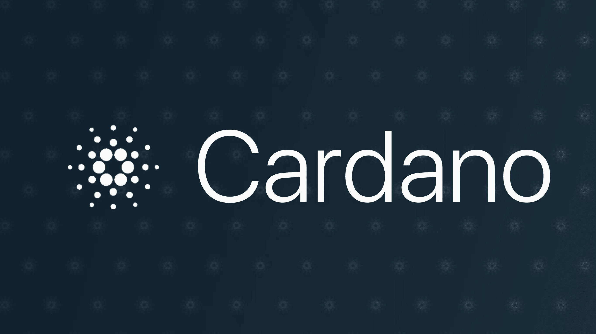

# Cardano 智能合同 101 —测试网

> 原文：<https://medium.com/coinmonks/cardano-smart-contracts-101-testnets-f9dc7ac24635?source=collection_archive---------2----------------------->



[image source](https://www.google.co.in/url?sa=i&rct=j&q=&esrc=s&source=images&cd=&cad=rja&uact=8&ved=2ahUKEwi7uPHuy4PdAhXCvY8KHQxQCOcQjxx6BAgBEAI&url=https%3A%2F%2Fmedium.com%2Fsetocean%2Fcryptos-in-3-mins-cardano-493627ac7920&psig=AOvVaw27HBGRrohcZWFz8xJtqeLs&ust=1535128056195501)

我记得第一次听说卡尔达诺的时候。这个奇怪的 ADA 令牌是最近在 Bittrex 上列出的第一个新令牌。我参加了一个生日聚会，但是我在我的车里发布了我的手机登录到 Bittrex 并刷新 ADA 页面。过早地买进卖出——我作为交易者的故事。幸运的是，故事并没有就此结束，在过去的一年里，我从交易过渡到了多区块链的实际开发。这个项目一直被学术界所掩盖，并且几乎没有可用的产品。我最近一直在研究新的 KEVM 和 IELE 测试网，学习如何在 Cardano 上部署智能合约。请给我关于这篇文章的反馈，并对这里所说的一切持怀疑态度！

## 测试网

Cardano 平台目前有两个测试网。以下是 IOHK(承包管理卡尔达诺发展的公司)网站的解释。

> KEVM 测试网
> 
> 在这里，您可以找到针对希望使用 KEVM 的开发人员的信息和说明，KEVM 是在 K 框架中指定的以太坊虚拟机(EVM)的正确构造版本。它允许开发人员试验任何可以在 EVM 上运行的智能合约，并提供改进的安全性和性能。k 是一种正式验证软件的方法，因此可以自动检查代码是否有任何缺陷，并且可以证明代码完全按照预期运行。我们鼓励您阅读关于 KEVM 的详细文档以及它与 EVM 的区别。最重要的是，我们期待您的反馈。

来源:https://testnet.iohkdev.io/goguen/kevm/

> IELE
> 
> IELE 是一个专用的虚拟机，为卡尔达诺区块链协议提供了基础。它执行和验证智能合同，并为区块链开发人员提供一种人类可读的语言。IELE 是使用形式化方法设计的，以解决在以太坊中编写可靠性智能合同所固有的安全性和正确性问题。当您在 IELE 编写智能合同时，它更安全，也更容易验证正确性。您受益于易于使用和可读的语言结构，并且整体性能得到提高。
> 
> IELE 测试网提供了更好的性能，并且是基于寄存器的，这意味着它可以利用比 KEVM 等基于堆栈的虚拟机更广泛的分析和优化。这导致更准确的天然气成本预测，以及更低的合同天然气成本。
> 
> IELE 是一种人类可读的语言，类似于 LLVM 中间表示。这使得直接向 IELE 编码变得容易，也使得理解合同和它们如何在区块链部署变得容易。IELE 旨在简化智能合同的正式验证。这包括编写智能合约必须遵守的规范，以及帮助开发证明智能合约在数学上正确的自动化技术。例如，在当前的智能契约范例中，将一个可能经过计算的数字压入堆栈，然后作为地址跳转到该堆栈，会使验证变得困难，从而降低安全性。IELE 避免了这个问题。它有命名标签，只能跳转到这些标签。此外，避免使用有界堆栈和消除堆栈或算术溢出有助于智能合约的规范和验证。
> 
> 调试合同变得更加容易，因为对于在合同中执行功能时可能发生的每个异常，IELE 都有不同的状态错误代码。除了帐户调用的正常返回值之外，调用函数的事务的发送方还会收到一个状态代码作为返回值。

来源:https://testnet.iohkdev.io/goguen/iele/

## 我的翻译

我上大学时在 IBM 实习，我们对新人做的一件事就是让他在实验室里寻找 1-D-10-T 电缆。他会在实验室里向他的新同事要一根 1D10T 电缆，要 20 分钟左右，直到有人告诉他这是个玩笑。作为一个真正的“白痴”有线电视搜索者，以下是我对两个测试网的理解:

## KEVM

这个测试网本质上是 ETC(以太坊经典)EVM，但它是一个 EVM(以太坊虚拟机)，已经被修改以符合 *K 框架*。 *K 框架*在这里[被描述](https://runtimeverification.com/blog/k-framework-an-overview/)，但是它本质上是一个编程语言必须遵守的标准，以便它的程序被正式验证和证明。Cardano 采用了 ETC 的 EVM，添加了必要的函数来满足 *K 框架，*并添加了一个**K**——从而产生了 EVM 名称的构造正确版本， **KEVM** 。KEVM 也是一个基于堆栈的机器，与我们的下一个测试网 IELE 相反，它是一个基于寄存器的机器。

**我发现* [*这篇文章*](https://www.quora.com/What-is-difference-between-register-machines-stack-machines) *对栈/寄存器的差异很有见地，也很简单*

## IELE

IELE 测试网基于与 KEVM 完全不同的虚拟机。虽然它们都可以运行 Solidity 代码，但 IELE 测试网会将代码转换成自己的 IELE 语言。IELE 是一个统一的低层平台，用于翻译和执行来自高层语言的智能合约。IELE 语言是人类可读的，并且对于每种类型的异常都有唯一的错误代码(**再见，老朋友，** *处理事务时的 VM 异常:恢复*)。IELE 语言允许对智能合同进行正式验证，并且它也符合 *K 框架。*出于我们的目的，我们将编写 Solidity 代码，但值得注意的是，最终在虚拟机上运行的代码将在执行前转换为 IELE。

IELE 来源:[https://runtime verification . com/blog/iele-a-new-virtual-machine-for-the-区块链/](https://runtimeverification.com/blog/iele-a-new-virtual-machine-for-the-blockchain/)

## 木槌

[Mallet](https://github.com/input-output-hk/mallet) 是一个用于与 Cardano 测试网交互的节点 CLI 工具。它也可以作为一个库包含在您的 dApp 中，用于链交互。在本文中，我们将使用它作为一个 CLI，并做一些简单的帐户交互。

## 设置

您将需要运行带有**节点 10.4** 或以上的 mallet。大多数人都在运行 Node 9 . x——我推荐通过[自制软件](https://brew.sh/)安装 **NVM** (节点版本管理器)并以这种方式管理节点版本。

**NVM 设置**

```
brew install nvm# Add nvm environment variables to your shell 
echo "export NVM_DIR='$HOME/.nvm'" >> ~/.bash_profile
echo ". '/usr/local/opt/nvm/nvm.sh'"  >> ~/.bash_profile# Load variables in current shell
source ~/.bash_profile# Install 10.4 version of Node
nvm install 10.4# Verify Version
nvm version
```

**木槌安装**

```
# Go to a Projects dir
cd <Cool Projects Dir># Pull Mallet
git clone [https://github.com/input-output-hk/mallet](https://github.com/input-output-hk/mallet) && cd mallet# Install dependencies
npm i# Verify installation
./mallet --help
```

**测试网连接**

```
# Connect to the KEVM testnet
./mallet kevm# Connect to the IELE testnet
./mallet iele# In both cases, once connected you will see the 'mallet> ' cursor
# indicating you are connected and it is waiting for input
```

**基本账户命令**

```
# The account commands are the same for both KEVM and IELE# Create an Account - note we are assigning a variable to use later
mallet> account1 = newAccount(<secret password>) # List accounts
mallet> listAccounts()# Select account - note we are using our variable we set earlier
mallet> selectAccount(account1)# Get balance - no argument assumes you are using the selected acct
mallet> getBalance()# Request Funds from faucet - note we are using the selected acct
mallet> requestFunds()
```

## 摘要

在这篇文章中，我们学习了卡尔达诺测试网的基础知识，KEVM 和 IELE。Cardano 文档每天都在增长，有证据表明那里有一个令人敬畏的产品。希望您已经学到了足够的知识，能够激起您更多的兴趣，因为在下一篇文章中，我将向您展示如何将您的第一个 Cardano 智能合同部署到 testnets！

> [直接在您的收件箱中获得最佳软件交易](https://coincodecap.com/?utm_source=coinmonks)

[](https://coincodecap.com/?utm_source=coinmonks)