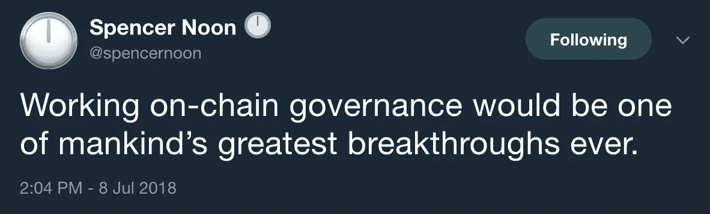

# 卡尔达诺——未来的自主经济？

> 原文：<https://medium.com/coinmonks/cardano-the-self-sovereign-economy-of-the-future-f648f946dc60?source=collection_archive---------0----------------------->

*在我的第一篇文章* *中介绍了我自己并描述了我为什么迷恋上了加密空间* [*之后，是时候写下我最兴奋的一个项目了；*](/@belowsearcher/crypto-a-mirror-of-society-1d79ed1df7db) [*卡丹诺*](https://www.cardano.org/en/home/) *。虽然从一开始就对 Cardano 很感兴趣，但我最初发现很难理解和欣赏这个项目的全部范围。在过去几个月的业余时间里，我逐渐研究了这个项目，我想我开始看到了大的图景，我发现这绝对令人兴奋。在这篇长篇阅读中，我将总结卡尔达诺项目引入的关键进展，以及如果成功，这些进展将如何改变我们所知的世界。*

Cardano 称自己为第三代加密货币和金融应用平台。比特币首次成功引入了加密货币的概念，之后以太坊成为第一个能够在区块链上运行智能合约的平台，[宣布真正成为“世界计算机”](https://www.youtube.com/watch?v=j23HnORQXvs)。自成立以来，两者都取得了很大成就，但也存在一些明显的可扩展性问题，例如:

1.  交易积压；在密集使用期间，输入的交易超过了系统处理能力，[增加了交易成本，降低了交易速度](https://cointelegraph.com/news/lightning-must-strike-soon-bitcoin-facing-backlogs-as-scalability-solution-awaited)。
2.  能源消耗；工作证明(PoW)采矿消耗能源，使能源消耗达到相当于一个小国的水平。尽管一些比特币支持者认为当前的银行系统更加耗能，但从环境角度来看，任何能耗显著降低的类似安全替代方案显然更具可持续性。

虽然这两个项目都有多种潜在的解决方案，并且其他一些项目正在分叉它们，以便创建他们试图改进的自己的版本，但 Cardano 正在从头开始构建。通过基本上对行驶中的汽车进行维护，可能会让这些项目保持领先，Cardano 希望设计这样一种高效的新车，它最终会赶上。

有许多项目旨在提高加密生态系统的可扩展性、互操作性和/或可持续性。Cardano 在竞争中脱颖而出的真正原因是它的开发过程。

Gource; a graphic that includes [a visualization of Cardano’s GitHub repository history](https://iohk.io/blog/a-major-brand-refresh-for-cardano/)

# 通过学术过程和正式验证进行开发

2017 年 ICO-boom 期间推出的大多数加密项目都写了一份白皮书，列出了具体的截止日期和预期结果，以筹集资金，并努力实现这两个目标。虽然这种方法对投资者很有吸引力，因为它给了他们明确的预期，可以期待什么以及什么时候期待它(去年导致许多‘卖新闻’事件，以便获利)，但它可能并不总是导致最高质量的产品。学习或设计新的东西需要时间，如果开发人员在时间压力下，事件的意外变化可能会导致他们做出务实的选择。

以太坊联合创始人查尔斯·霍金森(Charles Hoskinson)领导的来自[Input Output Hong Kong(IOHK)](https://iohk.io/)的开发团队为 Cardano 扭转了这一逻辑。他们想在现有的最佳科学和理论的基础上建立一个尽可能好的系统，并且随着拼图中的碎片被证明是可以解决的，他们将逐步实现这个系统。为了做到这一点，他们利用了一个实际上已经被工程师使用了数百年的系统；研究人员证明其理论有效的学术过程和正式方法。

因此，IOHK 发布的每一款 Cardano 产品都经过了严格的流程。首先，科学家开发一个潜在的理论，他们写在一篇科学文章中，在期刊或会议上提交给同行评审。其他几位科学家被要求对这篇文章进行严格的同行评议。这个过程是双盲的，这意味着作者不知道谁在进行审查，反之亦然，以允许双方在没有负面后果的情况下提出批评。

在审稿人给出他们对文章的批评意见后，编辑决定是否接受、拒绝或发给作者修改。因此，被同行评审的期刊或会议接受的文章具有其他科学家的“批准章”。对于 Cardano 实施的每一项关键技术，都有一个理论证明发表在同行评审的期刊上或在会议上展示，这些都可以在[的网站](https://www.cardano.org/en/academic-papers/)上找到。

然后，IOHK 的工程师继续在目标应用中进一步实施新开发的理论。完成后，名为 [FPComplete](https://www.fpcomplete.com/) 的第三方审计服务对代码进行审计，从而[在每月发布的审计报告](https://www.cardano.org/en/cardano-audit-reports/)中。为了增加透明度，卡尔达诺发布了[每周技术报告](https://www.cardano.org/en/weekly-technical-reports/)，在报告中他们给出了进度报告和对设计选择的解释。

所以，这些官僚作风是不是有点过头了？这不会不必要地减慢进程吗？

与其他只写代码，在测试网上运行，满意后马上在主网上实现的项目相比，它无疑减慢了这个过程。然而，作为透明度和学术过程的结果，密码学科学中一些最优秀的头脑(实际上发明了加密货币使用的技术)有机会批评该项目并找到关键漏洞。如果我们依靠学术过程和正规方法来制造火箭发动机、起搏器等，那么在为未来全球经济开发关键基础设施层时，我们难道不应该应用最高标准吗？

## 比比特币耗能更少、更快、更便宜的货币？

比特币是一个分散的账本，这意味着网络中的每个节点都存储着它的副本。为了防止恶意方为了自己的利益而篡改分类账，例如通过修改交易或重复消费，它使用了工作证明(PoW)共识机制。在 PoW 中，节点需要解决复杂的密码难题。第一个解决难题的节点开始“开采”下一个区块并获得开采奖励(目前为 12.5 BTC)，而其他节点验证分类账和已处理交易的当前状态。

由于攻击因此需要恶意方拥有至少 51%的开采权，所以攻击网络变得非常昂贵；目前[每小时 5 亿美元加上硬件成本](/@belowsearcher/crypto-a-mirror-of-society-1d79ed1df7db)。虽然这一系统在理论上仍然容易受到垄断采矿权的卡特尔(三个最大的采矿权池目前共拥有采矿权的 52.3%)和硬件(ASIC)生产商囤积最高效的硬件的攻击，但该系统仍然完好无损，并且自其诞生以来拥有近乎完美的正常运行时间。

2009 年比特币的推出是一个绝对的突破，如果加密货币成功的话，它将作为我们这个时代最大的技术进步之一被人们铭记。然而，在目前的形式下，它太慢、太贵，而且可以说太耗能，无法像比特币白皮书中描述的那样用作日常现实世界的“点对点电子现金系统”。如果闪电网络(比特币解决这些可扩展性问题的最大希望)成功，交易速度和成本将大幅下降——但能耗仍然存在。虽然大众接受后者作为一种折衷当然是可能的，但至少同样快速和安全但消耗明显更少能量的类似系统在总成本和(环境)可持续性方面都具有优势。

Cardano 希望通过使用一种称为 Ouroboros 的创新型利害关系证明(PoS)共识机制来实现这一目标。在 Ouroboros 中，任何人都可以通过以下方式参与共识机制:( 1)通过保持他们的计算机在线，在他们自己的节点中“下注”他们的硬币，或者(2)将他们的下注权委托给赌注池，这意味着他们不必一直在线。共识机制随机指定某人创建下一个区块，其中“赢得彩票”的几率与相对股份比例相关联；一个人的股份越多，被任命的几率就越大。因此，更大的赌注池将更容易赢得彩票，但赌注回报需要在利益相关者之间进行分配。最后，它使用基于博弈论的激励方案[，激励节点和用户保持系统分散](https://forum.cardano.org/t/summary-pos-delegation-incentives-lars-brunjes/11880)。大毒蛇(创世纪)的第一个版本的数学证明已经[出版](https://iohk.io/research/papers/#9BKRHCSI)，并在 2017 年加密会议上展示。大毒蛇将在接下来的几个月(大约 2018 年末)卡达诺的《Shelly》发行期间实现。

大毒蛇最大的潜在假设之一(因此也是一个潜在的弱点)是有诚实的大多数人参与。这一假设在被‘放归野外’后是否成立，将经受时间的考验。如果成功，共识机制将比比特币更快、更便宜、耗能更少，并且在理论上可以调整为更具可扩展性。更高效的下一个版本 Ouroboros Praos 的数学证明已经在 2018 年 Eurocrypt 上发布。Ouroboros Praos 计划在‘Basho’发布时实现(2019？).在 Praos 之后，IOHK 将致力于 [Ouroboros Hydra](https://youtu.be/Z_WrH6EPAQs?t=54m49s) ，这将为共识机制带来进一步的去中心化和可扩展性(2020？).

如果你想了解更多关于大毒蛇的信息，可以看看这些用通俗语言解释[的视频](https://youtu.be/lT6e8uWn1Os) (7 分 22 秒)和详细的(45 分 09 秒)。

## 比以太坊更安全、对开发者更友好的智能合约平台？

Nick Szabo 在 1995 年就已经讨论过智能合同的概念。建议是，从理论上讲，两个或更多人之间的任何“契约”或安排都可以被编程，使过程自动化，从而降低参与者之间必要的信任度。然而，在比特币出现之前，这个概念的应用是不可行的，因为没有安全、不可信的系统可用。基于比特币的成功，智能合约首先由以太坊成功付诸实践。ICO 于 2014 年[举行](https://cointelegraph.com/news/ethereum-raises-3700-btc-in-first-12-hours-of-ether-presale)，在 2016 年和 2017 年的大牛市期间，该平台作为 ICO 平台尤其受到关注。

虽然像比特币一样，以太坊标志着加密空间和总体技术创新的绝对突破，但该系统也有其弱点。除了上面提到的与比特币类似的可扩展性问题，智能合约编程的复杂性也引入了一些新的漏洞。

2016 年年中，加密货币历史上最重大的黑客攻击之一由此发生。建立了一个分散自治组织(DAO ),试图使用智能合同使组织的决策自动化，消除对人工干预的需要，从而创建一个无信任的组织。这个特定的 DAO 寻求筹集资金，并使用利益相关者的投票方案来投票决定钱将花在哪里，这也使它成为黑客的一个巨大的蜜罐目标。

接下来发生的事情是，有人在底层代码库中发现了一个漏洞，[允许他重复消费，从而以牺牲其他投资者的利益为代价，抽走了很大一部分资金](https://www.coindesk.com/understanding-dao-hack-journalists/)。结果，大约 15%的流通以太被盗，导致一个分叉来恢复丢失的资金，这在以太坊社区内引发了一场大规模的存在主义讨论，并最终将网络分裂为以太坊和以太坊经典。虽然“道黑客”提高了对智能合约代码漏洞的认识，并导致了像 [Quantstamp](https://quantstamp.com/) 这样的初创公司审计智能合约，但事实是，智能合约仍然容易出现人为错误，因为类似的以太坊平价钱包黑客在[6 月](https://blog.zeppelin.solutions/on-the-parity-wallet-multisig-hack-405a8c12e8f7)和【2017 年 11 月发生。

为了执行 Cardano 的智能合同，IOHK 和 [Runtime Verification](https://runtimeverification.com/) 正在开发一个名为 IELE 的新虚拟机。因为有了一种叫做[基于语义的编译](https://youtu.be/x_xm69gd3fE)的方法，开发者将能够用几乎任何编程语言在 Cardano 上编写智能合约*和*通过构造是正确的。

这意味着 Cardano 非常灵活，对开发者非常友好，并且非常安全。假设 IELE 实现了它的承诺，在 Cardano 上编写智能合同时，像 DAO hack 这样的事件将是不可能的。

[IELE 的 testnet 于 7 月 30 日刚刚上线](https://bitsonline.com/cardano-smart-contract-testnet-update/)。最终版本是 Goguen 版本的一部分，预计将于 2019-2020 年推出。根据 IOHK 首席执行官 Charles Hoskinson 的说法，IELE 将使 Cardano 成为一个比以太坊更便宜、更快、更安全的智能合约平台，用于 ICO 和安全令牌产品(STO 的)。

大毒蛇和 IELE 令人兴奋，但卡尔达诺的长期成功将几乎完全取决于其最终“伏尔泰”释放的一个关键方面(2020 年？).

A tweet about on-chain governance [by Spencer Noon](http://Cardano; the self-sovereign economy of the future? After introducing myself and describing why I've become enamored with the crypto space in my first post, it is time to write about one of the projects I'm most excited about; Cardano.  Cardano calls itself a third-generation cryptocurrency and platform for financial applications. Bitcoin first successfully introduced the concept of a cryptocurrency, after which Ethereum became the first platform that was able to run smart-contracts on a blockchain, proclaiming to literally become a 'world computer'. Both have achieved a lot since their inception, but also have some clear scalability issues, such as:  Transaction backlogs; during intensive use, more transactions are entered than the system can handle, increasing transaction costs and lowering transaction speed.  Energy consumption; Proof-of-Work (PoW) mining consumes energy, driving energy consumption to a point where it equals the energy consumption of a small country. While some Bitcoin proponents argue the current banking system is even more energy-consuming, any similarly secure alternative with significantly lower energy-consumption would clearly be more sustainable from an environmental perspective.   While both projects have multiple potential solutions being worked on and some other projects are forking them in order to create their own version they're trying to improve, Cardano is being built from scratch. While carrying out maintenance on a moving car might allow these projects to keep their head start, Cardano hopes to design such an efficient new car it will eventually catch up.  There are many projects aiming to improve the scaleability, interoperability and/or sustainability of the crypto ecosystem. What really sets Cardano apart from the competition is the process by which it is being developed.  Gource; a graphic that includes a visualization of Cardano's GitHub repository historyDevelopment through the academic process and formal verification Most of the crypto projects that were launched during the ICO-boom of 2017 wrote a whitepaper with concrete deadlines and expected results to raise money, and work hard to achieve both. While such an approach is attractive to investors as it gives them clear expectations what to expect and when to expect it (last year resulting in many 'sell-the-news' events in order to take maximum profit), it may not always result in the highest quality products. Learning or designing something new takes time and an unexpected turn of events might cause developers to make pragmatic choices if they're under time-pressure.  The development team from Input Output Hong Kong (IOHK), led by Ethereum co-founder Charles Hoskinson, turned this logic around for Cardano. They want to build the best possible system based on the best available science and theory, and will implement it gradually as pieces of the puzzle slowly are provably solved. To do so, they utilize a system that has actually been used by engineers for a few hundred years; the academic process and formal methods in which the researchers prove their theory works.  Every Cardano product that is being released by IOHK therefore undergoes a rigid process. First, scientists develop an underlying theory, which they write down in a scientific article that they present for peer-review at a journal or conference. Several other scientists are being asked to critically peer-review the article. This process is double-blinded, meaning the author's don't know who is performing the review, and vice versa, to allow both sides to be critical without negative consequences.  After the reviewers give their critical opinion on the article, an editor decides whether it is accepted, rejected or sent to the authors for revision. Articles that are accepted for a peer-reviewed journal or conference therefore have 'stamp of approval' of fellow scientists. For every key technology that is implemented in Cardano, a theoretical proof has been published in a peer-reviewed journal or was presented at a conference, which are available on their website.  IOHK's engineers then continue by further implementing the newly developed theory in the targeted application. When finished, a third party auditing service called FPComplete audits the code, resulting in a monthly published audit report. For additional transparency, Cardano releases a weekly technical report in which they give progress reports and explanations for made design choices. So, isn't all this bureaucracy a bit over the top? Doesn't it unnecessarily slow down the process? Yes, this certainly slows down the process compared to other projects that just write code, run it on a testnet and when satisfied implement it onto their mainnet right away. However, as a result of the transparency and academic process, some of the best minds in cryptographic science (that actually invented the techniques that cryptocurrencies use) have had a chance to criticize the project and find key vulnerabilities.  If we count on the academic process and formal methods to build rocket engines, pace makers etcetera, shouldn't we also apply the highest standards when developing a key infrastructure layer for the future global economy? A less energy-consuming, faster and cheaper currency than Bitcoin? Bitcoin is a decentralized ledger, meaning every node in the network stores a copy of the ledger. To prevent malicious parties from altering the ledger to their benefit by altering transactions or double-spending, it uses a Proof-of-Work (PoW) consensus mechanism. In PoW, nodes need to solve difficult cryptographic puzzles. The node that first solves the puzzle gets to 'mine' the next block and receive the mining rewards (currently 12.5 BTC), while the other nodes verify the current state of the ledger and processed transactions.  Since an attack would therefore require the malicious party to own at least 51% of the mining power, it becomes very expensive to attack the network; currently $0.5 billion per hour plus hardware costs. While this system in theory remains vulnerable to cartels pooling mining power (the 3 largest mining pools together currently own 52.3% of the mining power) and hardware (ASIC) producers hoarding the most efficient hardware for their own, the system remains unhacked and has a near-perfect uptime since it's inception.  The introduction of Bitcoin in 2009 was an absolute breakthrough and will be remembered as one of the biggest technological advances of our time, assuming cryptocurrencies are successful. Yet in its current form, it is too slow, too expensive and arguably too energy-consuming to be used as a daily real-world 'peer-to-peer electronic cash system' like described in Bitcoin's whitepaper. If Lightning Network (Bitcoin's biggest hope to solve these scaleability issues) is successful, transaction speed and costs will go down drastically - but the energy-consumption remains. While the masses accepting the latter as a tradeoff could certainly be a possibility, a similar system that is at least as fast and secure but consumes significantly less energy has an advantage in both overall cost and (environmental) sustainability.  Cardano hopes to achieve this by using an innovative variant of Proof-of-Stake (PoS) consensus mechanisms called Ouroboros. In Ouroboros, anyone can participate in the consensus mechanism by (1) 'staking' their coins in their own node by keeping their computer online or (2) delegate their staking rights to a stakepool, which can also be done offline. The consensus mechanism randomly appoints someone to create the next block, where the odds of 'winning the lottery' are tied to the relative proportion of stake; the more someone stakes, the higher odds of being appointed. Larger stakepools will therefore more often win the lottery, but the stake rewards need to be devided amongst stakeholders. Finally, it uses a game theory-based incentive scheme that incentivizes both nodes and users to keep the system decentralized. The mathematical proofs for the first version of Ouroboros (Genesis) were already published and presented at the Crypto 2017 conference. Ouroboros is implemented during Cardano's 'Shelly' release over the next few months (~Q3 2018).  One of the biggest underlying assumptions (and thus potential vulnerability) of Ouroboros is that there is an honest majority participating. Whether this assumption holds after being released 'in the wild' will undergo the test of time. If successful, the consensus mechanism will be faster, cheaper and way less energy-consuming than Bitcoin and could in theory be tweaked to be way more scaleable. The mathematical proofs for the next version, Ouroboros Praos, which is even more efficient, are already published  and presented at Eurocrypt 2018\. Ouroboros Praos is planned to be implemented with the 'Basho' release, which will likely be done in 2019\. After Praos, IOHK will work on Ouroboros Hydra, which should bring further decentralization and scaleability to the consensus mechanism (2020?).  If you want to learn more about Ouroboros, check out these video's explaining it in layman language (7:22 min) and in detail (45:09 min). A safer, more developer-friendly smart-contract platform than Ethereum? The concept of smart-contracts was already being discussed by Nick Szabo in 1995\. The suggestion was that in theory, any 'contract' or arrangement between two or more people could be programmed, automizing the process and thus decreasing the amount of trust necessary amongst the participants. However, until the inception of Bitcoin, the application this concept was not feasible, as no secure, trustless system was available. Building on Bitcoin's success, smart contracts were first successfully brought into practice by Ethereum. The ICO was held in 2014 and the platform particularly gained traction as an ICO-platform during the enormous bull-run of 2016 and 2017.  While like Bitcoin, Ethereum marks an absolute breakthrough in the crypto space and technological innovation in general, the system has its vulnerabilities. Besides having similar scaleability issues as Bitcoin mentioned above, the complexity of programming smart contracts also introduced some new vulnerabilities.  Mid 2016, one if the most significant hacks in the history of cryptocurrencies occurred as a result. A Decentralized Autonomous Organization (DAO) was built, attempting to automize the decision making of an organization using smart contracts, eliminating the need for human intervention and thus creating a trustless organization. This specific DAO looked to raise money and use a voting scheme of stakeholders to vote where the money would be spent on, which also made it a gigantic honeypot target for hackers.  What happened next was that someone found a vulnerability in the underlying codebase, allowing him to double-spend and thus drain a large portion of the money at the expense of other investors. As a result, roughly 15% of all circulating Ether was stolen, resulting in a fork to recover the lost funds, which initiated a massive existential discussion within the Ethereum community and eventually a split of the network into Ethereum and Ethereum Classic. While the 'DAO hack' increased awareness of vulnerabilities in smart contract code and resulted in startups such as Quantstamp that audit smart contracts, the fact that smart contracts remain vulnerable to human error, as similar hacks of Ethereum's Parity wallet in June and November 2017 occurred.  To execute smart contracts for Cardano, IOHK and Runtime Verification are developing a new virtual machine called IELE. Because of a method called Semantics Based Compilation, developers will be able to write smart contracts on Cardano in just about any programming language and are correct by construction.  This means Cardano flexible, very developer-friendly and very secure. Assuming IELE lives up to it's promise, an incident like the DAO hack will be impossible when writing smart contracts on Cardano.  IELE's testnet was just launched on July 30th. The final version is part of the Goguen release and is expected to be launched somewhere in 2019–2020\. According to IOHK CEO Charles Hoskinson IELE will make Cardano a cheaper, faster and more secure smart contract platform for ICO's and Security Token Offerings (STO's) than Ethereum.  A fully decentralized, self-sovereign system?   …   Sustainability DAO hack → https://medium.com/@FEhrsam/funding-the-evolution-of-blockchains-87d160988481 Tweet by Spencer Noon that fixing governance is extremely important → Figure A system that will improve worldwide socioeconomic equality? This  3 billion people don't have … access to a financial stack(?) Teaching African students (so far at least Etheopia and Rwanda) about programming, blockchain and cryptographics, hiring the best ones and allowing them to facilitate the implementation of this new infrastructure in their native countries. https://youtu.be/Z_WrH6EPAQs?t=1h38m3s (expected 2022–2025) … Conclusion Interoperability, privacy, blockchain-agnostic wallet, ATM's in Japan, debit card The title and subtitles have a lot of question-marks behind it, for good reason. The big question is: will the developed theories actually work as expected in the real world? At this point, nobody knows. However, if any of the current project teams should be capable of building a working project that is based on the best theoretical concepts out there, it is IOHK.  Since I've learned about Cardano and started studying the project, it has become my benchmark when reviewing other crypto projects. While I'm actually very aware of not becoming a narrow-minded maximalist, blinded for alternative technologies and solutions, my list of projects that I'm following has actually shrunk quite a bit since I learned about Cardano.  In some ways, Cardano is like slow cooking and mindful eating. IOHK take their time to cook the best possible meal. Let's make sure we stay mindful when eating it; alert to see if it lives up to it's promises and off-course enjoy every bite when it does.).

## 一个完全分散的，自我主权的系统？

完全去中心化对于系统的无信任和安全是绝对必要的。这意味着；

1.  令牌分配应该足够分散，使得任何一方都不能轻易获得系统中的多数股权；
2.  任何个人或利益集团都不能以多数股权参与共识机制；
3.  任何个人或团体都不应该有全权决定供应链的未来。

在撰写本文时，[令牌分配相当分散](https://www.cardano.org/en/genesis-block-distribution/)，在 Shelly 发布期间(大约 2018 年末)实现 Ouroboros 之后，节点分配也应该足够分散。然而，在未来几年，IOHK 仍将完全控制该系统的开发。虽然这在开发的早期阶段是必要的，但是既然他们看起来做得很好，为什么 IOHK 不继续做所有的开发工作呢？

前面提到的 DAO hack 实际上就是一个很好的例子。由于代码中的漏洞造成的资金损失，以太坊社区[在下一步该做什么](https://www.coindesk.com/understanding-dao-hack-journalists/)上分歧很大。该社区的一部分人，包括以太坊的联合创始人 Vitalik Buterin，确信恢复失去的资金将基本上表明该社区可以战胜恶意行为者。另一部分人，包括以太坊的联合创始人和现任 IOHK 首席执行官查尔斯·霍斯金森(Charles Hoskinson)，认为分叉链以恢复资金损失将证明分类账并不像它所说的那样“不可改变”，因此不变性应该得到尊重。双方都无法达成协议，链和社区最终都分裂成了我们今天所知的以太坊(ETH)和以太坊经典(ETC)。

除了潜在的开发人员和社区分歧，如果个人在重要的选择或正在编写的代码方面有决定性的发言权，会给系统带来“单点故障”。除了可能做出有偏见的决定之外，贿赂或威胁还会间接影响系统的安全性。所以政治其实对任何加密货币的治理模式都有非常大的作用，甚至是比特币和以太坊。

那么，我们如何才能让这个治理系统真正不受信任，不受审查呢？唯一被证明是抵制审查和不可信的系统是比特币——这就是为什么链上治理是解决这个政治可持续性问题的一个如此有趣的想法。最近在 EOS 的链上治理中的[危机表明，这样一个系统的复杂性不应该被低估，因为后果可能是巨大的。对于 Cardano，IOHK 设想了一个系统，在该系统中，共识奖励的一定百分比被留在金库中，并且定期(例如，每月一次)的链上投票决定其花费。](https://www.coindesk.com/eos-arbitrator-problem-crypto-governance-breakdown-explained/)

首先，在预投票阶段，*任何人*只要对如何改进当前系统(例如效率升级、分叉、新功能或 dApp)有想法，都可以提交一份资金提案。其余的用户可以注册，如果他们想成为(1)选民，(2)专家，或(3)想参加选举委员会。投票者需要投入一定数量的硬币才能参与，他们可以直接投票，也可以委托专家投票。专家拥有与投票人相同的权利，但可以将其他投票人的股份委托给他们，这意味着他们的投票权重可以增加。最后，委员会成员参与投票，确保选举过程正常运行并得到执行。

第二，在投票阶段，使用算法抽取一个代表性投票委员会，当选的机会与此人的赌注成比例。此外，还要求利益相关方投票决定哪个(哪些)资金提案应该获得资金。与大毒蛇一样，任何利益相关者都可以选择直接参与，在这种情况下是通过自己投票，或者将他们的权利委托给其他人，例如对该主题更了解的人或利益相关者委托为他们投票的人。在卡尔达诺设想的投票系统中，利益相关者可以委托注册为专家的任何人。专家甚至可以将别人委托给他们的股份委托给别人。这就是所谓的液体民主。

例如:我的母亲(注册选民)持有 ADA，但觉得自己没有能力对 Cardano 的未来做出决定。然而，她知道我(注册专家)正在积极关注事态发展，并且完全信任我会这样做，或者至少知道应该支持谁，所以她将股份委托给我。我确实读了很多关于 Cardano 的书，并积极参与社区活动，但我不认为我是一个足够的主题专家来就各自的主题投票，所以我将我(以及我母亲)的股份委托给一个我认识的社区领袖(也是专家)，他似乎和我有相似的道德指南。然后，该社区成员代表他/她自己的股份、我的股份、我母亲的股份以及其他任何委托给他/她的人投票赞成或反对，这大大增加了他/她的投票权重。

第三，在投票后阶段，选举委员会成员将核实结果，如果确实合法，就执行这些结果。然后根据赞成票的相对比例对所有提案进行排名。例如，80%投票赞成的提案排在第一位，然后是获得 75%赞成票的提案，第三个项目获得 55%的赞成票。只要资金可用，可用的国库资金就会按此顺序分配给他们。例如，前两项提案可能有足够的资金，但第三项提案却没有。剩余资金将作为“投票奖励”分配给参与投票过程的每个人。

Dash 是一种加密货币，它有一个类似的投票系统，其主节点持有者可以投票。然而，该系统缺乏隐私，这在理论上可能会影响选民，例如当有争议的提案正在进行表决。在卡尔达诺，使用零知识证明，投出的选票将因此变得模糊。

Cardano 的链上治理模型因此引入了几个概念突破，包括(1)它是一个混合系统，参与者可以直接投票或委托投票，(2)委托和投票同时进行，以及(3)所有投票都是私下进行的。IOHK 已于 2017 年 10 月发表了一篇关于拟议中的资金系统的学术论文，但在“Voltaire”发布之前，它不打算推出链上治理系统。这允许他们首先获得在 Ouroboros(有点类似)中打桩的“真实世界”经验，从其他项目的链上治理的成功和失败中学习，并争取一些时间来微调系统以达到完美。

虽然我绝不是这方面的专家，但作为一名科学家，我倾向于持怀疑态度，直到被证明是错误的。就我个人而言，我最大的担忧是，防止拒绝服务和 sybil 攻击所必需的赌注阈值可能会导致实际选民成为总人口中不具代表性的样本，因为更富裕的利益相关者可能有更多的机会参与。这将取决于实际门槛会有多高，目前还不得而知。我相信 IOHK 团队会找到最好的解决方案，但是和其他事情一样，时间会告诉我们实际的实现会是什么样子，以及它是否真的像预想的那样工作。

## 一个能改善全球社会经济平等的系统？

2014 年末，在 Cardano 项目启动之前，IOHK 首席执行官 Charles Hoskinson [在 TEDxBermuda](https://youtu.be/97ufCT6lQcY) 上谈到未来将如何去中心化。在他的演讲中，霍金森描述了一个 30 岁的美国人的生活，并将其与一个年龄相仿的阿富汗人的生活进行了比较。他的例子非常清楚地表明，生活在第一世界国家的人们认为理所当然的许多东西在其他地方不一定能得到。事实上，全世界大约有 30 亿人就是这种情况。

对于第一世界国家来说，像 Cardano 这样的系统可以提供出色的基础设施升级，但对于生活在发展中国家的人来说，这可能是他们第一次拥有出生证明、土地登记和进入一个系统，这个系统可以抵制审查，存储他们的钱，并允许他们快速、廉价和安全地转移资金。这就是为什么卡尔达诺[对区块链技术如何帮助发展中国家有着清晰的愿景](https://youtu.be/vTVrUOFXIT0)。

IOHK 联系了非洲的大学，为他们最好的学生提供了学习区块链、编程等知识的机会。他们的工作人员在世界著名的大学和研究机构工作。作为回报，这些学生向 IOHK 教授他们的祖国处理的实际日常问题，并帮助 IOHK 找到解决这些问题的方法。Hoskinson 预计这项研究的结果将在 2022-2025 年左右大致显示出[。](https://youtu.be/Z_WrH6EPAQs?t=1h38m3s)

这已经促成了与埃塞俄比亚政府的谅解备忘录(MOU ), IOHK 承诺培训区块链开发者，而埃塞俄比亚政府则探索在他们的农业中使用区块链技术，特别是咖啡。同样，霍斯金森[最近在卢旺达](https://www.reddit.com/r/cardano/comments/8ijh6d/charles_hoskinson_opening_remarks_rwanda/)的几个活动上发表演讲，也吸引了很多人的兴趣。

如果 Cardano 真的成为未来经济的安全基础设施层，它似乎最有可能首先在发展中国家实施。如果它成功了，它将改变全世界数十亿人的生活。

# 结论

Cardano 引入了如此多令人兴奋的新技术，我们甚至还没有谈到[互操作性](https://youtu.be/Ja9D0kpksxw?t=19m2s)、[隐私](https://www.youtube.com/watch?v=cAJERtcZamc&feature=youtu.be&t=1m34s)、[量子电阻](https://youtu.be/Ja9D0kpksxw?t=10m44s)、[区块链不可知钱包](https://daedaluswallet.io/)、[纸质钱包](https://forum.cardano.org/t/paper-wallets-launched-for-cardano-announcing-daedalus-0-10-0-and-cardano-1-2-0-release/12503)、[即将推出的硬件钱包支持](https://blog.coinspectator.com/2018/03/16/cardano-ada-coming-to-a-ledger-wallet-near-you/)、[日本的 Cardano ATM](https://www.cardano.org/en/buy-sell-ada/)以及即将推出的[借记卡](https://www.youtube.com/watch?v=Z_WrH6EPAQs&feature=youtu.be&t=1h9m47s)。然而，标题和副标题背后有很多问号，这是有道理的。最大的问题是:发展出来的理论在现实世界中会像预期的那样起作用吗？

事实上，Cardano 的技术，如 Ouroboros 的新颖激励方案和链上治理模型，是基于形式验证和数学证明的，这是非常好的。然而，他们非常依赖潜在的假设，因此根据定义*假设*是正确的，直到证明是错误的。

因此，卡尔达诺需要经受时间的考验，我们才能更加确定它确实是合法的。这不是在敲打卡尔达诺，而是任何依靠博弈论和去中心化激励计划的加密货币的命运，甚至是比特币。因此，在我看来，期望 Cardano 在实施后立即成为我们生活中的关键基础设施层是不合理的(2020 年？)马上。然而，如果它像预期的那样发挥作用，并被证明是有弹性的，对该系统信任的逐渐增加可能会增加采用率，并最终使它能够实现其全部承诺。

在某些方面，卡达诺就像慢煮和用心饮食。IOHK 花时间做最好的饭菜。让我们确保在吃的时候保持正念；警惕地看它是否信守承诺，如果它做到了，当然要享受每一口。

*此文还有中文***[*俄文*](https://link.medium.com/pA7nF4Xd3S) *和* [*西班牙文*](https://forum.cardano.org/t/cardano-la-economia-autosoberana-del-futuro/23089) *。***

> **喜欢这个故事吗？你可以在[媒体](/@undersearcher)和[推特](https://twitter.com/undersearcher)上关注我。**
> 
> ****免责声明**:本文仅用于信息和教育目的，不应视为投资建议。**

****