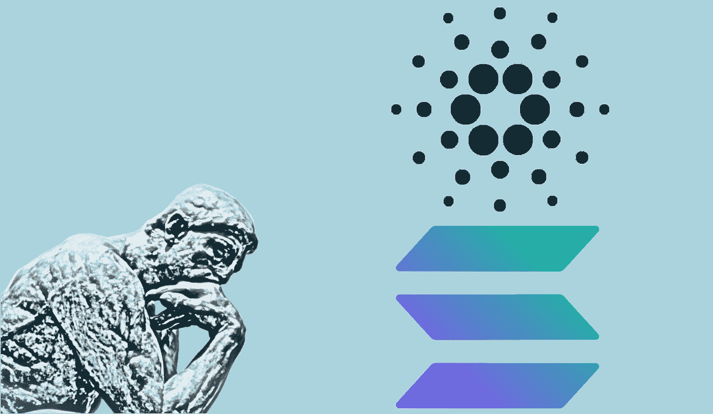

# 从验证者的角度看卡尔达诺对索拉纳

> 原文：<https://medium.com/coinmonks/cardano-vs-solana-from-a-validators-perspective-920b439366c2?source=collection_archive---------6----------------------->

A thinker has to decide what is best. One, the other, both or none?

关于这两个项目的利弊已经有了很多讨论。人们比较了市场资本总额、第 1 层吞吐量、已经在各自链上运行的 dApps 的数量、社区、公众与所有者/创造者手中的令牌百分比、网络必须重启的次数、发表的同行评审论文的数量；)

我将触及其中的一些指标，但我真的想通过验证者的视角来展示这种差异:一个人决定加入网络，在一个由一台或多台机器组成的节点上运行区块链验证软件。

我个人知道如何运行 Cardano Node，也就是 Staking pool，因为我从二月份开始就成功地运行了一个。我从来没有丢过一块，我的正常运行时间是 100%，所以，是的，我的系统工作正常。在 Azure 上，我每月花费大约 150 美元，运行 2 个中继节点和 1 个块生产。虚拟机只需要 2 个内核和 16GB 或 RAM，正如我们所说，开发人员正在试图优化这一点，以消耗更少的内存。

对于索拉纳来说，[要求](https://docs.solana.com/running-validator/validator-reqs)是:

*   16 个内核/32 个线程
*   256GB 内存
*   500GB 高清
*   300 兆比特/秒对称网络，商用。首选 1GBit 秒

现在我不知道这样的系统性能如何，因为我没有试过，但在 [Azure 的市场](https://azure.microsoft.com/en-us/pricing/calculator/)上，这种类型的机器每月的账单，最低限度，比如说 1 E32d v5 (32 个 vCPUs，256 GB RAM，1200GB 临时存储)是 1892.21 美元。你必须加上网络成本，税收，也许额外的磁盘空间，或者专用磁盘而不是临时磁盘，我不确定。可以肯定的是，它比我在 Cardano 上的系统要贵 10 倍以上。

这种成本差异将立即减少愿意尝试的人数。对大多数人来说，尝试每月 150 美元比 2500 美元更容易。这意味着，从这个角度来看，索拉纳网络在实现真正的权力下放方面将有更多的困难，因为只有富裕的个人才会承担这样的任务。

我想说的下一点是优雅。是的，如果增强节点的处理能力，每秒钟可以处理更多的事务。这在编程中被称为暴力，并且不是可扩展的解决方案。在这种情况下，扩展计划是什么？买更大更强的机器？在一个真正分散的、大规模采用的加密生态系统中，这场竞赛是无法获胜的。真正需要的是能够在巨大负载下工作的扩展解决方案。每当达到交易阈值时，不必重启网络。而是在本地网络的第二层进行验证，并将汇总结果传递给主区块链。L1·区块链松了一口气！

我比较的另一个指标是令牌分布。给我看看钱！对于 Cardano 来说，事情很清楚，所有的节点都由社区管理，因为今年春天 genesis pool 退役了。根据 messari.io 的数据，总供应量的 83.33%掌握在公众投资者手中。来自[同一地点](https://messari.io/asset/solana/profile/launch-and-initial-token-distribution)的索拉纳的数字令人担忧:总供应量中只有 37%掌握在投资者手中。这意味着特定人群更容易操纵价格。此外，在一个子集上交易(37%对 83%)对价格行为有比例效应，假设基金会在两种情况下都不交易。

最后，这个问题归结为每个人的个人偏好。一旦我们掌握了事实，我们就可以做出明智的决定。如果你想要一个非常快速的 L1 解决方案，一个年轻的项目，去年增长惊人，但有一些问题，索拉纳是你的选择。如果你想要一个稳定而缓慢的增长，一个坚实的科学基础，一个通往未来的清晰道路，一个明确的里程碑，一个令人惊叹的社区，一个世界上最好的科学家致力于证明和改进协议，一个真正分散的生态系统，Cardano 就是答案。欢迎登机，我们爱你！(我们也爱索拉纳人，人人都有空间！:) )

PS。请考虑委派一些 ADA 到我们的游泳池。我们把利润的 10%捐给对卡尔达诺协议研究最好的 NTUA 学生:
阿达·斯克普斯—ASKP
www.skepsispool.com—[https://www.youtube.com/channel/UCwsKlLDRjXNH3-DwnGU6elg](https://www.youtube.com/channel/UCwsKlLDRjXNH3-DwnGU6elg)

> 加入 Coinmonks [电报频道](https://t.me/coincodecap)和 [Youtube 频道](https://www.youtube.com/c/coinmonks/videos)了解加密交易和投资

## 也阅读

 [## 杠杆代币[多头代币]终极指南

### 杠杆化令牌是具有杠杆化风险敞口的 ERC20 令牌，不考虑保证金、要求、管理…

medium.com](/coinmonks/leveraged-token-3f5257808b22)  [## 最佳加密交易所| 2021 年十大加密货币交易所

### 编辑描述

blog.coincodecap.com](https://blog.coincodecap.com/crypto-exchange)  [## 2021 年最佳加密借贷平台| 6 大比特币借贷平台

### 获得比特币和其他加密货币的最佳贷款利率

medium.com](/coinmonks/top-5-crypto-lending-platforms-in-2020-that-you-need-to-know-a1b675cec3fa)  [## 2021 年最佳免费加密交易机器人

### 2021 年币安、比特币基地、库币和其他密码交易所的最佳密码交易机器人。四进制，位间隙…

medium.com](/coinmonks/crypto-trading-bot-c2ffce8acb2a)  [## 最佳 4 个加密交易信号电报通道

### 这是乏味的找到正确的加密交易信号提供商。因此，在本文中，我们将讨论最好的…

medium.com](/coinmonks/best-crypto-signals-telegram-5785cdbc4b2b)  [## 5 个最佳社交交易平台[2021] | CoinCodeCap

### 编辑描述

blog.coincodecap.com](https://blog.coincodecap.com/best-social-trading-platforms)  [## BlockFi 评论 2021:利弊和利率| CoinCodeCap

### 编辑描述

blog.coincodecap.com](https://blog.coincodecap.com/blockfi-review)  [## 如何在印度购买比特币？2021 年购买比特币的 7 款最佳应用[手机版]

### 如何使用移动应用程序购买比特币印度

medium.com](/coinmonks/buy-bitcoin-in-india-feb50ddfef94)