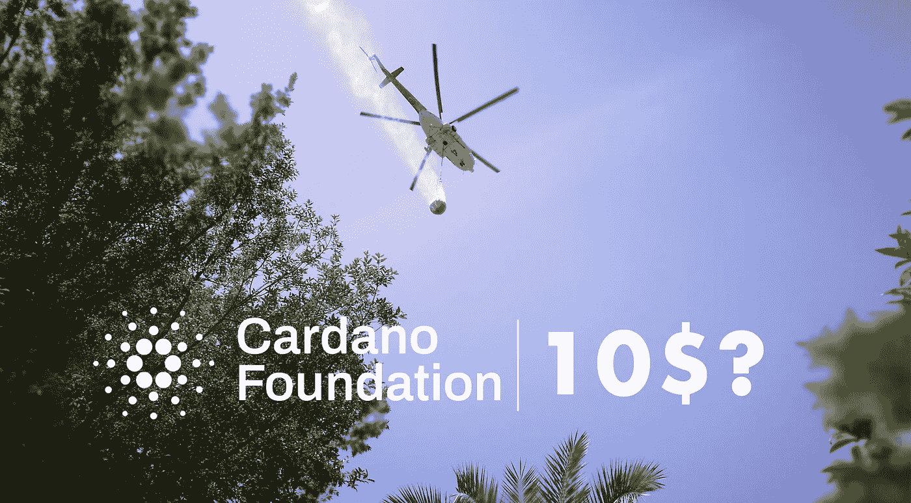

# 卡尔达诺:为什么 10 美元 ADA 是可能的

> 原文：<https://medium.com/coinmonks/cardano-why-10-ada-is-possible-936b13c8e3f5?source=collection_archive---------0----------------------->

10$? — Photo by [Raimond Klavins](https://unsplash.com/@raimondklavins?utm_source=unsplash&utm_medium=referral&utm_content=creditCopyText) on [Unsplash](https://unsplash.com/?utm_source=unsplash&utm_medium=referral&utm_content=creditCopyText), edited by the author

卡尔达诺(ADA)今年的价格大幅上涨。1 月 1 日，阿达值 0.18 美元；目前，以太坊的竞争对手是 1.27 美元**。**巨大的收益，这就是为什么许多交易者和加密新手特别想知道一件事:H **卡尔达诺还能涨到多高？**还有分析师对 ADA 价格的预测有哪些？