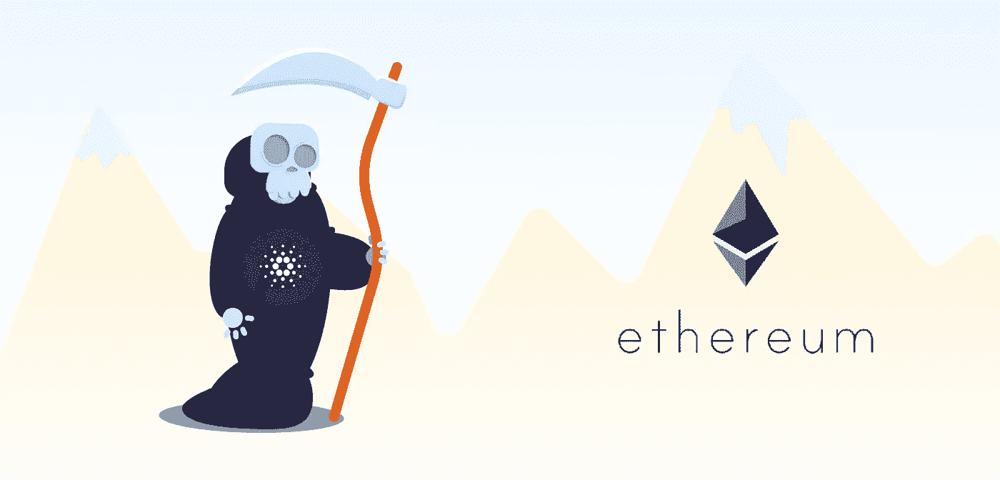
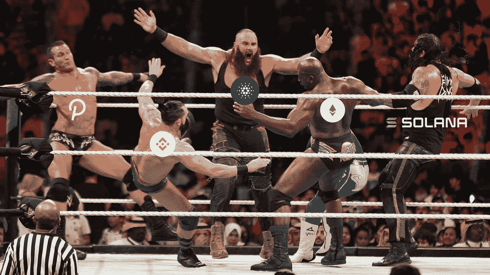
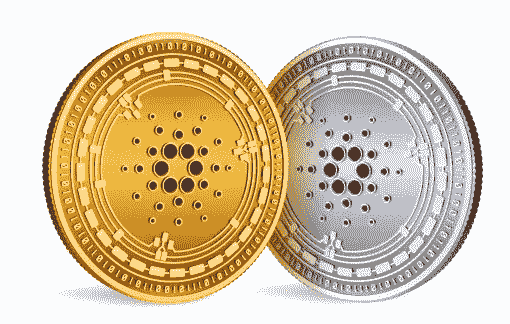

# 卡尔达诺的阿隆佐硬叉，以太坊的克星？

> 原文：<https://medium.com/coinmonks/cardanos-alonzo-hard-fork-ethereum-s-nemesis-8bb5502bc78c?source=collection_archive---------3----------------------->

Cardano grim reaper coming for ethereum

在 GMT+1 今天晚上 10:45，Cardano 将在其 mainnet 上推出备受期待的阿隆佐硬叉子。这是 cardano 网络发展路线图上的一个重要里程碑，因为此次升级将启动智能合同功能在网络上的实施。

智能合约对生态系统牵引力的重要性怎么强调都不为过。这为网络带来了更多的开发者、更多的项目、更多的投资者、更多的用例，并且整体上增加了其本地令牌的价值。

在我们深入了解最新升级的承诺之前，让我们看看这对区块链空间有何影响。

# 泰坦之战。

以太坊在 2015 年 7 月推出了智能合约功能。这催生了以太坊网络中的许多区块链项目，并为区块链创造了更多的用例。6 年后，我们有了更多实施智能合同的项目，以及更多使用案例，如 DeFi、众筹、NFTs 等。在以太坊网络上建设的缺点是由于网络拥塞导致的高额燃气费。开发者不希望像以前那样在以太坊网络中构建，因为构建 DApps 并在网络上进行交易需要花费大量成本。以太坊也不能为交易提供最快的网络速度。

Cardano 涵盖了近年来困扰以太坊网络的这些漏洞。Cardano 的网速更快，每秒可以处理更多的交易，交易费用显著降低，并发布了智能合同功能，因此对开发人员和新项目来说，Cardano 是一个更具吸引力的网络。

# 期待什么

随着智能合约功能的实施，新项目和区块链用例将在未来几周和几个月内在 cardano 上推出。cardano 爱好者期待的两个主要用例是 DeFi 和 NFTs。

# 挑战

像 [Cardaswap](https://cardaswap.finance/) 和 [ErgoDEX](https://ergodex.io/) 这样的 DeFi 项目已经建成，并将在 cardano 网络上大规模运行。其他几个 DeFi 项目将在未来几个月在网络上推出。

# NFTs

非功能性测试已经成为区块链最流行也是最有争议的用例之一，而且还会持续下去。借助 Cardano 的智能合约功能，NFT 的项目和市场将建立在网络上。

NFT 的市场如[【NFT 道】](https://nft-dao.org/)和 [LoveAda](https://lovada.art/) 是活跃的，许多 NFT 收藏甚至在网络智能合约推出之前就已经销售一空。

# 这对阿达意味着什么？

阿达，卡尔达诺生态系统的本土标志，在未来几周和几个月内将会增值。正如本文前面所述，智能合约功能将吸引更多的开发人员在网络上构建更多的项目。这将增加项目的效用，并吸引更多的投资者进入生态系统。所有这些都表明硬币的看涨趋势，9 月初达到 3.07 美元的峰值，目前交易价格为 2.6 美元。依我看，2.6 美元的阿达真是便宜。拿个袋子。干杯。

> 加入 Coinmonks [电报频道](https://t.me/coincodecap)和 [Youtube 频道](https://www.youtube.com/channel/UCbyDhTbOiKh2iUMKBi4-4Zg)了解加密交易和投资

## 另外，阅读

*   [什么是保证金交易](https://blog.coincodecap.com/margin-trading) | [美元成本平均法](https://blog.coincodecap.com/dca)
*   [BigONE 交易所评论](/coinmonks/bigone-exchange-review-64705d85a1d4) | [电网交易机器人](https://blog.coincodecap.com/grid-trading)
*   [最佳加密交易信号电报](/coinmonks/best-crypto-signals-telegram-5785cdbc4b2b) | [MoonXBT 评论](/coinmonks/moonxbt-review-6e4ab26d037)
*   [Godex.io 审核](/coinmonks/godex-io-review-7366086519fb) | [邀请审核](/coinmonks/invity-review-70f3030c0502) | [BitForex 审核](https://blog.coincodecap.com/bitforex-review)
*   [火币交易 Bot](https://blog.coincodecap.com/huobi-trading-bot) | [如何购买 ADA](https://blog.coincodecap.com/buy-ada-cardano) | [Geco？一次审查](https://blog.coincodecap.com/geco-one-review)
*   [币安 vs 比特邮票](https://blog.coincodecap.com/binance-vs-bitstamp) | [比特熊猫 vs 比特币基地 vs Coinsbit](https://blog.coincodecap.com/bitpanda-coinbase-coinsbit)
*   [如何购买 Ripple (XRP)](https://blog.coincodecap.com/buy-ripple-india) | [非洲最好的加密交易所](https://blog.coincodecap.com/crypto-exchange-africa)
*   [非洲最佳加密交易所](https://blog.coincodecap.com/crypto-exchange-africa) | [胡交易所评论](https://blog.coincodecap.com/hoo-exchange-review)
*   [eToro vs 罗宾汉](https://blog.coincodecap.com/etoro-robinhood)|[MoonXBT vs Bybit vs Bityard](https://blog.coincodecap.com/bybit-bityard-moonxbt)
*   [有哪些交易信号？](https://blog.coincodecap.com/trading-signal) | [比特斯坦普 vs 比特币基地](https://blog.coincodecap.com/bitstamp-coinbase)
*   [ProfitFarmers 回顾](https://blog.coincodecap.com/profitfarmers-review) | [如何使用 Cornix Trading Bot](https://blog.coincodecap.com/cornix-trading-bot)
*   [如何在势不可挡的域名上购买域名？](https://blog.coincodecap.com/buy-domain-on-unstoppable-domains)
*   [印度的秘密税](https://blog.coincodecap.com/crypto-tax-india) | [altFINS 审查](https://blog.coincodecap.com/altfins-review) | [Prokey 审查](/coinmonks/prokey-review-26611173c13c)
*   [Blockfi vs 比特币基地](https://blog.coincodecap.com/blockfi-vs-coinbase) | [BitKan 评论](https://blog.coincodecap.com/bitkan-review) | [Bexplus 评论](https://blog.coincodecap.com/bexplus-review)
*   [南非的加密交易所](https://blog.coincodecap.com/crypto-exchanges-in-south-africa) | [BitMEX 加密信号](https://blog.coincodecap.com/bitmex-crypto-signals)
*   [MoonXBT 副本交易](https://blog.coincodecap.com/moonxbt-copy-trading) | [阿联酋的加密钱包](https://blog.coincodecap.com/crypto-wallets-in-uae)
*   [雷米塔诺审查](https://blog.coincodecap.com/remitano-review)|[1 英寸协议指南](https://blog.coincodecap.com/1inch)
*   [购买 PancakeSwap(蛋糕)](https://blog.coincodecap.com/buy-pancakeswap) | [Coinswitch 俱吠罗评论](/coinmonks/coinswitch-kuber-review-1a8dc5c7a739)