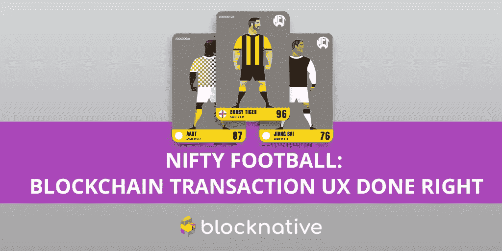
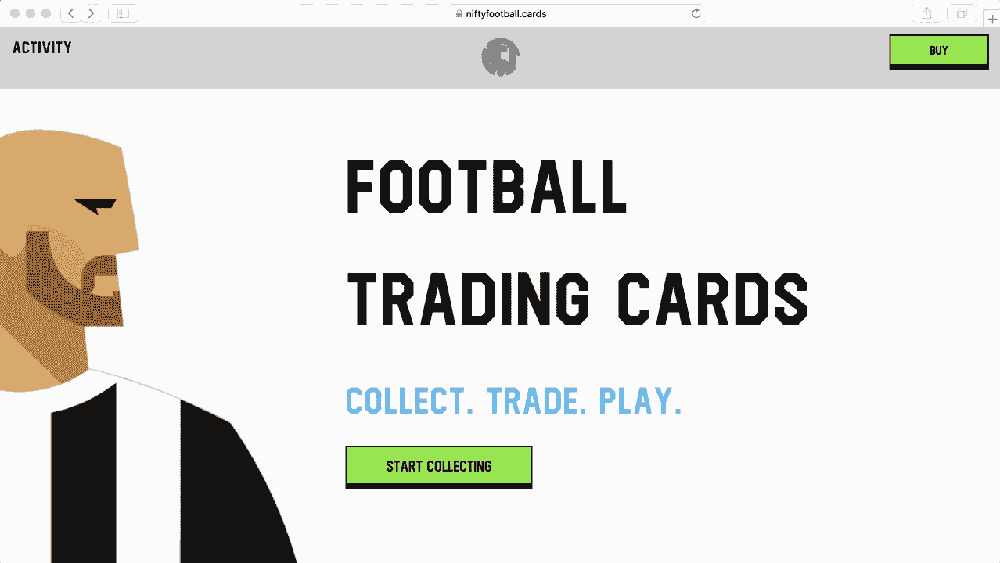
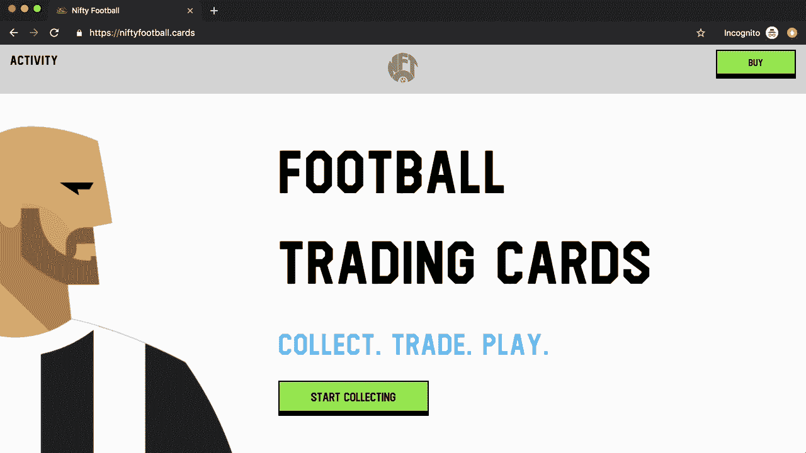
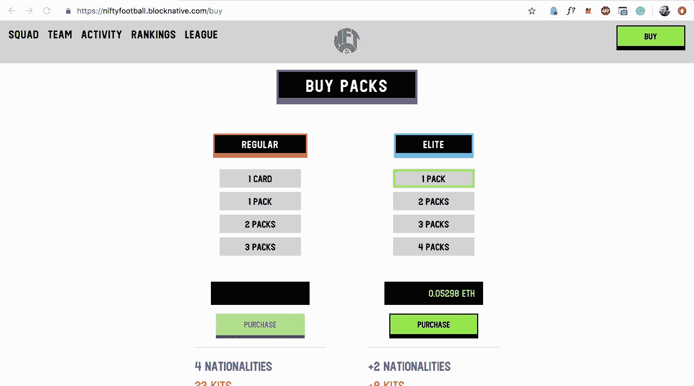
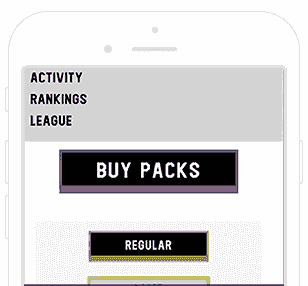

# 案例研究:Nifty Football 在移动和桌面上提供最先进的 Dapp UX

> 原文：<https://medium.com/coinmonks/case-study-nifty-football-delivers-state-of-the-art-dapp-ux-on-mobile-and-desktop-64a9000cac7a?source=collection_archive---------0----------------------->

我们很高兴地分享, [Nifty Football](https://niftyfootball.cards/) 已经将 [Blocknative Assist](https://www.blocknative.com/transaction-awareness) 部署到他们的 Dapp 中，为以太坊生态系统提供了一个最先进的交易可用性的活生生的例子。

Nifty Football 是一款以太坊驱动的足球——或者对你们中的美国和加拿大人来说是“足球”——一款可加密收集的交易卡牌游戏，拥有可证明的稀缺资产。Nifty Football 背后的团队在该领域经验丰富，之前曾在 KnownOrigin、CryptoKaiju 和 BlockCities 工作过。

该团队对如何构建成功、吸引人的 Dapps 有着深刻的理解，这使他们从一开始就专注于提供清晰、易于理解的用户体验。只要看看 Dapp 的流线型前端就知道它使用起来有多简单。在与 Blocknative 团队联系后，Nifty Football 领导层意识到他们有一个直接的机会将这种清晰和简单扩展到他们的入职和交易流程中。根据俏皮足球的联合创始人[安迪·格雷](/@awaygray)的说法:

> *“整整 50%的精彩足球交易发生在手机上。我们希望帮助我们的客户了解他们的交易状态，不管他们选择什么设备。通过在交易的每一步提供实时可见性，Blocknative Assist 在参与的最关键时刻改善了我们的用户体验。”*

当用户登陆网站时，体验就开始了。如果它们在不支持的浏览器上；Nifty Football 和 Assist.js 将把用户引向一个兼容 Web3 的浏览器:

当用户在没有安装钱包的情况下访问 Nifty Football 时，Blocknative Assist 会引导他们通过，并实时验证他们的进度！—钱包安装、登录、授权 Nifty Football、选择正确的网络等过程:

这确保了尽可能多的用户准备好并能够进行交易，这一切都是为了最大化活跃用户群和交易量。

每当用户发起交易时，Blocknative Assist 都会帮助他们了解交易的每一步都发生了什么，从等待批准到待定再到确认。此外，随着易于理解的警报与 Dapp 本身一起出现，用户不再被迫挖掘钱包设置或导航到第三方块浏览器:

至关重要的是，这些交易通知在移动 Dapp 浏览器上也同样有效:

干净的用户界面、onboarding 支持和事务通知的结合使 Nifty Football 在 Dapp 可用性方面遥遥领先。**想亲自体验一下吗？**去[买一些卡片](https://niftyfootball.cards/buy)去体验足球行业中最好的 UX。

## Nifty 的事务可用性审计(TUXA)评分的主要改进

通过将 Assist.js 部署到他们的 Dapp 中，Nifty Football 推动了他们的 Dapp 交易可用性审计分数的重大改进——现在是我们在 Mainnet 上遇到的最好的 Dapp 之一。你可以用 Blocknative 的[最近开源的审计模板](https://blog.blocknative.com/blog/dapp-transaction-audit-template)快速评估你的 TUXA 分数。

## 将 Assist.js 集成到 Nifty Football

Nifty Football 的团队选择通过我们的“白手套”集成服务使用 Blocknative 来部署 Assist.js。我们在 [Blocknative 的 Discord](https://discord.gg/z4ZQCe2) 上开设了一个私人频道，以便包括我们的 CTO 和集成团队在内的所有相关人员能够流畅地协作。部署 Blocknative Assist 只需要几个步骤:

1.  创建一个 API 密钥:这可以唯一地标识您的 Dapp 并启用[性能分析](https://www.blocknative.com/performance-analytics)
2.  初始化 Blocknative Assist:将 Assist.js 添加到 Dapp 的第一页。
3.  初始化库。
4.  呼叫船上。
5.  修饰您的契约:这增加了上述的[事务感知](https://www.blocknative.com/transaction-awareness)功能。

就这样，经过 5 个步骤，Nifty Football 在 Blocknative 的帮助下开始运行。**最初的部署花了我们团队大约一天的时间来设置**。在这个过程中，我们收到了有用的产品反馈，并投入了额外的周期来设计和实现我们最近的 Assist.js 0.8 版本中包含的几个特性。我们很高兴能够参与帮助 Nifty Football 和更广泛的 Dapp 生态系统改善 Web3 的 UX。

## 想提高你的 Dapp 的交易 UX？

Blocknative 的使命是改善 Web3 生态系统的 UX。我们的嵌入式 javascript 小部件使 Dapp 开发人员能够轻松地为他们的最终用户改善入职和交易体验。

如果你想和这个团队联系，[加入我们的 Discord](https://discord.gg/z4ZQCe2)——它包含免费下载，比如我们的 Dapp UX 审计模板。你也可以在 Blocknative.com 注册一个免费账户，然后在几分钟内将 Assist.js 集成到你的 Dapp 中。

> [在您的收件箱中直接获得最佳软件交易](https://coincodecap.com/?utm_source=coinmonks)

*最初发表于*[T5【https://blog.blocknative.com】](https://blog.blocknative.com/blog/nifty-football)*。*