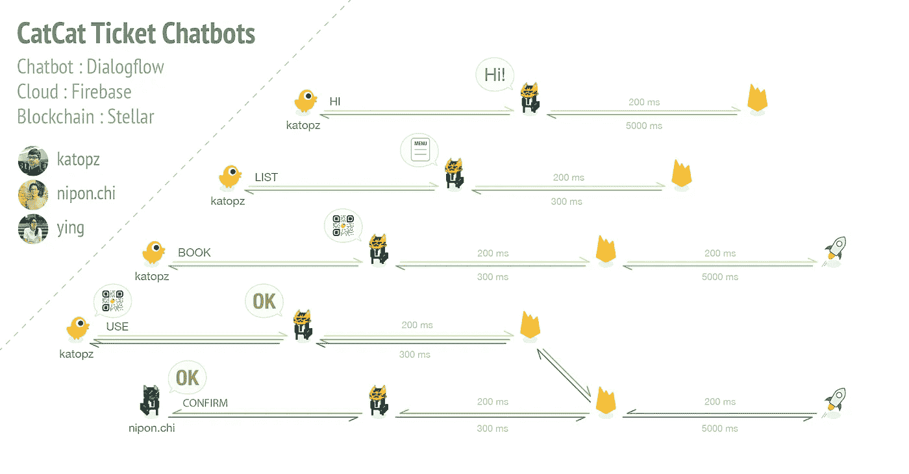
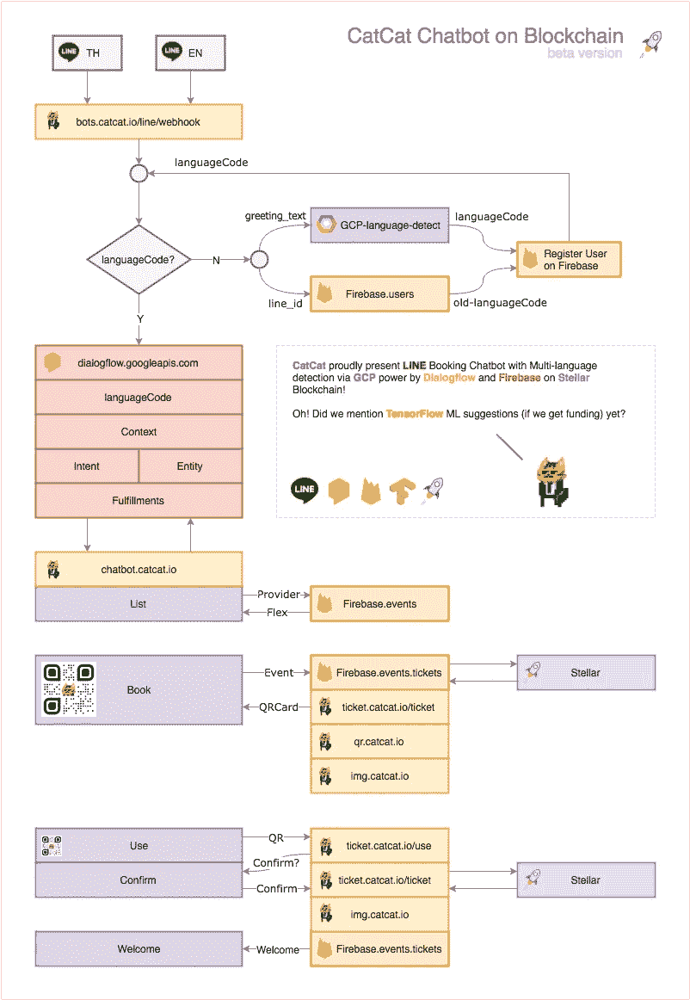
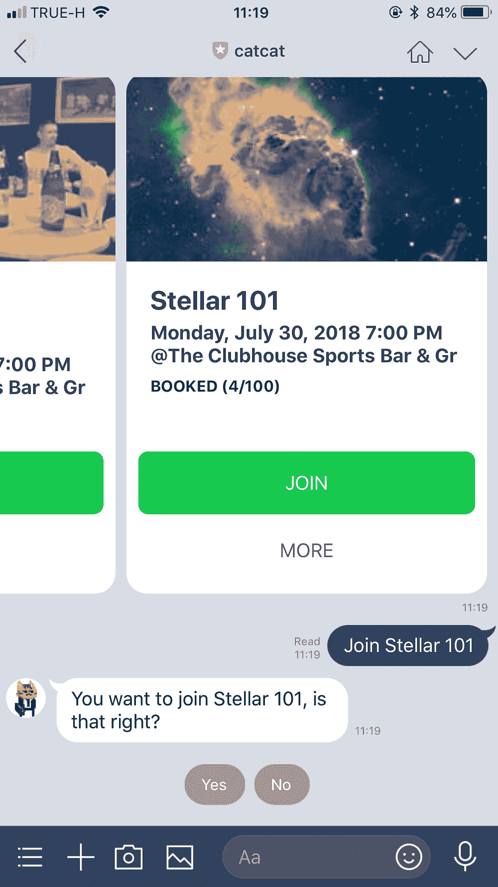
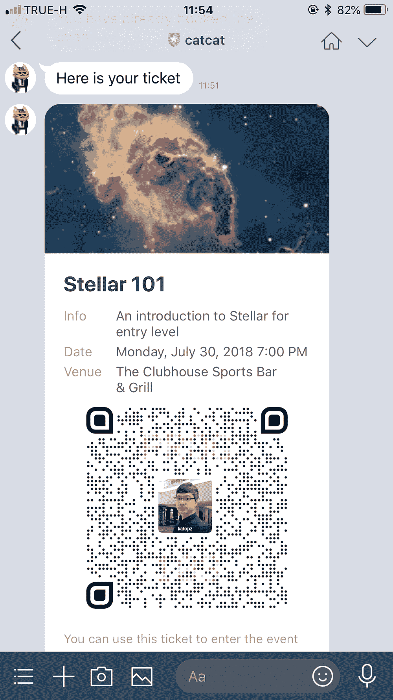

# 🤖恒星区块链上的猫猫聊天机器人

> 原文：<https://medium.com/coinmonks/catcat-chatbots-on-stellar-blockchain-46cfa31a1c4c?source=collection_archive---------5----------------------->

🎫🤖🔥🚀⛓

我们目前正在开发**聊天机器人**，它使用 **Dialogflow** 作为聊天平台，使用 **Firebase** 作为云功能和存储。这听起来很无聊，所以我们决定添加 **Stellar** Blockchain 和 **TensorFlow** 用于机器学习，以保持我们在周一早上醒来；)

# MVP 工作流程

这是我们的 MVP 看起来更像概念证明，所以…

1.  用户将获得**“问候消息”**并无缝注册
2.  用户可以**将**事件列为轮播。
3.  用户可以在 **Stellar** 区块链上**预订**门票，并获得二维码作为卡。
4.  通过让管理员扫描门票上的 QR，用户可以在参加活动时使用**门票。**
5.  管理员可以通过**卡上的按钮**确认**票。**
6.  票证将在 **Firebase** 上进行验证，以减少延迟，并在管理员确认后最终用 Stellar 区块链对**进行交叉检查。**
7.  在管理员**确认**他们的票后，用户将得到**欢迎消息**。

# 屏幕上显示程序运行的图片

对于测试版，我们将针对英语和泰语。

# 特征

1.  开源！[https://github.com/catcatio](https://github.com/catcatio)
2.  2 步轻松订票(**列表**和**订**)。
3.  分两步轻松确认票证(**扫描**和**确认**)。
4.  通过张贴现有的**脸书的**活动链接轻松创建门票。
5.  好看的 **QR 票**，可以用肉眼人工验证。
6.  依靠便宜、快速、无停机、不可破解的**恒星**区块链。
7.  **TensorFlow** 机器学习事件，通过兴趣分类、细分、定位(如果我们有资助💵).
8.  **线下支付**无缝购票(必选 POC)。
9.  **LIFF** 用于启用离线票证申领流程(必需的 POC)。

更多功能即将推出，例如 ICS、登机牌、通知、复习、测验、投票。

# 顺便说一句，我们加入…

## LINE_HACK2018

 [## LINE HACK 2018-LINE HACK Thailand 2018

### LINE Messaging API 提供了一个全新层次的用户交互。该服务允许您从事有针对性的…

hackth.line.me](https://hackth.line.me/) 

## 恒星构建挑战#7

 [## 星河对话上的订票聊天机器人

### 讨论与恒星平台相关的一切的地方。连接银行、支付系统和人。

galactictalk.org](https://galactictalk.org/d/1620-catcat-ticket-booking-chatbots-on-stellar) 

等待他们两个的上市公告。无论我们在比赛中是赢是输，我们仍然计划通过举办活动来吃我们自己的狗粮，并使用我们的门票平台来会面/培训**我们如何建立和整合所有这些堆栈，以及回顾/做和不做/最佳实践/限制**(还有什么？为什么这个话题这么长？).

# 还有一点

我们把我们的❤️和👻建造🎫🤖🔥在🚀⛓，让我们往好的方面想吧！

> [在您的收件箱中直接获得最佳软件交易](https://coincodecap.com/?utm_source=coinmonks)

