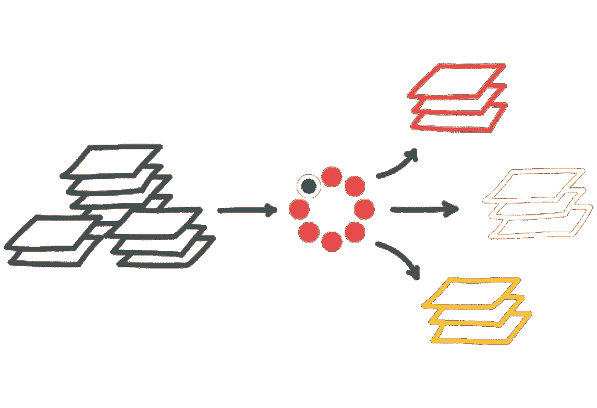

# 最好的故事值得一听+区块链 RSS feed

> 原文：<https://medium.com/coinmonks/categorizing-coinmonks-content-for-better-curation-2e451477a1b4?source=collection_archive---------5----------------------->

## 对 Coinmonks 内容进行分类以便更好地管理

`[*Donate to Coinmonks*](/coinmonks/monks-need-your-help-7440418d67ec)`

`[***Get published on Coinmonks***](https://medium.com/coinmonks/contribute/home)`

**标记名 *—* 故事集(点击故事阅读) *—* RSS Feed URL**

**分权👇**

*   [**区块链开发教程**](http://medium.com/coinmonks/tutorials/home) (面向开发者)——[故事](http://medium.com/coinmonks/tutorials/home)——[Rss feed](https://medium.com/feed/coinmonks/tagged/tutorials)
*   [**比特币**](https://medium.com/coinmonks/bitcoin/home) — [故事](https://medium.com/coinmonks/bitcoin/home) — [Rss 提要](https://medium.com/feed/coinmonks/tagged/bitcoin)
*   [**闪电网**](https://medium.com/coinmonks/lightning-network/home) — [故事](https://medium.com/coinmonks/lightning-network/home) — [Rss 供稿](https://medium.com/feed/coinmonks/tagged/lightning-network)
*   [**区块链**](/coinmonks/blockchain) — [故事](https://medium.com/coinmonks/blockchain/home)—[Rss feed](https://medium.com/feed/coinmonks/tagged/blockchain)
*   [**坚实度教程**](https://medium.com/coinmonks/solidity-tutorial/home) — [故事](https://medium.com/coinmonks/solidity-tutorial/home)—[Rss feed](https://medium.com/feed/coinmonks/tagged/solidity)
*   [**NEO**](https://medium.com/coinmonks/neo/home) — [故事](https://medium.com/coinmonks/neo/home)—[Rss 提要](https://medium.com/feed/coinmonks/tagged/neo)
*   [**EOS**](https://medium.com/coinmonks/eos/home)—[Stories](https://medium.com/coinmonks/eos/home)—[Rss feed](https://medium.com/feed/coinmonks/tagged/eos)
*   [**智能合约**](https://medium.com/coinmonks/smart-contract/home)——[故事](https://medium.com/coinmonks/smart-contract/home)——[Rss feed](https://medium.com/feed/coinmonks/tagged/smart contracts)
*   [**Hyperledger**](https://medium.com/coinmonks/hyperledger/home)—[故事](https://medium.com/coinmonks/hyperledger/home)—[Rss feed](https://medium.com/feed/coinmonks/tagged/hyperledger)
*   [**IPFS 教程**](https://medium.com/coinmonks/ipfs/home) — [故事](https://medium.com/coinmonks/ipfs/home)—[Rss 提要](https://medium.com/feed/coinmonks/tagged/ipfs)
*   [**Corda**](https://medium.com/coinmonks/corda/home) — [故事](https://medium.com/coinmonks/corda/home)—[Rss feed](https://medium.com/feed/coinmonks/tagged/corda)
*   [**Dapps**](https://medium.com/coinmonks/dapp/home)—[Stories](https://medium.com/coinmonks/dapp/home)—[Rss feed](https://medium.com/feed/coinmonks/tagged/dapps)
*   [**嫩薄荷**](https://medium.com/coinmonks/tendermint/home) — [故事](https://medium.com/coinmonks/tendermint/home)—[Rss 提要](https://medium.com/feed/coinmonks/tagged/tendermint)
*   [**以太坊**](https://medium.com/coinmonks/ethereum/home) — [故事](https://medium.com/coinmonks/ethereum/home)—[Rss 提要](https://medium.com/feed/coinmonks/tagged/ethereum)
*   [**卡达诺**](https://medium.com/coinmonks/cardano/home) — [故事](https://medium.com/coinmonks/cardano/home) — [Rss 提要](https://medium.com/feed/coinmonks/tagged/cardano)
*   [**block stack**](https://medium.com/coinmonks/blockstack/home)—[Stories](https://medium.com/coinmonks/blockstack/home)—[Rss feed](https://medium.com/feed/coinmonks/tagged/blockstack)
*   [**ICO**](https://medium.com/coinmonks/ico/home)——[故事](https://medium.com/coinmonks/ico/home)——[Rss feed](https://medium.com/feed/coinmonks/tagged/ico)
*   [**ERC**](https://medium.com/coinmonks/erc/home) — [故事](https://medium.com/coinmonks/erc/home)—[Rss 提要](https://medium.com/feed/coinmonks/tagged/erc)
*   [**Web3**](https://medium.com/coinmonks/web3/home) — [故事](https://medium.com/coinmonks/web3/home) — [Rss 提要](https://medium.com/feed/coinmonks/tagged/web3)
*   [**道**](https://medium.com/coinmonks/dao/home) — [故事](https://medium.com/coinmonks/dao/home) — [Rss 提要](https://medium.com/feed/coinmonks/tagged/dao)
*   **—[故事](https://medium.com/coinmonks/iota/home) — [Rss 提要](https://medium.com/feed/coinmonks/tagged/iota)**
*   **[**交易**](https://medium.com/coinmonks/trading/home) — [故事](https://medium.com/coinmonks/trading/home) — [Rss 提要](https://medium.com/feed/coinmonks/tagged/trading)**
*   **[**隐私**](https://medium.com/coinmonks/privacy/home) — [故事](https://medium.com/coinmonks/privacy/home) — [Rss 提要](https://medium.com/feed/coinmonks/tagged/privacy)**
*   **[**稳定币**](https://medium.com/coinmonks/stablecoins/home) — [故事](https://medium.com/coinmonks/stablecoins/home) — [Rss Feed](https://medium.com/feed/coinmonks/tagged/stablecoins)**
*   **[**安全令牌**](https://medium.com/coinmonks/security-token/home) — [故事](https://medium.com/coinmonks/security-token/home) — [Rss 提要](https://medium.com/feed/coinmonks/tagged/security-token)**
*   **[**密码学**](https://medium.com/coinmonks/cryptography/home)——[故事](https://medium.com/coinmonks/cryptography/home)——[Rss feed](https://medium.com/feed/coinmonks/tagged/cryptography)**
*   **[**加密挖掘**](https://medium.com/coinmonks/mining/home) — [故事](https://medium.com/coinmonks/mining/home) — [Rss 提要](https://medium.com/feed/coinmonks/tagged/mining)**
*   **[**令牌策展注册表**](https://medium.com/coinmonks/tcr/home) — [故事](https://medium.com/coinmonks/tcr/home) — [Rss 提要](https://medium.com/feed/coinmonks/tagged/tcr)**

## **技术**

*   **[**虚拟现实&增强现实**](http://medium.com/coinmonks/ar-vr/home) — [故事](http://medium.com/coinmonks/ar-vr/home) — [Rss 提要](https://medium.com/feed/coinmonks/tagged/ar-vr)**
*   **[**量子计算**](/coinmonks/quantum-computing) — [故事](/coinmonks/quantum-computing) — [Rss 提要](https://medium.com/feed/coinmonks/tagged/quantum-computing)**
*   **[**物联网**](/coinmonks/internet-of-things) — [故事](/coinmonks/internet-of-things) — [Rss 提要](https://medium.com/feed/coinmonks/tagged/internet-of-things)**
*   **[**机器人**](/coinmonks/robotics) — [故事](/coinmonks/robotics) — [Rss 费用](https://medium.com/feed/coinmonks/tagged/robotics) d**
*   **[**语音助手**](https://medium.com/coinmonks/voice/home) — [故事](https://medium.com/coinmonks/voice/home) — [Rss Feed](https://medium.com/feed/coinmonks/tagged/voice)**

## **语言**

*   **[**Python**](https://medium.com/coinmonks/python/home)—[Stories](https://medium.com/coinmonks/python/home)—[Rss Feed](https://medium.com/feed/coinmonks/tagged/python)**

## **人工智能👇**

*   **[**人工智能**](/coinmonks/artificial-intelligence) — [故事](/coinmonks/artificial-intelligence) — [Rss Feed](https://medium.com/feed/coinmonks/tagged/artificial-intelligence)**
*   **[**深度学习**](/coinmonks/artificial-intelligence) — [故事](https://medium.com/coinmonks/deep-learning/home) — [Rss 提要](https://medium.com/feed/coinmonks/tagged/deep-learning)**
*   **[**神经网络**](https://medium.com/coinmonks/neural-network/home) — [故事](https://medium.com/coinmonks/neural-network/home) — [Rss 费用](https://medium.com/feed/coinmonks/tagged/neural-network) d**
*   **[**tensor flow**](https://medium.com/coinmonks/tensorflow/home)—[Stories](https://medium.com/coinmonks/tensorflow/home)—[Rss Fee](https://medium.com/feed/coinmonks/tagged/tensorflow)d**
*   **[**数据科学**](https://medium.com/coinmonks/data-science/home) — [故事](https://medium.com/coinmonks/data-science/home) — [Rss 提要](https://medium.com/feed/coinmonks/tagged/data-science)**

**让我知道上面任何断开的链接。😉**

****

**[source](https://miuros.com/categorization-whitepaper/img/automatic_categorization_wp.svg)**

**我要感谢所有为 Coinmonks 做出贡献的作家，我们非常感激。我们每天都收到大量的故事，我们正在对这些故事进行分类，以便有效地分发它们。**

**任何想使用 Coinmonks RSS 提要的人都可以使用这个 [***出版物提要 Url***](https://medium.com/feed/coinmonks/) ***。如果你想阅读带有特定标签的 Coinmonks 出版物中的故事，请使用以下格式。*****

> **[https://medium.com/feed/coinmonks/](https://medium.com/feed/coinmonks/)标记/标记名**

**用您最喜欢的标记替换 TAGNAME，您将获得该标记的 RSS 提要。我将在下面列出一些重要标签。**

**因此，如果你喜欢 Coinmonks 出版物，你应该现在就把这个故事和你最喜欢的故事页面加入书签。**

**这个故事将经常更新与新的策展。👏你可以随时使用搜索(在右上角)来寻找更多的硬币僧侣的故事。**

**如果你是一个喜欢写故事的中等作家，你可以在 Coinmonks 出版物上投稿。**

****