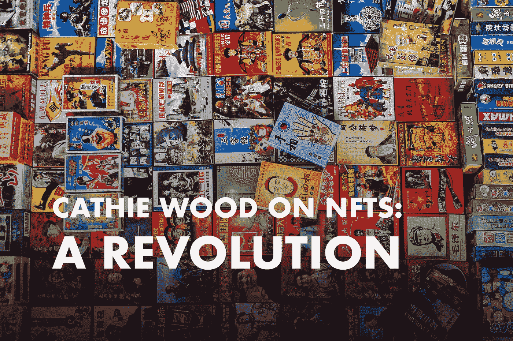

# 凯西·伍德:NFT 就像互联网

> 原文：<https://medium.com/coinmonks/cathie-wood-nfts-are-like-the-internet-31e503cb6432?source=collection_archive---------2----------------------->

名人投资者凯西·伍德去年吸引了很多公众的注意，这是有原因的。她的公司的旗舰方舟创新 ETF 交易所交易基金在 2020 年飙升 149%。疫情增加了许多她的大型头寸，这些头寸利用创新技术改造传统行业。

REVOLUTION1!!1!!! — Photo by [Eric Prouzet](https://unsplash.com/@eprouzet?utm_source=unsplash&utm_medium=referral&utm_content=creditCopyText) on [Unsplash](https://unsplash.com/?utm_source=unsplash&utm_medium=referral&utm_content=creditCopyText), edited by the author

现在，专业投资者公开表示支持围绕 NFTs 的炒作。**木连** …