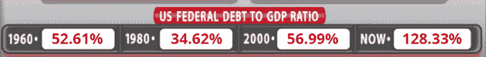
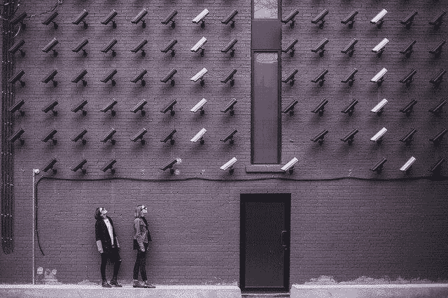
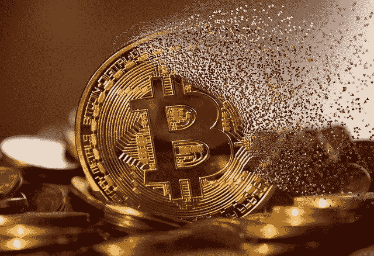

# CBDCs:赛博朋克反乌托邦噩梦

> 原文：<https://medium.com/coinmonks/cbdcs-a-cyberpunk-dystopian-nightmare-e8c6929768ef?source=collection_archive---------6----------------------->

*Image: free download from* [*Pixabay*](https://pixabay.com/photos/trace-board-technology-science-3157431/) *(*by [geralt](https://pixabay.com/users/geralt-9301/))

这一切都始于 12 年前的比特币。自从 80 年代以来，密码朋克们一直在计划数字货币革命，在此之前曾有过不成功的创造数字货币的私人尝试。

比特币是第一种看起来有效的货币，经过几年的测试阶段后，它开始迅速崛起，然而，今天的加密货币仍然处于年轻和不确定的状态。

政府也在加入与 CBDCs 的数字现金游戏。这些将是不受我们控制的数字货币(与大多数加密货币不同)，但将由银行和政府集中管理。

CBDCs 是由中央银行运营的集中式数字货币。

美国联邦硬币，或者他们可能会命名为“数字美元”。欧洲央行为欧洲人铸造的数字欧元，当然还有这场竞赛的领跑者，数字人民币。

但是，我们可以有把握地假设 CBDCs 是金融领域的一种发展，当政府数字货币生效时，加密货币将不再需要吗？

# CBDC 金融反面乌托邦

*Source of Image: Free Download from* [*Pixabay*](https://pixabay.com/illustrations/hacker-attack-mask-internet-1872304/)

顾名思义，央行数字货币是一种“法定”货币，由我们对政府的信任提供支持。

每一种“国家”或“法定”货币都与金融机构对政府偿还联邦债务能力的全球信任密切相关。

## 债务与国内生产总值的比率

过去，当一个经济体的债务达到上限，政府不得不采取措施削减支出时，它就会拉响警报。

通常，当债务/GDP 比率达到 100%以上时，这个上限就会达到。这意味着一个经济体积累的总债务已经达到了与其生产的 GDP 相同的水平。这意味着去年的整个经济程序不足以弥补我们政府积累的债务。

[*Source*](https://www.usdebtclock.org/)

通常，减少债务的应对措施是政府削减支出。他们控制的一个手段是新资金的流动。削减开支意味着金融市场上货币流动性的减少。

然后衰退来袭，所有指标都变得悲观。

# 控制、审查和金融监督

*Source of Image: Free Download from* [*Pixabay*](https://pixabay.com/photos/surveillance-bricks-cameras-girls-2616771/)

一部分经济学家认为，CBDC 将有助于在金融动荡时期为组织经济和更好地管理创造更好的条件。我们可以同意，由于一切都将是数字化的，进行变革所需的时间将可以忽略不计，也许节省下来的时间可以帮助减轻负面经济事件的影响。

但除此之外，CBDC 帮不上任何忙。货币供应的弹性对政府来说至关重要，但 CBDC 不会改变政府仍然无法预见经济崩溃的事实(就像 2008 年一样)。CBDC 本身并不是一个能够预测或捍卫一个经济体所面临的核心和挑战性问题的金融实体。

在检查了中央银行 Covid 的反应和流通中的法定货币的增加后，似乎在未来两三年内通货膨胀将再次开始急剧上升。美联储、欧洲央行和所有央行的印钞速度与经济活动不同步。CBDC 能帮上什么忙呢？这只会加快通货膨胀率，因为新印的钞票会被银行机构自动接收。

我们认为推动 CBDC 是一剂灵丹妙药，但相反，这将是令人失望的，因为 CBD 的目的不是为了经济的大跃进。它是关于对金融活动的控制、审查、监视和限制。

# CBDCs 会带来哪些变化？

*Source of Image: Free Download from* [*Pixabay*](https://pixabay.com/photos/city-landscape-panoramic-3000060/)

你有没有想过，如果加密货币不存在，政府是否会急于创造一个 CBDC？直到几年前，银行或政府还没有关于数字货币的计划和研究。

创建 CBDCs 是为了对抗加密为人们提供的金融自由。

在目睹了加密货币的爆炸式增长后，各国政府和央行发现 CBDC 是当今的必然选择。CBD 存在的主要原因是政府保持对金融的控制。

计划是多样的，开始的竞争不会是公平的。

还有一个阻止加密旗舰产品比特币发展的策略。这始于 2013 年，目前，我们看到比特币受到重创，无法在费用不飙升的情况下进行链上交易。BTC 无法扩展。

然而，成千上万的加密货币出现了。还有很多仍然提供我们的钱的完全控制，不变性和财务自由。

此外，大多数加密货币具有固定和低供应量的价值储存特征。这一特点也增强了需求，并提供了传统金融之外的选择。

基于社区的发展中国家不会下放权力。世界各地将不会有矿工提供工作证明和保护网络免受攻击。CBDCs 将是一个由政府控制的中央数据库。一个人，行长，或者中央银行的主席将被控制。

因此，一个比我们现在更糟糕的制度将会产生。我们所能控制的“法定”货币的唯一形式是纸币。有了数字 CBDC，我们手机钱包里的数字将不受我们的控制。

# CBDCs 不是加密货币

*Source of Image: Free Download from* [*Pixabay*](https://pixabay.com/photos/blockchain-technology-smart-bitcoin-3446557/)

该领域的一些人认为，CBDCs 将有助于加密货币获得更多的认可和采用。不知何故，他们没有看到效果将是完全相反的。

在政府的推动下，CBDCs 可能会完全接管数字货币市场。

加密货币仍将是一个利基市场，而 CBD 将继续被采用。这是一个悲观的想法，但超过 90%的人口将自愿或没有重大阻力地采用 CBDCs。

遗憾的是，大多数人没有受过足够的金融教育，无法理解法定货币的风险，而不是加密货币的风险。此外，当政府法令演变成更加中央化的未来时，风险也会增加。

## 加密的采用令人昏昏欲睡

十年后，加密技术还没有被商业采用。大多数采用来自 Visa/Mastercard 加密卡，它将 Crypto.com 比特币基地或币安的交易所与银行连接起来。

这不是进步，它只是将加密货币作为交易领域的一个额外步骤。它使 Crypto 成为事务机制的第三个(或第四个、第五个等等)功能。我们不拥有交易所的密码。

比特币产生的主要原因是为了砍掉中间人。当涉及第三方和第二层的系统时，它不能实现商业，也不能更好地执行。

就没有第三方参与的实际应用而言，crypto 已经彻底失败了。比特币现金(Bitcoin Cash)和 Dash 等项目的社区曾试图提高商户的接受度，但仍处于我们三四年前预期的非常低的水平。

虽然人们知道什么是加密货币，但他们仍然不想使用它们。投机和价格波动是密码成为资产类别而非货币的主要原因。

# 最后的想法

*Source of Image: Free Download from* [*Pixabay*](https://pixabay.com/photos/internet-cyber-network-finger-3592056/)

除了一些非常小的经济体(如[巴哈马](https://www.forbes.com/sites/vipinbharathan/2020/10/21/central-bank-digital-currency-the-first-nationwide-cbdc-in-the-world-has-been-launched-by-the-bahamas/))之外，中国是第一个推广这种数字现金选项的国家，在这个国家，数字支付已经增加，并在有记录的经济体中使用了 70-80%。

就中国而言，CBDC 的意义是显而易见的。一个威权政府将在其控制下的中央数字货币中获得对金融领域的更多控制权。

其余政府也将完全集中金融部门，尽管不是像他们声称的那样试图对抗中国 CBDC 的影响，而是加强他们对国家金融事务的铁一般的控制。

此外，由于我们进行的每一笔金融交易都将被政府官员记录和监督，CBDCs 将给我们的隐私带来更多的影响。

**金融交易将受到审查和监控。**

我们能有把握地说我们信任我们的政府吗？即便如此，我们要向后代解释我们的政府可以永远被信任并完全控制我们吗？

难道历史的教训还没有教给我们任何东西吗？历史上有多少次政府被推翻或变成独裁政府？当一个事件发生时，如果政府只是阻止访问我们的资金，集中的数字“法定”钱包会发生什么？那时我们将不得不遵从任何事情。

我们在为自由而战，我们想怎么交易就怎么交易，没有人审查我们的交易。这是我们不应该用任何东西来交换的核心人权。

***主动上:***

*●* [*念。现金*](https://read.cash/@Pantera) *●* [*噪音。现金*](https://noise.cash/u/Pantera99) *●* [*备忘录。现金*](https://memo.cash/profile/16QQohWB3U9PC9kwCNasPorwYKmZ5oNYeE) *●* [*中型*](/@panterabch) *●* [*蜂巢*](https://hive.blog/@pantera1)*●*[*Steemit*](https://steemit.com/@pantera1)*●*[*声乐**●*](https://vocal.media/authors/pantera)[*头脑*](https://www.minds.com/pantera99/)

*●* [*推特*](https://twitter.com/Panterabch)*●*[*LinkedIn*](https://www.linkedin.com/in/panterabch/)*●*[*Reddit*](https://www.reddit.com/user/PanteraBCH)

*最初发布于*[*https://read . cash*](https://read.cash/@Pantera/cbdcs-a-cyberpunk-dystopian-nightmare-0b948295)*。*

## 另外，阅读

 [## 最佳加密交易机器人

### 2021 年币安、比特币基地、库币和其他密码交易所的最佳密码交易机器人。四进制，位间隙…

medium.com](/coinmonks/crypto-trading-bot-c2ffce8acb2a)  [## 最佳 6 个加密交易信号电报通道

### 这是乏味的找到正确的加密交易信号提供商。因此，在本文中，我们将讨论最好的…

medium.com](/coinmonks/best-crypto-signals-telegram-5785cdbc4b2b)  [## BlockFi 评论 2021:利弊和利率

### 今天，我们提出了一个全面的 BlockFi 评论，这是一个成立于 2017 年的加密贷款平台，拥有其…

blog.coincodecap.com](https://blog.coincodecap.com/blockfi-review)  [## 加密税务软件——五大最佳比特币税务计算器[2021]

### 不管你是刚接触加密还是已经在这个领域呆了一段时间，你都需要交税。

medium.com](/coinmonks/best-crypto-tax-tool-for-my-money-72d4b430816b)  [## Pionex 评论 2021 |免费加密交易机器人和交换

### Pionex 是为交易自动化提供工具的后起之秀。Pionex 上提供了 9 个加密交易机器人…

medium.com](/coinmonks/pionex-review-exchange-with-crypto-trading-bot-1e459d0191ea)  [## 存储比特币的最佳加密硬件钱包[2021]

### 保管您的数字资产很容易，但找到正确的存储方式却是一项繁琐的任务。在线钱包有一个风险…

blog.coincodecap.com](https://blog.coincodecap.com/best-hardware-wallet-bitcoin)