# 使用 GANs (Tensorflow 实现)的名人人脸生成

> 原文：<https://medium.com/coinmonks/celebrity-face-generation-using-gans-tensorflow-implementation-eaa2001eef86?source=collection_archive---------0----------------------->

## ***甘斯*简介**

生成对抗网络 **(GANs)** 是深度学习中最热门的话题之一。( **GANs)** 是一类用于无监督学习算法的人工算法，由两个神经网络系统实现

1.  发电机
2.  鉴别器

两个网络都在零和博弈的框架下相互竞争。生成对抗网络 **(GANs)** 是一组模型，它们基本上学习创建与给定的输入数据相似的合成数据。

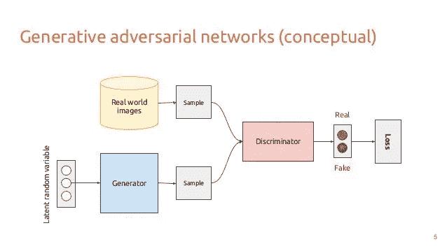

鉴别器的任务是确定给定图像看起来是自然的(即，是来自数据集的图像)还是看起来像是人工创建的。生成器的任务是创建与原始数据分布相似的看起来自然的图像，这些图像看起来足够自然以欺骗鉴别器网络。首先给发生器一个随机噪声，利用它产生假图像，然后这些假图像和原始图像一起被送到鉴别器。

判别模型的任务是确定给定图像看起来是自然的(来自数据集的图像)还是看起来像是人工创建的。这基本上是一个二进制分类器，将采取正常的卷积神经网络(CNN)的形式。生成器的任务是创建与原始数据分布相似的自然图像。

生成器试图愚弄鉴别器，而鉴别器试图不被生成器愚弄。随着模型通过交替优化进行训练，这两种方法都得到改进，直到“伪图像与数据集图像无法区分”为止。

生成对抗网络的数学方程；

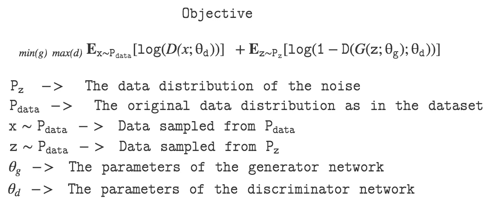

我们可以认为这个等式由两部分组成，第一部分是从原始数据分布中采样的数据，第二部分是从噪声的数据分布中采样的数据。

***第一部分-***

*鉴别器*总是想最大化自己把一张图片正确分类为真假的概率。这里，图像是从原始数据分布中采样的，原始数据分布是真实的数据本身。我们知道 **D(x)** 表示图像是真实的概率，因此*鉴别器*总是想要最大化 **D(x)** ，因此 **log(D(x))** 应该最大化并且第一部分必须最大化。

***第二部分-***

z’是随机噪声样本，G(z)是使用噪声样本生成的图像。这个术语的解释非常相似。生成器总是希望最大化鉴别器被生成的图像欺骗的概率。这意味着，生成器应该想要最大化 **D(G(z))** ，因此它应该最小化 **1- D(G(z))** ，从而最小化 **log(1- D(G(z))。**

## 使用 GANs 生成名人图像


## ***名人图像数据集:***

CelebA 数据集是超过 200，000 张带有注释的名人头像的集合。因为在这篇博客中，我只是要生成人脸，所以我没有考虑注释。

## 1).获取数据:-

```
import helper
helper.download_extract('celeba', data_dir)
```

我已经创建了 helper.py 文件，您可以通过它下载 CelebA 数据集图像。运行这段代码时，它将下载 CelebA 数据集。(下面给出源代码链接)。

## 2).预处理图像:-

因为我只在人脸上工作，所以我把它调整到 28*28 以获得好的效果。我已经裁剪了图像中不包含图像部分的部分。

```
#snippet of Helper python file which preprocess the given image dataset.def get_image(image_path, width, height, mode):
    """
    Read image from image_path
    :param image_path: Path of image
    :param width: Width of image
    :param height: Height of image
    :param mode: Mode of image
    :return: Image data
    """
    image = Image.open(image_path)if image.size != (width, height):  

        face_width = face_height = 108
        j = (image.size[0] - face_width) // 2
        i = (image.size[1] - face_height) // 2
        image = image.crop([j, i, j + face_width, i + face_height])
        image = image.resize([width, height], Image.BILINEAR)return np.array(image.convert(mode))
```

> 因为生成敌对网络很难训练。(你可以查看这个链接，以了解[为什么生成性对抗网络的训练这么难](/@jonathan_hui/gan-why-it-is-so-hard-to-train-generative-advisory-networks-819a86b3750b)？).

为了获得准确的结果，我们应该有一个好的 GPU(4GB 或以上)，通过运行此代码片段，您可以发现 tensorflow 是否安装了 GPU。

```
from distutils.version import LooseVersion
import warnings
import tensorflow as tf# Check TensorFlow Version
assert LooseVersion(tf.__version__) >= LooseVersion('1.0'), 'Please use TensorFlow version 1.0 or newer.  You are using {}'.format(tf.__version__)
print('TensorFlow Version: {}'.format(tf.__version__))# Check for a GPU
if not tf.test.gpu_device_name():
    warnings.warn('No GPU found. Please use a GPU to train your neural network.')
else:
    print('Default GPU Device: {}'.format(tf.test.gpu_device_name()))
```

## 3).模型输入和网络架构-

我将图像宽度、图像高度、图像通道和噪声参数作为模型输入，由生成器进一步用于生成假图像。

> 发电机的结构:-

```
def generator(z, out_channel_dim, is_train=True, alpha=0.2, keep_prob=0.5):

    with tf.variable_scope('generator', reuse=(not is_train)):
        # First fully connected layer, 4x4x1024
        fc = tf.layers.dense(z, 4*4*1024, use_bias=False)
        fc = tf.reshape(fc, (-1, 4, 4, 1024))
        bn0 = tf.layers.batch_normalization(fc, training=is_train)
        lrelu0 = tf.maximum(alpha * bn0, bn0)
        drop0 = tf.layers.dropout(lrelu0, keep_prob, training=is_train)

        # Deconvolution, 7x7x512
        conv1 = tf.layers.conv2d_transpose(drop0, 512, 4, 1, 'valid', use_bias=False)
        bn1 = tf.layers.batch_normalization(conv1, training=is_train)
        lrelu1 = tf.maximum(alpha * bn1, bn1)
        drop1 = tf.layers.dropout(lrelu1, keep_prob, training=is_train)

        # Deconvolution, 14x14x256
        conv2 = tf.layers.conv2d_transpose(drop1, 256, 5, 2, 'same', use_bias=False)
        bn2 = tf.layers.batch_normalization(conv2, training=is_train)
        lrelu2 = tf.maximum(alpha * bn2, bn2)
        drop2 = tf.layers.dropout(lrelu2, keep_prob, training=is_train)

        # Output layer, 28x28xn
        logits = tf.layers.conv2d_transpose(drop2, out_channel_dim, 5, 2, 'same')

        out = tf.tanh(logits)

        return out
tests.test_generator(generator, tf)
```

生成器体系结构具有第一密集层和在去卷积层之后全连接层(除了输出层之外，每一层都包含 batch_normalization、leaky relu 和 dropout 层)。生成器获取一个随机噪声向量 z，然后将其整形为 4D 形状，并将其传递给一系列上采样层。每个上采样层重复转置卷积操作，即反卷积操作。

所有转置卷积的深度从 1024 一直降低到 3，这表示一幅 RGB 彩色图像。最后一层通过双曲正切( [tanh](https://en.wikipedia.org/wiki/Activation_functionhttps://en.wikipedia.org/wiki/Activation_function) )函数输出一个 28 *x28x3* 张量。

> 鉴别器的结构:-

```
def discriminator(images, reuse=False, alpha=0.2, keep_prob=0.5):

    with tf.variable_scope('discriminator', reuse=reuse):
        # Input layer is 28x28xn
        # Convolutional layer, 14x14x64
        conv1 = tf.layers.conv2d(images, 64, 5, 2, padding='same', kernel_initializer=tf.contrib.layers.xavier_initializer())
        lrelu1 = tf.maximum(alpha * conv1, conv1)
        drop1 = tf.layers.dropout(lrelu1, keep_prob)

        # Strided convolutional layer, 7x7x128
        conv2 = tf.layers.conv2d(drop1, 128, 5, 2, 'same', use_bias=False)
        bn2 = tf.layers.batch_normalization(conv2)
        lrelu2 = tf.maximum(alpha * bn2, bn2)
        drop2 = tf.layers.dropout(lrelu2, keep_prob)

        # Strided convolutional layer, 4x4x256
        conv3 = tf.layers.conv2d(drop2, 256, 5, 2, 'same', use_bias=False)
        bn3 = tf.layers.batch_normalization(conv3)
        lrelu3 = tf.maximum(alpha * bn3, bn3)
        drop3 = tf.layers.dropout(lrelu3, keep_prob)

        # fully connected
        flat = tf.reshape(drop3, (-1, 4*4*256))
        logits = tf.layers.dense(flat, 1)
        out = tf.sigmoid(logits)

        return out, logitstests.test_discriminator(discriminator, tf)
```

鉴别器的工作就是鉴别哪个图像是真的，哪个是假的。鉴别器也是 4 层 CNN，具有批量归一化和泄漏 relu 层(输入层除外)。鉴别器接收输出图像(大小为 28*28*3)并对其执行卷积。最后鉴别器使用 ***逻辑 Sigmoid 函数*** *显示输出概率，以显示图像是真是假。*

> 当鉴别器看到图像中的差异时，它向发生器发送梯度信号，该信号从鉴别器流向发生器。

## 4).发电机损耗和鉴别器损耗:-

鉴别器接收来自训练图像和发生器的图像，因此在计算鉴别器的损失时，我们必须加上真实图像和虚假图像造成的损失。两个网络同时被训练，因此发生器和鉴别器都需要两个优化器。如果图像是真实的，我们希望从鉴别器输出接近 1 的概率，如果图像是假的，输出接近 0 的概率。

```
def model_loss(input_real, input_z, out_channel_dim, alpha=0.2, smooth_factor=0.1):

    # TODO: Implement Function
    d_model_real, d_logits_real = discriminator(input_real, alpha=alpha)

    d_loss_real = tf.reduce_mean(
        tf.nn.sigmoid_cross_entropy_with_logits(logits=d_logits_real,
                                                labels=tf.ones_like(d_model_real) * (1 - smooth_factor)))

    input_fake = generator(input_z, out_channel_dim, alpha=alpha)
    d_model_fake, d_logits_fake = discriminator(input_fake, reuse=True, alpha=alpha)

    d_loss_fake = tf.reduce_mean(
        tf.nn.sigmoid_cross_entropy_with_logits(logits=d_logits_fake, labels=tf.zeros_like(d_model_fake)))

    g_loss = tf.reduce_mean(
        tf.nn.sigmoid_cross_entropy_with_logits(logits=d_logits_fake, labels=tf.ones_like(d_model_fake)))return d_loss_real + d_loss_fake, g_losstests.test_model_loss(model_loss)
```

## 培训和结果:-

当训练过程正在进行时，生成器产生图像集，并且在每个时期之后，它变得越来越好，使得鉴别器不能识别它是真实图像还是虚假图像。产生结果如下-

## 生成的图像:-

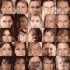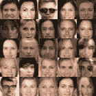

After first Epoch and After Second Epoch

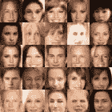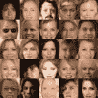

After third and fourth Epoch

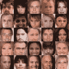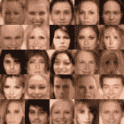

after fifth and sixth epoch

等等，新的面孔不断产生…

我还从[这里](https://drive.google.com/drive/folders/15hvzxt_XxuokSmj0uO4xxMTMWVc0cIMU)得到了预训练的网络，如果你想使用这个预训练的网络运行 GAN，那么使用我在这里[提供的这个 python 文件](https://drive.google.com/file/d/1xZul7DwqqJoe5OCuKHw6fQVeQZNIMSuF/view)。

运行后，这将生成一组 10 个假图像。有些是-

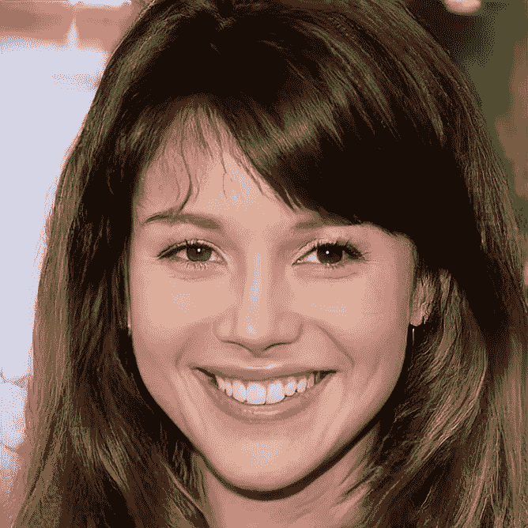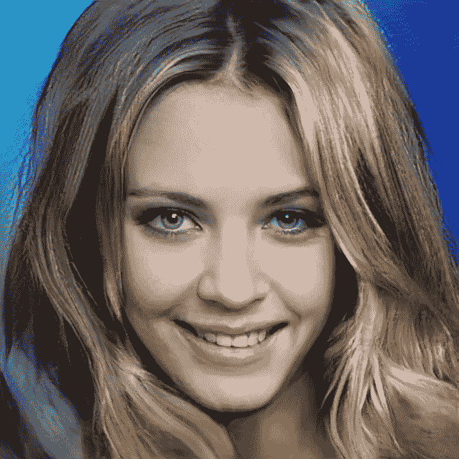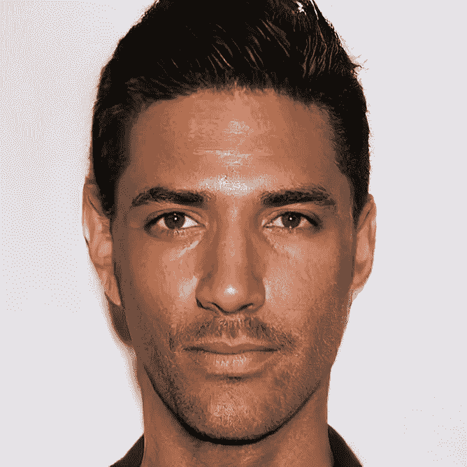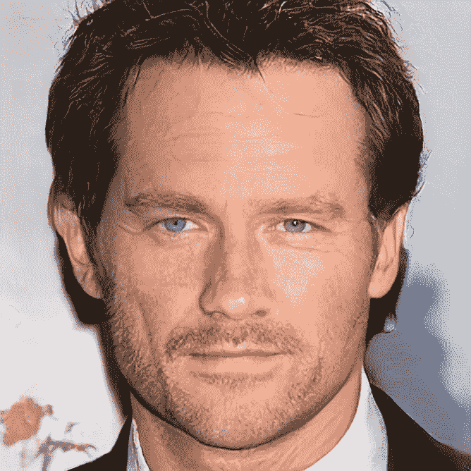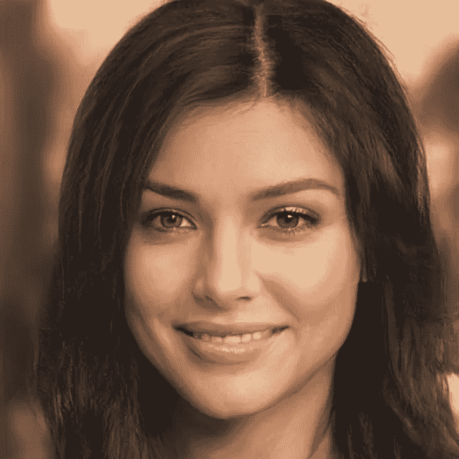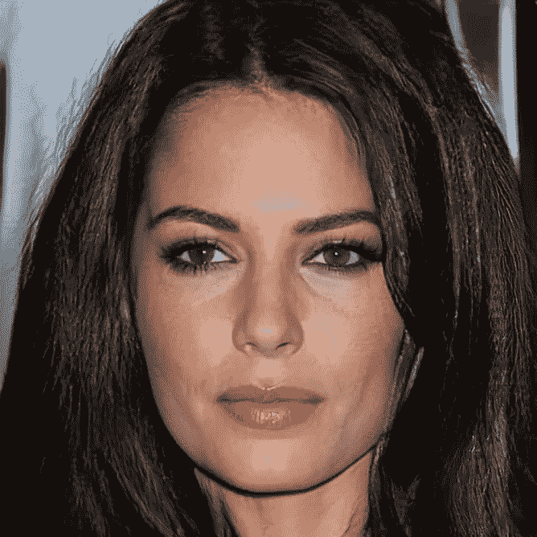

这些是从给定的预训练网络生成的假图像。

这就完成了与生成性对抗网络相关的所有惊人的东西。

# 参考资料:-

1.  [生成对抗网络教程](/deep-dimension/gans-a-modern-perspective-83ed64b42f5c)
2.  [Shravan 关于甘的博客](/deep-dimension/gans-a-modern-perspective-83ed64b42f5c)
3.  [一个关于生成性对抗网络的很好的教程](https://www.oreilly.com/learning/generative-adversarial-networks-for-beginners)
4.  [了解创成式数字网络](https://towardsdatascience.com/understanding-generative-adversarial-networks-4dafc963f2ef) k

这个项目的代码可以在我的 Github-:[https://Github . com/hacker shubh/Face-gen aration-using-Generative-Adversarial-Network](https://github.com/HACKERSHUBH/Face-Genaration-using-Generative-Adversarial-Network)中找到。

> 加入 Coinmonks [电报频道](https://t.me/coincodecap)和 [Youtube 频道](https://www.youtube.com/c/coinmonks/videos)获取每日[加密新闻](http://coincodecap.com/)

## 另外，阅读

*   [复制交易](/coinmonks/top-10-crypto-copy-trading-platforms-for-beginners-d0c37c7d698c) | [加密税务软件](/coinmonks/crypto-tax-software-ed4b4810e338)
*   [网格交易](https://coincodecap.com/grid-trading) | [加密硬件钱包](/coinmonks/the-best-cryptocurrency-hardware-wallets-of-2020-e28b1c124069)
*   [密码电报信号](http://Top 4 Telegram Channels for Crypto Traders) | [密码交易机器人](/coinmonks/crypto-trading-bot-c2ffce8acb2a)
*   [最佳加密交易所](/coinmonks/crypto-exchange-dd2f9d6f3769) | [最佳加密交易所](/coinmonks/bitcoin-exchange-in-india-7f1fe79715c9)
*   开发人员的最佳加密 API
*   最佳[密码借贷平台](/coinmonks/top-5-crypto-lending-platforms-in-2020-that-you-need-to-know-a1b675cec3fa)
*   杠杆代币的终极指南
*   [7 个最佳零费用加密交易平台](https://coincodecap.com/zero-fee-crypto-exchanges)
*   [最佳网上赌场](https://coincodecap.com/best-online-casinos) | [期货交易机器人](/coinmonks/futures-trading-bots-5a282ccee3f5)
*   [分散交易所](https://coincodecap.com/what-are-decentralized-exchanges) | [比特 FIP](https://coincodecap.com/bitbns-fip)
*   [用信用卡购买密码的 10 个最佳地点](https://coincodecap.com/buy-crypto-with-credit-card)
*   [加拿大最佳加密交易机器人](https://coincodecap.com/5-best-crypto-trading-bots-in-canada) | [Bybit vs 币安](https://coincodecap.com/bybit-binance-moonxbt)