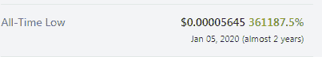

# SmartBCH 上的芹菜(CLY)！这是下一个妖术吗？

> 原文：<https://medium.com/coinmonks/celery-cly-on-smartbch-is-this-the-next-hex-5f50e63d9a71?source=collection_archive---------5----------------------->

目前，大约有 40 个代币在 SmartBCH 上运行，在 dex 上上市，提供交易、赌注、收益农业和更多的投资机会。

这些代币中的一些似乎没有任何效用，而仅仅是提供投机。然而，我们发现有几个项目可能具备成为具有长期潜力的可行项目的条件。

芹菜( [celery.cash](https://celery.cash/) )是一种智能 BCH 代币(SEP20)，最近引起了人们的关注，主要是因为它的价格升值。这是一个不断上升的象征，而 BCH 下降了 20%，使许多 SmartBCH 爱好者注意到。

[*marketcap.cash*](https://www.marketcap.cash/token/CLY)

Certik 已经审计了 CLY 令牌，提供了更多的透明度，芹菜代码提供了一些有趣的点，旨在成为一个可行的长期投资。

对于本文的观点，我分析了芹菜中引起我注意的部分，但我想再次表达这样一个事实，即这只是一篇综述。我多年来一直在探索加密货币。他们中的一些人表现得非常出色，另一些人则失败了。我以前写过各种 SmartBCH 项目，包括 LawPunks、CashCats、AxieBCH、MuesliSwap 等。

我的立场是分析，但绝不是指导任何人进行糟糕的投资，我总是在我所有的帖子中解释风险。

接下来，我对芹菜(CLY)进行了研究，并分享了我的发现，但投资者，尤其是那些计划入股的人应该阅读详细内容，因为**分拆是一个漫长的过程**。

# 芹菜-CLY 令牌组学

我记得理查德·哈特大约两年前谈论过六边形的“南瓜”。我一直认为妖术是个骗局，从来没想过它能成功。好吧，我错了，HEX 的家伙已经获利了一个特殊的投资回报率至今。

Source: [Coingecko](https://www.coingecko.com/en/coins/hex)

**芹菜**与 HEX 有着共同的特点，有着相似的投资者目标群体。

CLY 的合同细节和智能合同的代码都在这个[链接](https://celery.cash/celery.pdf)中。

白皮书[给出了一个关于这个项目可持续性的有趣想法。](https://celery.cash/whitepaper.pdf)

[*Source*](https://celery.cash/whitepaper.pdf)

简单来说，上述等式意味着:所有赌注将以 CLY 代币的形式提供**每年 100%的复利(APR)。由于芹菜模型提供复利，投资者在 2 年后会将他们最初的 CLY 代币翻两番。**

CLY 的象征性销售持续了 30 秒，轻松达到了 100BCH 的硬上限。

> 年金是一种在一段时间内向所有者支付一系列款项的金融工具。类似于年金，芹菜提供了一个超过 1 年的支付流回到主人，目的是它将取代你一年的工资价值，或更多！
> 
> **来自:芹菜白皮书(** [**来源**](https://celery.cash/whitepaper.pdf) **)**

芹菜象征:CLY

CLY 代币之前由 Certik ( [链接](https://www.certik.org/projects/celery))进行过审计，除了 Celery 承认的关于代币销售集中化流程的两项建议外，其余问题似乎都已解决。

***Source:*** [***Certik***](https://www.certik.org/projects/celery)

芹菜(CLY)已注册到价格跟踪 Marketcap.cash，总供应量为 50 亿个代币。

***Source:*** [***marketcap.cash***](https://www.marketcap.cash/)

尽管 marketcap.cash 的供应数据是不正确的，因为更多的代币是在自动过程中铸造的，以支付赌注者的复利。

令牌代码以 100%的年利率计算复利。

平台(celery.cash)上的芹菜代币根据 CLY 代币向赌注者提供 100%的 APR。根据芹菜的开发者 Max Hastings 和官方网站的数据，目前已经有 65%的代币被下注。

正如我们在 11 月 18 日的芹菜电报上看到的，流通中的代币已经是 51.5 亿了

[*Source*](https://t.me/celeryToken/6802)

# 把 CLY 押在芹菜上

按照目前的增长速度，预计一年后 CLY 代币供应量将增长 65%。

赌注的选择权在 Dapp:[https://celery.cash/account](https://celery.cash/account)

存款后，账户余额和收到的利息会实时显示在我们的账户页面上。

## 支出-拆分

在帐户屏幕上，点击“高级”,我们可以选择切换到支付模式，在这种模式下，芹菜的反倾销机制适用。

## 芹菜模型的可持续性

这种模式的可持续性受到质疑，因为来自赌注过程的代币膨胀将不断增加最大代币供应量。

然而，芹菜有一个特点，限制大规模的拆盘和抛售，这可能被证明是一个强大的基础，因为它限制了当赌注者要求支付时的卖出压力。

芹菜最有趣的部分是一个**反倾销功能**，它可以防止在自由市场上大量的不稳定和倾销代币。

## 反倾销—不稳定模型

celery.cash

投资者可以通过两种方式解除 CLY 代币的持有:

*   **总计 365 天的每日支出**
*   **强制支付**全部金额(带 **50%罚金**在总代币中)

赔付模式必须由下注者启动，并在接下来的 365 天内每天以较小的百分比开始分配下注的 CLY 令牌。强制赔付选项会将任何未结算的金额减半。这是对所押 CLY 总额以及所获复利的罚款。

新铸造的 CLY 令牌也受到反倾保护，因为它们会立即进入反倾代码下的复利机制。

永久押记意味着只有一部分押记金额可用于获利目的。这种方法解释了芹菜背后的愿景，即取代我们的工资。

芹菜的基本面带来了长期的投资愿景，交易似乎不是一个好的选择，尤其是在这个早期。

# 最后

[*Source*](https://unsplash.com/photos/ZugQ-1NBaO0)

芹菜是一个有趣的项目，一个可以持续盈利的项目。我做了各种计算，投资了 CLY。我把一半的投资押在芹菜上。现金，其余的一半放在我的钱包里，但也许我会押更多。

如果芹菜变得受欢迎，那么它实际上可能会通过其支付模式成为平均工资的替代品。

与大多数具有类似模式的代币一样，CLY 新投资者的稳定涌入将推高或至少维持其价格。虽然这纯粹是猜测，没有什么是确定的，但反倾销机制的废除者可以带来稳定，只有少数新投资者参与。

芹菜似乎是在一份聪明的合同中实施的一个体面的开端。这是一个复杂的结构，但有意义。

**有用链接:**

*   [**网站**](https://celery.cash/)
*   [**审核**](https://www.certik.org/projects/celery)
*   [**推特**](https://twitter.com/celerycash)
*   [**电报**](https://t.me/celeryToken)
*   [噪声。现金:马克斯·黑斯廷斯](https://noise.cash/u/MaxHastings)

**CLY DEXs 交易:**

*   [**BenSwap**](https://dex.benswap.cash/#/swap)
*   [**MistSwap**](https://app.mistswap.fi/swap)

Follow me on: ● [ReadCash](https://read.cash/@Pantera) ● [NoiseCash](https://noise.cash/u/Pantera99) ● [Medium](/@panterabch) ● [Hive](https://hive.blog/@pantera1) ● [Steemit](https://steemit.com/@pantera1) ●[Vocal](https://vocal.media/authors/pantera) ● [Minds](https://www.minds.com/pantera99/) ● [Twitter](https://twitter.com/Panterabch) ● [LinkedIn](https://www.linkedin.com/in/panterabch/) ● [email](https://read.cash/@Pantera/localcryptos-p2p-exchange-is-now-offering-bitcoin-cash-trading-06637230#bad-link)

**注释:**

> **免责声明**:本内容中发布的所有材料均用于娱乐和教育目的，并符合合理使用准则。无意侵犯版权。如果你是或代表本文所用材料的版权所有者，并且对所述材料的使用有问题，请发送[电子邮件](https://read.cash/@Pantera/cryptouknowns-battlegrounds-the-crypto-battle-royal-part-i-0ca762da#bad-link)。这篇文章或我发表的任何文章都不是金融建议，但包含与投资研究相关的信息。

***支持内容创作者。***

如果你喜欢这个故事，就订阅吧！

*原发布于*[*https://read . cash*](https://read.cash/@Pantera/celery-cly-on-smartbch-is-this-the-next-hex-b646c874)*。*

> 加入 Coinmonks [电报频道](https://t.me/coincodecap)和 [Youtube 频道](https://www.youtube.com/c/coinmonks/videos)了解加密交易和投资

## 也阅读

 [## 最佳加密交易所| 2021 年十大加密货币交易所

### 编辑描述

blog.coincodecap.com](https://blog.coincodecap.com/crypto-exchange)  [## 2021 年最佳加密借贷平台| 6 大比特币借贷平台

### 获得比特币和其他加密货币的最佳贷款利率

medium.com](/coinmonks/top-5-crypto-lending-platforms-in-2020-that-you-need-to-know-a1b675cec3fa)  [## 2021 年最佳免费加密交易机器人

### 2021 年币安、比特币基地、库币和其他密码交易所的最佳密码交易机器人。四进制，位间隙…

medium.com](/coinmonks/crypto-trading-bot-c2ffce8acb2a)  [## 最佳 4 个加密交易信号电报通道

### 这是乏味的找到正确的加密交易信号提供商。因此，在本文中，我们将讨论最好的…

medium.com](/coinmonks/best-crypto-signals-telegram-5785cdbc4b2b)  [## 5 个最佳社交交易平台[2021] | CoinCodeCap

### 编辑描述

blog.coincodecap.com](https://blog.coincodecap.com/best-social-trading-platforms)  [## BlockFi 评论 2021:利弊和利率| CoinCodeCap

### 编辑描述

blog.coincodecap.com](https://blog.coincodecap.com/blockfi-review)  [## 如何在印度购买比特币？2021 年购买比特币的 7 款最佳应用[手机版]

### 如何使用移动应用程序购买比特币印度

medium.com](/coinmonks/buy-bitcoin-in-india-feb50ddfef94)  [## 加密税务软件——五大最佳比特币税务计算器[2021]

### 不管你是刚接触加密还是已经在这个领域呆了一段时间，你都需要交税。

medium.com](/coinmonks/best-crypto-tax-tool-for-my-money-72d4b430816b)  [## 存储比特币的最佳加密硬件钱包[2021] | CoinCodeCap

### 编辑描述

blog.coincodecap.com](https://blog.coincodecap.com/best-hardware-wallet-bitcoin)  [## Pionex 评论 2021 |免费加密交易机器人和交换

### Pionex 是为交易自动化提供工具的后起之秀。Pionex 上提供了 9 个加密交易机器人…

medium.com](/coinmonks/pionex-review-exchange-with-crypto-trading-bot-1e459d0191ea)