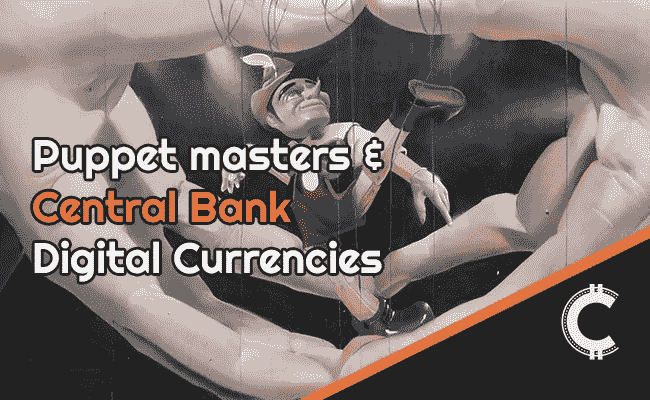

# 央行数字货币:你需要知道什么

> 原文：<https://medium.com/coinmonks/central-bank-digital-currencies-what-you-need-to-know-6efc3bcc5996?source=collection_archive---------3----------------------->

缓慢但肯定的是，消息开始出现，央行将采用数字货币或 CBDCs。这一事件的转变对现代货币理论(MMT)、国际政治和行为经济学有着多方面的影响，有可能彻底颠覆经济学规则。

## 什么是 CBDCs？

与[比特币](https://chrisoncrypto.com/blog/f/unstoppable-the-investment-case-for-bitcoin-in-2021)不同，央行数字货币是法定货币，将由全球各央行发行和控制，即美国美联储(FED)和欧洲央行(ECB)，它们对这一想法已经升温。

[cbdc](https://chrisoncrypto.com/blog/f/fed-chairman-jerome-powell-talks-cbdcs-at-imf-annual-meeting)泛指中央银行法定货币的数字表示，包括商业银行或中央银行持有的数字账户余额。这里的区别是令牌化，它创建了一种独特的数字价值表示，更便于携带，在数字领域中的作用类似于(但不同于)现实生活中的实物现金。

从不稳定的一面来看，象征性的法定货币为央行提供了更大的灵活性来操纵货币，并利用某种形式的分类账技术促进跨境支付，这肯定不会分散。

**今天要转账，你需要通过银行系统。数字货币(CBDCs)意味着中央银行将直接对你进行操作。即，您将在中央银行拥有一个带有数字钱包的账户。**

[https://platinum.crypto.com/r/wll3zzg50a](https://platinum.crypto.com/r/wll3zzg50a)

## 好处和权衡

虽然央行稳定货币的技术细节和货币编码尚未公开讨论或实施，但国际货币基金组织的年会暗示了这种货币的发展方向。

在会议期间，管理国际清算银行(BIS)的奥古斯丁·卡斯滕斯(Augustin Carstens)颇为不祥地表示:“ ***有了 CBDCs，央行将对货币的条款和监管拥有绝对控制权，我们也将拥有实施这一点的技术。*** ”

简而言之，这意味着央行将能够实施各种自动化流程，如自动征税、通胀率的即时调整(可能基于人口统计)、将某些地址列入黑名单，以及许多其他工具，这些工具将有效地让央行在财政政策中发挥重要作用，同时提高流程的效率。

当然，银行和财政政策国有化的前景听起来像是一个反乌托邦的噩梦，部分原因是它消除了实物现金交易带来的相对匿名性，但也是因为金融基础设施的绝对集中化性质。毫无疑问，我们将听到更多关于各种 CBDCs 的细节和技术细节的传言，以及这些是否会增强我们今天享受的现金特权。

我只能说:不要抱太大希望。

你仍然可以在餐馆给服务员小费，但不会在央行不知情的情况下。

## 暗示

欧洲央行、国际货币基金组织、美国司法部以及允许监管比特币和其他数字资产的举措，充分说明了未来会发生什么。央行数字货币的鼓点再响亮不过了。

鉴于 CBDCs 可以有效地绕过私人银行和金融科技部门，它们很快就提出了这样的问题:这种权衡对于多方而不仅仅是个人是否有意义。事实上，**这不仅仅是一个在没有窥探的情况下自由使用现金的问题，而且也引起了人们对作为美元支柱的 Swift 支付系统的可行性的担忧。**

众所周知，中国和其他许多国家最终将脱离美元本位，随着全球货币战争的展开，数字货币是削弱并最终用分散的货币格局取代美元的最直接途径。请记住，这是多年来形成的，不会在一夜之间发生。

**然而，除了政治因素，还有一个问题是中央银行能否直接改变财政政策。**如今，鉴于大多数国家的利率为零或为负值，货币政策已经死气沉沉。事实上，货币政策无处可去，这解释了央行为何有兴趣将财政政策纳入自己的保护伞之下(即货币民族主义)。既然央行想要这种直接向人们提供信贷的能力，那么通过 CBDCs 绕过当前的系统是完全有意义的。此时此刻，中央银行印出的钱进入银行系统，由于当前的信贷紧缩，这些钱又被囤积起来。央行不喜欢这样，所以他们会找一个迂回的方式(可能通过央行的移动应用程序)给所有人直升机撒钱(在这个过程中极大地改变了金融现实)。

最后，由于央行将为每个拥有央行账户的人提供直接信贷额度，那么**普遍基本收入(UBI)也将成为意想不到的后果**(或其他)购物清单的一部分；逐步淘汰实物现金将是其中一个后果(尽管这是有意为之)。

如果当前的危机延续到 2021 年及以后，那么可以想象其影响将被描绘成银行业困境的解决方案。当然，尽管对最终用户来说事情会变得更容易(可能会完全实现税收自动化)，但央行行长们届时将拥有他们如此渴望的完全控制权(根据上周国际货币基金组织小组讨论的[评论](https://twitter.com/ChrisOnCrypto1/status/1318164160874688513))。

人们很少知道:没有解决方案，只有权衡取舍。

## 一个有远见的政府会怎么做？

在这种情况下，一个相信自由市场资本主义的真正有远见的政府会采取以下路线:首先，发行 CBDC 或官方法定稳定币以与传统金融互动(1)，其次，采用比特币标准作为国家的储备资产和替代交易媒介(2)。

就目前情况而言，各国央行和政府并不认为比特币是一种威胁，但这在技术上无关紧要，因为没有哪个政府或政府集团能够搞垮现存最大的计算机网络。然而，随着比特币博弈理论的展开，以及人们感受到央行稳定货币的影响，对比特币的需求将变得更加明显。

事实上，比特币与游戏中没有皮肤的中央实体的突发奇想和倾向是对立的；这是比特币价值主张的精髓，不久就会实现。

保持怀疑。买比特币。

[**订阅**](https://chrisoncrypto.com/subscribe) **半月刊，定期洞察比特币与加密。继续吧。它是免费的。**

[**加入电报频道**](https://t.me/chrisoncryptochannel) **获取更新、图表、观点和交易。**

## 另外，阅读

*   最好的[密码交易机器人](/coinmonks/crypto-trading-bot-c2ffce8acb2a)
*   [密码本交易平台](/coinmonks/top-10-crypto-copy-trading-platforms-for-beginners-d0c37c7d698c)
*   最好的[加密税务软件](/coinmonks/best-crypto-tax-tool-for-my-money-72d4b430816b)
*   [最佳加密交易平台](/coinmonks/the-best-crypto-trading-platforms-in-2020-the-definitive-guide-updated-c72f8b874555)
*   最佳[加密贷款平台](/coinmonks/top-5-crypto-lending-platforms-in-2020-that-you-need-to-know-a1b675cec3fa)
*   [最佳区块链分析工具](https://bitquery.io/blog/best-blockchain-analysis-tools-and-software)
*   [加密套利](/coinmonks/crypto-arbitrage-guide-how-to-make-money-as-a-beginner-62bfe5c868f6)指南:新手如何赚钱
*   最佳[加密制图工具](/coinmonks/what-are-the-best-charting-platforms-for-cryptocurrency-trading-85aade584d80)
*   [莱杰 vs 特雷佐](/coinmonks/ledger-vs-trezor-best-hardware-wallet-to-secure-cryptocurrency-22c7a3fd391e)
*   了解比特币的[最佳书籍有哪些？](/coinmonks/what-are-the-best-books-to-learn-bitcoin-409aeb9aff4b)
*   [3 商业评论](/coinmonks/3commas-review-an-excellent-crypto-trading-bot-2020-1313a58bec92)
*   [AAX 交易所评论](/coinmonks/aax-exchange-review-2021-67c5ea09330c) |推荐代码、交易费用、利弊
*   [Deribit 审查](/coinmonks/deribit-review-options-fees-apis-and-testnet-2ca16c4bbdb2) |选项、费用、API 和 Testnet
*   [FTX 密码交易所评论](/coinmonks/ftx-crypto-exchange-review-53664ac1198f)
*   [n 零审核](/coinmonks/ngrave-zero-review-c465cf8307fc)
*   [Bybit 交换审查](/coinmonks/bybit-exchange-review-dbd570019b71)
*   3Commas vs Cryptohopper
*   最好的比特币[硬件钱包](/coinmonks/the-best-cryptocurrency-hardware-wallets-of-2020-e28b1c124069?source=friends_link&sk=324dd9ff8556ab578d71e7ad7658ad7c)
*   最佳 [monero 钱包](https://blog.coincodecap.com/best-monero-wallets)
*   [莱杰纳米 s vs x](https://blog.coincodecap.com/ledger-nano-s-vs-x)
*   [bits gap vs 3 commas vs quad ency](https://blog.coincodecap.com/bitsgap-3commas-quadency)
*   [莱杰 Nano S vs 特雷佐 one vs 特雷佐 T vs 莱杰 Nano X](https://blog.coincodecap.com/ledger-nano-s-vs-trezor-one-ledger-nano-x-trezor-t)
*   [block fi vs Celsius](/coinmonks/blockfi-vs-celsius-vs-hodlnaut-8a1cc8c26630)vs Hodlnaut
*   Bitsgap 评论——一个轻松赚钱的加密交易机器人
*   为专业人士设计的加密交易机器人
*   [PrimeXBT 审查](/coinmonks/primexbt-review-88e0815be858) |杠杆交易、费用和交易
*   [埃利帕尔泰坦评论](/coinmonks/ellipal-titan-review-85e9071dd029)
*   [赛克斯石评论](https://blog.coincodecap.com/secux-stone-hardware-wallet-review)
*   [BlockFi 评论](/coinmonks/blockfi-review-53096053c097) |从您的密码中赚取高达 8.6%的利息