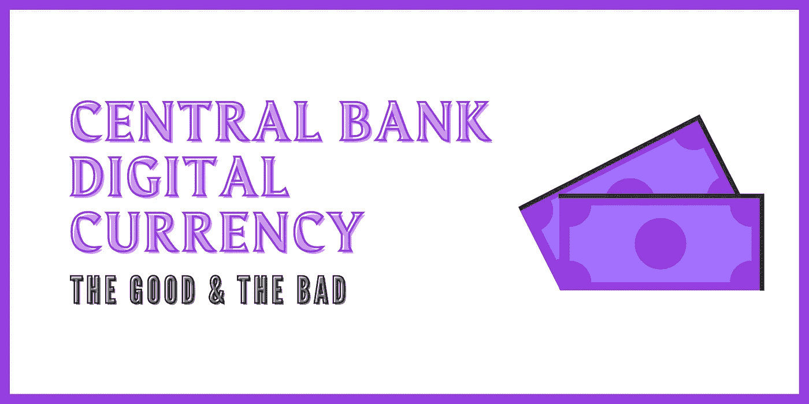

# 央行数字货币

> 原文：<https://medium.com/coinmonks/central-bank-digital-currency-b0914cc757b2?source=collection_archive---------6----------------------->

## 加密货币

## 探索 CBDC 的好与坏

Image Courtesy of [0x_idkCrypto](/@0x_Idkcrypto)

我们知道比特币和以太坊的事情，但我们知道什么是央行数字货币吗？

中央银行数字货币(CBDC)是一种与一国货币挂钩的数字货币，由中央银行发行。它们类似于稳定的货币，如 USDC、T2、USDT、T4 和 TUSD，都与美元挂钩。stablecoins 和 CBDC 的主要区别在于，前者由私营公司发行，并在数字资产交易所上市。

CBDC 不同于你目前用来给虚拟卡充值和给朋友和家人进行个人转账的数字法定货币。CBDC 不同于你在加油站用来买薯片和花生的现金。它们是一种新的数字货币，由一个国家的中央银行监管和控制。区块链让这一切成为可能。CBDC 的将在区块链，这意味着所有的交易将被记录从一个街区到另一个街区。记录在哪里，什么时候，谁会在街区被看到(当然，对你我这样的人是匿名的)。

在 CBDC 成为我们日常生活的一部分之前，我们应该探索这一新资产类别的机遇和挑战。让我们看看这对央行数字货币的用户和发行者意味着什么。

# CBDC 的优势

CBDC 或央行数字货币一直是这些天各国央行内部讨论的话题。CBDC 被视为数字货币的头号竞争者；以下是央行数字货币的一些值得注意的好处。

# 效率和可靠性

CBDC 想到的最显著的好处之一与我们能够看到的加密货币的情况类似。CBDC 将能够显著降低和加快机构支付和零售用户的交易速度。

这与我拥有的数字电子货币有何不同？

这是一个简单却令人生畏的问题，支持 CBDC 的人总是会被问到。值得注意的是，CBDC 的纸币将以电子方式发行，不印制任何纸币。这完全取消了用户必须将物理纸币存入 ATM 并将这些资金存入其电子钱包的步骤。

# 具有成本效益的替代方案

CBDC 氏症可能是节约成本的一个推动因素。我们生活在一个事物发展比以往任何时候都更快的时代，这意味着我们用作交换媒介的货币需要以更快的速度进行交换，同时降低生产成本。CBDC 将大幅降低生产和印刷实体钞票、租赁或使用存储空间的成本因素；和运输成本。

对于分销商来说，分发实物纸币可能是一项艰巨的任务，而 CBDC 可能是一种更安全的分发资金的方式，因为它减少了对生态系统内可能发生的欺诈的担忧。当然，可能会有网络安全方面的顾虑；央行应该制定计划，从一开始就把安全放在首位。

# 鼓励创新

当 CBDC 在未来取代他们的位置时，这可以鼓励一个国家金融系统的创新。就竞争而言，对支付生态系统的看法将完全不同。新银行(neo banks)等私人实体将会提出越来越多的创新想法，帮助向零售用户分销 CBDC。

此外，CBDC 的可以是一个解决方案，银行无银行账户，并提供虚拟银行账户，以无证个人在一个国家。当然，了解你的客户(KYC)将是无证社区进入的一个障碍，但从银行无银行账户开始是启动这些努力的一个很好的地方。

# CBDC 的缺点

虽然 CBDC 的举措可能是央行采取的一个很好的举措，但对于一个拥有新技术资金的国家的公民来说，也有许多不利之处。

# 地理限制

当我们想到 CBDC 的时候，我们会想到从一个国家向另一个国家汇款的可能性。CBDC 的技术将使这成为可能。然而，将人民币 CBDC 从中国转移给美国的某人对那里的人没有多大用处，当然，除非已经建立了像 CBDC 交易所这样的基础设施来执行 CBDC 兑换。目前，CBDC 的仍然有地理限制，因为他们只能在他们的祖国使用。

# 银行将变得无关紧要

在当今的金融生态系统中，银行是主导力量，在任何交易中都扮演着中间人的角色。想往国外汇款，还是会用银行；当你想买车或买房时，银行会为你提供贷款。

那么，当 CBDC 推出时，还需要银行吗？

这一点的标题可能是一种点击诱饵，但与银行目前的规模相比，它们在未来 10 到 20 年的规模将大大减少。这意味着，银行将实现自动化，只有少数员工为银行分行工作，如果你没有得到这个提示，这将导致失业。然而，银行不会完全成为多余的，随着 CBDC 的可能，员工在银行分支机构办公的需求将会减少。

# 用户隐私

CBDC 的用户隐私在很多讨论中都有争议。专家们担心 CBDC 是否是真正的隐私。当中央银行印刷和发行现金给不同的当事人时；钞票本身只有序列号(#123456)可以识别。当纸币被交换时，没有证据表明纸币(#123456)在当前持有者之前来自何处。

CBDC 让这一切成为可能。当然，这可能没有听起来那么好——知道钱去了哪里是最终遏制洗钱和恐怖分子融资活动的惊人壮举。然而，对于你我这样的普通公民来说；我们真的想让央行和政府知道我们花钱的目的吗？:大概不会。CBDC 将能够通过网上购物跟踪交易、资金流动和个人用户行为。现在，还不清楚 CBDC 的设计功能会是什么样子。然而，大多数将有活动显示在链上。

# 结束语

中央银行的数字货币(CBDC)不同于稳定货币，有一个强烈的误解，认为两者非常相似。CBDC 是一种新形式的数字资产，由政府和中央银行发行，以限制生产和其他杂项成本。此外，遏制可以在链上跟踪的非法活动。CBDC 的障碍是一个新的技术障碍，如果处理得当，中央银行和政府的工作将会受到称赞，并将能够建立对他们国家的信任。

***免责声明:*** *感谢收听，任何观点的表达(如有变更，恕不另行通知)都是我(作者)个人的，我(作者)不保证所提供的任何信息或分析的准确性或完整性。*

**在 Twitter 上关注我:** [@0x_idkcrypto](https://twitter.com/0x_idkcrypto)

> 加入 [Coinmonks 电报频道](https://t.me/coincodecap)，了解加密交易和投资

## 另外，阅读

*   [什么是融资融券交易](https://blog.coincodecap.com/margin-trading) | [成本平均法](https://blog.coincodecap.com/dca)
*   [BigONE 交易所评论](/coinmonks/bigone-exchange-review-64705d85a1d4) | [电网交易机器人](https://blog.coincodecap.com/grid-trading)
*   [3 商业评论](/coinmonks/3commas-review-an-excellent-crypto-trading-bot-2020-1313a58bec92) | [Pionex 评论](/coinmonks/pionex-review-exchange-with-crypto-trading-bot-1e459d0191ea) | [Coinrule 评论](/coinmonks/coinrule-review-2021-a-beginner-friendly-crypto-trading-bot-daf0504848ba)
*   [莱杰 vs n rave](/coinmonks/ledger-vs-ngrave-zero-7e40f0c1d694)|[莱杰 nano s vs x](/coinmonks/ledger-nano-s-vs-x-battery-hardware-price-storage-59a6663fe3b0) | [币安评论](/coinmonks/binance-review-ee10d3bf3b6e)
*   [Bybit Exchange 审查](/coinmonks/bybit-exchange-review-dbd570019b71) | [Bityard 审查](https://blog.coincodecap.com/bityard-reivew) | [CoinSpot 审查](https://blog.coincodecap.com/coinspot-review)
*   [霍比评论](https://blog.coincodecap.com/huobi-review) | [OKEx 保证金交易](https://blog.coincodecap.com/okex-margin-trading) | [期货交易](https://blog.coincodecap.com/futures-trading)
*   [麻雀交换评论](https://blog.coincodecap.com/sparrow-exchange-review) | [纳什交换评论](https://blog.coincodecap.com/nash-exchange-review)
*   最好的[加密税务软件](/coinmonks/best-crypto-tax-tool-for-my-money-72d4b430816b) | [硬币追踪评论](/coinmonks/cointracking-review-a-reliable-cryptocurrency-tax-software-5114e3eb5737)
*   [Stackedinvest 审查](https://blog.coincodecap.com/stackedinvest-review) | [北海巨妖审查](/coinmonks/kraken-review-6165fc1056ac) | [期货交易机器人](/coinmonks/futures-trading-bots-5a282ccee3f5)
*   最佳[加密借贷平台](/coinmonks/top-5-crypto-lending-platforms-in-2020-that-you-need-to-know-a1b675cec3fa) | [杠杆令牌](/coinmonks/leveraged-token-3f5257808b22) | [风暴增益评论](https://blog.coincodecap.com/stormgain-review)
*   最佳[加密制图工具](/coinmonks/what-are-the-best-charting-platforms-for-cryptocurrency-trading-85aade584d80) | [最佳加密交易所](/coinmonks/crypto-exchange-dd2f9d6f3769) | [普罗比特评论](https://blog.coincodecap.com/probit-review)
*   [比特币基地僵尸程序](/coinmonks/coinbase-bots-ac6359e897f3) | [AscendEX 审查](/coinmonks/ascendex-review-53e829cf75fa) | [OKEx 交易僵尸程序](/coinmonks/okex-trading-bots-234920f61e60) | [Bexplus 审查](https://blog.coincodecap.com/bexplus-review)
*   [如何在印度购买比特币？](/coinmonks/buy-bitcoin-in-india-feb50ddfef94) | [瓦济克斯评论](/coinmonks/wazirx-review-5c811b074f5b) | [俱吠罗评论](/coinmonks/coinswitch-kuber-review-1a8dc5c7a739)
*   [CryptoHopper 替代品](/coinmonks/cryptohopper-alternatives-d67287b16d27) | [HitBTC 评论](/coinmonks/hitbtc-review-c5143c5d53c2) | [Kucoin 交易机器人](/coinmonks/kucoin-trading-bot-automate-your-trades-8cf0ca2138e0)
*   [WazirX vs CoinDCX vs bit bns](/coinmonks/wazirx-vs-coindcx-vs-bitbns-149f4f19a2f1)|[block fi vs coin loan vs Nexo](/coinmonks/blockfi-vs-coinloan-vs-nexo-cb624635230d)
*   [本地比特币审核](/coinmonks/localbitcoins-review-6cc001c6ed56) | [加密货币储蓄账户](https://blog.coincodecap.com/cryptocurrency-savings-accounts)
*   [比特币基地评论](/coinmonks/coinbase-review-6ef4e0f56064) | [德里比特评论](/coinmonks/deribit-review-options-fees-apis-and-testnet-2ca16c4bbdb2) | [FTX 评论](/coinmonks/ftx-crypto-exchange-review-53664ac1198f) | [StealthEX 评论](/coinmonks/stealthex-review-396c67309988)
*   [n 零审核](/coinmonks/ngrave-zero-review-c465cf8307fc) | [Phemex 审核](/coinmonks/phemex-review-4cfba0b49e28) | [PrimeXBT 审核](/coinmonks/primexbt-review-88e0815be858)
*   最佳[区块链分析](https://bitquery.io/blog/best-blockchain-analysis-tools-and-software)工具| [赚比特币](/coinmonks/earn-bitcoin-6e8bd3c592d9) | [Swapzone 评论](/coinmonks/swapzone-review-crypto-exchange-data-aggregator-e0ad78e55ed7)
*   [加密套利](/coinmonks/crypto-arbitrage-guide-how-to-make-money-as-a-beginner-62bfe5c868f6)指南| [如何做空比特币](/coinmonks/how-to-short-bitcoin-568a2d0b4ae5) | [Prokey 回顾](/coinmonks/prokey-review-26611173c13c)
*   [币安交易机器人](/coinmonks/binance-trading-bots-d0d57bb62c4c) | [OKEx 评论](/coinmonks/okex-review-6b369304110f) | [Atani 评论](https://blog.coincodecap.com/atani-review)
*   [最佳加密交易信号电报](/coinmonks/best-crypto-signals-telegram-5785cdbc4b2b) | [MoonXBT 评论](/coinmonks/moonxbt-review-6e4ab26d037)
*   [Godex.io 审核](/coinmonks/godex-io-review-7366086519fb) | [邀请审核](/coinmonks/invity-review-70f3030c0502) | [BitForex 审核](https://blog.coincodecap.com/bitforex-review)
*   [火币交易机器人](https://blog.coincodecap.com/huobi-trading-bot) | [如何购买 ADA](https://blog.coincodecap.com/buy-ada-cardano) | [Geco？一次审查](https://blog.coincodecap.com/geco-one-review)
*   [币安 vs 比特邮票](https://blog.coincodecap.com/binance-vs-bitstamp) | [比特熊猫 vs 比特币基地 vs Coinsbit](https://blog.coincodecap.com/bitpanda-coinbase-coinsbit)
*   [如何购买 Ripple (XRP)](https://blog.coincodecap.com/buy-ripple-india) | [非洲最好的加密交易所](https://blog.coincodecap.com/crypto-exchange-africa)
*   [非洲最佳加密交易所](https://blog.coincodecap.com/crypto-exchange-africa) | [胡交易所评论](https://blog.coincodecap.com/hoo-exchange-review)
*   [eToro vs robin hood](https://blog.coincodecap.com/etoro-robinhood)|[MoonXBT vs Bybit vs Bityard](https://blog.coincodecap.com/bybit-bityard-moonxbt)
*   [交易信号是什么？](https://blog.coincodecap.com/trading-signal) | [Bitstamp vs 比特币基地](https://blog.coincodecap.com/bitstamp-coinbase)
*   [ProfitFarmers 回顾](https://blog.coincodecap.com/profitfarmers-review) | [如何使用 Cornix Trading Bot](https://blog.coincodecap.com/cornix-trading-bot)