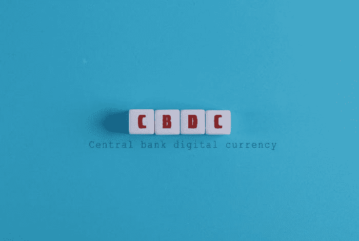
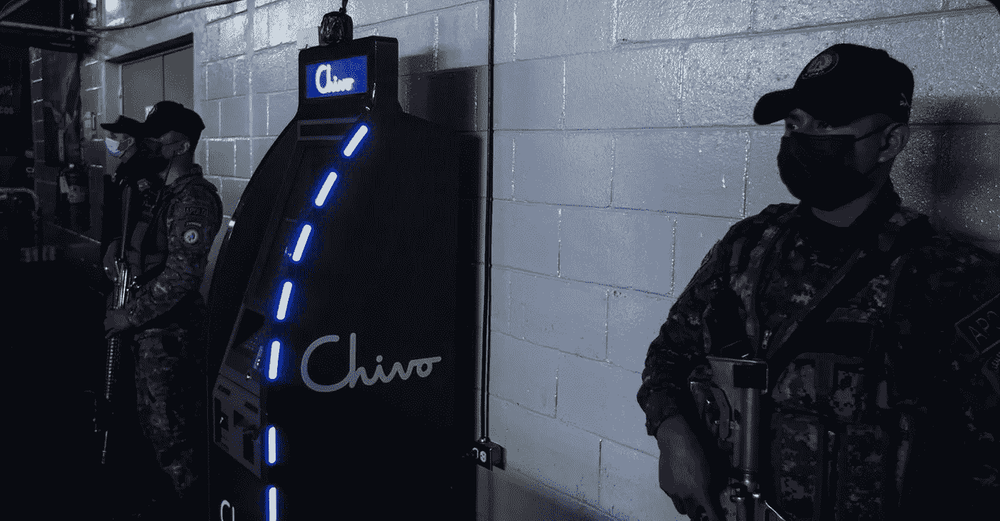

# 中央银行为中央银行苦苦哀求

> 原文：<https://medium.com/coinmonks/central-banks-begging-in-distress-for-cbdcs-8f39d3ea5eb6?source=collection_archive---------4----------------------->

*Image From:* [*Pixabay*](https://pixabay.com/illustrations/woman-tunnel-neon-lighting-5719835/)

银行这次更进一步，在 DeFi 部门试水，发现这只是对他们传统的集中业务的威胁。欧盟和美国的金融智库对结果进行了分析，并再次将 CBDCs 作为保持银行业在金融领域相关性的解决方案。

当存在对企业的有效威胁时，会采取某些措施。逻辑表明，企业(在这种情况下是银行)将试图创造更好的服务。然而，这些服务能够与现有的分散金融相匹配吗？在 DeFi 中，集中化的传统银行能够与更高收益率和自动化的智能合约系统竞争吗？

比特币在 2010 年被认为是一个潜在威胁，当时银行甚至还没有更新他们基于 UNIX 的旧网络。尽管仍然有充分的理由继续使用已经被证明是可靠的网络，但在 30 年内，还是取得了一些进展。

最近，我们看到银行在改变，创造更好的基础设施和服务，并进行创新。但直到 2010 年，比特币才成为他们无法接触的支付选择。

加密技术不仅对银行，而且对美元霸权都是一种有效的威胁。十年后，有了 DeFi，这个威胁现在是一个令人生畏的信息，金融将如此迅速地变化，没有什么可以阻止将要发生的事情。然而，银行家们仍然相信他们有一个解决方案:CBDCs。

# 中央银行数字货币

*Source:* [*Flickr*](https://live.staticflickr.com/65535/51081109033_7a194dd3bb_b.jpg)

加密是一种金融干扰。

分散和自治的加密货币无法被控制、关闭或驯服。

银行认为 DeFi 有危险，政府认为加密是一种支付方式。每次的反应都差不多。严格监管加密货币并对交易征收重税，同时作为竞争对手推进数字法定货币或 CBDCs 的发展。

中国已经有了一个(CBDC)，它正在测试它，并试图增加它的实践。中国 CBDC 也是“一带一路”倡议的一部分，这是一项政府计划，预计将帮助中国经济在大约 20 年内实现 GDP 翻番。至少这是中国政府的计划。

中国也偶尔禁止加密。

然而，上述措施阻止了加密货币在中国的使用吗？当整个世界都在快速进入加密领域时，中国人对加密不感兴趣吗？我已经见过很多中国人，在 VPN 和代理背后，绕过“防火长城”，试图攫取他们应得的“财务自由”。

这是一种把金钱和国家分开的自由，把财政的绝对权力交给人民。

这种自由不仅仅威胁像中国这样的共产主义政权。它破坏了民选政府和被赋予货币供应控制权的专制政府。

他们向我们灌输政府必须控制货币的观念，但我们确定这是唯一的方式吗？

然而，时代在变，我们都经历过央行政策的失败。问问任何经历过 2008 年经济崩溃的人，他们是否还会盲目信任银行。问问他们是否想过有一天，他们的银行会成为下一个雷曼兄弟。如果根本不担心政府会没收我们的账户(比如塞浦路斯)。

我们的货币价值现在面临着通胀上升和零(甚至是负)利率的风险。欧元和美元的无休止印刷已经开始了三方之间的货币竞争，而那些遭受损失的是将不得不做出承诺的主权国家。

我们看到今天的顶级金融组织，如国际货币基金组织，欧洲央行，以及最近的国际清算银行，匆忙创建 CBDCs(如数字欧元，数字日元等。)，同时还要求迅速做出改变，以对抗加密货币的扩张。

然而，这将如何发生呢？CBD 会分散吗？是否会有矿工在世界各地进行采矿交易并遵守商定的协议？谁将掌握控制权？

大多数加密货币都是由共识驱动的。这是一个基于对任何规则变化的压倒性支持的决策过程。政府会创造一种分散化的货币吗？届时谁将控制通胀水平和货币供应？

## CBDCs 只是一个系绳。

支撑 USDT 的不是其外汇储备。没有人相信 Tether 实际持有 700 亿美元的流动资产。

它得到了所有使用它的人的支持，条件是有一天它可能会内爆，并在其不稳定的基础上崩溃。虽然，只要它有效，并且有稳定的机制，所有相关的各方都同意它的价格。在这个意义上，Tether 类似于 fiat，而 CBDCs 只不过是数字 fiat。

# 最后

我仍在试图理解央行在这种情况下试图采用的策略。每个私人或政府组织的高层管理人员似乎都处于困惑和苦恼之中。

CBDCs 与 fiat 没有任何不同，可能那些通知央行董事的人做得很糟糕。现在有人可能会怀疑，并问:“你为什么试图唤醒他们？只是让他们犯更多的错误”。

我们正在目睹的金融变革是不可避免的。不管是不是 CBD，即将到来的是人类历史上最大的价值转移。

即使银行家(包括私人和政府控制的)完全理解他们今天的处境，他们也无法控制一个赋予个人权力的去中心化的金融未来。

加密货币是分散的网络，由代码支持，但它们的成功还基于另一个方面:“人民的意愿”。大规模采用并没有像 BTC 社区中的一些人希望的那样被高估。

加密货币不需要法律和法规。与包括 CBDCs 在内的其他货币等价物相比，它们提供了更好的功能和更高的效率。

CBDC 只会浪费资源和时间。

## BTC 是萨尔瓦多的 CBDC

[*Source*](https://twitter.com/be_cashy/status/1437115379285909504/photo/1)

CBDC 的测试阶段目前正在萨尔瓦多进行。因为这甚至不是被使用的 BTC，而是 BTC 的数字 LN-Coin 版本，提供了对布克勒政府近乎完全的控制。

它已经失败了。90%的人对此不屑一顾并提出抗议。密码不会被强制采用，CBDC 也不会被自愿采用，而是被强制采用。

如果萨尔瓦多想要一种非托管的货币，并使这个国家的人民能够实现金融意愿，那么它应该选择比特币现金。如果多尔西了解比特币，并想利用自己的影响力为所有人谋福利，他也会选择比特币现金。

在这种情况下，萨尔瓦多并没有反其道而行之，而是成为中美洲发展中国家的试验田。随着保管钱包、Strike 和 Chivo 的使用，负责人将有能力拒绝交易。

金融审查不是区块链的特色。因此，银行想到了运行在第二层扩展“解决方案”上的第三方钱包，这是他们拖延金融创新的最后一次徒劳尝试。

**跟我上:***●*[***read cash***](https://read.cash/@Pantera)*】●*[***noise cash***](https://noise.cash/u/Pantera99)*●*[***Medium***](/@panterabch)*●*[*蜂巢*](https://hive.blog/@pantera1) *●* **●*[***推特***](https://twitter.com/Panterabch)*●*[***领英***](https://www.linkedin.com/in/panterabch/)****●*****

******如果你喜欢这篇文章，别忘了订阅并点赞！******

***原发布于*[*https://read . cash*](https://read.cash/@Pantera/central-banks-begging-in-distress-for-cbdcs-why-crypto-cant-be-tamed-bcfa7e87)*。***

> **加入 Coinmonks [电报频道](https://t.me/coincodecap)和 [Youtube 频道](https://www.youtube.com/channel/UCbyDhTbOiKh2iUMKBi4-4Zg)了解加密交易和投资**

## **另外，阅读**

*   **[什么是保证金交易](https://blog.coincodecap.com/margin-trading) | [美元成本平均法](https://blog.coincodecap.com/dca)**
*   **[BigONE 交易所评论](/coinmonks/bigone-exchange-review-64705d85a1d4) | [电网交易机器人](https://blog.coincodecap.com/grid-trading)**
*   **最佳[密码交易机器人](https://blog.coincodecap.com/best-crypto-trading-bots) | [购买索拉纳](https://blog.coincodecap.com/buy-solana) | [矩阵导出评论](https://blog.coincodecap.com/matrixport-review)**
*   **[Coldcard 评论](https://blog.coincodecap.com/coldcard-review) | [BOXtradEX 评论](https://blog.coincodecap.com/boxtradex-review)|[uni swap 指南](https://blog.coincodecap.com/uniswap)**
*   **[阿联酋 5 大最佳加密交易所](https://blog.coincodecap.com/best-crypto-exchanges-in-uae) | [SimpleSwap 评论](https://blog.coincodecap.com/simpleswap-review)**
*   **购买 Dogecoin 的 7 种最佳方式**
*   **[最佳期货交易信号](https://blog.coincodecap.com/futures-trading-signals) | [流动性交易所评论](https://blog.coincodecap.com/liquid-exchange-review)**
*   **[3 商业评论](/coinmonks/3commas-review-an-excellent-crypto-trading-bot-2020-1313a58bec92) | [Pionex 评论](/coinmonks/pionex-review-exchange-with-crypto-trading-bot-1e459d0191ea) | [Coinrule 评论](/coinmonks/coinrule-review-2021-a-beginner-friendly-crypto-trading-bot-daf0504848ba)**
*   **[莱杰 vs Ngrave](/coinmonks/ledger-vs-ngrave-zero-7e40f0c1d694) | [莱杰 nano s vs x](/coinmonks/ledger-nano-s-vs-x-battery-hardware-price-storage-59a6663fe3b0) | [币安评论](/coinmonks/binance-review-ee10d3bf3b6e)**
*   **[Bybit Exchange 审查](/coinmonks/bybit-exchange-review-dbd570019b71) | [Bityard 审查](https://blog.coincodecap.com/bityard-reivew) | [CoinSpot 审查](https://blog.coincodecap.com/coinspot-review)**