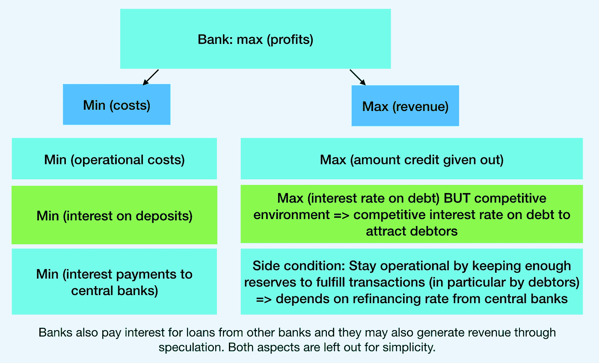

# 中央银行作为经济控制手段的货币政策

> 原文：<https://medium.com/coinmonks/central-banks-monetary-policy-as-a-means-for-economic-control-593e64190172?source=collection_archive---------3----------------------->

## 信用创造和印钞，中央银行对自由市场的全面接管，以及比特币如何解决这一问题？

最近，越来越多的人开始批评中央银行系统。批评主要集中在央行和银行在信用创造和资产购买过程中凭空创造货币，这在我之前的文章中已经讨论过。

这篇文章展示了我的发现，首先关注央行通过设定利率来影响经济的能力。在这个过程中，商业银行作为中介机构有自己的动机。然后，更重要的是，讨论中央银行的资产购买计划对经济的影响，这在术语“**量化宽松**下更为人所知。

最后，央行“比特币”的分散化替代品被强调为当前银行体系的对立面。

[这篇文章在“比特币的价值”会议上被报道，并在 YouTube 上有视频。](https://www.youtube.com/watch?v=SK_filM88BI&feature=youtu.be)

[本文还有德语版本。](/@stefanievonjan/die-geldpolitik-der-zentralbanken-als-mittel-zur-wirtschaftlichen-kontrolle-aa15ed5ba8c5)

Detail of the U.S. one dollar bill

> 货币创造的最终约束是货币政策。通过影响经济中的利率水平，英格兰银行的货币政策影响了家庭和公司的借贷量。这既通过影响银行收取的贷款利率直接发生，也通过货币政策对经济活动的总体影响间接发生。” [*英国央行，2014 年 Q1 季度公报*](https://www.bankofengland.co.uk/-/media/boe/files/quarterly-bulletin/2014/money-creation-in-the-modern-economy.pdf?la=en&hash=9A8788FD44A62D8BB927123544205CE476E01654)

# 中央银行、经济和利率

央行通过人为的低利率对经济实施间接控制。这使得银行很容易再融资，最终发放信贷。因此，中央银行通过设定利率来影响创造多少信贷。人为的低利率导致经济的严重扭曲，即繁荣和萧条周期以及资源的错误分配。

中央银行通过利率对经济的控制是间接的，因为创造的信贷量最终取决于对信贷的需求。英格兰银行的一篇文章很好地解释了这个概念，我摘录如下:

> *“银行首先根据他们可获得的有利可图的贷款机会来决定放贷多少，这将关键取决于英国央行设定的利率。正是这些贷款决策决定了银行系统创造了多少银行存款。反过来，银行存款的多少会影响银行希望持有多少央行货币储备(以满足公众提款、向其他银行支付款项或满足监管流动性要求)，而在正常情况下，央行货币储备由英格兰银行按需提供。”*

为了充分理解央行对银行创造的信贷量的影响程度，理解银行的模型至关重要。

# 银行的商业模式

与任何公司一样，银行希望通过最小化成本和最大化收益来实现利润最大化。**银行从发放给债务人的贷款利息中获得收入。银行可以通过提高利率或增加信贷额度来增加收入。**

银行在吸引债务人方面相互竞争，这就是为什么银行会因为任意提高贷款利率而失去潜在的债务人。因此，由于竞争环境，这个机会是有限的。因此，银行有动机创造尽可能多的信贷，通过支付相关利息来增加收入。

A bank intends to maximize its profits

银行业的成本包括银行的运营成本、客户储蓄账户的利息(在它们被设定为零之前)以及他们从中央银行获得信贷所需支付的利息。

这些中央银行的资金对银行的运作至关重要，即把客户的资金从一家银行转移到另一家银行。这一点将在接下来的章节中强调。在此之前，银行通过信用创造凭空创造货币的能力将在我之前的文章[中详细讨论。](/@stefanievonjan/money-creation-in-the-fiat-system-a-balance-sheet-analysis-of-banks-and-central-banks-363251bd2eb4)

# 银行在信用创造的过程中创造货币

在创造信贷的过程中，银行在资产负债表的资产一方记录下贷款的金额，并将这笔钱存入债务人的银行账户，该账户在银行资产负债表的负债一方。

因此，信贷总额被添加到资产负债表的两侧:资产侧的“对客户的债权”(债务)和银行负债侧的“对客户的债权”(贷款)。

当债务得到偿还时，银行对该债务的债权就会减少。索赔额的减少反映在资产负债表的资产部分。在这个过程中，通过信用创造产生的货币被摧毁。

银行并不直接通过债务偿还产生收入，而是通过债务的利率产生收入，这是银行的主要收入来源。然而，债务偿还与银行在央行持有的准备金有关。如果债务没有偿还，那么债权的价值必须向下修正，这会减少利润和权益。储备和客户交易之间的关系将在下面讨论。

# 储备的必要性，以使客户的交易

> 银行的商业模式依赖于贷款(或其他资产)的利率高于存款(或其他负债)的利率。银行资产和负债的利率取决于英格兰银行设定的政策利率，这是货币创造的最终约束。” [*英国央行 2014 年季报【Q1】*](https://www.bankofengland.co.uk/-/media/boe/files/quarterly-bulletin/2014/money-creation-in-the-modern-economy.pdf?la=en&hash=9A8788FD44A62D8BB927123544205CE476E01654)

我们再深入了解一下，银行什么时候发放信贷。首先，银行评估债务人的信誉(信用风险),然后将其计入债务人获得的利率。只有当企业被评估为有利可图时，银行才会贷款。

这取决于投资回报，为简单起见，我们认为投资回报是不变的。除此之外，最重要的因素是银行从央行再融资的利率。银行在央行进行再融资的利率至关重要，因为银行需要央行的资金来进行银行间的结算。

这种“央行货币”被称为“储备”。储备是银行在中央银行持有的钱。这与消费者在银行存钱的概念有很大关系。就像消费者把钱存在银行的银行账户里，银行把钱存在央行的银行账户里。

储备是银行间交易的推动者。当一家银行的客户向在另一家银行有账户的人转账时，准备金尤其重要。准备金不足会对银行处理交易的能力构成威胁(流动性风险)。下图说明了这一概念。

该图显示了当客户将资金从他的账户转移到另一家银行的另一个账户时，银行资产负债表上发生的情况。在上面的例子中，钱从“花旗银行”转移到“明星银行”。不出所料，花旗银行在负债方面损失了客户的存款。但是花旗银行也失去了它在中央银行的储备。这是因为花旗银行必须在客户转移资金时向明星银行转移相同数量的准备金。这对银行的准备金需求有着巨大的影响。此外，这也是为什么银行之间互相贷款，以平衡客户的资金流动。

我们已经讨论了三个重要的概念:

1.  银行的收入流(主要是债务利息支付)
2.  银行如何在信用创造过程中创造货币
3.  储备的必要性，以使客户的交易

现在，这三个方面汇集在一起。

银行需要准备金——也就是中央银行的钱——来完成客户的交易。这限制了银行创造债务的能力。一家银行只会产生同样多的债务，直到它没有耗尽准备金，这将削弱其处理客户交易的能力。这是因为产生的债务被放在“人民存款”条目中，正如我在上一篇文章中所讨论的。这笔存款随后可以通过正常的商业交易转移到另一家银行。然后，银行也需要转移准备金。因此，银行需要储备来处理交易。对准备金的需求随着新债务的增加而增加，因为银行必须保留准备金来处理债务人的商业交易。这就是为什么银行必须在中央银行持有一定比例的负债(客户存款)作为准备金，称为[准备金要求](https://www.federalreserve.gov/monetarypolicy/reserve-maintenance-manual-calculation-of-reserve-balance-requirements.htm)。

**银行会借出尽可能多的债务，通过支付这些债务的利息来增加收入。同时，银行需要储备来处理交易。这些储备是有代价的。只有当储备成本低于债务收入时，银行才会发放贷款。如果储备成本降低，通过债务创造的更多可能的业务变得有利可图，即更多的债务将被借出。**

我们已经讨论了再融资利率对银行决定发放额外债务的重要性。为了更详细地理解再融资利率的宏观经济含义，必须理解银行之间的竞争机制。

# 银行间的竞争

> 为了发放额外的贷款，一家银行通常不得不降低其相对于竞争对手的贷款利率，以吸引家庭和公司增加借贷。一旦发放了贷款，它很可能会把自己创造的存款“流失”给那些竞争对手。这两个因素都会影响为单个银行发放贷款的盈利能力，并影响借贷量。” [*英国央行 2014 年季报*Q1](https://www.bankofengland.co.uk/-/media/boe/files/quarterly-bulletin/2014/money-creation-in-the-modern-economy.pdf?la=en&hash=9A8788FD44A62D8BB927123544205CE476E01654)

银行之间相互竞争。银行争夺两样东西:贷款利息和存款准备金。为了吸引更多的债务人，银行可以降低相对于其他银行的债务利率。与此同时，银行需要确保它们能够为需要准备金的交易提供服务。它们要么通过向央行借款，要么通过吸收存款来获得准备金。如前一章所述，来自另一家银行的新存款带有准备金。为了吸引更多的存款，银行可以提高银行存款利率。英格兰银行声称“通过吸引新的存款，银行可以在不减少储备的情况下增加贷款”。因此，英国央行需要评估，是通过诱人的利率吸引新存款更合理，还是直接从央行借入准备金更合理。过去，前者对银行来说更合理，然而，这种情况最近有所改变。

吸引新存款仅仅是储备的再分配，不应该对宏观经济产生影响。相比之下，降低再融资利率允许银行从央行借入更多债务，从而扩大流通中的储备数量，进而在宏观经济层面上影响经济。为了理解宏观经济的含义，我们总是需要观察新货币是从哪里创造出来的，而当新信贷被创造出来时，情况正是如此——当央行向银行发放准备金时，以及当银行创造新信贷并发放给客户时。因此，在宏观经济层面上，通过吸引存款来争夺储备的竞争可以忽略不计。

一旦央行降低再融资利率，银行就可以以更低的利率借入准备金。因此，银行可以通过发放更多债务来扩大业务，因为它们可以以更低的利率为自己再融资，以服务于债务人的后续交易。由于银行处于竞争环境，银行会降低债务的利率来吸引更多的债务人。这就是降低再融资利率导致商业债务利率降低的机制。

债务利率的降低吸引了新的债务人要求债务资金。这反过来导致流通中的债务货币扩张。此外，人为的低利率让摧毁资本的投资变得有利可图。由于资本成本的降低，不赚钱的投资机会变得有利可图。这种扭曲是不可持续的，繁荣最终会变成萧条，本·考夫曼的文章“比特币和商业周期”对此有很好的解释。

在下文中，你可以找到中央银行再融资利率的信息。美联储(美联储)隔夜银行融资利率的最新发展数据可以在[这里](https://fred.stlouisfed.org/series/OBFR)找到。目前的隔夜银行融资利率为 0.05%。关于欧洲中央银行(ECB) [边际贷款便利](https://www.ecb.europa.eu/explainers/tell-me/html/marginal_lending_facility_rate.en.html)的信息，这是银行隔夜借款的利率和通过[主要再融资操作](https://www.ecb.europa.eu/explainers/tell-me/html/mro.en.html)进行一周以上再融资的利率，可以在[这里](https://www.ecb.europa.eu/stats/policy_and_exchange_rates/key_ecb_interest_rates/html/index.en.html)和[这里](https://sdw.ecb.europa.eu/browse.do?node=9691107)找到。这两种融资形式都需要证券形式的抵押品。边际贷款工具的当前利率为 0.25%，主要再融资操作为 0%。

# 央行通过资产购买直接影响经济的能力

*“一旦短期利率达到有效下限[0.5%]，央行就不可能通过降低准备金利率来进一步刺激经济。为经济提供进一步货币刺激的一种可能方式是通过资产购买计划(QE)。”* [*英国央行，季度公报，2014 年 Q1*](https://www.bankofengland.co.uk/-/media/boe/files/quarterly-bulletin/2014/money-creation-in-the-modern-economy.pdf?la=en&hash=9A8788FD44A62D8BB927123544205CE476E01654)

在深入研究量化宽松(QE)对经济的影响之前，先解释一下 QE 的概念。量化宽松本质上是央行从市场上大量购买资产。在这个过程中，银行充当中介。银行既可以向中央银行出售已经拥有的资产，也可以在市场上购买资产，然后出售给中央银行。但是这些资产是用哪些资金从市场上买的呢？通过凭空创造它们，我在之前的文章中对此做了解释，我在这里做一个快速回顾。

# 中央银行和市场资产

正如英格兰银行的一篇文章所讨论的，银行可以简单地创造货币来购买资产。银行通过在资产负债表的资产方增加资产价值，并在卖方的银行账户上插入资产资金来实现这一点。

当央行从银行购买资产时，同样的原则也适用。中央银行在中央银行资产负债表的资产方增加资产价值，并将资金存入银行的银行账户，称为“准备金”。正如在“为使客户能够进行交易而设立准备金的必要性”一章中所解释的那样，这些准备金存放在商业银行在中央银行持有的银行账户中。

注意:解释这个概念的图可以在[我之前的文章](/@stefanievonjan/money-creation-in-the-fiat-system-a-balance-sheet-analysis-of-banks-and-central-banks-363251bd2eb4)中找到。“关于法定货币是债务还是货币的说明”一章展示了不同货币形式之间的区别，即中央银行创造的货币(基础货币)和商业银行创造的货币(广义货币)。

# 中央银行和市场扭曲

我们已经看到银行和央行如何通过凭空创造货币的垄断来无限购买资产。我们还讨论了低利率会导致不当投资，从而导致最终必将破产的人为繁荣周期。量化宽松是一种通过人为膨胀对垃圾资产的需求从而人为推高其价格来防止繁荣破灭的手段。在泡沫破裂时，资产的高估通常会得到纠正，即在以下过程中:投资者会出售他们的资产，这导致了抛售冲击——泡沫破裂。但由于央行大规模购买垃圾资产，这种抛售压力被抵消了。胸围是人为防止的。标准普尔 500 指数的[近期图表很好地展示了这一机制。标准普尔 500 指数在 2020 年 3 月 23 日显示最低值，这一天是](https://www.tradingview.com/symbols/SPX/)[美联储宣布购买 ETF](http://www.bloomberg.com/amp/news/articles/2020-05-14/fed-buys-305-million-of-etfs-at-start-of-historic-program)以“稳定市场”的日子。

取自[交易视图](https://www.tradingview.com/symbols/SPX/)的标准普尔 500 指数图表

如果金融世界与现实世界保持一致，生产的减少——就像封锁期间一样——将减少公司的现金流，因此伴随着股价的贬值。但是**由于中央银行通过人为降低利率和通过大规模资产购买人为改变需求而进行的令人难以置信的市场操纵，金融世界不再反映现实。**

这尤其适用于美联储在量化宽松期间大量购买的政府债券。这种由央行诱导的对政府债券的持续需求，使得政府债券的利率被人为压低。这对于所有资产的风险评级有很大的影响，因为根据定义，基本风险率等于政府债券的利率。

# 中央银行和救助

> *“QE 涉及货币政策重心向货币数量的转移:央行购买大量资产，通过创造广义货币和相应增加央行储备来融资。资产的出售者将持有新创造的存款，而不是政府债券。相对于他们希望持有的其他资产，他们可能持有比他们想要的更多的钱。因此，他们会希望重新平衡投资组合，比如利用新增存款购买公司发行的债券和股票等高收益资产，这就导致了之前讨论过的“烫手山芋”效应。这将提高这些资产的价值，降低企业在这些市场融资的成本。”* [*英国央行，季度公报，2014 年 Q1*](https://www.bankofengland.co.uk/-/media/boe/files/quarterly-bulletin/2014/money-creation-in-the-modern-economy.pdf?la=en&hash=9A8788FD44A62D8BB927123544205CE476E01654)

上述引文很好地解释了个人投资者如何通过量化宽松计划获得新的流动性。中央银行购买投资者大规模丢弃的资产，以“稳定市场”，意即防止泡沫破裂。那些被大规模出售的资产实际上被降级，并被出售的投资者视为不当投资。这意味着**央行大规模救助投资者**。QE 允许投资者以高价清算他们的垃圾资产，最终允许他们将资金重新分配到更有利可图的投资上。银行在这一过程中扮演中介角色，从个人投资者手中购买资产，然后卖给中央银行。

# 中央银行的经济接管

我首先阐述了为什么债权人通过发放信贷获得权力的概念:假设一家银行贷款给一个中产阶级，让他买房子。这笔债务和房子一起被证券化了。现在，发放债务的银行对借款人拥有权利，即收回银行首先凭空创造的资金的权利。如果借款人无法还钱，那么银行可能会剥夺债务人的权利，并没收房屋。

中央银行通过(选择性)购买资产对经济进行直接控制。这为发行或出售这些资产的相关方提供资金，并将所有权转移给美联储。这适用于量化宽松计划中购买的所有资产类别，如政府债券、抵押贷款支持证券、债券和股票(或更准确地说是 ETF)。在过去的几年里，欧洲央行甚至通过[绿色债券购买计划](https://www.ecb.europa.eu/pub/economic-bulletin/focus/2018/html/ecb.ebbox201807_01.en.html)参与补贴被认为是“绿色”的项目。

通过有选择地购买资产的能力，央行可以通过影响金融体系给经济带来结构性变化。[欧洲央行非常公开地宣布](https://www.ecb.europa.eu/pub/pdf/other/gendoc2006en.pdf):

> *“欧元系统可以通过发行债务凭证、反向交易和直接交易进行结构性操作。每当欧洲央行希望* *(定期或不定期地)调整欧元体系相对于金融部门的结构地位时，就会执行* ***这些操作。”***

**注:**直接交易用于通过在二级市场上购买政府债券为政府融资。他们被介绍给德拉吉领导下的“拯救欧元”。

[反向交易](https://www.ecb.europa.eu/home/glossary/html/glossr.en.html)是央行根据回购协议买入或卖出资产，或针对抵押品进行信贷操作的操作。

关于欧洲央行资产购买计划的更多细节可以在这里找到。在这个网站上，有一个关于“企业部门购买计划”的部分，在那里你可以找到欧洲央行购买了哪些企业证券的列表(在“[CSPP/PEPP](https://www.ecb.europa.eu/mopo/pdf/CSPP_PEPP_corporate_bond_holdings_20200522.csv?ffba3d28db01beb36a00016e6d2a2376)持有的企业债券证券列表”下的常见问题解答中)。

美联储的资产几乎翻了一番，这可以从他们资产负债表最近的变动中看出来。在封锁期间，美联储创造了超过 2.8 万亿美元。最近，美联储代表 Neel Kashkari 宣布[美联储在印刷钞票方面没有限制](https://www.bloomberg.com/opinion/articles/2020-03-23/coronavirus-fed-s-infinite-cash-tested-in-world-of-leverage)。这笔钱的大部分用于购买政府债券。政府可以自由分配从这些政府债券中获得的资金，游说者正在排队等候。在美国，[大公司排队要求救助](https://www.washingtonpost.com/business/2020/03/18/trump-coronavirus-plan-bailouts/)，其中包括航空公司、酒店、邮轮公司。央行无限购买资产的能力相当于历史上前所未有的经济接管。

# 货币创造的权力结构

我们可以得出结论，货币创造的**权力结构如下:**首先是作为最后贷款人的央行，其次是同样有权凭空创造货币的银行**。政府从这个系统中获益最大，因为他们获得了最便宜的信贷。这导致权力极大地集中到这些中央政府手中。这种利益冲突很好地解释了为什么政府没有动力取缔这种银行程序，尽管它可能被认为是“挪用他人财产或公然盗用，或更直接地说，伪造”。([罗斯巴德，1962 年，第 809 页](https://cdn.mises.org/Man,%20Economy,%20and%20State,%20with%20Power%20and%20Market_2.pdf))**

读者可能会奇怪，为什么我认为中央银行在控制层级上优于政府。我想在“负责调查农村信贷的参议院和众议院银行和货币委员会小组委员会的联合听证会，第六十三届国会，第二次会议”中提及此声明。1914 年 2 月 16 日。”

“**让我们控制一个国家的货币，我们不关心谁制定它的法律”写在那里。我认为，从权力的角度来看，只要政府不取缔这种银行程序，央行就优于政府。由于政府由中央银行提供资金，因此它依赖于中央银行。理论上，政府有能力像过去一样禁止央行。然而，随着依赖性的增加，这种可能性变得越来越困难。**

上述说法描述了债务制度对人民的影响如下:“**人民永远不能自由‘因为借方是贷方的仆人’**”。我们的货币体系以两种方式建立在债务基础上:

1.  美联储纸币是由未来的税收支持的，这些税收是政府的债务，通过人民的税收来偿还。本质上，纳税人是美联储票据的抵押品。
2.  增加货币供应量导致通货膨胀，从而使这个国家的人民越来越多地负债以维持生活。

我们的结论是，中央银行可以通过制定货币政策对经济施加巨大的影响。他们的权力与他们凭空创造金钱的能力直接相关。

# 比特币是一种自由技术

看到中央银行系统在多大程度上被用作一种控制手段——甚至是大规模接管，人们可能会发展或加强对金钱的负面关系。但是钱不需要这样。货币体系既可以作为控制的手段，也可以作为实现自由的手段。

[比特币](https://blog.coincodecap.com/a-candid-explanation-of-bitcoin/)对此大开眼界。金钱和财产权让人们可以独立自主，不受政府等受益者的影响——一只披着羊皮的狼。货币是推动经济发展的引擎，促进贸易、专业化和繁荣。

金钱可以作为未来可持续投资的价值储存手段。**货币的这些方面通过法定货币体系被颠倒过来。一个扭曲市场、拯救最鲁莽的人、支持资源错配、导致繁荣和萧条循环、大规模损害经济和人类可持续发展的体系诞生了。**这种反人类的货币体系是通过政府将银行程序合法化来实现的，这实质上是为了一小撮精英的利益而剥夺了大多数人的权利。

**比特币是一场货币革命，给生活的方方面面带来了范式转变**。比特币能够为未来投资储蓄，扩大个人对更可持续行动的时间偏好。比特币使金融主权能够维护个人自由。

比特币让我们质疑:我们需要政府吗？或者我们想制定我们自己的法律，创造我们自己的合作形式，就像在自由的私人城市里一样？比特币让我们看到了一个更美好的未来，一个没有政府垄断暴力和剥夺的未来。通过比特币，我们不再依赖政府支持的资金，这使得我们在各方面都独立于中央政府。

“你永远无法通过对抗现有的现实来改变事情。要改变什么，就建立一个新的模式，让现有的模式过时。”巴克明斯特·富勒

This picture relates to the concept of “free private cities” as developed by Titus Gebel in the specialized form of [Bitcoin citadels](https://twitter.com/stefanievjan/status/1263931693272043521?s=20)

注:**比特币的价值根源于其稀缺性和去中心化**。没有一个中央政党可以凭空创造货币，相反，新的比特币只能在一个叫做“挖掘”的过程中被创造出来。深入解释比特币的价值超出了本文的范围——然而，这将在未来的文章中找到它的位置。

非常感谢我的校对[马尔顿·瑟奈](https://twitter.com/martoncsernai)和[凯万·达瓦尼](https://twitter.com/keyvandavani)。我也非常感谢亚历山大·柏克德在我进入扁平兔子洞的过程中，通过我们的谈话和聊天来支持我。

> [在您的收件箱中直接获得最佳软件交易](https://coincodecap.com/?utm_source=coinmonks)

