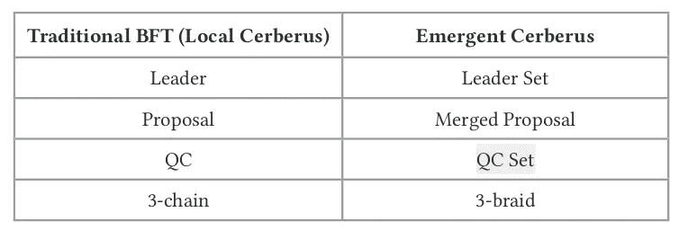

# 地狱犬——未来定义的共识

> 原文：<https://medium.com/coinmonks/cerberus-the-consensus-for-future-defi-e5822f70cd86?source=collection_archive---------3----------------------->

## 在这篇文章中，我们将讨论由 DLT 创建的一个新的挖掘协议共识。

Credit:canva.com

采矿的共识协议什么都不是，但是参与每个区块开采的所有参与者都签署了数字协议。共识协议定义了区块链的安全性，它不仅保护参与者，还保护整个系统免受[51%攻击、双花费攻击](/coinmonks/anatomy-of-a-51-double-spend-attack-b5ac9080fe80)、 [DOS(拒绝服务)攻击](https://www.paloaltonetworks.com/cyberpedia/what-is-a-denial-of-service-attack-dos)和[远程攻击](https://blog.ethereum.org/2014/05/15/long-range-attacks-the-serious-problem-with-adaptive-proof-of-work/)。

现有的挖掘共识协议有许多类型，但没有一个是针对不断增长的 [DeFi](https://blog.coincodecap.com/the-ultimate-guide-to-defi-decentralized-finance) (分散金融)市场而创建的，因此我们需要完全致力于 DeFi 需求的特殊类型的共识。因此，在本文中，我们将讨论 Radix 的 Cerberus 共识协议，它完全致力于 Defi。

# 地狱犬共识协议:

简而言之，Cerberus 是 Radix 的关键技术，它为系统提供了无限的[可扩展性](https://en.wikipedia.org/wiki/Scalability)，可以处理无限数量的并行碎片。Cerberus 将所有碎片视为“本地 Cerberus”，并且多个本地 Cerberus 可以彼此并行组合以形成“紧急 Cerberus”，其中每个碎片像传统的 [BFT](https://academy.binance.com/blockchain/byzantine-fault-tolerance-explained) (拜占庭容错)一样彼此通信，例如，当执行一个事务时，该事务散列被发送到并行本地 Cerberus 中的其他块，这在各个方面提供了最大的安全性。

Radix 在 Cerberus 中增加了一个应用层，可以更好地指定命令之间的依赖关系。当一个基数节点与基数区块链、Cerberus 和一个称为“基数引擎”的应用层结合时，当多个基数节点结合时称为“基数宇宙”，当一个基数宇宙进行一个事务时，它称为“原子”，其中原子中的所有数据称为“粒子”。

每个事务都有三个步骤首先建议、验证和阻止传播或在 Cerberus 协议的区块链中注册，当来自节点的客户端命令请求时，该节点被选为事务的领导者或建议者，其他节点进入该事务以验证/无效该事务，然后阻止传播。

如果你可以看到，那么你可以发现 Cerberus 组合多个基数节点来验证单个事务，这意味着一个事务变得更加安全和合法，原子中的粒子根据原子得到验证或无效。

Cerberus 协议自动选择事务中涉及的所有节点，Cerberus 旨在防止 Sybil 攻击、DOS(拒绝服务)攻击等。

# Cerberus 的优势:

由于 Cerberus 可以并行处理多个交易，因此它在交易、安全性和速度方面为您的 Defi 应用程序和服务提供了无限的[可扩展性](https://en.wikipedia.org/wiki/Scalability)。

Cerberus 提供了一个应用层，您可以在其中利用 Radix 的所有功能来构建和运行您的 Defi 应用程序。

Cerberus 解决了[状态机复制](https://en.wikipedia.org/wiki/State_machine_replication) (SMR)的问题，并且借助 Radix 引擎，Cerberus 协议允许您为您的 Defi 应用程序和服务应用智能合约的替代方案。

你可以阅读这些[文件](https://www.radixdlt.com/wp-content/uploads/2020/03/Cerberus-Whitepaper-v1.0.pdf)，从技术角度详细了解地狱犬协议。

# 结论:

是的，我知道在区块链世界有很多种共识，但要运行 Defi[Dapp](https://blog.coincodecap.com/what-are-dapps-an-ultimate-guide)和服务，我们需要一个特别专注的共识，因为在 Defi 中，我们需要关注的要点是交易，因为当交易数量增加时，Defi Dapp 和服务也会增加，这里 Cerberus 共识协议非常有用，它将在速度、安全性和分散化方面提供可扩展性，它为您的 Dapp 提供应用层，为您的 Defi 项目提供智能合同替代方案。

> 作者详细信息:
> 
> 姓名-吉坦德拉·奈克
> 
> 电子邮件-Jitencrackit2@gmail.com

## 另外，阅读

*   最好的[密码交易机器人](/coinmonks/crypto-trading-bot-c2ffce8acb2a)
*   [密码本交易平台](/coinmonks/top-10-crypto-copy-trading-platforms-for-beginners-d0c37c7d698c)
*   最好的[加密税务软件](/coinmonks/best-crypto-tax-tool-for-my-money-72d4b430816b)
*   [最佳加密交易平台](/coinmonks/the-best-crypto-trading-platforms-in-2020-the-definitive-guide-updated-c72f8b874555)
*   最佳[密码借贷平台](/coinmonks/top-5-crypto-lending-platforms-in-2020-that-you-need-to-know-a1b675cec3fa)
*   [最佳区块链分析工具](https://bitquery.io/blog/best-blockchain-analysis-tools-and-software)
*   [加密套利](/coinmonks/crypto-arbitrage-guide-how-to-make-money-as-a-beginner-62bfe5c868f6)指南:新手如何赚钱
*   最佳[加密制图工具](/coinmonks/what-are-the-best-charting-platforms-for-cryptocurrency-trading-85aade584d80)
*   [莱杰 vs 特雷佐](/coinmonks/ledger-vs-trezor-best-hardware-wallet-to-secure-cryptocurrency-22c7a3fd391e)
*   了解比特币的[最佳书籍有哪些？](/coinmonks/what-are-the-best-books-to-learn-bitcoin-409aeb9aff4b)
*   [3 商业评论](/coinmonks/3commas-review-an-excellent-crypto-trading-bot-2020-1313a58bec92)
*   [AAX 交易所评论](/coinmonks/aax-exchange-review-2021-67c5ea09330c) |推荐代码、交易费用、利弊
*   [Deribit 审查](/coinmonks/deribit-review-options-fees-apis-and-testnet-2ca16c4bbdb2) |选项、费用、API 和 Testnet
*   FTX 密码交易所评论
*   [n 零审核](/coinmonks/ngrave-zero-review-c465cf8307fc)
*   [Bybit 交换审查](/coinmonks/bybit-exchange-review-dbd570019b71)
*   [3Commas vs Cryptohopper](/coinmonks/cryptohopper-vs-3commas-vs-shrimpy-a2c16095b8fe)
*   最好的比特币[硬件钱包](/coinmonks/the-best-cryptocurrency-hardware-wallets-of-2020-e28b1c124069?source=friends_link&sk=324dd9ff8556ab578d71e7ad7658ad7c)
*   最佳 [monero 钱包](https://blog.coincodecap.com/best-monero-wallets)
*   [莱杰 nano s vs x](https://blog.coincodecap.com/ledger-nano-s-vs-x)
*   [bits gap vs 3 commas vs quad ency](https://blog.coincodecap.com/bitsgap-3commas-quadency)
*   [莱杰纳米 S vs 特雷佐 one vs 特雷佐 T vs 莱杰纳米 X](https://blog.coincodecap.com/ledger-nano-s-vs-trezor-one-ledger-nano-x-trezor-t)
*   [block fi vs Celsius](/coinmonks/blockfi-vs-celsius-vs-hodlnaut-8a1cc8c26630)vs Hodlnaut
*   [Bitsgap 评论](/coinmonks/bitsgap-review-a-crypto-trading-bot-that-makes-easy-money-a5d88a336df2)——一个轻松赚钱的加密交易机器人
*   [Quadency Review](/coinmonks/quadency-review-a-crypto-trading-automation-platform-3068eaa374e1) -专为专业人士打造的加密交易机器人
*   [PrimeXBT 审查](/coinmonks/primexbt-review-88e0815be858) |杠杆交易、费用和交易
*   [埃利帕尔泰坦评论](/coinmonks/ellipal-titan-review-85e9071dd029)
*   [SecuX Stone 评论](https://blog.coincodecap.com/secux-stone-hardware-wallet-review)
*   [BlockFi 评论](/coinmonks/blockfi-review-53096053c097) |赚取高达 8.6%的加密利息