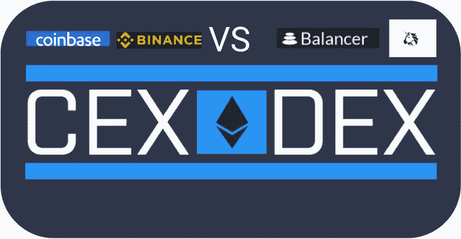
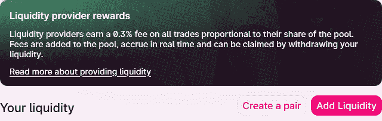
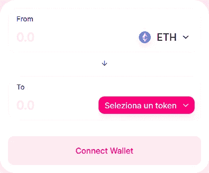
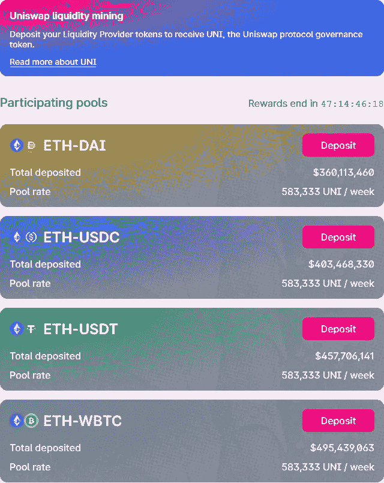

# CEX vs 德克斯:Uniswap 如何运作？

> 原文：<https://medium.com/coinmonks/cex-vs-dex-how-does-uniswap-work-8ff2ef89e558?source=collection_archive---------0----------------------->

## 让我们通过深入研究 Uniswap 和 AMMs 来找出集中式和分散式交换的区别

在过去的一段时间里，DeFi 的世界真的爆炸了，每天都有许多创新项目出现，大量的资金被封锁在这些平台内，打破了 100 亿美元的墙。这类金融服务的需求显著增加，即使大部分平台都有不容小觑的临界点。

几个月来一直在争夺 **DeFi 平台排名第一的最有趣的协议之一当然是** [**Uniswap**](https://uniswap.org/) **，**这要归功于 [**治理令牌**](/coinmonks/here-is-uni-the-uniswap-dex-token-bf5908cb7c71) **的发布，再次成为专业人士最关注的项目之一**。然而，人们并不完全了解它的运作，因为作为一个分散的交易所，总是不知道谁提供流动性，特别是习惯于使用集中服务的用户。

为了充分理解这个项目，我们尝试深入细节，并**将其与集中式方案**进行比较，以了解这两种方法的优缺点。从 Uniswap 网站上，你可以看到 4 个主要部分，每个部分都是生态系统运行的基础，它们是:
**- Pool、
- Swap、
- UNI、
-Vote。**

## 资金池:提供流动性以换取费用

在集中交易中，流动性由平台直接提供，该平台持有各方面涉及的资金和货币。这种类型的方法为 CEX 提供了一个很大的优势，因为它直接赚取用户支付的费用，并且交易几乎是即时的(即使你必须切换到区块链才能将它们转移到个人钱包)。在 Uniswap(但一般在 dex 中)**中，流动性由用户自己提供，他们向特定池提供代币，作为交换，接收所有交换代币者支付的费用**。事实上，流动性提供者从所有交易中赚取 0.3%的佣金，与他们在资金池中的份额成比例。费用被添加到池中，实时累积，并可以通过提取现金来申请。

## 交换:通过付费来交换代币

在 **CEXs 中，用户直接与平台“对话”并购买他感兴趣的令牌**，而在 DEX 中，情况略有不同。对代币感兴趣的用户(假设是 ERC20)需要用另一个代币或硬币进行交换，因此**交换**。一般来说，使用 Uniswap，**的例子，用户必须有以太坊来交易**，例如，与复合，曲线和许多其他。通过这样做，用户**直接向他交换令牌的资金池支付 0.3%的费用，然后这笔费用将在所有流动性提供者之间分配。**

## UNI:如何获得治理令牌

在此部分，用户有机会通过流动性挖掘获得 **DEX Uniswap 治理令牌。**事实上，我们发现了一系列流动性池，用户可以向其中添加流动性，并以此作为交换(除了 0.3%的交换费)获得平台令牌。可添加流动性的池有: **ETH-DAI** (马克尔道稳定币盯住美元价值) **ETH-USDC** (稳定币美元币) **ETH-USDT** (稳定币系绳)**ETH-WBTC**(wrapped bit Coin，即 ERC20 代币形式的比特币)。每个池的 UNI 排放池费率目前约为 583，333 UNI /周。

## 投票:成为治理的积极成员

这显然是 DEX 与 CEX 最大的不同之处:**治理，因此大多数公共方面的决策活动都掌握在用户和持有者手中，他们通过投票表达自己的意见**。目前，还没有提出重大投票，但越来越多的治理令牌正在 DeFi 世界中找到自己的位置。显然，与 DEX 不同，在集中式交换中，选择权落在开发团队和平台所有者身上，他们垄断了决策权，并做出自己的决定。

你对 Uniswap 有什么看法？你更喜欢 CEX 还是德克斯？

关注我在加密和区块链领域的其他文章！

## 另外，阅读

*   最好的[密码交易机器人](/coinmonks/crypto-trading-bot-c2ffce8acb2a)
*   [密码本交易平台](/coinmonks/top-10-crypto-copy-trading-platforms-for-beginners-d0c37c7d698c)
*   最好的[加密税务软件](/coinmonks/best-crypto-tax-tool-for-my-money-72d4b430816b)
*   [最佳加密交易平台](/coinmonks/the-best-crypto-trading-platforms-in-2020-the-definitive-guide-updated-c72f8b874555)
*   最佳[加密贷款平台](/coinmonks/top-5-crypto-lending-platforms-in-2020-that-you-need-to-know-a1b675cec3fa)
*   [最佳区块链分析工具](https://bitquery.io/blog/best-blockchain-analysis-tools-and-software)
*   [加密套利](/coinmonks/crypto-arbitrage-guide-how-to-make-money-as-a-beginner-62bfe5c868f6)指南:新手如何赚钱
*   最佳[加密制图工具](/coinmonks/what-are-the-best-charting-platforms-for-cryptocurrency-trading-85aade584d80)
*   [莱杰 vs 特雷佐](/coinmonks/ledger-vs-trezor-best-hardware-wallet-to-secure-cryptocurrency-22c7a3fd391e)
*   了解比特币的[最佳书籍有哪些？](/coinmonks/what-are-the-best-books-to-learn-bitcoin-409aeb9aff4b)
*   [3 商业评论](/coinmonks/3commas-review-an-excellent-crypto-trading-bot-2020-1313a58bec92)
*   [AAX 交易所评论](/coinmonks/aax-exchange-review-2021-67c5ea09330c) |推荐代码、交易费用、利弊
*   [Deribit 审查](/coinmonks/deribit-review-options-fees-apis-and-testnet-2ca16c4bbdb2) |选项、费用、API 和 Testnet
*   [FTX 密码交易所评论](/coinmonks/ftx-crypto-exchange-review-53664ac1198f)
*   [n 零审核](/coinmonks/ngrave-zero-review-c465cf8307fc)
*   [比特交换评论](/coinmonks/bybit-exchange-review-dbd570019b71)
*   [3Commas vs Cryptohopper](/coinmonks/cryptohopper-vs-3commas-vs-shrimpy-a2c16095b8fe)
*   最好的比特币[硬件钱包](/coinmonks/the-best-cryptocurrency-hardware-wallets-of-2020-e28b1c124069?source=friends_link&sk=324dd9ff8556ab578d71e7ad7658ad7c)
*   最佳 [monero 钱包](https://blog.coincodecap.com/best-monero-wallets)
*   [莱杰纳米 s vs x](https://blog.coincodecap.com/ledger-nano-s-vs-x)
*   [bits gap vs 3 commas vs quad ency](https://blog.coincodecap.com/bitsgap-3commas-quadency)
*   [莱杰纳米 S vs 特雷佐 one vs 特雷佐 T vs 莱杰纳米 X](https://blog.coincodecap.com/ledger-nano-s-vs-trezor-one-ledger-nano-x-trezor-t)
*   [block fi vs Celsius](/coinmonks/blockfi-vs-celsius-vs-hodlnaut-8a1cc8c26630)vs Hodlnaut
*   Bitsgap 评论——一个轻松赚钱的加密交易机器人
*   为专业人士设计的加密交易机器人
*   [PrimeXBT 审查](/coinmonks/primexbt-review-88e0815be858) |杠杆交易、费用和交易
*   [埃利帕尔泰坦评论](/coinmonks/ellipal-titan-review-85e9071dd029)
*   [SecuX Stone 点评](https://blog.coincodecap.com/secux-stone-hardware-wallet-review)
*   [BlockFi 评论](/coinmonks/blockfi-review-53096053c097) |从您的密码中赚取高达 8.6%的利息