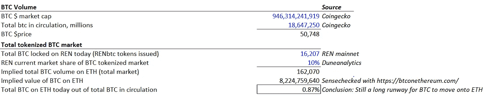
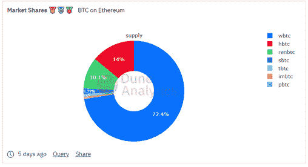
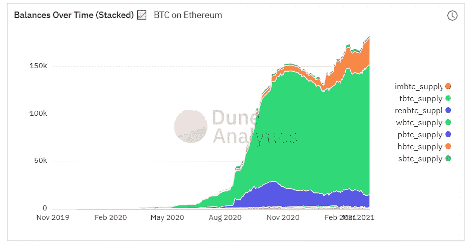
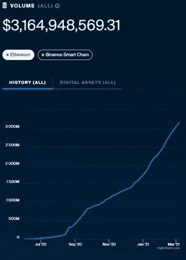
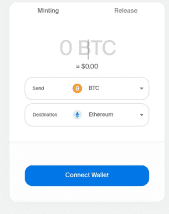

# REN 分析—第 1 部分—定性

> 原文：<https://medium.com/coinmonks/ch-3-ren-pt-1-qualitative-d742c6c9947f?source=collection_archive---------3----------------------->

“跟着钱走”。这是黄金法则。在加密领域，它会带你到比特币，那里有大约 1 万亿美元的停放价值。我开始问这个问题，“那条路通向哪里？”

任进入。

在这篇文章中，我将详细介绍我对任及其市场的定性观点。我把定量方面的部分留给 2。

虽然在我们投资之前，了解事物如何工作的技术细节很重要，但这不是本文的重点。本帖侧重投资角度。已经有很多关于任如何工作的细节了。

# 介绍和市场

## 【任】什么是任？什么是符号化的 BTC 市场？

如第二章所述，我认为成为特定领域的专家是解决投资问题的好方法。任是一个桥梁，使资产转移之间分离的区块链。这些“桥梁”使得独立的区块链能够兼容，换句话说就是互操作性。因此，这将 REN 牢牢地放在了 crypto 的互操作性类别中。当您使用 REN 服务时，您正在将一个区块链本地的令牌移动到一个单独的区块链上。你付给任一小笔费用。

目前，它的主要创收活动是促进比特币转移到以太坊。这是 REN 目前的主要市场，但它的市场正在增长，因为 REN 将自己定位为一个更普遍的互操作性解决方案，而不仅仅是比特币-以太坊的桥梁。其他市场包括
比特币-其他以太坊竞争对手、虚拟货币-以太坊等等。

它是如何工作的？首先，你把你的比特币发送给 REN，REN 会把它安全地锁在分散的网络中。有一个由世界各地的人组成的网络，名为“黑暗节点”(Darknodes)，每个人都有一段保护比特币的密码。作为对他们服务的回报，黑暗节点分享 REN 网络赚取的现金费用。为你锁定比特币后，网络会直接向你的钱包发放一个“RENBTC”令牌。1 RENBTC 的价值等同于 1 比特币，不同的是你的 RENBTC 现在可以在以太坊上使用。大概就是这样。这个过程被称为“令牌化”或“包装”比特币。

那么，为什么你真的想把比特币换成人民币比特币，并在其他区块链上使用人民币比特币呢？答案是因为 1)比特币的区块链在设计上非常初级，除了购买和出售比特币之外没有其他功能 2)你希望更有创意地将你的比特币价值应用到其他区块链的数字经济中，3)你希望在这样做的同时保持对比特币价格的敞口。

比方说，我想借入、借出或交易密码——为什么我需要涉及比特币？你绝对不需要，真的。但有很多人确实希望将比特币作为他们的主要交易货币。由于波动性/流动性/不熟悉性，这些人或机构可能会对其他加密资产感到不安，或者他们可能明确希望保持对比特币价格波动的敞口。也许他们的董事会只是暂时同意公司拥有比特币。因此，为了让他们的比特币产生效益，他们会将它转移到以太坊，在那里他们可以赚取利息，以它为抵押借款，或做更多创造性的事情——为此，他们会使用像任这样的服务。

我们将把这个将比特币转移到其他区块链的市场称为“令牌化的 BTC 市场”。

## **为什么要关注这个市场？**

我的论点是，从长远来看，比特币的大部分价值最终将转移到其他区块链。如果我是对的，象征化的 BTC 市场将极具价值。

我的论文基于这样一种观点，即比特币持有者最终会希望与新的数字经济进行交易。就这么简单。如果你不打算用现金，那你有现金有什么意义呢？或者换句话说，这些钱还会去哪里？

随着更广泛的加密市场的采用，比特币价值流入存在于其他区块链的 DeFi 应该会随着时间的推移而发生。这不会是一夜之间的繁荣，至少我不这么认为。当然，可以通过更明确的监管、教育/熟悉以及保险等关键基础设施的发展来加速这一过程。

一切加密广告巨大的市场规模，这是有意义的，因为首要目标是重建一切，因为我们知道它到区块链。尽管我经常戴着怀疑的眼镜，但对于令牌化的 BTC 市场，这里的笑点是，目前只有不到 1%的比特币在其他区块链应用。剩下的 99%没有别的地方可去。因此，这个市场有一条巨大但也是*不可避免的*跑道:

Only 1% of BTC is on Ethereum. I use Ethereum because bitcoin’s application on other chains is almost negligible. Source: me.

## **谁在令牌化的 BTC 市场竞争？**

竞争对手之间的差异是 1)他们用来“标记”BTC 的机制 2)用户体验 3)无处不在。最终，竞争对手都展示了相同的效用——他们采用 BTC，并将其应用于其他地方。这意味着市场竞争激烈。你可以在这里阅读更多关于竞争对手之间的技术差异[，但在这篇文章中，我将简短地讲述一些重要的事情:](https://thedefiant.substack.com/p/it-was-almost-impossible-to-keep-26b)

1.  **REN**——使用分散的网络来保持比特币在网络上的安全，同时为 1 个比特币向用户发放 1 个 RENBTC(如上所述)。构成网络的暗节点必须向财政部存入 100，000 REN，作为良好行为的承诺。如果任何暗节点自己试图从网络中窃取比特币，网络将没收这笔存款，并将其用于重新平衡被盗的价值。将存款机制视为创建网络安全的一种方式。它的工作原理与您的房租押金相同，如果您毁坏租用的公寓，押金将被没收。
2.  WBTC——一个由任正非和其他人合作建造的项目。这是象征性的 BTC 市场的第一步。该机制与 REN 的不同之处在于，它使用一个集中的托管人来保护比特币的安全，而不是一个分散的网络。WBTC 主要由机构使用，需要 KYC/AML，因此与 REN 相比，在用户体验方面存在一定困难。
3.  霍比比特币——就像 WBTC 一样管用
4.  SBTC——synthetic IX-BTC 或 SBTC 允许用户购买“合成”比特币。这是一种金融衍生产品，或者基本上是一种跟踪比特币价格的令牌。这不会有助于增加如今已经拥有的比特币的互操作性。我希望这种差异是明显的。如果有人今天有比特币，要使用 SBTC，他/她需要 1)卖出比特币，然后 2)用这笔钱购买 SBTC。这是两项独立的交易，并不能解决现有比特币的价值应用问题。SBTC 不能使用 SBTC 来“标记”某人的比特币，以使其具有互操作性。这是一个技术性但实质性的差异，因为 SBTC 的产品与任正非的产品略有不同。当然有用，但不同。
5.  Tbtc —工作方式类似于 REN，但存在一些技术差异，在我看来，这使得它稍微不太实用。它的工作方式类似于 REN，但使用 Ethereum 作为存款(而 REN 使用 REN)，并特别关注将 BTC 转移到 ETH(最后一次检查)。
6.  thor chain——非常有趣的项目。THORchain 允许您交换居住在不同区块链的资产。因此，如果您愿意，您可以无缝地将比特币兑换成以太网，而如果您想使用 REN 实现这一点，您需要首先将比特币转换成 RENBTC，然后将 RENBTC 兑换成以太网。然而，这是一个与我们谈论的 REN 不同的用例。REN 解决的用例是在其他交易所使用比特币的应用价值，同时仍然暴露于比特币的价格。我们并不是想把我们的比特币换成以太网，只是想让*在*以太网上使用它。两件不同的事情。我不认为它会侵蚀任正非的市场份额。在这里阅读更多关于 THORchain [的内容。](/letters-from-the-savannah/understanding-thorchain-rune-cf8d582fe8cd)

见下文，WBTC 目前在以太坊上拥有最多的令牌化比特币市场份额。它是第一个行动者，所以这是有道理的。然而，请记住，WBTC 已经被重新设计，包括任，**因此，铸造的 WBTC 基本上是任的利润和市场份额的一部分**，至少在未来。HBTC 最近已经取得了一些份额，但这是一个集中的解决方案，不可直接投资。因此，任是市场领导者，是目前唯一真正的竞争对手，市场份额约为 15%。

请记住，下面这些图片只是某个时间点的快照。ETH 上突出的标记化 BTC 每天都在波动。下图显示，显著的令牌化 BTC 增长已经停止，但这并不意味着该服务的使用率正在下降或未来将会下降。这可能意味着令牌化的 BTC 最近被赎回的次数更多，可能是由于 ETH 气费或其他市场条件。

第三张图是关于任的成交量最好的视图，取自 mainnet。

Market share of BTC on ETH; source [*https://duneanalytics.com/eliasimos/btc-on-ethereum_1*](https://duneanalytics.com/eliasimos/btc-on-ethereum_1)

BTC on ETH outstanding over time; source [*https://duneanalytics.com/eliasimos/btc-on-ethereum_1*](https://duneanalytics.com/eliasimos/btc-on-ethereum_1)

RENBTC **volume** has continued to grow; source: [https://mainnet.renproject.io/](https://mainnet.renproject.io/)

# **我的投资框架和论文**

## **1。由于未来的增长和自然寡头垄断，该市场极具吸引力**

**成长**

如上图所示，流通中的比特币只有 1%进入了 DeFi。令牌化的 BTC 市场是比特币在 DeFi 中应用的第一个价值创造点。它可以被认为是你需要使用的收费公路。

**这个市场可能会变成一个自然的寡头垄断市场**

好极了。你已经将你的比特币令牌化，并准备在以太坊中使用它来赚取利息和所有那些很酷的东西。现在，如果您想要使用的 DeFi 平台不支持您的令牌化 BTC，该怎么办？这是一个问题。

REN 通过与生态系统中的其他项目建立强大的合作伙伴关系来推动 RENBTC 的兼容性和支持，从而提前解决了这个问题。鉴于起点，复制这种无处不在的竞争对手可能很难，我个人认为，随着时间的推移，这将导致自然的寡头垄断。上述市场份额数据似乎也表明了这一点。

举例来说，如果你创建了自己版本的令牌化 BTC，并想与任竞争，你需要说服其他大型 DeFi 项目，如 Curve，在他们的平台上开设一个新的流动性池，以支持你的令牌。然而，你需要提出充分采用你的令牌作为 Curve 的动机。一个循环问题！曲线人有更好的事情要做。另外，就 Curve 而言，RENBTC 的兼容性足以欢迎比特币持有者，那么他们为什么需要提供所有的令牌化比特币选项呢？正如我们在 DeFi 中所知，流动性建立在流动性的基础上，如果当前竞争对手的网络效应足够强大，竞争对手就很难进入。

**自然寡头中的规模优势**

有一种风险是，新的竞争对手可能会收取更低的费用，与任竞争。然而，任的网络可能只是调整他们的费用较低，以削弱新网络的增长，在短期内保持其市场份额。这就好比优步将其他竞争对手拒之门外，这些竞争对手无法比优步更长久地依靠更低的费用生存。

## **2。任将保持稳固的市场地位**

任团队绝对是“跟钱走”。它同时扮演进攻和防御的角色，将网络定位为比特币和任何其他最终可能看到比特币价值流动的区块链之间的网关。它通过迅速与其他网络建立伙伴关系来实现这一点。在 IP 开源的加密世界里，你的策略必须是合理的。我在下面展示了他们的剧本，这样我就不用多说了，它就能独树一帜了。

1.  任的团队首先专注于启动项目，成为先行者。他们创造了 WBTC，尽管它不是一个完美的解决方案，因为它有 KYC 的要求，并且是集中的，至少他们现在已经经历了，并且垄断了市场。
2.  然后，他们建立了 REN，作为一个分散的解决方案独立工作，并专注于将比特币令牌化到以太坊上。他们选择以太坊是因为它是新数字经济的第一故乡，也是最有可能出现比特币价值流的地方。
3.  接下来，他们重新发明了最初项目的运作方式，让任在铸造代币的过程中扮演一个角色。你可以说这类似于苹果把它的应用商店放在三星上。
4.  任开始盘算比特币可以提前泄露到非以太坊的道上，开始打防御战。随着索拉纳成为以太坊的潜在对手，他们在索拉纳的网络上获得了合作关系。雪崩也在里面，还有更多。
5.  由于以太坊的网络费用出现问题，智能链的兴起成为一种替代方案，任很快在比特币和智能链之间架起了一座桥梁。
6.  展望未来。通过与阿卡拉的合作，任已经为波尔卡多特迈出了第一步，阿卡拉是波尔卡多特有抱负的 DeFi 冠军。
7.  任认为 Filecoin 是未来的数字存储解决方案，并创造了 FIL-ETH 解决方案

…&更多。这些人显然在上面。

在大战略之外，任专注于用户体验。这是一个更柔和但重要的观点。任知道，crypto 还没有达到应有的直观性，如果没有 IP 差异化+零售采用，用户体验很重要。因此，它专注于让用户体验尽可能简单，并将其艰苦的工作隐藏在后端。了解使用其面向用户的主要产品有多简单:

REN Interface; Source: [https://bridge.renproject.io/mint](https://bridge.renproject.io/mint)

在 B2B 合作伙伴关系中，如与 Acala 的合作和 WBTC 的重新布线，任被编程到后端，因此用户甚至不必处理面向用户的平台以外的额外步骤。

鉴于这是定性问题的关键，我们就到此为止吧。总有更多的工作要做，以便在一个主题上变得更聪明，但这需要时间机会成本的权衡。我认为我们已经覆盖了足够多的内容，知道将来要监控什么。在下一部分中，我们将把所有这些转换成数字，以弄清楚它的含义——我们应该投资还是通过？

在推特上打招呼讨论；[@ the _ 桃树](https://twitter.com/the_peach_tree)

