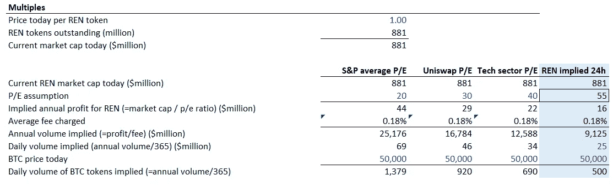
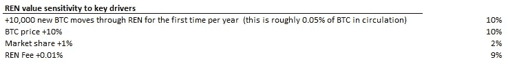
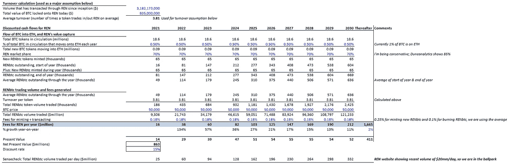

# REN 分析—第 2 部分—定量

> 原文：<https://medium.com/coinmonks/ch-3-ren-pt-2-quantitative-23868751647d?source=collection_archive---------4----------------------->

## 业务驱动因素

到数字上！

让我们把任如何产生利润分解成**利润=价格*数量**

## **1)价格**

价格=任收取的费用

任对每笔交易收取你想代币的总金额 0.1%-0.25%的费用。这是我直接从[网站](https://mainnet.renproject.io/)上下载的。这些费用很大程度上是稳定的，但会随着网络需求上下浮动。网络如何改变它的收费价格？网络可以集体投票决定价格变化。他们为什么要这么做？来驱动网络中的流量。例如，如果他们降低费用，在网络上移动比特币会更便宜，所以这应该会增加流量。价格可能变化的另一个原因也是为了保护网络的安全(我在下面的奖金部分解释了这一点，因为我们现在可以把它放在一边)。

等式的“价格”一边很简单，因为它是现成的。等式中更难的部分是理解和预测“体积”。

**2。体积**

交易量=通过任网络转移的*美元*总额。如果今天有 2 个比特币通过任的网络交易，每个 5 万美元，那么总“量”就是 10 万美元。

请注意，“数量”驱动因素是 1) BTC 的价格 2)在网络中流通的 BTC 代币的数量。举例来说，想象一下如果比特币的价格从 5 万美元涨到 10 万美元。假设我们保持进出 REN 网络的比特币数量不变，在上面的例子中是 2，REN 的交易量已经上升到 200，000 美元，由于更多的美元通过网络流动，利润实际上也在上升。利润也会增加，因为如果我们将进出的令牌数量增加到 4 个，而价格保持不变，为 50，000 美元，那么“数量”也会增加。那么，是什么驱动了令牌的进出活动呢？1)新比特币迁移到 DeFi 2)当前比特币已经在 DeFi 上来回移动(一般波动性)。

我有时认为这类似于投资一家自然资源公司，比如一家金矿公司。如果他们开采更多的黄金，等式中的“数量”部分就会上升，利润就会增加。如果黄金价格上涨，利润也会上涨。

**因此，鉴于其目前的市场定位，押注任实际上是部分押注比特币价格。如果比特币价格暴跌，收取的费用可能会降低，反之亦然。随着 REN 从令牌化比特币市场之外的其他市场获得更多流量，这种情况将会改变。**

# 重视网络:

所以让我们把这一切放在一起，对网络进行估值，看看押注于它是否有意义。这很令人兴奋，因为我们可以把像区块链收费公路这样不透明的东西用我们上面提出的逻辑分解掉；不需要任何花哨！

让我们看看如何使用 1)基于倍数的方法 2)暗节点和收益方法 3)贴现现金流方法。我们对每项投资采用的方法将取决于每种情况以及我们认为有意义的方式。我完全支持效率，所以只有当我认为这有助于我获胜时，我才会以这种方式变得像个科学书呆子。

1.  **倍数-接近:**

我想你应该熟悉[的估值倍数](https://corporatefinanceinstitute.com/resources/knowledge/valuation/multiples-analysis/)。我们希望将 REN 与其他资产进行比较，让我们知道 REN 是“便宜”还是“昂贵”，这样我们就知道投资 REN 和其他资产相比是否有意义。

正如你已经知道的，我是一个上下文的超级粉丝，在 crypto 中，三角测量或建立尽可能多的上下文是非常重要的，以避免迷失在过度炒作或过度捏造的价格中。

**我们的公式将是:市盈率=网络价值/网络利润。**

这和股票狂人使用的“市盈率”是一样的。'网络价值'很容易，这就是市值。“网络利润”是我们需要做出预测的地方。在*利润=价格*数量*公式中，我们已经知道公式中的“价格”部分，即任收取并公布的费用。我们真正关心的是体积这个更难的部分。我要做的是通过在公式中插入一些逻辑市盈率来逆向工作，并求解任需要达到什么量才是“合理的”。这比我们凭空想出自己的销量预测要好，而且可以作为三角测量的一个点。

什么是合适的市盈率？我不知道。没人知道。但是标准普尔的历史市盈率大约是 20 倍(作为一个大市场的参考)，科技股在繁荣时期通常是 30-40 倍(作为行业的参考)，而 Uniswap 是 30 倍(作为一个顶级 DeFi 硬币的参考)。这些是讨论的起点。顺便提一下，我确实认为该业务的一部分非常类似于实物商品的开采，尽管这很有趣，但我们不能对商品矿商使用 10 倍的低市盈率范围，因为实物采矿需要大量资本投入，因此在这里实际上无法与任(软件)相比。

我在下面展示了 REN 需要达到的交易量水平，以证明每股收益的合理性。然后，我在 REN 的网站上查看了实际交易量，并了解到他们最近平均每天的交易量为 2500 万美元。我把这个输入到蓝列，解方程的其余部分，给你们看隐含的倍数是多少。

**结论**:任每天的交易量约为 2500 万美元，因此市场定价约为 55 倍市盈率。它需要 3400 万美元才能达到 40 倍的市盈率。现在，它比一般的科技股和 Uniswap 还要“贵”，这公平吗？这归结于我们是否认为该业务从长远来看会有超额利润。我认为有一个强有力的论点是，它们的估值应该高于传统科技行业，因为任看到的是指数增长，而一家强大的传统科技公司的收入增长可能达到 20%至 40%。如果你看看今天的股票市场，你会看到一些软件公司的股价是 80-100 倍。无论如何，我并不建议用这些倍数作为适当的比较，但在这种情况下，当只有 1%的市场被渗透时，REN 的 55 倍真的是这样吗？帮我报名。和 Uniswap 相比呢？当然，它们是不同的业务，在这个问题上还有很多争论，但我认为*不可避免的*比特币转 DeFi 的趋势使 REN 在未来成为一个更稳定的业务，并有一条清晰的抛物线增长之路。看看 Sushiswap 对 Uniswap 造成了什么样的损害，只要简单地复制它就可以了，因为 REN 是很难复制的。反正我跑题了。你得到了要点，这就是如何建立定量的背景。

2) **暗节点&收益收益率方法:**

提醒:暗节点是一个很酷的名字，用来称呼那些有权从人人网赚取现金费用的人。真金白银。要成为黑暗节点，1)你必须拥有 100，000 EN 2，你必须拥有一台能够执行加入网络任务的计算机。可能是你！

另一种评估任价值的方式是考虑你会为运营一个黑暗节点支付多少钱。这与考虑股票的收益是一样的，但我来到这里是出于对现实世界机制的逻辑思考:

REN 网络的用户数量增加=从费用中产生收入=更多的人想要成为暗节点以赚取这些费用=人们需要购买 REN 以有权运行暗节点=给定 10，000 个可能的暗节点的最大数量，REN 令牌的价值随着人们竞相购买 REN 令牌而升值。

要运行一个暗节点，你必须拥有 100，000 REN。假设只有 1，000，000，000 个 REN 在流通，那么只有 10，000 个暗节点参与 REN 网络。这是故意的。

想象一个世界，REN 是一个成熟的网络，并且有最大量的暗节点在运行(10，000)。你碰巧有一个，每年黑节点付给你 10，000 美元的费用。任的总市值恰好是 10 亿美元。所以每个暗节点的价值= 10 亿美元/ 1 万= 10 万美元。由于你在价值 100，000 美元的资产上赚了 10，000 美元，该资产的年收益率为 10%。有人走过来，将你赚的 10%与他或她在股市赚的 5%或他们在纽约昂贵的出租房产赚的 3%进行比较，并决定从你这里购买 Darknode。他们付给你相同的金额，以赚取他们满意的 7%的股息收益率(这比他们在其他地方获得的 5%高了一步)。他们为您的租赁令牌支付 143，000 美元，因此现在他们每年将获得 10，000 美元/143，000 毫米= 7%的年收益。现在，由于总共有 10，000 个暗节点，市场基本上将 REN network 重新定价为 14 亿美元的市值。

从根本上来说，这将推动 REN network 的长期估值——人们愿意为拥有 Darknode 支付的价格。还要注意的是，随着时间的推移，这些暗节点将主要被锁定在运行网络中，因此公开市场中的流动性将下降，价格发现将变得更加困难。

今天只有 1700 个黑节点在运行。因此，使用这种方法对网络进行估值还为时过早，因为有抱负的新黑暗节点可能不会支付高于市场价格太多的价格来拥有 100，000 个令牌。根据我对每年 1300 万美元网络费用的预测(取自下面 DCF 中的第一年)，平均除以 1700 个暗节点，我认为每个暗节点每年大约赚 7000 美元。按照今天的市场价格，购买一个暗节点等于每个代币 1.00 美元* 100，000 个代币= 100，000 美元，这是 7%的收益率。

7%的收益率从一个爆炸式增长的资产！对我有吸引力。有人给我买了一个作为生日礼物吗？没有吗？好的，我问问我女朋友。

**3)现金流量折现法:**

真的吗？加密中的 DCFs？我知道，我知道，听我说完。如果你是 DCF 的新手，去[这里](https://www.investopedia.com/terms/d/dcf.asp)看看这个概念。如果你不是 DCF 的新手，你和我一样，不太喜欢 DCF，因为它们需要太多假设，会导致完全错误的结论。但是，为了便于学习，我将这项业务进行了分解，试图非常清楚地量化每个驱动因素的影响。总结结论如下:

Source: me

我们了解到:
1)每年每有 10，000 个比特币进入 DeFi，任的市值就会上升+10%。1 万个比特币是流通比特币总量的 0.05%。10，000 个比特币是今天 DeFi 中全部比特币的 6%。这是一个巨大的闸门，如果它打开得快一点，任将一飞冲天。现在我们知道为什么几乎每周都有新的 REN 与其他网络合作，因为 REN 希望确保它是每个网络的首选网关，以获取尽可能多的比特币价值。

2)在其他条件不变的情况下，的价格敏感度可以认为是与任的 1 比 1。非比特币收入流将有助于分散这项业务的风险，鉴于它们还处于萌芽状态，我根本没有将它们纳入我的分析，所以这是我的数据之外的加分项。

3)任收取的费用很重要。这是显而易见的，但现在我们有了一种敏感性，去思考*T4 到底有多重要。我们需要监控网络，以确保没有费用紧缩。*

下面完整的现金流量表显示，使用非常保守的假设(不同意我的折现率，请随意),我们已经接近了今天的市场价值。我认为我对市场份额(最高可达 85%)、比特币流量(每年可超过 0.50%)和比特币价格持保守态度。如果你在手机上阅读这篇文章，你可以跳过这个模型，因为我在下面叙述了这个结论。

Source: me

这个模型本身只是一个帮助我理解未来可能如何发展的工具:

**不利情况:**跌至 4 万美元，任市场份额降至 50% =任市值下降-50%。所以我认为在一个糟糕的世界里，我会损失 50%的投资。

**上涨案例:**价格 12 万美元([预测](https://panteracapital.medium.com/bitcoin-rally-2017-vs-today-ba1fe9d7ac79))，REN 市场份额 85%(REN+dune analytics 今天的 WBTC 份额)，每年 1%的新比特币流入 year = REN 市值是今天价值的 5 倍。所以我认为在一个好的世界里，我可以获得 5 倍于我投资的回报。

=正面我输了-50%，反面我赢了+400%。我会一整天都赌下去！

**结论—我学到了什么**

任很神奇，[币局说是](https://www.youtube.com/watch?v=3MqWqXiRCEY)，我们现在知道基本面了。REN 的价格将与比特币的价格挂钩，直到更多的比特币流入更广泛的 DeFi 系统，他们可以从他们建立的非比特币桥梁中获得更多的交易量。毫无疑问，从我们市场分析来看，这是一个有吸引力的市场，我们也知道，战略和团队的质量使任成为比特币互操作性的主要参与者。

正如我们在上面所做的三角分析，任的定价无论如何都不算离谱。当机构开始关注时，他们将会看到一个非常不对称的风险/回报投资机会。

短期而言，在比特币价格上涨期间，当任的价格与其他替代币一起下跌时，我有时会买入任。如上所述，假设通过 REN 的代币量不变，这种情况根本没有意义。我发现任比其他替身恢复得更快，也许是因为这个原因。

**风险**

我承认在这个市场上资产的合理定价需要时间，这篇文章只是理论上的，我认为从长远来看应该如何定价。我也承认，鉴于加密领域的事情变化如此之快，未知的未知是巨大的。

**希望这些都有帮助！如果你想讨论桃树，请在推特上联系我。**

**我不是财务顾问。**

— — — — — — — — — — — — — — — — — — — — — — — — — — — — — — —

**花红心思在收费上只是为了晒晒任的情报**

如上所述，任的网络将会通过调整价格来操纵网络的流量和价值。这里有两个要点，我试图在不太专业的情况下提出来，但理解为什么价格会上下波动也很重要:

1)因为通过 REN 移动的资产是由网络“托管”的，所以网络在任何时候都需要确保网络的价值高于它托管的资产的价值，以适当地激励那些保持网络完整性的人。例如，如果我通过网络移动 1 台价值 50，000 美元的，REN 将把锁起来并保持安全，并发给我 1 台 RENBTC 供我在 DeFi 中自由使用。REN 的网络价值至少需要保持在 50，000 美元以上，因为如果它低于 50，000 美元，REN 网络中本应保护我的比特币的人实际上有动机窃取比特币并将其据为己有，因为他们自己持有的 REN 令牌价值更低。

2)如果 REN 的价值危险地接近等于或低于托管资产的价值，REN 参与者通过移动定价来“调整”网络的价值，这将使像我这样的书呆子调整我的贴现现金模型，从而相应地调整 REN 的市值。这就是事情的结局:

大量 BTC 流入网络托管=任必须确保任的市场价值大于托管资产的市场价值，否则任网络中的人可能会想要窃取资产=任网络参与者提高定价=像我这样的书呆子投资者提高他们的贴现现金流模型的定价，并看到更高的任估值和买入机会= Ibuy 更多的任=任的市场价值上升=否 REN 参与者有动机窃取托管资产，因为他们持有的 REN 比托管资产更值钱

与此同时，提高定价将暂时阻止人们将资产转移到 REN(因为这会很贵)，从而降低托管资产的数量

我之所以在上面提到，是因为如果我们看到任的定价在变动，这就是正在发生的事情