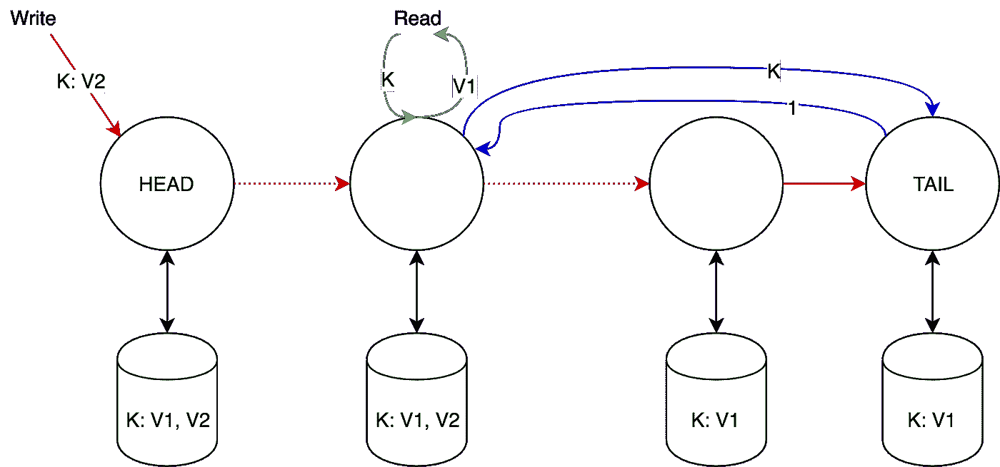

# 链式复制:如何构建有效的 KV 存储(第 1/2 部分)

> 原文：<https://medium.com/coinmonks/chain-replication-how-to-build-an-effective-kv-storage-part-1-2-b0ce10d5afc3?source=collection_archive---------1----------------------->

在这篇文章中，我将考虑一个使用链式复制的简单有效的 KV 存储系统设计。链式复制(CR)已被证明具有良好的性能，正在积极研究中。

这是这篇大文章的第一部分(这里是第二部分),组织如下:首先，我们将讨论一般方法，然后我们将考虑实现:

1.  陈述问题，并将 CR 与主要/备用方法进行比较。
2.  CR —基本方法。
3.  CR —分摊查询。
4.  FAWN:一组快速排列的弱节点。

# 1.介绍

## 1.1 问题

假设我们想要设计一个非常简单的键值存储系统。存储应具有简约的界面:

*   write(key，object):保存/更新键值。
*   read(key):返回键值。

我们还知道数据集的大小相对较小——它完全适合一台服务器(因此我们不需要考虑分片),并且我们预计会有大量的读/写查询。

我们的目标是设计这样一个存储系统，它能够处理大量的查询**(高吞吐量，HT)** ，满足**高可用性，HA** 标准，并具有**强一致性，SC** 。

许多系统为了 HA + HT 而牺牲 SC，因为满足所有这三个条件是非常复杂任务。亚马逊迪纳摩在这类系统中取得了巨大的成功，并推动了迪纳摩风格的数据库，如卡珊德拉，Riak，伏地魔等。

## 1.2 主/备份

付款交单是解决我们问题的最普遍的方式。P/B 有一个主服务器，N 个备份服务器。

上图显示了一种 P/B 方法，即主节点在向客户端发送 ACK 之前等待所有备份的 ACK。P/B 设置还有许多其他变化:

*   主节点对所有写请求进行总体排序。
*   一旦其中一个备份发送了 ACK，主备份就向客户端发送 ACK。
*   草率的法定人数和暗示的移交。
*   等等

需要一个独立、稳定的流程来监控集群状态并提供集群配置。在主节点失败的情况下，该过程发起新的选举，并且该过程决定在裂脑的情况下做什么。根据需求，这个过程可以部分地作为复制算法的一部分或者作为一个附加工具(比如 zookeeper)来实现。

很明显，P/B 方法的性能迟早会受到两个限制的约束:

*   主节点的性能。
*   备份节点的数量。

我们越快达到这些限制，就越需要“更强”的一致性和耐久性。

替代方法呢？

## 1.3 链式复制

CR 的基本组件是:具有两个特殊节点的节点序列(链)——头(接收来自客户端的请求)和尾(链的末端，提供一致性保证)。这种链至少具有以下特性:

*   容许多达 n-1 个节点的故障。
*   写性能大约是 P/B 方法的写性能。
*   对于其他节点，如果磁头出现故障，群集重新配置的速度会快得多，大约与 P/B 的时间相同

值得注意的是，链复制需要节点之间**强大而可靠的 FIFO 链接。**

让我们考虑一下 CR 的不同实现。

# 2.链式复制—基本方法

## 2.1 架构

客户端向头部发送写请求，向尾部发送读请求。回应总是来自尾部。当头部接收到请求时，它计算状态的增量，应用更改并将增量沿链向下传播。一旦 tail 收到增量，它就通过每个节点向 head 发回 ACK。如您所见，如果读取请求返回某个值 X，这意味着它已经保存在所有节点上。

## 2.2 复制协议

让我们从头开始枚举所有节点，然后在每个节点上 *i* 我们将存储以下数据:

*   *Pending(I)*—tail 已收到但尚未处理的请求列表。
*   *Sent(i)* —尚未由 tail 请求处理的列表，发送到节点的 *i* 后继节点。
*   *History(i，key)* —键的变更列表。它可以是完整的历史记录，也可以是最后一个值。

请注意:

并且:

## 2.3 应对失败

如前所述，我们需要一个特殊的主流程，它将:

*   检测故障节点。
*   通知失败节点的前趋和后继节点。
*   通知客户端故障节点是头部还是尾部。

我们假设主进程从不失败。

我们还假设我们的节点是故障停止的，这意味着:

*   服务器在其失败的情况下停止工作，即它从不发送不正确的响应。
*   这种故障总是可以被主进程检测到。

让我们考虑如何添加一个新节点:理论上，一个新节点可以被添加到链中的任何位置，然而添加到尾部似乎是最简单的方法——我们只需要将当前尾部的状态复制到新节点，并通知旧尾部它需要将请求进一步传输到新尾部。

最后，让我们考虑可能的失败:

*   脑袋失灵。
    从链中删除该节点，并指定其继任者作为新的头。只有来自 *Pending(head)* 的未进一步发送的请求才会丢失，即*Pending(head)\ Sent(head)*。
*   尾部故障。
    从链中删除该节点，并将它的前一个节点指定为新的尾部。在此之前*已发送(tail-1)*变空(标记为已由 tail 处理)，这使得*待处理(tail-1)*变小。
*   另一个节点 *k* 故障。
    主进程通知节点*k-1*和 *k + 1* 失败。可能会丢失来自*Sent(k-1)*的请求，这些请求实际上尚未到达节点 *k + 1* ，因此我们再次重新发送*Sent(k-1)*，并且仅在此之后使 *k + 1* 成为*k-1*的后继。

## 2.4 与主要/备用方法的比较

*   在 CR 中，读取请求仅由一个节点处理，并立即得到响应，而在 P/B 中，主节点从所有备份接收写入确认可能会有延迟。
*   在这两种方法中，写请求在所有节点上执行，但是，由于并行执行，P/B 的速度稍快一些。

CR 方法失败时的延迟:

*   磁头故障:读取请求仍然得到处理。存在两个消息的延迟——从主进程到关于新头节点的所有节点，以及从主进程到所有客户端。
*   尾部故障:读写请求的两个消息的延迟——通知
    tail——1 关于新的尾部以及通知所有客户端。
*   任何其他节点的故障:读取请求没有延迟。写请求可能被延迟，直到发送(is)被重新发送。

P/B 进近失败时的延误:

*   主节点故障:选择新的主节点和同步状态的消息延迟多达 5 条。
*   备份失败:读取请求没有延迟，但只有在没有写入请求的情况下。否则，最多会延迟 1 条消息。

如您所见，CR(尾部)的最严重故障比 P/B(主要)的最严重故障更快。

最初研究的作者进行了广泛的测试，并得出结论，CR 性能与 P/B 相同。

# 3.具有分配查询的链式复制— CRAQ

很明显，这种基本方法有一个弱点——尾部，它处理所有的读请求。这可能会导致以下问题:

*   尾部成为热点，即处理大多数请求的节点。
*   如果放在另一个数据中心，Tail 会降低写请求的速度。

CRAQ 提出了一个非常简单的想法:让我们允许所有节点处理读请求，除了尾部。为了保持一致性，我们将为写请求维护一个版本向量，并且我们将对尾部进行请求，以在不明确的情况下获得最新提交的版本。

## 3.1 架构

因此，除了 tail 以外的每个节点都处理读请求并将值返回给客户机。Head 在出现写请求时向客户端返回响应(与基本方法相比)。

每个非尾节点可以维护同一密钥的多个版本，并且这些版本是单调递增的。每个版本可以是“干净的”或“脏的”，在开始时所有版本都是干净的。

当节点接收到写请求时，它将接收到的版本添加到该密钥的本地版本列表中；

*   如果该节点是尾部，则它将该版本标记为干净，该版本现在被**提交**，并且尾部将 ACK 发送回头部。
*   否则—该节点将该版本标记为脏，并传递给下一个节点。

当一个节点从它的后继节点收到 ACK 时，它将该版本标记为干净的，并删除所有旧版本。

当节点收到读取请求时:

*   如果节点已知的最新版本是干净的，则将其返回。
*   否则—要求 tail 获取给定密钥的最后提交版本，并将其发送回客户端。(这样的版本会一直存在于尾部被设计)。

CRAQ 的性能随着工作负载中主要是读取请求的节点数量而线性增长。对于主要是写请求的工作负载，性能将优于或等于基本方法。

CRAQ 可以部署在多个数据中心。这为客户端提供了选择最近的节点来加速读取请求的机会。

## 3.2 CRAQ 的一致性

CRAQ 提供了很强的一致性，但有一种情况除外:当一个节点从 tail 接收到最后提交的版本时，tail 可能会在节点向客户机发送响应之前提交最新的版本。在这个场景中，CRAQ 在整个链上提供**单调读取**(后续读取请求不会过去)**。**

在这种情况下，还可以提供其他较弱的一致性来提高性能:

*   最终一致性:节点不会从尾部请求最新提交的版本。这仍将提供单调读取，但仅在一个节点上。(后续读取请求必须命中同一节点)。此外，这允许 CRAQ **容忍网络分区。**
*   有限最终一致性:只允许在某些条件下返回脏版本，比如不超过 N 次修订或 T 分钟。

## 3.3 应对失败

与基本方法相同。

## 3.4 可能的改进

CRAQ 有一个非常有趣的特性——写请求时可以通过组播发送更新。当写请求命中 head 时，head 可以向所有节点多播更改，然后沿链向下发送“修复”事件。一旦接收到固定事件，节点就等待接收多播更新。同样，tail 可以多播 ACK，并通过链将固定事件发送回 head。

# 4.FAWN:一组快速排列的弱节点

这是一个非常有趣的研究，与本文不完全相关，但是给出了一个如何使用链复制的很好的例子。

高性能 KV 存储(Dynamo、memcached、Voldemort)具有相同的特征:大量 I/O(非计算性的)需要并行访问随机密钥，数千个并发请求，数据大小相对较低，最多 1Kb。

由于寻道操作(随机存取)缓慢，带 HDD 的节点不是此类系统的好选择，另一方面，带大量 RAM 的节点消耗的功率惊人地多，2GB DRAM 相当于 1Tb HDD。

最初研究的目标是以最小的能耗构建一个高吞吐量的高效集群。三年后，50%的服务器成本是能源成本，现代节能模式并不真正有效-在进行的测试中，在 20%的系统负载下，CPU 功耗约为 50%。此外，其他组件可能根本没有节能模式，例如 DRAM，它已经在最低电压下工作。必须注意的是，在这样的集群中，我们还可以观察到 CPU 和 I/O 之间的差距——强大的 CPU 必须等待 I/O 操作完成。

## 4.1 架构

FAWN 集群建立在旧服务器上，每台服务器 250 美元(2009 年)，嵌入式 CPU 500MHz，512Mb 内存，32Gb 固态硬盘。如果你熟悉 Amazon Dynamo 或 consistent hashing，你会发现 FAWN 架构与它们非常相似:

*   每个物理服务器由多个虚拟节点组成，每个节点都有自己唯一的 VID。
*   VID 形成一个环，每个 VI 负责它“后面”的范围(例如，A1 负责 R1 范围中的键)。
*   为了提高容错能力，数据以顺时针方向在 R 个下一个虚拟节点上复制(例如，如果 R=2，则 A1 的键被复制到 B1 和 C1)。因此，我们得到一个链式复制(基本方法)。
*   读取请求被路由到尾部，即来自 A1 的读取将被路由到 C1。
*   写请求被路由到头部，并被传播到尾部。

服务器映射存储在前端集群上，其中的每个服务器负责特定范围的 vid，并可以将请求重新路由到适当的前端服务器。

## 4.2 评估

在压力测试中，FAWN cluster 达到了 QPS(每秒查询数),即闪存驱动器上 90%的 QPS 随机读取。

在下表中，我们比较了不同系统的总拥有成本(TCO)。传统系统的基本设置是 1000 美元的服务器(与 2009 年相同)，功耗为 200 瓦:

总之，如果您的工作负载包括:

*   海量数据，低请求量—选择 FAWN + 2Tb 7200 RPM，
*   数据量小，请求量大—选择 FAWN + 2GB DRAM，
*   平均值—选择风扇+ 32GB 固态硬盘。

# 参考

*   [支持高吞吐量和高可用性的链式复制](https://dl.acm.org/citation.cfm?id=1251261)
*   [CRAQ 上的对象存储:以读取为主的工作负载的高吞吐量链复制](https://dl.acm.org/citation.cfm?id=1855818)
*   [小鹿:一个由懦弱节点组成的快速阵列](http://www.sigops.org/s/conferences/sosp/2009/papers/andersen-sosp09.pdf)

> [直接在您的收件箱中获得最佳软件交易](https://coincodecap.com/?utm_source=coinmonks)

