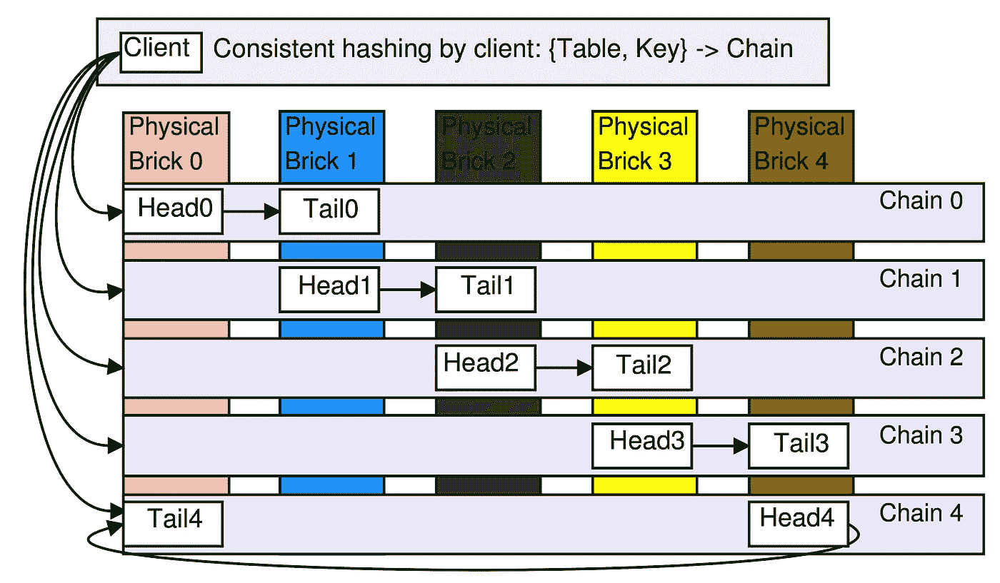
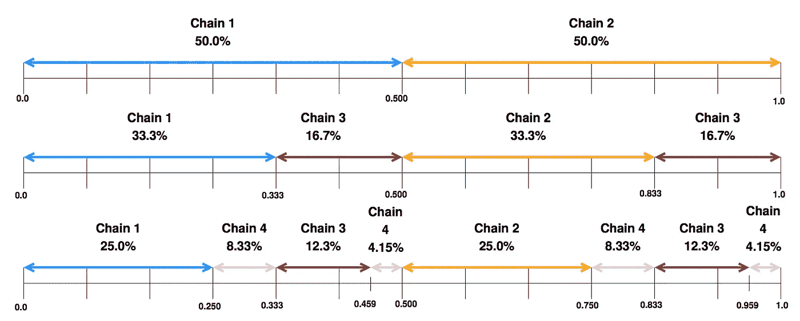
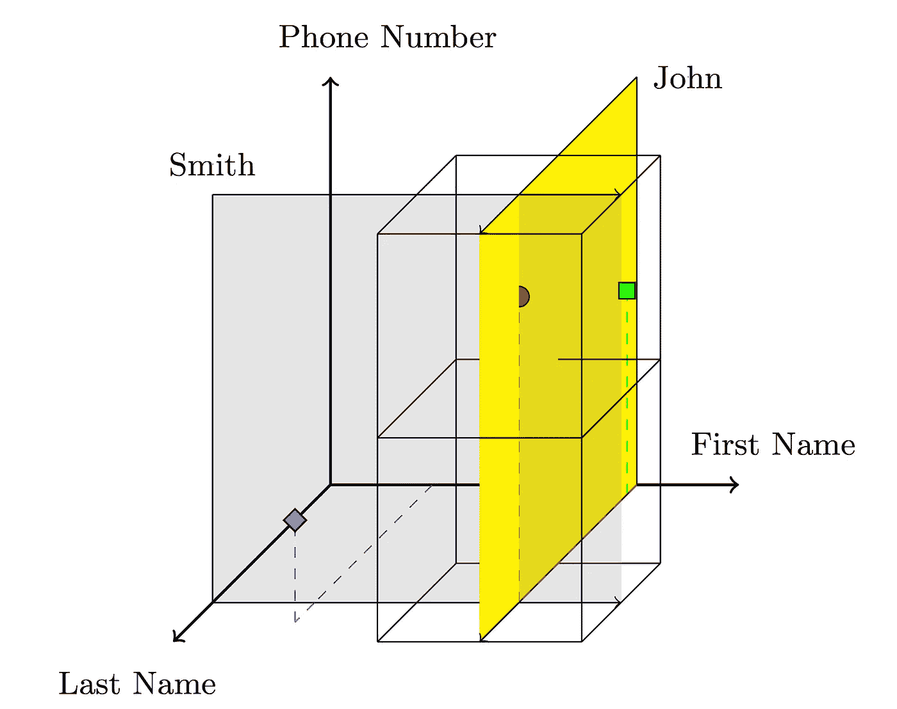
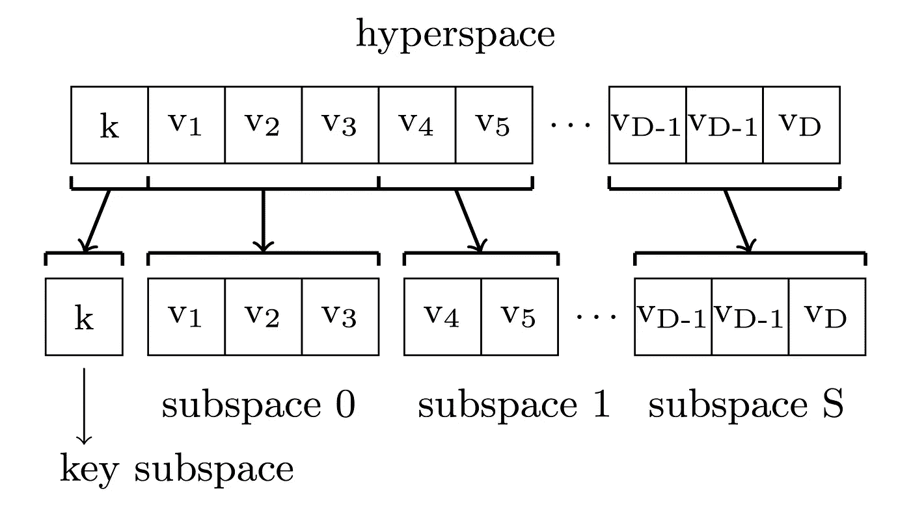
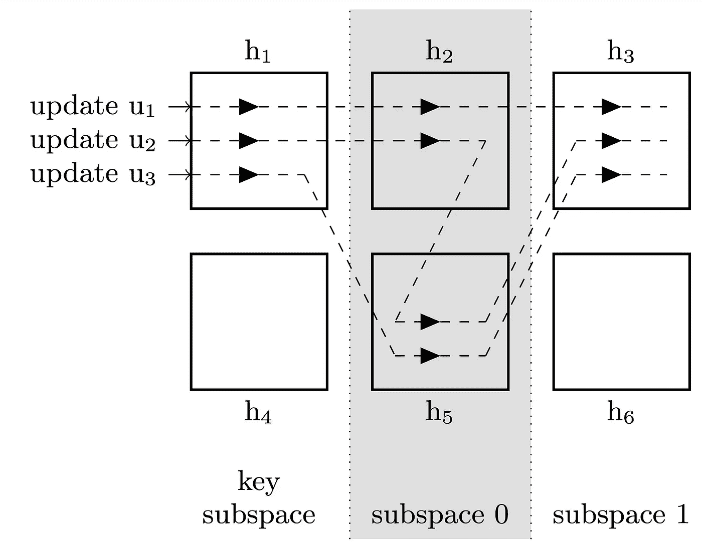
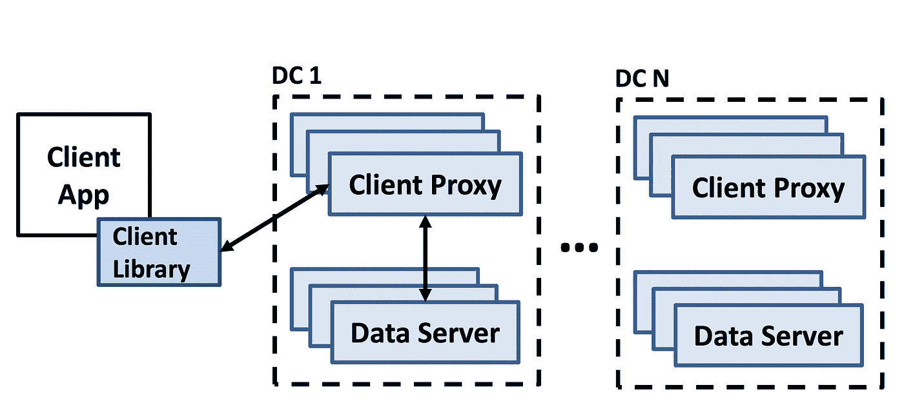
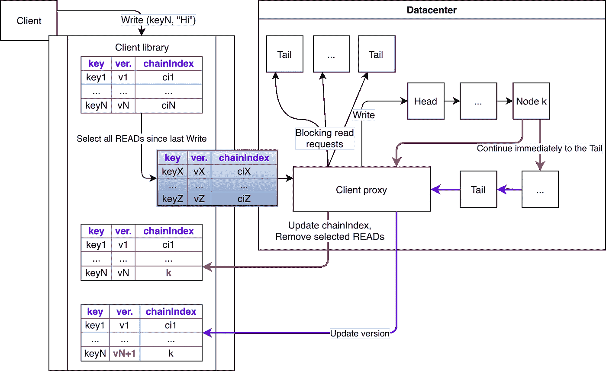
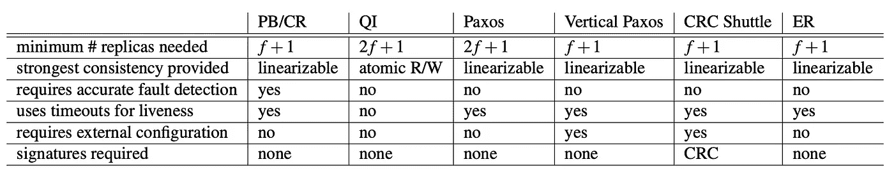
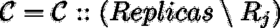
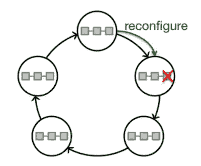

# 链式复制:如何构建高效的 KV 存储(下)

> 原文：<https://medium.com/coinmonks/chain-replication-how-to-build-an-effective-kv-storage-part-2-2-6c55eb9c63fd?source=collection_archive---------0----------------------->

我们继续探索链复制用法的例子。基本术语和架构在[第一部分](/coinmonks/chain-replication-how-to-build-an-effective-kv-storage-part-1-2-b0ce10d5afc3)中给出，我强烈建议在开始阅读第二部分之前阅读它。

在本文中，我们将考虑:

*   Hibari —用 Erlang 写的分布式容错存储。
*   HyperDex —分布式键值存储，通过第二属性和快速范围搜索进行快速搜索。
*   连锁反应——因果+一致性和地理复制。
*   如何构建一个没有外部集群管理过程的分布式系统？

# 5.希巴里

Hibari 是用 Erlang 写的分布式容错 KV-storage。它使用 CR(基本方法),因此实现了很强的一致性。Hibari 在测试中显示了高吞吐量，在 2U 机架式服务器上每秒钟可以更新数千次。

## 5.1 架构

Hibari 使用一致散列法进行数据放置。存储由物理和逻辑块组成，其中物理块可以是 linux 服务器或 EC2 实例或任何虚拟机，而逻辑块是操作中使用的实际存储实例。每个逻辑块都是某个链的一部分。在下面的示例中，我们配置了一个群集，每个物理块放置 2 个逻辑断点，链长度为 2。请注意，链节点放置在不同的物理砖块上，以增加容错能力。

主进程(参见第一部分)被称为*管理服务器*。数据存储在表中(表只是作为名称空间)，每个表至少存储在一个链中，每个链只存储一个表。客户机从管理服务器接收每个链的头和尾，因此它们确切地知道将它们的请求发送到哪个逻辑块。

## 5.2 散列法

Hibari 使用元组{T，K}来确定哪个链存储表 T 中的密钥 K:它将密钥 K 映射到[0.1，1.0]区间上(使用 MD5)，该区间被划分为多个区域，每个区域代表某个链。根据不同的标准(例如，链条的重量)，区域可以有不同的宽度。

因此，更强大的物理砖块上的链可以被分配更宽的间隔(以处理更多命中)。

# 6.超指数

HyperDex 项目的目标不仅仅是构建一个分布式 KV-storage，而是构建一个具有按秒属性快速搜索和按范围快速搜索的 KV-storage(BigTable、Cassandra、Dynamo 等系统无法做到这一点——它们必须为这种查询遍历所有节点)。HyperDex 使用*超空间哈希*来实现。

## 6.1 架构

超空间哈希的想法并不新鲜——它只是一个 n 维空间，其中每个属性对应一个坐标轴。例如，对于对象(名字、姓氏、电话号码),空格可以这样显示:

灰色超平面穿过姓氏= Smith 的所有键，黄色-名字= John 的所有键。查询“GET phone-number WHERE first-name = John AND second-name = Smith”的结果是灰色和黄色超平面的交集。这意味着具有 k 个属性的查询返回(n — k)维子空间。

搜索空间被分成 n 维不相交的区域，并且每个区域被分配给一个节点(因此来自该区域的所有对象都被存储在该节点上)。这在对象和节点之间创建了一个散列。

搜索查询(甚至范围一)确定结果超平面的区域，因此查询将只通过那些区域，而不是通过所有节点。

这种方法有一个问题——所需节点的数量随着属性的数量呈指数增长 k: O(2 ^ k)。为了处理它，HyperDex 将多维空间分割成具有较低维度和较小属性子集的子空间:

## 6.2 复制

作者开发了一种基于链复制的新方法来提供强一致性，称为*值相关链*，其中每个下一个节点由相应属性的散列来确定。例如，一个键(“John”、“Smith”)将首先被散列到*键空间*(这给了我们一个链头，称为*点头*)，然后“John”的散列给出相应轴上的坐标，等等。(见下图)。

所有更新都通过强制线性化的点引导。

如果一个更新导致一个区域改变，那么首先在旧版本之后立即写入新版本(参见更新 u2)，然后一旦从尾部接收到 ACK，从先前节点到旧版本的链路将被改变(参见更新 u3)。为了防止并发更新(r1 和 r2)破坏一致性，点领导者将版本控制和其他元数据添加到请求中，以便节点在接收到 r2 时可以确定它们必须等待 r1 首先到达。

# 7.连锁反应

ChainReaction 使用因果+一致性模型，这是因果一致性模型加上副本不需要仲裁器收敛的要求。具有所有因果相关关键字版本的元数据被添加到所有请求中，以提供因果+一致性，ChainReactions 允许我们在几个数据中心进行地理复制，这是 CRAQ 的进一步发展。

## 7.1 架构

它基于 FAWN 架构，略有改动:

*   每个数据中心都有*数据服务器*——后端(存储数据，提供复制)创建 DHT 环。
*   *客户端代理* —前端(将请求重定向到适当的节点)。

每个密钥被复制到 R 个后续节点上，从而创建了一个链。读请求由尾部处理，写请求由头部处理。

## 7.2 单一数据中心

必须注意一个非常重要的属性——如果节点 *k* 与一些客户端请求是因果一致的，那么在 *k* 之前的所有节点也是因果一致的(根据链复制的设计)。这意味着如果我们知道已经在节点 *k* 上观察到请求 *Req* ，那么所有与因果相关的读取请求(属于 *Req* )只能在节点【head，..，k】。在尾巴已经执行了 Req 之后，就没有这种限制了。

让我们将数据中心中由 tail 处理的所有写请求 *d* 表示为 **DC 写稳定(d)。**

每个客户端维护一个列表(*元数据*)，该列表包含它已经请求的所有关键字，格式如下: *(keyN，version，chainIndex)* ，其中 chainIndex 是一个标识符，它捕获节点的链位置，该节点处理并回复客户端对元数据所涉及的关键字的最后请求。**客户端仅存储那些客户端未知的键的元数据，不管它们是否是 DC 写稳定的(d)。**

**7.2.1 执行写操作**

我们注意到，一旦对 key *keyN* 的写请求变为 DC 写稳定(d ),任何其他读请求都不能返回先前版本的 keyN 。

自上一次写入以来已对其执行读取请求的所有键的列表被添加到下一次写入请求中。客户端代理在接收到写请求时，对相应链尾部的每个键执行阻塞读请求(等待相同或更新版本的确认，换句话说，提供因果一致性)。一旦接收到所有确认，客户端代理就向相应链的头发送写请求。

一旦新值被保存在第一个 *k* 节点上，客户端代理就向客户端发送通知，并且在剩余链节点上的更新以懒惰模式继续*(懒惰传播* ) —因此，优先级被给予第一个 *k* 节点上的写请求。客户端更新 chainIndex(到 *k* )并删除发送的键的元数据——因为现在我们知道它们是 DC 写稳定的(d)。一旦 tail 处理了请求，它就向链节点发送一个通知，以便它们将值标记为稳定，并向客户端发送一个通知，以便它可以更新密钥的版本。

**7.2.2 执行读取操作**

客户端代理通过向 *nodeIndex = rand(1，chainIndex)* 发送读取请求来执行负载分配。在响应中，节点发送该值和该值的版本。客户端代理检查响应并向客户端发送数据，此外:

*   如果版本稳定，那么 *chainIndex =链的长度*
*   或者版本是否更新— *chainIndex = index*
*   否则，chainIndex 保持不变。

**7.2.3 应对故障**

与链复制基本方法中的方式相同，但在某些情况下，chainIndex 在客户端变得无效(例如，当节点已从链中移除时)，这种情况很容易检测到(在节点上缺少具有这种版本的这种密钥)，并且为了处理它们，请求仅被路由到头部。

## 7.3.多个数据中心(地理复制)

我们将使用来自单 DC 设置的算法，并做最小的修改。首先，在元数据中，我们需要大小为 N 的版本向量，而不是标量版本和标量链接索引。

此外，我们将以类似于 DC 写稳定(d)的方式来表示全局写稳定:如果写请求 *Req* 在所有数据中心的所有尾部上执行，则称其为全局写稳定。我们还将在所有 DC 中添加一个新组件— *remote_proxy* ，它负责从其他 DC 接收更新，或者向其他 DC 发送更新。

**7.3.1 执行写操作(在服务器的*上)***

它以与单 DC 设置相同的方式启动—执行阻塞读取并更新前 *k* 节点上的值。然后 client-proxy 向客户端发送一个带有版本向量的响应，其中所有位置都是 0，但 ith 的值为 k。最后还有一个额外的操作是将更新发送到 remote_proxy，它累积几个更新，然后发送它们。

这里我们可以观察到两个问题:

*   解决从不同 DC 发出的不同操作之间的依赖性
    每个 remote_proxy 维护一个称为 *rvp* 的大小为 N 的本地版本向量，该向量存储发送和接收操作的计数器，并且它在所有更新中被发送到其他 DC。这样，当远程代理从另一个远程代理接收到更新时，它将本地 rvp 与远程 rvp 进行比较，如果本地计数器小于远程，则操作被阻塞，直到接收到错过的更新。
*   解析给定操作在其他 DC 中的依赖关系？布隆过滤器被用来实现这一点。客户端代理为每个读/写请求的响应中的每个密钥发送一个布隆过滤器(称为*回复过滤器)*。这些过滤器由客户端存储在*访问对象*字段中，并且作为所有过滤器的结果过滤器(称为*依赖性过滤器*)由客户端作为每个读/写请求中的元数据的一部分发送。和以前一样，过滤器在请求完成后被删除。回复和依赖过滤器与 rvp 一起发送到其他 DC。
    远程 DC 在接收到所有数据时检查回复过滤器中的设置位是否与依赖性过滤器中的设置位相同。如果是，那么这样的请求可能是因果相关的。(它们只是潜在相关，因为 bloom filter 没有给出 100%的可能性)。

**7.3.2 执行读取操作**

它与单 DC 设置中一样执行，但使用矢量链索引而不是标量。在 DC 中有可能缺少密钥(因为操作是异步的)—在这种情况下，我们要么等待它，要么将请求重定向到另一个 DC。

**7.3.3 冲突解决**

由于元数据的原因，与因果相关的请求以正确的顺序执行(尽管有时我们会阻塞这个过程)。不幸的是，不同 DC 中的并发更新会导致冲突。为了解决这种冲突，建议在每次更新时使用对 *(c，s)* 的最后写入获胜策略，其中 *c* 是 client_proxy 上的挂钟，而 *s* 是 DC 的 id。

**7.3.4 故障处理**

类似于单 DC 设置。

# 8.在可伸缩复制协议的设计中利用分片

这项研究的目标是开发一个具有分片和复制功能的分布式系统**，而不需要**使用任何外部主进程进行集群监控/重新配置。

作者认为当前方法存在以下局限性:

复制:

*   主/备份—当主服务器被错误地标记为有故障时，会导致不一致的状态。
*   仲裁交集—在重新配置期间可能导致不一致的状态。

高度一致性:

*   现代协议依赖于多数表决算法(如 Paxos)，其中需要 2 * N + 1 个节点来容忍 N 个节点的故障。

故障检测:

*   P/B 和 CR 假设对故障停止节点进行理想检测，但这在实践中是不现实的。
*   ZooKeeper 也有同样的问题——当有很多客户端时，客户端需要太多时间(> 1 秒)来重新加载配置。

被称为“弹性复制”的所提出的算法没有提到的限制，并且还提供以下好处:

*   一致性强。
*   有 N + 1 容忍 N 个故障就够了。
*   重新配置而不失去一致性。
*   不需要多数表决算法。

For example, new configuration doesn’t have a faulty replica:summary

## 8.1 副本

我们在每个分片上定义了一系列配置:

例如，新配置没有错误的副本:

配置序列中的每个元素都有:

*   副本—一组副本。
*   orderer —具有特殊角色的特殊副本的 id(见下文)。

每个碎片被表示为一个副本的集合(因此我们不区分“碎片”和“副本”)

每个副本存储以下数据:

*   配置—当前副本的配置 id。
*   订购者—哪个副本是此配置的订购者。
*   模式—复制副本的模式，可以是以下三种模式之一:待定(所有复制副本来自非 C1)、活动(所有复制副本来自 C1)、不可变。
*   历史记录—对副本数据的操作序列(可能只是滑动状态)。
*   稳定-此复本提交的历史前缀的最大长度。显而易见的是:

订购者副本的主要工作是向其他副本发送请求，并维护副本中最长的前缀。

## 8.2 碎片

碎片被组合在一起，形成称为*松紧带*的环。每个碎片只属于一个弹力带。每个碎片的前身扮演一个特殊的角色，被称为*序列器*。如果出现故障，定序器会为其后继者生成新的配置。

必须满足两个要求:

*   在每个弹性带中至少有一个具有一个活动副本的碎片。
*   在每个弹性带中至少有一个碎片是无缺陷的复制品。

最后一个要求似乎很强，但是，它相当于一个“传统的”要求“绝不能有错误的主过程”。

## 8.3 链式复制

正如您所看到的，复制品形成了一个链(基本方法),其中订购者是头，但是，有一个小的区别:

*   CR 从链中删除一个有故障的节点，而 ER 只是创建一个新的链。
*   在 CR 中，读请求由尾部提供服务，在 ER 的情况下，它们必须从头开始遍历整个链(以提供强一致性)。

## 8.4 出现故障时的重新配置

*   复制品不仅由同一碎片的复制品来监控，而且由定序器的复制品来监控。
*   一旦检测到故障，就会向副本服务器发送通知。
*   定序器发布新的配置(没有错误的副本)。
*   一个新的复制品被创建，它将自己的状态与弹性带同步。
*   定序器使用新的副本发布新的配置。

# 参考

*   [希巴里](https://https//dl.acm.org/citation.cfm?id=1863515dl.acm.org/citation.cfm?id=1863515)
*   [hyperdex.orgerdex.org](https://hyperdex.orgerdex.org/)
*   [HyperDex:一个分布式的、可搜索的键值存储](https://www.cs.cornell.edu/people/egs/papers/hyperdex-sigcomm.pdf)
*   [连锁反应](https://dl.acm.org/citation.cfm?id=2465361)
*   [在可扩展复制协议的设计中利用分片技术](https://ymsir.com/papers/sharding-socc.pdf)

> [在您的收件箱中直接获得最佳软件交易](https://coincodecap.com/?utm_source=coinmonks)

[**Click to read today’s top story**](http://bit.ly/2G71Sp7)