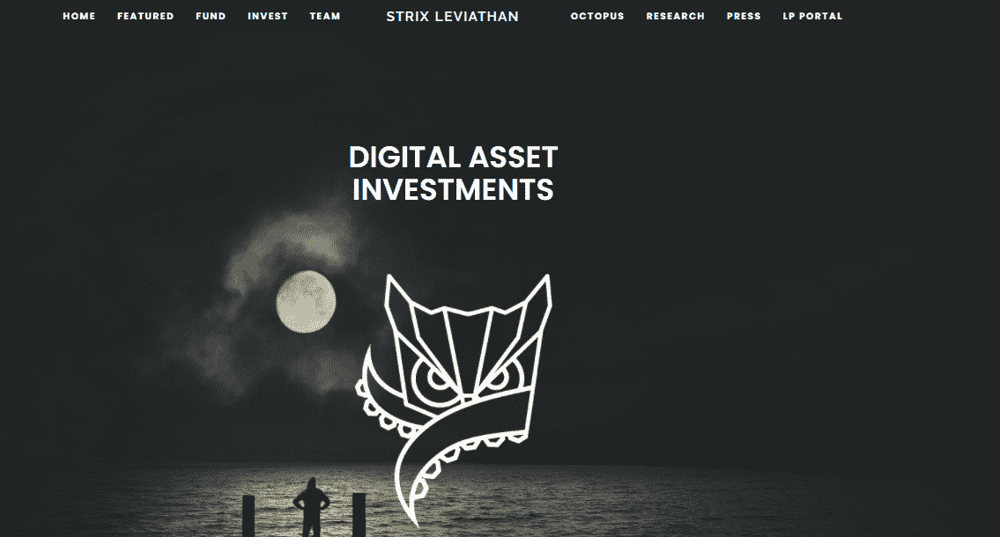
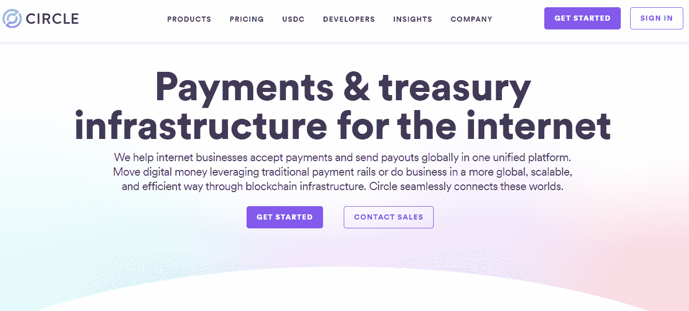
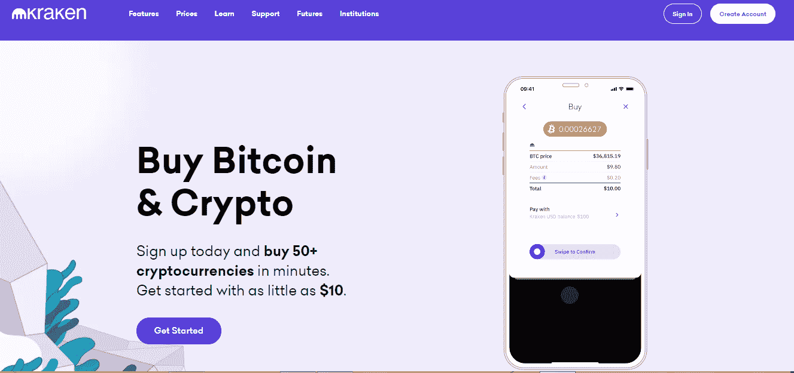

# 链 v 链外:交易者如何在今天的市场上依赖区块链

> 原文：<https://medium.com/coinmonks/chain-v-off-chain-how-traders-are-relying-on-blockchain-in-todays-market-447d28990a63?source=collection_archive---------8----------------------->

交易是一个残酷的行业，专业人士和业余爱好者都在市场上一决雌雄，赚取可观的利润。然而，在价值 95 万亿美元的全球股票市场中，需要复杂的技术来确保交易的安全。

难怪金融界是最早采用分布式分类帐技术作为解决支付问题、处理速度慢以及对更准确记录的需求的可行解决方案的领域之一。

让我们来看几个案例研究，看看交易者在当前市场中是如何依赖区块链的。

# 案例研究#1 [Strix Leviathan](https://strixleviathan.com/)

为顶级对冲基金工作的交易员会使用和大众一样的区块链交易平台吗？

在大多数情况下，不会的。

精英对冲基金和他们的交易员转向像 [Strix Leviathan](https://cryptoslate.com/companies/strix-leviathan/) 这样的公司，为他们开发专有的企业级分布式账本技术交易软件。

如果机构不希望开发自己的平台，总部位于西雅图的 Strix Leviathan 提供了自己的[章鱼交易平台](https://strixleviathan.com/crypto-fund-platform)作为解决方案。

Octopus 拥有数据接收和转换引擎，以及一套功能强大的交易执行机制。

# 案例研究#2 [圆圈](https://www.circle.com/en/)

正规的非专业交易者呢？他们可以利用哪些区块链的交易平台？

马萨诸塞州波士顿的 Circle Poloniex 是领先的分布式账本技术平台之一，每月的加密交易超过 20 亿美元。

该平台为交易者提供包括各种数字货币的投资和交易在内的一系列服务。

交易者能够进行加密货币对加密货币或加密货币对法定货币的交易。后者仅仅意味着你可以将政府发行的货币(法定货币)如美元、人民币和英镑换成加密货币资产。

# 案例研究#3 [北海巨妖](https://www.kraken.com/en-us)

据估计，当今世界有 [3 亿加密货币用户](https://www.yahoo.com/now/countries-using-cryptocurrency-most-210011742.html#:~:text=Cryptocurrency%20and%20blockchain%20technology%20company,form%20of%20cryptocurrency%20as%20payment.)。大多数交易者实际上都不在美国。Statista 报告称，按交易量排名的[十大加密货币国家](https://www.yahoo.com/now/countries-using-cryptocurrency-most-210011742.html#:~:text=Cryptocurrency%20and%20blockchain%20technology%20company,form%20of%20cryptocurrency%20as%20payment.)是:

1.尼日利亚:32%

2.越南:21%

3.菲律宾:20%

4.土耳其:16%

5.秘鲁:16%

6.瑞士:11%

7.印度:9%

8.中国:7%

9.美国:6%

10.德国:5%

由于大多数加密平台都瞄准了美国本土市场，这为像[北海巨妖](https://www.kraken.com/en-us)这样的企业向世界其他地方提供数字资产服务敞开了大门。

今天，北海巨妖是最大的比特币交易所，提供日元、加元和英镑等多种法定货币的交易。

通过一系列并购，北海巨妖已经吸收了五家公司，为交易员创建了一个庞大的比特币交易平台。

# 结论

自纳斯达克首次宣布完成历史性的区块链交易以来，已经过去了六年。自那以后，该交易所开始整合分布式账本技术平台，以促进更快的贸易结算。现在，交易结算只需几分钟，而不是几天。

几乎无法想象今天没有区块链的交易。无论是业余的还是专业的交易者，都非常依赖这种实用的技术，正如我们在上面的三个案例研究中看到的，可以肯定地说，区块链已经存在了。

*本博客是一个关于链上链下交易者如何使用区块链的多系列文章。*

> 加入 [Coinmonks 电报频道](https://t.me/coincodecap)，了解加密交易和投资

## 另外，阅读

*   [尤霍德勒 vs 科恩洛 vs 霍德诺特](/coinmonks/youhodler-vs-coinloan-vs-hodlnaut-b1050acde55a) | [Cryptohopper vs 哈斯博特](https://blog.coincodecap.com/cryptohopper-vs-haasbot)
*   [币安 vs 北海巨妖](https://blog.coincodecap.com/binance-vs-kraken) | [美元成本平均交易机器人](https://blog.coincodecap.com/pionex-dca-bot)
*   [如何在印度购买比特币？](/coinmonks/buy-bitcoin-in-india-feb50ddfef94) | [WazirX 审核](/coinmonks/wazirx-review-5c811b074f5b) | [BitMEX 审核](https://blog.coincodecap.com/bitmex-review)
*   [比特币主根](https://blog.coincodecap.com/bitcoin-taproot) | [Bitso 回顾](https://blog.coincodecap.com/bitso-review) | [排名前 6 的比特币信用卡](/coinmonks/bitcoin-credit-card-bc8ab6f377c6)
*   [币安 vs 比特邮票](https://blog.coincodecap.com/binance-vs-bitstamp) | [比特熊猫 vs 比特币基地 vs Coinsbit](https://blog.coincodecap.com/bitpanda-coinbase-coinsbit)
*   [如何购买 Ripple (XRP)](https://blog.coincodecap.com/buy-ripple-india) | [非洲最好的加密交易所](https://blog.coincodecap.com/crypto-exchange-africa)
*   [非洲最佳加密交易所](https://blog.coincodecap.com/crypto-exchange-africa) | [晤交易所评论](https://blog.coincodecap.com/hoo-exchange-review)
*   [eToro vs robin hood](https://blog.coincodecap.com/etoro-robinhood)|[MoonXBT vs by bit vs Bityard](https://blog.coincodecap.com/bybit-bityard-moonxbt)
*   [Stormgain 回顾](https://blog.coincodecap.com/stormgain-review) | [Bexplus 回顾](https://blog.coincodecap.com/bexplus-review) | [币安 vs Bittrex](https://blog.coincodecap.com/binance-vs-bittrex)