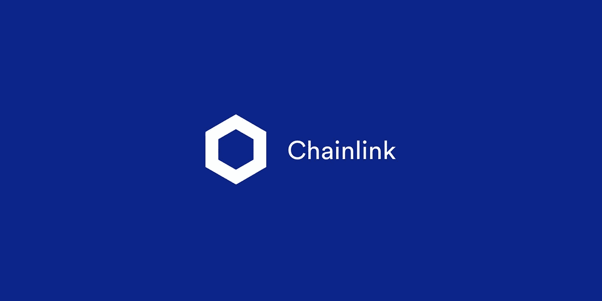
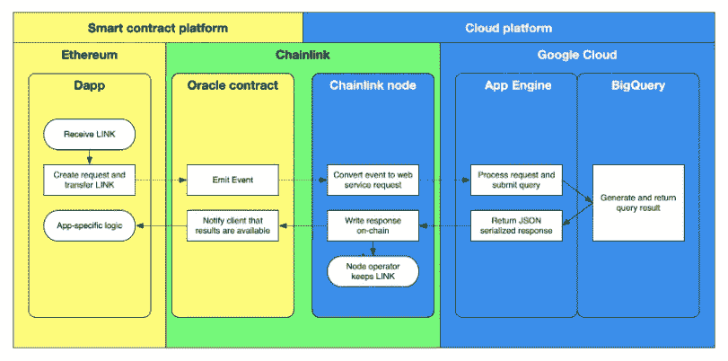
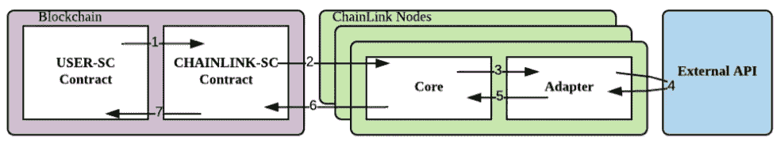
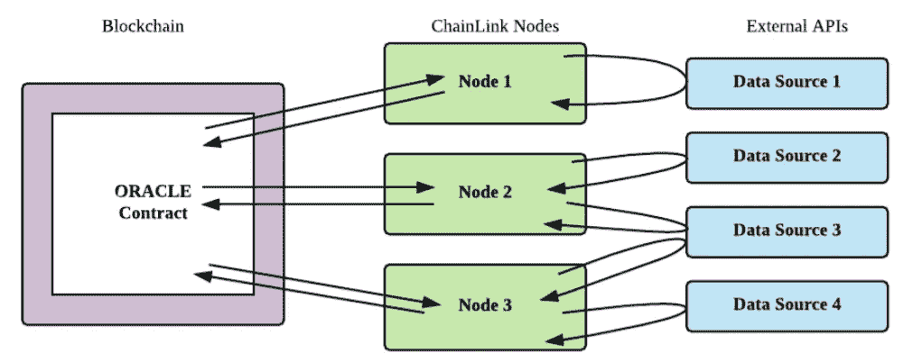

# chain link——一个去中心化的区块链 Oracle 网络——第 2 部分

> 原文：<https://medium.com/coinmonks/chainlink-a-decentralized-blockchain-oracle-network-part-2-1cecdfb93169?source=collection_archive---------3----------------------->

Chainlink 是目前最著名的区块链 oracle 项目之一，旨在支持区块链网络，即通过使用 API 接受/传输外部数据的智能合同。它作为一个完全分散的网络运行。

该框架将智能合同连接到链外输入，然后输入和触发智能合同，并将产生链外输出，如支付、数据传输等。

Chainlink 可用于连接数据提供商、web APIs、企业系统、云服务提供商、物联网设备、支付系统、其他区块链等等。

在本文中，我们将讨论 Chainlink 的底层架构及其支持它实现去中心化的各种组件。

## **架构概述**

Chainlink 项目建立在以太坊平台上。该项目的主要目标是充当链上和链下数据系统之间的桥梁。除了支持分散化，该项目还支持模块化，即不同的系统组件可以分离和重组，以嵌入任何最新的技术。

链式网络由处理作业、任务、调度的链式节点的集合组成，并由支持从外部系统到区块链的数据流的几个核心适配器组成。执行由链上 Oracle contracts 协调的作业的链节点使用链接令牌作为对链节点操作员的激励。

来源- [谷歌云](https://cloud.google.com/blog/products/data-analytics/building-hybrid-blockchain-cloud-applications-with-ethereum-and-google-cloud)

## **链上架构**

在 oracle 服务中，用户契约被称为请求契约(由 **USER-SC** 表示)，请求契约的链上接口被称为 **CHAINLINK-SC** 。

ChainLink 链上组件由三个主要合同组成:

**1)** **信誉合同-** 跟踪 oracle 服务提供商的绩效指标。

a.oracle 服务购买者指定查询参数、所需的 Oracle 数量、信誉等要求，并汇总合同以构成服务级别协议(SLA)提案。

b.链上信誉以及过去合同的日志有助于购买者手动分类、过滤和选择预言。

c.当购买者完成他们的 SLA 提议时，SLA 将被提交给订单匹配合同，而不是直接联系 oracles。

**2)** **订单匹配合同-** 该合同接受建议的 SLA，记录 SLA 参数，并从 oracle 提供商处收集投标。信誉合同有助于最终将甲骨文排除在投标池之外。

a.当向订单匹配合同提交建议时，会触发日志。oracle 提供商可以根据他们的能力和提供的服务来监控和筛选建议书。

b.契约接受来自满足 SLA 要求的节点的投标。为了对合同进行投标，oracle 服务提供商附加罚款金额，然后提交。

c.从合格投标池中选择请求的甲骨文数量。在投标过程中收到的罚款将返还给未被选中的先知。

d.通过触发通知所选 oracles 的日志来创建最终的 SLA 记录。然后，oracles 执行 SLA 中提到的任务。

e.一旦创建了新的 oracle 记录，离线 Oracle 就执行协议并向在线 Oracle 报告。

**3)** **聚合契约-** 该契约收集来自 oracle 提供者的响应，并计算链环查询的最终统一结果。在信誉契约中报告并维护每个 oracle 的响应有效性。它还将 oracle provider metrics 反馈给 USER-SC 中指定的合同功能。

## **ChainLink 工作流程:**

1)用户 SC 发出链上请求

2) CHAINLINK-SC 为 oracles 记录一个事件

3) ChainLink 核心拾取事件并将分配路由到适配器

4) ChainLink 适配器执行对外部 API 的请求

5) ChainLink 适配器处理响应并将其传递回核心

6) ChainLink 核心向 CHAINLINK-SC 报告数据

7) CHAINLINK-SC 聚集响应并将它们作为单个响应传递回用户 SC。

## **链外架构**

在链外架构中，不同的 oracle 节点连接到以太网。通过遵循现有共识机制之一，将单个响应聚集成全局响应，该全局响应被返回给请求合同用户 SC

ChainLink 节点由标准的开源核心实现提供支持，该实现处理标准的区块链交互、调度以及与公共外部资源的连接。外部适配器可以用来提供额外的专门的离线服务。

## **链式分散方法**

为了将权力下放的概念理想化，将使用三种方法。

**1。** **数据源分布**

为了克服对单一来源的依赖，该系统被设计成从多个来源获取数据。来自不同系统的响应被聚集以找到结果。

**2。** **神谕的分布**

该系统支持不同的 oracle 节点，每个 oracle contacts 都有自己独特的数据源集，这些数据源可能与其他 oracle 重叠，也可能不重叠。

**3。** **使用可信的硬件。**

## **链家安全服务**

Chainlink 由四个关键的安全服务组成。这些服务可能由一家公司或一个发起 ChainLink 网络的团体经营，但严格按照 ChainLink 的分散设计运作。

**验证系统-** 该系统为用户选择 oracles 提供了一个性能指标。在选择时，它会检查以下两点:

o **可用性:**对有时间限制的查询的响应失败应该被系统捕获。

o **正确性:**不正确的响应或与同行提供的响应的偏差应被系统捕获。

**信誉系统**以下是决定 oracle 绩效的不同指标，chainlink 记录并发布用户评级。

o 已分配请求的总数

o 已完成的请求总数

o 已接受的请求总数

o 平均回应时间

o 罚款金额

奖励给予高声誉的服务，而任何错误的活动导致惩罚以及贬低品牌声誉。

**认证服务-** 认证服务的目标是预防和/或补救罕见但灾难性的事件，特别是以 Sybil 和镜像攻击形式出现的整体欺诈。

**合同升级服务-** 合同升级服务使 Chainlink 网络能够支持一组新的 oracle 合同。这项服务是可选的，由用户控制。

**链路令牌使用-** 链式网络利用链路令牌向链式节点运营商付费。链接令牌是一个 ERC20 令牌，具有额外的 ERC223“传输和调用”传输功能(地址、uint256、字节)，允许在单个交易中通过合同接收和处理令牌。

**参考文献:** [Chainlink 白皮书](https://link.smartcontract.com/whitepaper)

阅读更多:[了解区块链甲骨文-第一部分](/coinmonks/understanding-blockchain-oracle-part-i-20592f189b16)

> [*在您的收件箱中直接获得最佳软件交易*](https://coincodecap.com/?utm_source=coinmonks)

