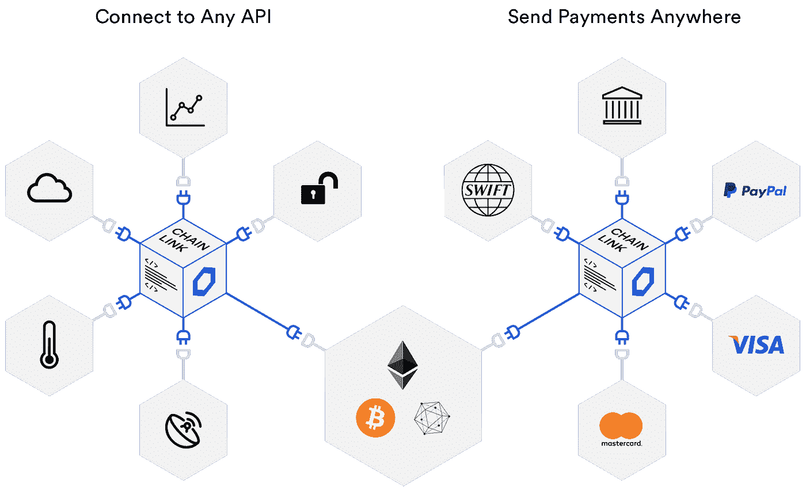
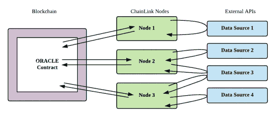
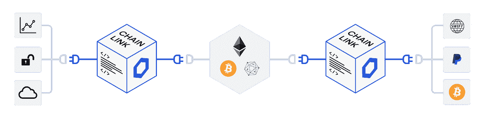

# 链环:基本分析

> 原文：<https://medium.com/coinmonks/chainlink-a-fundamental-analysis-77fa4a4ea482?source=collection_archive---------0----------------------->

> “持有一家公司的股票需要非凡的耐心，这家公司让你兴奋，但其他人似乎都忽略了它。你开始认为别人都是对的，而你是错的。但在基本面看好的地方，耐心往往会得到回报——卢肯斯的股票在第 15 年上涨了 6 倍，American Greetings 在 6 年内上涨了 6 倍，Angelica 在 4 年内上涨了 7 倍，Brunswick 在 5 年内上涨了 6 倍，而 SmithKline 在 2 年内上涨了 3 倍。”
> 
> 彼得·林奇

在我的上一篇文章“[智能合约将如何彻底改变世界](https://link.medium.com/csGtnZJ8F0)”中，我简要介绍了 Chainlink 如何解决“Oracle 问题”，这是智能合约和广泛采用之间的根本障碍。在本文中，我将从基本分析的角度更深入地研究 Chainlink。

开始之前，我们需要了解一些关键术语:

*   **区块链本质上是非常安全、分布式和分散的数据库。**
*   **智能合约是一行行代码，当给定输入时，它们会自动执行某项功能——就像自动售货机一样。**
*   **Chainlink 是一种保护数据传输的数字基础设施。**

## **什么是智能合同，它们与传统合同有什么不同**？

智能合同是一种自动执行的数字合同，协议条款用代码编写。代码和其中包含的协议存在于一个分布式的、分散的基础设施中:区块链。智能合同自行执行，而不是由第三方执行。

智能合约和传统合约的主要区别在于，智能合约是确定性的，因为它们将基于预设条件的实现而执行，而传统合约是概率性的，因为它们有可能不执行。此外，智能合同不仅以与传统合同相同的方式定义了协议的规则和处罚，还自动强制执行这些义务。显然，智能合同是合同的高级形式。

## **智能合约的价值是什么？**

智能合同可靠、自动化且高效。它们是可靠的，因为它们被保证在满足预设条件的基础上执行。这种情况的一个例子可以是一个合同，其中打赌第二天是否会下雨，一旦收到天气数据，该合同将被执行。

这就引出了自动化的下一个点；整个过程没有任何中间人。在整个过程中，合同按照编写的内容执行，无需人工干预，这也使得效率更高。这些契约也在分散基础设施上的许多节点上运行，以保证契约按照编写的那样执行。这意味着合同的创建者不必担心适当的执行或合同是否会被执行。因此，智能合同可以为公司减少许多令人头痛的问题，这些问题包括多个部门在不同的物理位置执行相同的合同，这些部门可能会导致人为错误，如合同的错放或丢失；一份可以被授权用户查看的数字智能合同，从精神和经济的角度来看，都让公司变得更加容易。

## **chain link 想解决什么问题？**

现在我们已经了解了基础知识，我们可以深入研究 Chainlink 试图解决的问题。首先，我们来问几个问题。我们如何将防篡改、安全的数据输入区块链，以扩大使用案例的多样性？我们如何将有关市场、股票、web API 源、银行支付、后端系统、零售支付的信息、外部数据、真实生活事件数据或有关其他系统的数据放入区块链？

由于在区块链如何达成共识的性质，他们没有能力自己获取任何外部数据。这就是神谕发挥作用的地方。Oracles 基本上是为区块链提供外部数据的节点。目前，这些 oracles 是集中式的，这意味着存在单点故障。正如我们之前所了解的，智能合约在分散的基础架构上执行，但现在我们发现这些高度安全和可靠的合约是由高度不安全和集中的 oracle 触发的。**高价值交易，如公司使用的交易，不会使用集中的 oracles 来触发他们在分散的基础设施上运行的合同，因为他们为什么想要一个高度安全可靠的机制被一个高度不可靠和不安全的机制触发呢？端到端的可靠性对于低信任环境中的高价值交易来说绝对至关重要。理解这一点非常重要，因为这样你就能看到 Chainlink 的基本价值与其市场价值的对比。**

Chainlink 试图通过使用多个独立的 oracle 节点而不是集中式节点来分散 oracle 机制，从而解决这个问题。值得注意的是，Chainlink 不是一个数据提供者，它只是一个由集中式 oracle 节点操作者组成的分散网络。就像比特币的网络是通过拥有很多集中的节点来分散的一样，Chainlink 网络也是如此。你不能分散集中的东西，但你可以增加足够的集中资源，使它成为一个分散的网络。

“先知”和“数据提供者”不是同一个东西。令人困惑的是，有时情况就是这样:提供数据流的公司将自己作为直接向用户交付数据的 oracle。

Chainlink 的不同之处在于，它的分散节点网络将利用各种各样的数据 API，然后它们自己形成一个更广泛的分散网络的一部分，这个分散网络由所有做同样事情的其他 Chainlink 节点组成，但是合并了来自各种提供者的它们自己的一系列数据 API。这涉及到多层分割，最好通过视觉而不是文本来显示。

这是人们在讨论这个话题时最大的误解——认为数据源本身(fx Cisco 或 Samsung)提供的 oracles 会与 Chainlink 网络竞争。更有可能的是，虽然他们可以直接向用户提供服务(代表单点故障)，但他们也很乐意向 Chainlink 节点提供服务(作为收费回报)，然后 chain link 节点将这些数据转发给智能合约，以及该合约认为对他们自己的安全和不信任级别必要的其他数据。谷歌是一家企业使用 Chainlink 来赚钱的最新例子，它的新数据集可以洞察不同的区块链。请记住，由智能合约选择的其他节点可能提供相同类型的数据，但来自不同的提供者，这再次降低了对单个参与方的信任。这就是去中心化层。这就是链环的全部意义。

现在想象一下，在未来，世界上最大的金融机构将结算数十亿美元的衍生品智能合同，并使用 100 多个 oracles 来提供其支付触发器，以确保准确的数据，并要求 100，000 美元的抵押股份来绝对保证准确的数据供应，所有节点运营商相互攀附，以拥有越来越多的链接，以便他们可以获得利润丰厚的高价值合同。

这不仅仅发生在通过 [SWIFT](https://create.smartcontract.com/sibos17) 的[全球衍生合同](https://blog.chain.link/solving-deep-seeded-trust-problems-in-derivatives-using-chainlink-enabled-smart-contracts/)上，还会发生在通过 [OpenLaw](/@OpenLawOfficial/openlaw-teams-with-chainlink-to-bring-real-world-info-to-smart-contracts-4e7a3dac80a8) 和 [Accord 项目](https://twitter.com/AccordHQ/status/1031022745835003905?s=20)的所有法律行业，通过 [ZeppelinOS](https://blog.openzeppelin.com/chainlink-partnership/) 的所有 EVM，以及通过 [Kaleido](https://kaleido.io/kaleido-selects-chainlink-to-provide-oracle-services-for-blockchain-business-cloud/) 、 [Google](https://cloud.google.com/blog/products/data-analytics/building-hybrid-blockchain-cloud-applications-with-ethereum-and-google-cloud) 、 [Intel](https://software.intel.com/en-us/articles/new-confidential-computing-solutions-emerge-on-the-hyperledger-avalon-trusted-compute) 和 [Oracle](https://blogs.oracle.com/startup/every-startup-in-the-blockchain-with-oracle-cloud-and-chainlink) 等的所有企业入职。

Chainlink 作为整个行业的行业标准 oracle 提供商，拥有多年的领先优势和绝对优势。它还具有在安全可信执行环境(TEEs)中通过 [Town Crier](https://blog.chain.link/town-crier-and-chainlink/) 进行复杂链外计算的能力，以及不依赖 TEEs 和 [Mixicles](https://blog.chain.link/breaking-down-mixicles-and-its-potential-to-unlock-enterprise-demand-for-defi-applications-on-public-blockchains/) 的私有、符合监管的链上智能合约，这两者都是由智能合约的领军人物之一 Ari Juels 开创的，并在持续的基础上为其发展做出贡献。

链接令牌作为在此生态系统中表达和移动价值的机制，是价值表示和交换的强制形式，必须作为抵押品发布，必须在节点中进行押记以获得高价值合同，并且必须作为对节点运营商执行此工作的付款发布。

现在，考虑到市场目前对这个新兴生态系统的估值不到 10 亿美元，想想这可能会有什么样的上升潜力。

> 要了解更多关于 Chainlink 和 staking 机制如何工作的信息，请查看我的另一篇文章“深入了解 LINK Token ”。
> 
> ***在推特上关注我:***[*@ kwsantiago*](https://twitter.com/kwsantiago)
> 
> **随时提示我:**0xc 408105508 ba 51 bacc 5 bb 3 ea 1d 13 da 3206618858
> 
> **本文仅供参考。本文中所述的任何内容都不应被理解为财务建议。**