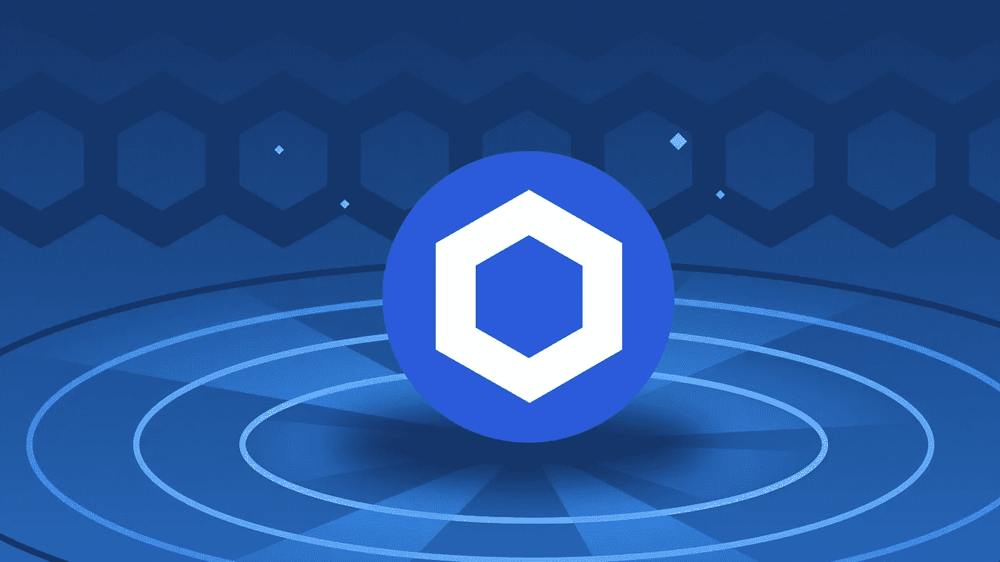
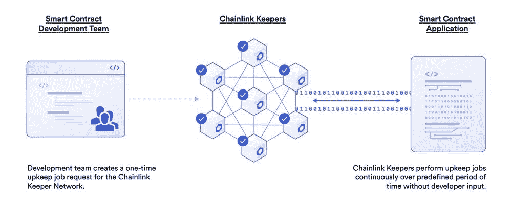
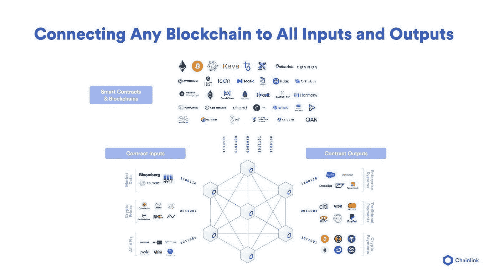
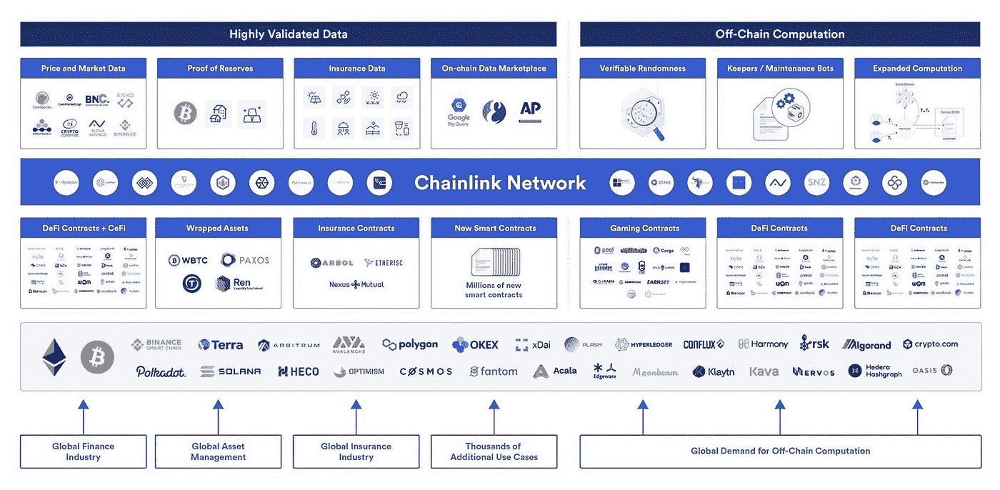
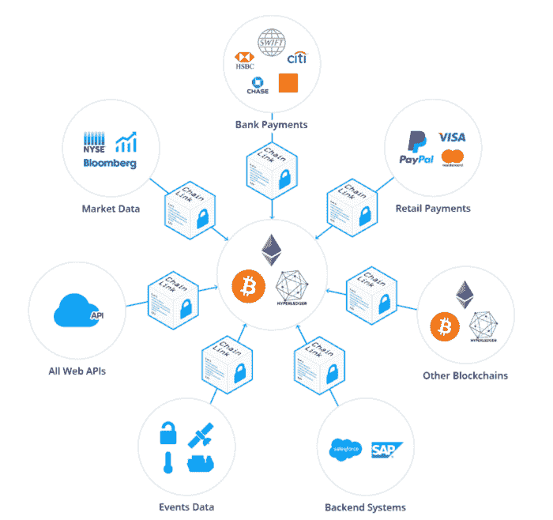
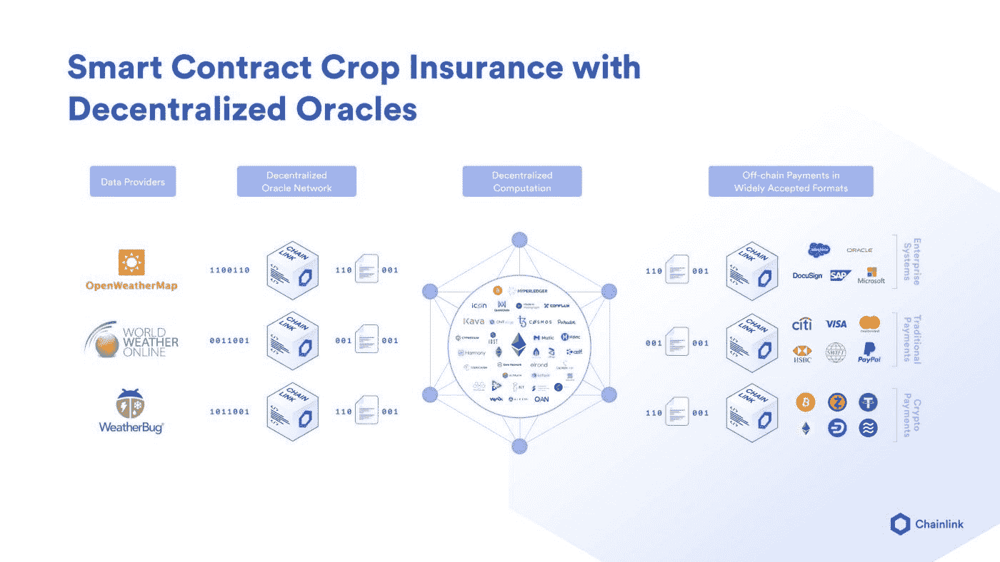
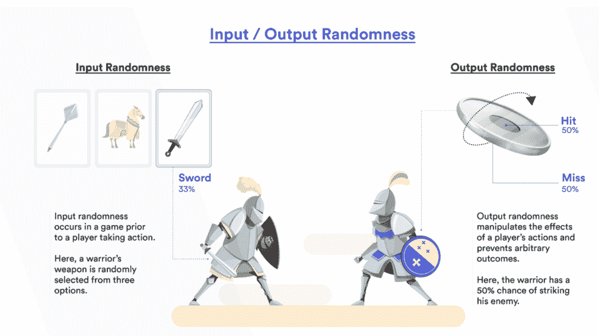
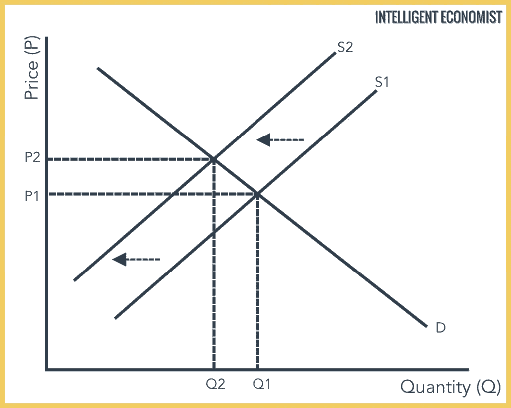

# 链环

> 原文：<https://medium.com/coinmonks/chainlink-the-one-crypto-without-any-real-competition-e54c4a00bb01?source=collection_archive---------1----------------------->

Source: academy.binance.com

## 什么是 Chainlink？

Chainlink 是一个区块链抽象层，支持普遍连接的智能合约。这是一个去中心化的 oracle 网络，它提供了智能合约，一个到所有世界上最高质量的数据馈送的防篡改、高度可用的连接。智能合同可以使用 Chainlink 访问数据，如金融市场和定价、天气、体育比赛结果、物联网传感器读数以及任何其他现实世界中可验证的数据，以实现更强大和可用的区块链应用程序。

## 智能合同和分散式应用

Source: docs.chain.link

一份没有先知书的聪明合同就像一架没有翅膀的飞机。Oracles 向分散的应用程序提供了关于外部世界的无可争议的事实。基于区块链的智能合约应用正在改变世界转移资产和促进协议的方式。这些区块链拥有验证者网络，他们有目地限制他们与外界的联系。智能合同需要一个额外的基础设施 oracle，以便安全地从外部世界获取数据。

因为智能合同管理着数十亿美元的价值，控制它们的数据必须符合最高的质量标准。这是不能妥协的。智能合同最终必须能够采用保护区块链安全获取和验证数据的分散计算保证。

这意味着区块链不能依赖任何集中式数据源，因为这可能会危及智能合约的整个安全架构——如何危及？完美地执行错误的动作。

例如，如果智能合同基于体育赛事的结果进行支付，那么任何来自中央来源的赛事误报都将使合同的完整性无效。或者，如果这样的中央源被黑客攻击和修改，即使只是暂时的，oracle 也会向智能合同广播不正确的信息，以欺骗它获得付款。

因为智能合约是自动执行的，只要满足标准，它们就会支付，这是不可逆转的。

## Chainlink 是如何工作的？

Source: docs.chain.link

当涉及到通过区块链交流的真实世界数据时，Chainlink 旨在消除“坏演员”和“错误”为此，Chainlink 使用其加密货币 link 来激励数据准确性，保持合同稳定，并奖励节点验证交易的工作。

***链环神谕&链环令牌***

*   Chainlink 从 oracles 网络中收集信息，丢弃离群值，并将共识传递给智能契约以确保有效性。
*   Chainlink 在一个自动化的过程中将 oracles 与区块链运算符进行匹配，该过程可以根据它们特定类型的请求提供最准确的信息。
*   运营商将提交服务水平协议(SLA ),并在合同中包含链接令牌，随后用于向提供满足合同条款的准确信息的甲骨文支付费用。
*   多个节点将接受数据请求，并促进与真实世界数据提供者的通信。当他们得到想要的数据时，他们向 Chainlink Aggregating Contract 报告以比较答案。所有这些都通过平均答案来实现准确信息的最佳平衡。
*   节点将根据它们在网络上有多少链接令牌来验证事务。
*   这些新信息将通过 Chainlink 传送到运营商的区块链。然后，它将被输入到智能合同中，以便根据更新的可靠信息进行更改。

## 为什么是 Chainlink？

***先发优势***

Chainlink 是第一个将外链数据与当前智能合约相结合的公司。Chainlink 凭借其先发优势，已成为使用最广泛、最值得信赖的分散式 oracle 网络，为许多区块链的实时应用程序带来了数十亿美元的价值。

***链式生态系统&伙伴关系***

Source: docs.chain.link

Chainlink 已与 60 多家数据提供商合作，包括 Accuweather、SportsDataIO、美联社；被大多数区块链人使用；超过 500 种 DeFi 应用；超过 200 个 NFT 市场；主要公司，如谷歌、甲骨文、英特尔和 AWS 拥有超过 200 款游戏；和许多其他伙伴关系。这些合作大部分发生在 2021 年。

## 实践中的链环

Source: docs.chain.link

*稳定的公司，如 USDC 或区块链的泰瑟，需要价格先知来知道他们的目标价格。Stablecoins 的市场估值超过 1400 亿美元，并且正在快速扩张。*

****合成资产****

*Chainlink 将使区块链合成资产有可能模仿股票和商品等现实世界的金融资产。*

****预测市场****

*区块链技术已经实现了去中心化预测市场的创建，这些市场可以在不受单一一方或运营商控制的情况下运行。由于区块链预测市场的本质，它们依赖外部数据来确定结果。一些潜在的数据集包括体育赛事结果和政治选举结果等等。*

****天气****

**

*Source: docs.chain.link*

*有了 Chainlink powered data feeds，保险公司就能够提供天气保险，而不会出现困扰传统保险协议的所有不利因素和低效问题，包括欺诈、腐败和延误。*

****区块链游戏****

**

*Source: docs.chain.link*

*随机性是产生不可预测性和公平分配游戏中物品的关键，这两者都增强了游戏体验。随着 Chainlink 最近推出的 VRF，即可验证的随机函数，它能够创建一个有意义和公平的游戏，非常需要随机性的来源。*

****供应链****

*供应链始于材料采购，终于将产品交付给最终客户。支付被交换，所有权转移，海关清关，监管监督，文件在过程中在各方之间传递。智能合同提供了一种解决方案，可以自动化全球商务中的关键程序，减少摩擦和交易对手风险。供应链智能合同可以使用 Chainlink oracles 链接到在线 API、云网络和各种现实世界的传感器，包括 GPS、温度、速度、加速度、湿度、亮度等。这些信息可能被用来触发合作伙伴之间的支付和数据传输，这种方式是供应链中的任何一个参与者都无法影响的。*

***T5【元宇宙】T6***

*元宇宙经济将促进用户拥有的价值转移，并托管贷款、借款、保险等金融工具。Chainlink 价格馈送为区块链的项目提供了强大而安全的价格数据，有助于整个元宇宙经济建立在彼此成功的基础上，而 Chainlink 数据馈送可以提供重要的成果，以巩固基础区块链，如建立游戏内元宇宙项目、奖励等的转移，以实现用户期望的区块链。*

****支付****

*由于世界各地的支付偏好差异很大，智能合同需要获得广泛的支付选择，以满足全球需求。Chainlink 将智能合约的输出传输到外部 API 的能力使其能够支持广泛的支付服务。*

## *供应动态*

*作为一种文明，我们越依赖智能合约，对链接的需求就越高。考虑以下市场中价格决定的供求经济模型:*

**

*Source: intelligenteconomist.com*

*链接最大上限供应量为 10 亿。因为链接令牌用于支付节点运营商和存款合同，所以它们实际上是从流通中去除的。当代币退出流通时，就会出现供应短缺，而需求稳定时，价格就会上涨。*

*我们可以预见，随着 DeFi、区块链游戏、NFTs 以及现在的元宇宙的快速扩张，对去中心化神谕的需求会非常大。就目前而言，Chainlink 占据了第一的位置，除非有人出现并创造出一个卓越的分散式甲骨文，否则只要智能合约和区块链存在，Chainlink 将继续统治市场。*

**免责声明:本文包含的信息仅用于教育目的，并不构成 Wheatstones 的任何形式的建议或推荐，用户在做出(或避免做出)任何投资决定时也不打算依赖这些信息。**

> *加入 Coinmonks [电报频道](https://t.me/coincodecap)和 [Youtube 频道](https://www.youtube.com/c/coinmonks/videos)了解加密交易和投资*

## *另外，阅读*

*   *[加拿大最好的加密交易机器人](https://blog.coincodecap.com/5-best-crypto-trading-bots-in-canada) | [赌注加密](https://blog.coincodecap.com/staking-crypto)*
*   *[如何在印度购买比特币？](/coinmonks/buy-bitcoin-in-india-feb50ddfef94) | [WazirX 审查](/coinmonks/wazirx-review-5c811b074f5b)*
*   *[最佳网上赌场](https://blog.coincodecap.com/best-online-casinos) | [硬件钱包](/coinmonks/hardware-wallets-dfa1211730c6)*
*   *[如何在 WazirX 上购买柴犬(SHIB)币？](https://blog.coincodecap.com/buy-shiba-wazirx)*
*   *[MoonXBT vs Bybit vs 币安](https://blog.coincodecap.com/bybit-binance-moonxbt) | [Arbitrum:第二层解决方案](https://blog.coincodecap.com/arbitrum)*
*   *[买 PancakeSwap(蛋糕)](https://blog.coincodecap.com/buy-pancakeswap)|[matrix export Review](https://blog.coincodecap.com/matrixport-review)*
*   *[最佳免费加密信号](https://blog.coincodecap.com/free-crypto-signals) | [YoBit 评论](/coinmonks/yobit-review-175464162c62) | [Bitbns 评论](/coinmonks/bitbns-review-38256a07e161)*
*   *[Bitget 评论](https://blog.coincodecap.com/bitget-review)|[Gemini vs BlockFi](https://blog.coincodecap.com/gemini-vs-blockfi)|[OKEx 期货交易](https://blog.coincodecap.com/okex-futures-trading)*
*   *[OKEx vs KuCoin](https://blog.coincodecap.com/okex-kucoin) | [摄氏替代度](https://blog.coincodecap.com/celsius-alternatives) | [如何购买 VeChain](https://blog.coincodecap.com/buy-vechain)*
*   *[币安期货交易](https://blog.coincodecap.com/binance-futures-trading)|[3 commas vs Mudrex vs eToro](https://blog.coincodecap.com/mudrex-3commas-etoro)*
*   *[在印度利用加密套利赚取被动收入](https://blog.coincodecap.com/crypto-arbitrage-in-india)*
*   *[德国最佳加密交易所](https://blog.coincodecap.com/crypto-exchanges-in-germany) | [WazirX P2P](https://blog.coincodecap.com/wazirx-p2p)*
*   *[如何购买 Monero](https://blog.coincodecap.com/buy-monero) | [IDEX 评论](https://blog.coincodecap.com/idex-review) | [BitKan 交易机器人](https://blog.coincodecap.com/bitkan-trading-bot)*
*   *[如何在 Bitbns 上购买柴犬(SHIB)币？](https://blog.coincodecap.com/buy-shiba-bitbns) | [印度的币安](https://blog.coincodecap.com/binance-in-india)*