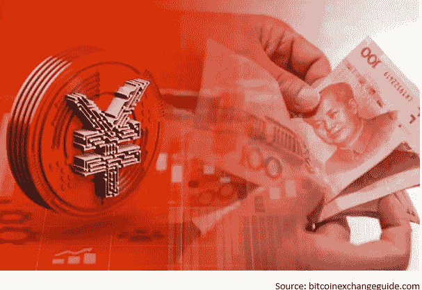

# 储备货币宫的卫兵换岗

> 原文：<https://medium.com/coinmonks/changing-of-the-guard-at-the-reserve-currency-palace-bc9872cbb92d?source=collection_archive---------4----------------------->

理查德·尼克松的财政部长约翰·康纳利有一句名言:“美元是我们的货币，但这是你们的问题。”嗯，无限印刷的时代可能就要结束了。引入数字人民币是彻底改革世界金融体系的导火线吗？

让我们从头开始。目前，占世界 GDP 90%的国家正在评估引入各自的 CBDC(央行数字货币)。领跑者显然是中国。这不仅仅是基于他们自 2020 年 4 月以来的广泛测试。我相信中国对私有和分散加密货币的强硬立场，以及对本地加密挖掘的禁令(之前它拥有世界上 65-70%的哈希比率！！)，是事情走向的清晰迹象。中国政府打算完全控制民众的消费习惯。告别现金和隐私。再加上其可操作的社交评分系统，乔治·奥威尔或阿尔多斯·赫胥黎的愿景似乎不幸成为了现实。但这是另一个帖子的讨论。

中国 CBDC(电子人民币)的推出会对美元产生什么影响？会威胁到美元储备货币地位吗？你可能会问，什么是储备货币？根据定义，储备货币是由中央银行或其他货币当局作为其外汇储备的一部分持有的大量外币。储备货币可以用于国际交易、国际投资和全球经济的各个方面。

当审视历史背景时，美元作为世界储备货币的地位似乎已经成熟，可以取而代之。自 1450 年以来，我们已经观察到六种世界储备货币(葡萄牙、西班牙、荷兰、法国、英国和美国)。他们各自财政霸权的中间长度是 94 年。根据官方说法，自 1944 年布雷顿森林协定以来，美元已经成为储备货币 77 年了。然而，1918 年第一次世界大战结束后，美元开始主导世界贸易。因此，这将需要，不是 77 年，而是 103 年。

另一方面，中国发现自己陷入了美元陷阱，因为它必须将收入和过剩储蓄转化为可兑换的价值储存手段——美国国债。鉴于中国渴望成为世界领先的经济强国，这是一个无法容忍的局面。这就是为什么中国通过“一带一路”倡议复兴了古丝绸之路。此外，经过 8 年的谈判，中国与日、韩、澳、新及东盟 10 国签署了全球最大的自由贸易协定《RCEP》。

通过克服以美国为中心的 SWIFT(Society fir world wide Interbank telecom munications)，中国已经在上述联盟内解决了跨境支付问题，无论是贸易还是电子商务，都采用了数字人民币的即时和区块链安全结算渠道。这也为绕过美国制裁的支付开辟了道路，可能会吸引俄罗斯、几个非洲国家以及南美国家。它甚至与阿联酋签署了一项特殊协议，用电子人民币支付未来的石油进口。现在，这显然是对美元在国际原油结算中主导地位的直接攻击。此外，电子人民币不需要银行账户，为数十亿没有银行账户的人打开了这一支付渠道。

Considering all this, the comment by Zhou Xiaochuan (周小川), former head of the PBOC (People’s Bank of China) — “The original goal of its design and the direction for which we are striving is not at all to replace the US dollar’s status as reserve currency or the international payments currency” — sounds a bit tongue in cheek.

尽管如此，单单引入电子人民币并不会在明天取代美元作为世界储备货币的地位。鉴于金融系统的普遍数字化，以及中国的先发优势加上其经济实力，使电子人民币成为五到十年内成为世界储备货币宫殿新守卫的名副其实的竞争者。

> 加入 Coinmonks [电报频道](https://t.me/coincodecap)和 [Youtube 频道](https://www.youtube.com/c/coinmonks/videos)了解加密交易和投资

# 另外，阅读

*   [币安交易机器人](/coinmonks/binance-trading-bots-d0d57bb62c4c) | [OKEx 评论](/coinmonks/okex-review-6b369304110f) | [阿塔尼评论](https://coincodecap.com/atani-review)
*   [最佳加密交易信号电报](/coinmonks/best-crypto-signals-telegram-5785cdbc4b2b) | [MoonXBT 评论](/coinmonks/moonxbt-review-6e4ab26d037)
*   [如何在 Bitbns 上购买柴犬(SHIB)币？](https://coincodecap.com/buy-shiba-bitbns) | [购买弗洛基](https://coincodecap.com/buy-floki-inu-token)
*   [CoinFLEX 评论](https://coincodecap.com/coinflex-review) | [AEX 交易所评论](https://coincodecap.com/aex-exchange-review) | [UPbit 评论](https://coincodecap.com/upbit-review)
*   [十大最佳加密货币博客](https://coincodecap.com/best-cryptocurrency-blogs) | [YouHodler 评论](https://coincodecap.com/youhodler-review)
*   [AscendEx 保证金交易](https://coincodecap.com/ascendex-margin-trading) | [Bitfinex 赌注](https://coincodecap.com/bitfinex-staking)