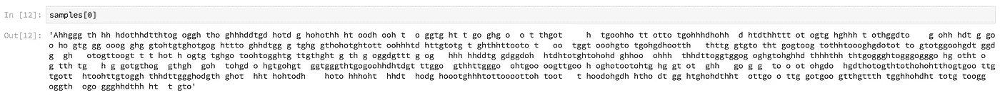
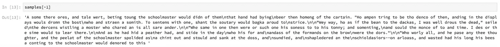

# 人物对人物的 RNN 与 Pytorch 的 LSTMCell

> 原文：<https://medium.com/coinmonks/character-to-character-rnn-with-pytorchs-lstmcell-cd923a6d0e72?source=collection_archive---------2----------------------->

我看了一些关于递归神经网络的教程，用的是 using 但是我找不到使用`LSTMCell`类的，很多都使用更高级别的`LSTM`类。所以我决定使用 lstm 单元建立一个字符到字符的模型。

**问题陈述:**我们想要构建一个 RNN，其中我们将有一个字符序列作为输入，一个字符序列作为输出。您可能已经看到了许多使用许多库构建的模型，如 Tensorflow/Keras、CNTK、MXNET 或 Pytorch。然后使用这种模型根据序列中的前一个字符对最可能出现的字符进行采样。因此，这是一个非常有趣的工具，可以根据现有的文本(一本书或一系列文章)进行文本采样。

[古腾堡计划](https://www.gutenberg.org/)是许多作者的免费书籍的极好来源(也许你能在那里找到你最喜欢的)。许多书籍都有`.txt`格式，这对于培训 C-to-C 递归模型非常有用。我用的是高尔基的[《弃儿》](https://www.gutenberg.org/ebooks/55861)。

正如您可能已经猜到的，从这样的 RNN 中抽取的结果文本将具有(或者至少应该具有)您可能在训练文本中遇到的句法结构和单词选择。这一概念在黑镜的[《马上回来》](https://en.wikipedia.org/wiki/Be_Right_Back)一集中有部分描述，其中一家公司向遭受损失的人提供了一个死者的数字模拟。如果你想了解更多关于 Luka 聊天机器人的信息，请阅读这篇文章。

然而，重要的是要注意，这种模型可以使用词到词模型来构建，使模型基于已经看到的词来预测最可能的词(因为句子对于词和字符都是连续的)。

**模型定义:**我们将使用一个两层 LSTM 模型，每层有 512 个隐藏节点。这个想法是将一个字符序列作为输入批量传递给模型，并使用相同的序列作为目标，但是移动了一个字符。每个字符都将被一次性编码，我们将在 LSTM 单元的输出之上添加一个完全连接的层，以适应输出的维度，这将是我们词汇的大小。

**主要术语:**

*   **词汇****——**组成我们文本的每个单个字符的集合。它很可能包含许多字母和大写字母、所有的语法字符，有时还包含附加字符，如“:、-”等。
*   **词汇的大小** **—** 词汇集的长度。我们需要这个大小来定义 LSTM 单元的输入大小。此外，我们需要这个大小作为模型的输出(位于 LSTM 单元第二层之上的全连接层的输出)；主要地，我们的目标是零维词汇大小的一键编码向量。
*   **LSTM 细胞—** 这个细胞位于模型的核心。你可能已经看过很多次了。这是克里斯托弗·奥拉的一个很好的图表:

他有一篇关于 LSTM 细胞和 RNN 细胞背后的数学和直觉的精彩文章；如果你还没有读过，你应该读一读。

LSTM 单元背后的基本思想是，信号以特定的方式流经单元，由输入、遗忘、更新和输出门定义。在任何给定的步骤 t，单元有三个输入:单元输入、隐藏向量输入和单元状态输入。在任何给定时间都有来自单元的三个输出:新隐藏状态、新单元状态和输出，该输出又与新隐藏状态相同。所有这些都在克里斯托弗的帖子中有所描述。

*   **隐藏状态—** 大小为 *(batch_size，hidden_size)* 的向量。隐藏向量的维度越大——你的模型就越健壮，以计算成本为代价。隐藏状态向量作为你的短期记忆，在时间步长 t 被输入更新。
*   **细胞状态—** 大小为 *(batch_size，hidden_size)，*的向量充当你的长期记忆。
*   **LSTM 的层—** 如果我们把 LSTM 细胞一个接一个的堆叠起来，我们就得到一个分层的 LSTM 模型。从技术上来说，**我们希望在任何给定的时间 t 将第一层的 LSTM 单元的输出作为输入传递给第二层的 LSTM 单元。**如果我们这样做，我们最终会构建一个更深的网络。
*   **LSTM 网络—** 现在，如果我们将时间 t 的隐藏状态输出向量传递给时间 t+1 的隐藏状态向量输入，我们将获得一系列 LSTM 单元，这形成了我们的 LSTM 模型。

现在让我们来看看代码和构建模型。正如我提到的，我想使用 pytorch 库中的 LSTM 细胞类来构建这个模型。还有，值得一提的是，Keras 在`utils`模块中有一个很棒的工具:`to_categorical`。这是一个伟大的方式一热编码矢量，非常直观。

**首先**:我们需要将文本读入 io，并用整数对文本进行编码。

**第二个**:我们需要写批处理算法。正如我之前提到的，我们希望将目标设置为训练字符，但在时间上移动 1 以定义顺序。我使用了之前在 Udacity 上的一个课程中的批处理函数。在我看来，编写批处理算法是这类任务中最难的部分。

第三个:我们想开始在 pytorch 中构建我们的模型。在这里，我们将使用 LSTM 细胞类来定义细胞的两层在我们的 LSTM 模型。通常将隐藏和单元状态初始化为零的张量，以传递给序列中的第一个 LSTM 单元。

请注意，我们重用了同一个 LSTM 单元对象，但顺序不同，将隐藏和单元状态从上一个时间步长传递到当前时间步长单元，同时在时间步长上迭代输入(一键编码的字符序列)。

第四个:现在我们要定义我们的模型对象以及优化器和损失函数。我们将使用 Adam optimizer，因为它是此类任务的最常见选择。此外，我们将使用交叉熵损失，因为我们将测量输出和目标(即分布)之间的熵。

**第五**:我们要训练我们的模特。我将把编码的数据集分成训练集和验证集，以监控损失，从而对拟合不足进行诊断。

您可能已经注意到，我还预测了一些字符，将初始字符设置为“A”。预测非常简单:模型在 t=0 时接收一个独热编码的“A”作为 LSTM 单元的输入。之后，我们从单元格中获得一个具有我们的词汇量的输出。如果我们将 softmax 函数应用于输出，我们获得了词汇空间上的分布；接下来，我们想根据模型选择 5 个最可能的字符。一旦我们获得了字符，我们就根据它们在这 5 个字符的空间中的概率抽取一个字符。这个被采样的字符现在将在时间 t=1 被输入到 LSTM 单元，等等。

**注意:**由于 pytorch 到处都需要一个批处理维度，所以很多时候你都要修改输入和输出的维度；因此，你要做更多的`squeezing`和`unsqueezing`。**还有**，不要忘了将你的 numpy 数组转换成 torch 张量，然后再转换回来，因为我们最终处理的是整数(你需要它们来查找实际的字符)。**还有一点**:内存布局有时会出现错位；因此你需要在某些地方使用`contiguous`来重新排列内存。

以下是 RNN 生成的一些样本:

First epoch sample

50th epoch sample

我们可以看到，我在第 50 个纪元获得的结果样本没有多大意义；但是，我们可以看到，模型学到了很多东西:一些单词，一些句子结构，句法。现在我们需要做的就是调整模型的超参数，使它变得更好。

完整的模型可以在[这里](https://github.com/halahup/Machine-Learning/tree/master/Recurrent%20Neural%20Networks/Character%20Level%20RNNs)找到。

**我遇到的问题**:

*   有些书(课文)在课文中间的某个地方埋了一个像“씓啊”“啊”之类的古怪字符。当这些字符只存在于训练集中时(在将数据分为训练数据和验证数据之后)，问题就变得很明显了。验证集的词汇长度变得不足 1 或 2 个字符，在验证时，您被迫传递它的词汇长度。不重要，但是很烦人。
*   你需要足够大的文本来或多或少地适应模型。否则，你将会过度适应或者最终疯狂地规则化，伤害模型的能力。托尔斯泰的《安娜·卡列尼娜》是开始练习的一份非常好的资料。

> 加入 Coinmonks [电报频道](https://t.me/coincodecap)和 [Youtube 频道](https://www.youtube.com/c/coinmonks/videos)获取每日[加密新闻](http://coincodecap.com/)

## 另外，阅读

*   [复制交易](/coinmonks/top-10-crypto-copy-trading-platforms-for-beginners-d0c37c7d698c) | [加密税务软件](/coinmonks/crypto-tax-software-ed4b4810e338)
*   [电网交易](https://coincodecap.com/grid-trading) | [加密硬件钱包](/coinmonks/the-best-cryptocurrency-hardware-wallets-of-2020-e28b1c124069)
*   [密码电报信号](http://Top 4 Telegram Channels for Crypto Traders) | [密码交易机器人](/coinmonks/crypto-trading-bot-c2ffce8acb2a)
*   [最佳加密交易所](/coinmonks/crypto-exchange-dd2f9d6f3769) | [印度最佳加密交易所](/coinmonks/bitcoin-exchange-in-india-7f1fe79715c9)
*   [币安 vs 比特邮票](https://coincodecap.com/binance-vs-bitstamp) | [比特熊猫 vs 比特币基地 vs Coinsbit](https://coincodecap.com/bitpanda-coinbase-coinsbit)
*   [如何购买 Ripple (XRP)](https://coincodecap.com/buy-ripple-india) | [非洲最好的加密交易所](https://coincodecap.com/crypto-exchange-africa)
*   [非洲最佳加密交易所](https://coincodecap.com/crypto-exchange-africa) | [胡交易所评论](https://coincodecap.com/hoo-exchange-review)
*   [eToro vs robin hood](https://coincodecap.com/etoro-robinhood)|[MoonXBT vs by bit vs Bityard](https://coincodecap.com/bybit-bityard-moonxbt)
*   开发人员的最佳加密 API
*   最佳[密码借贷平台](/coinmonks/top-5-crypto-lending-platforms-in-2020-that-you-need-to-know-a1b675cec3fa)
*   [免费加密信号](/coinmonks/free-crypto-signals-48b25e61a8da) | [加密交易机器人](/coinmonks/crypto-trading-bot-c2ffce8acb2a)
*   [杠杆代币的终极指南](/coinmonks/leveraged-token-3f5257808b22)