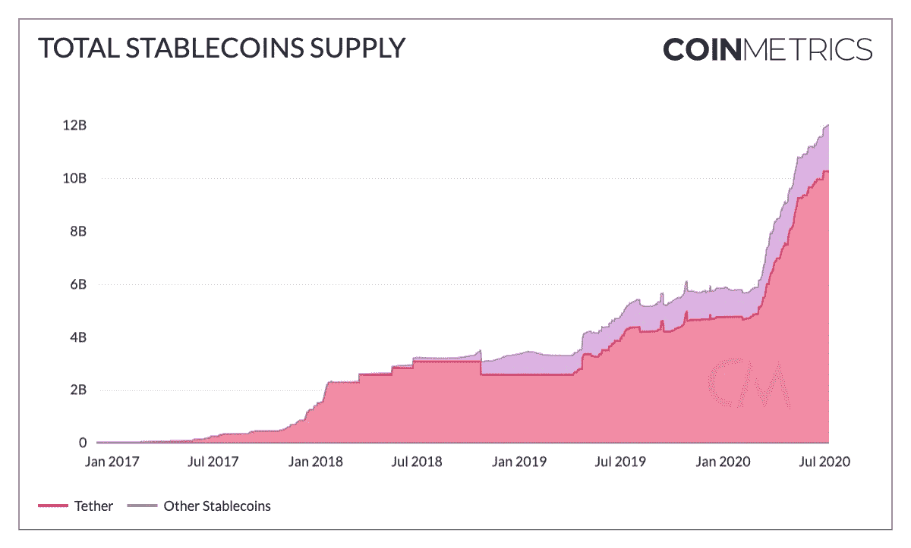

# 支付轨道的特征

> 原文：<https://medium.com/coinmonks/characteristics-of-payment-rails-c51024d2f81c?source=collection_archive---------0----------------------->

稳定硬币在过去的几个月里有了显著的增长。与此同时，美国正在应对影响消费的全球疫情的负面影响。如果加密货币变得可以消费，它需要利用支付基础设施。让我们看看这可能会构成什么。

