# 图表趣味|比特币基地

> 原文：<https://medium.com/coinmonks/chart-fun-coinbase-ipo-82ce0ab29d2d?source=collection_archive---------7----------------------->

## 面对不确定性时猜测的艺术

比特币基地全球公司的首次公开募股即将上市。在 IPO 和各种颜色的加密货币吸引眼球之际，比特币基地的直接上市独树一帜。

随着一个重要的加密经济基础设施参与者接近 IPO，人们应该如何看待业务、IPO 定价和估值？

猜测是一种困难的艺术形式。当这种艺术形式被召唤去拿起武器对抗以前未知的对手(加密经济基础设施玩家)时，它通常会击败仓促撤退。

当市场参与者面临缺乏先例的机会时，市场会退回到启发式，并使用现有的心理模型来形成观点。在极端情况下，所有形式的思考都被搁置，市场开始关注这些机会，因为 FOMO(害怕错过)驱动着行为。缺乏既定的判断参数往往会导致定价过高或过低的狂躁发作。随着对市场理解的加深，错误定价往往会自我纠正。

本期《图表趣事》着眼于比特币基地 IPO，当遇到难以预测的问题时，采用了我更喜欢的[费米问题](https://en.wikipedia.org/wiki/Fermi_problem)方法。

*免责声明:和所有猜测一样，这种心理模型很可能是不充分的，或者更糟，完全错误的。这不是一个要约或征求认购首次公开募股。在拿你的资本冒险之前，请行使独立的判断。*

## 一)背景

一些 S-1 文件的背景资料。

**业务**

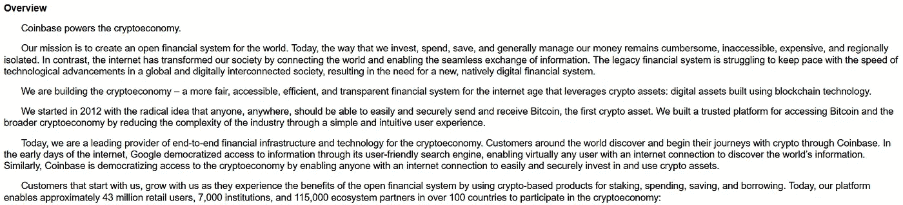

**网络效应**

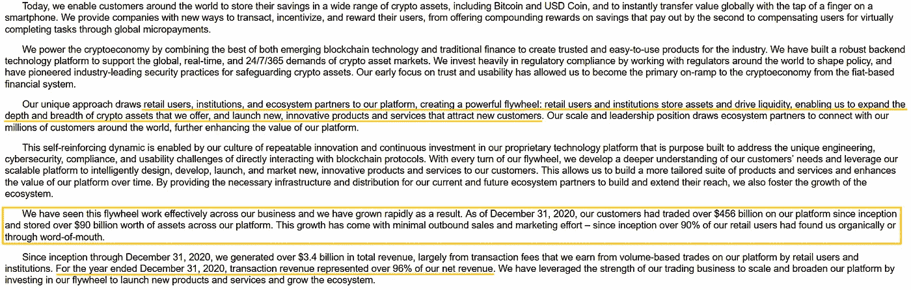

**新兴产业，规模**

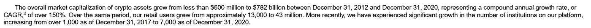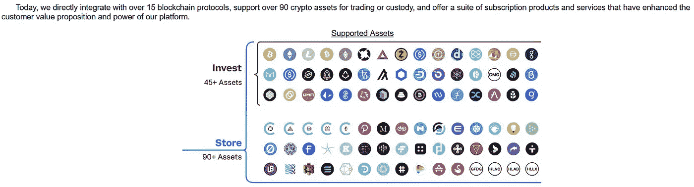

自 2012 年成立以来，比特币基地的收入已经达到 13 亿美元，同时实现了盈利:这在最近的科技 IPO 中是罕见的。

**加密货币应用**

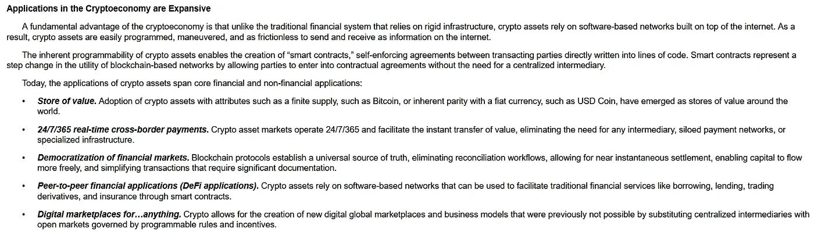

**比特币基地产品套件**

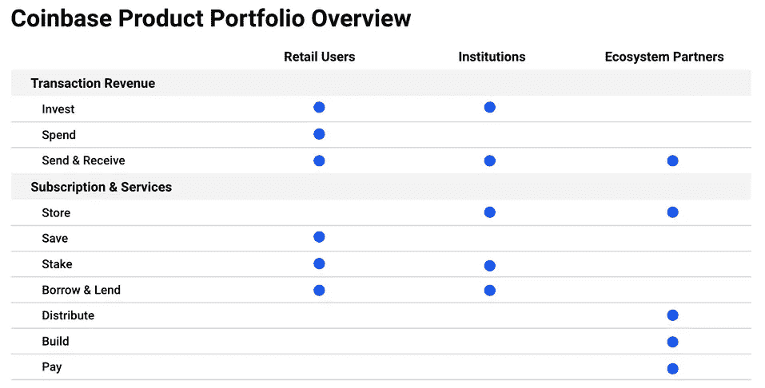

**关键业务指标、收入**

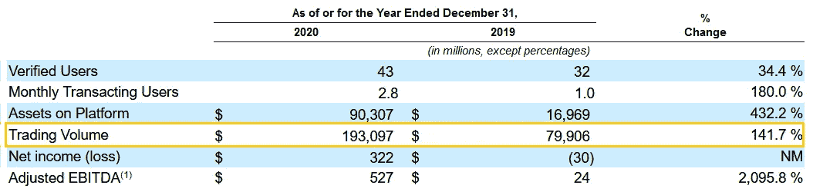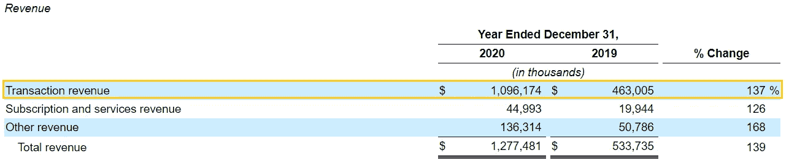

**交易收入——来自比特币基地平台交易的**交易费用——是**收入的主要来源(总收入的 86%)**。

## II)比特币基地 IPO 定价:仅交易心理模型

在这种现实模式中，比特币基地将沿着一条只进行交易的道路发展。比特币基地的收入将来自其平台上加密货币交易的交易费(**【Take-rate】**)。

此外，这种心理模型将整个加密货币资产类别视为一个整体。比特币基地的命运将由以下因素决定:

> ***1。比特币基地在加密货币交易量中的份额。***
> 
> **2*。在其平台上处理的交易接受率。***
> 
> ***3。利润率。***

**心理模型以 5 年为视角，将加密货币的潜在未来情景视为今天黄金市值的百分比**(加密货币试图推翻的无风险现任者的代表)。

## 这些场景

**一、碰撞燃烧**

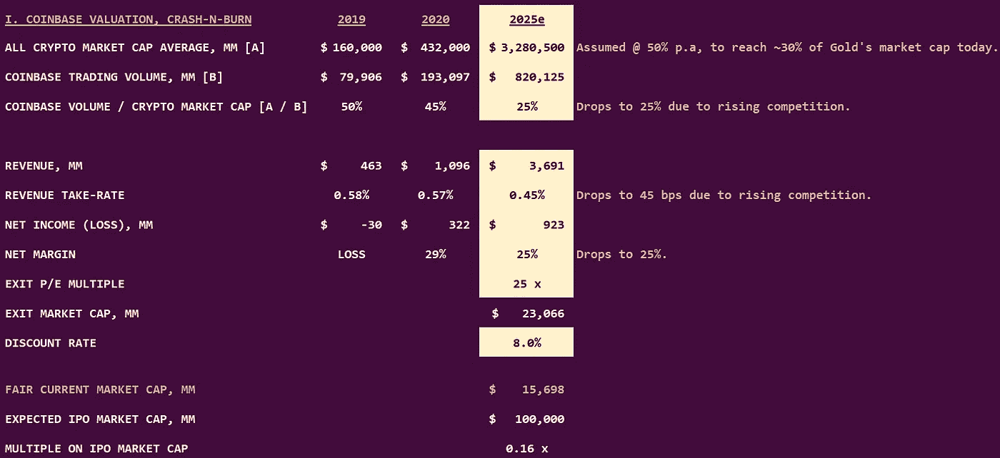

Scenario 1: Crash-n-Burn. Gold market cap [source](https://companiesmarketcap.com/assets-by-market-cap/). Cryptocurrency market cap [source](https://coinmarketcap.com/charts/).

从这个角度来看，加密货币资产类别将增长到今天黄金市值的三分之一。**由于竞争加剧，交易收取率降至 45 个基点**和**利润率压缩至 25%** 。

> 以 25 倍的退出市盈率计算，如今的“合理”市值= 160 亿美元。

**二。底座**

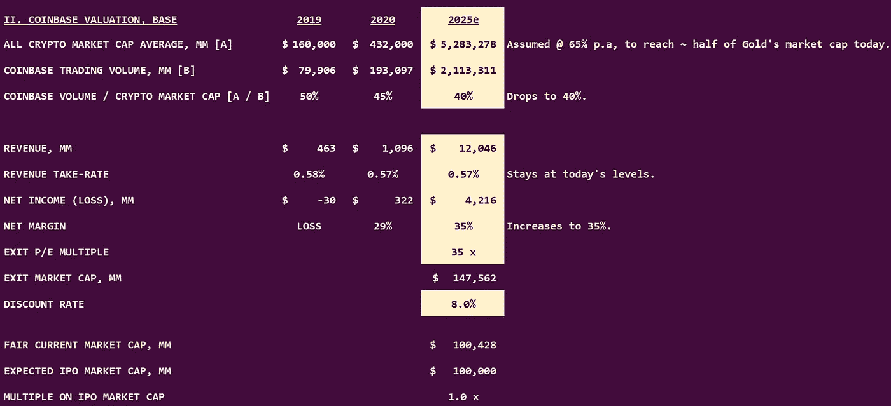

Scenario 2: Base

在这个世界上，加密货币资产类别将达到目前黄金市值的一半。交易**收取率保持在今天的水平**和**利润率扩大到 35%** 。

> 以 35 倍的退出市盈率计算，如今的“合理”市值= 1000 亿美元。
> 
> 解读比特币基地预期的 1000 亿美元 IPO 市值的一种方式是，市场预期会出现上述现实情况。

5 家交易所(洲际交易所、芝加哥商品交易所、CBOE 交易所、NDAQ 交易所、DBOEY 交易所)的平均收入为 53 亿美元。平均十年净利润率= 29% 。

在这幅现实图景中，**比特币基地的收入必须增长至交易所同业平均水平的 2.3 倍。比特币基地还必须比同行平均水平更有利可图。**

似是而非？

**III。蓝天**

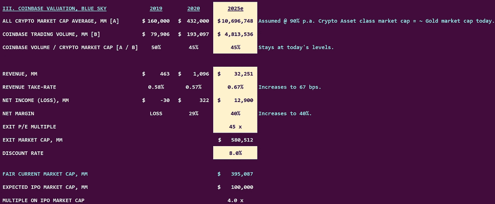

Scenario 3: Blue Sky

从现实的角度来看，加密货币资产类别将与今天黄金的市值相当。交易**收取率增加到 67 个基点**，**利润率扩大到 40%** 。

随着这场最精彩的表演，**倍数**扩大到一个有力的**45 倍**。

> 以 45 倍的退出市盈率计算，如今的“合理”市值= 3950 亿美元。

比特币基地的收入将达到 320 亿美元，超过目前同类交易所的总收入。

似是而非？

## III)市场告诉我们什么？

> 崩盘后市值= 160 亿美元，比 IPO 定价低 84%。
> 
> 基础市值= 1000 亿美元=预期 IPO 定价。
> 
> 蓝天市值= 3950 亿美元，比 IPO 定价高出 295%。

**场景**揭示了市场对加密货币，尤其是比特币基地的隐性预期。

**隐含的市场假设**

1.  **在很长一段时间内，加密货币将是一种超高速增长的资产类别**。
2.  随着时间的推移，比特币基地的**规模和网络效应护城河将继续加强**。
3.  比特币基地将成为世界上最大最赚钱的平台。

**市场假设不一致**

**高交易接受率:**随着加密货币资产类别成为主流，交易摩擦可能会减少。这可能会对利率产生下行压力。**基础和蓝天情景假设未来的增长率与**持平。

## IV)从更长的时间来看…

根据对比特币基地价值的关键驱动因素的假设，查看*公允价值*的范围。

Coinbase Fair Valuation ranges: Author’s Framework.

***左侧面板:*** *直方图=比特币基地的公允价值范围，单位为百万美元。青色线=预期 IPO 定价。*

***右图:*** *特定假设下的每股公允价值的价值驱动因素。*

预期的 IPO 定价在**公允价值范围的第 79 个百分点**。

> 比特币基地必须实现超高增长和超高盈利能力(CAGR 收入超过 35%，营业利润率超过 45%)，才能证明预期的 IPO 定价是合理的。

## v)已知的未知

上面描述的 ***心智模型(仅交易)*** 不允许针对 ***订阅&服务收入*** 垂直的任何信用给比特币基地。这将是其平台上的加密资产的功能。在**蓝天场景中，这可能意味着 25-55 亿美元的额外收入流**。

**DeFi 应用用例**:随着 DeFi(分散式金融)用例的激增，这将为比特币基地带来额外的扩展途径。该公司已经表现出在这方面进行创新的意愿。

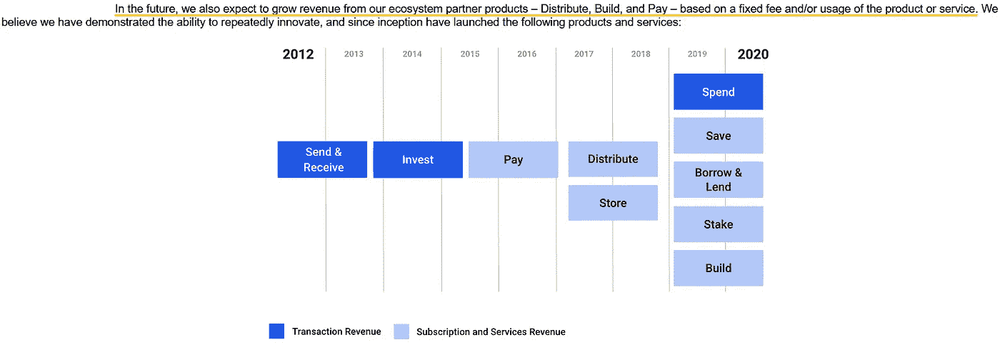

**交易所数据服务**——将数据货币化——是当今交易所的一个重要收入来源。比特币基地可能会利用类似的途径来推动增长，并加强平台效应。

一个新生的高速增长的资产类别，以及交易价值链中的低效率，对比特币基地来说是一个长期机遇。挑战在于它如何优化规模增长和盈利能力。

转到列表。

> 加入 T42 电报集团，学习加密交易和投资

## 另外，阅读

*   最好的[加密交易机器人](/coinmonks/crypto-trading-bot-c2ffce8acb2a) | [网格交易机器人](https://blog.coincodecap.com/grid-trading)
*   [加密复制交易平台](/coinmonks/top-10-crypto-copy-trading-platforms-for-beginners-d0c37c7d698c) | [如何在 WazirX 上购买比特币](/coinmonks/buy-bitcoin-on-wazirx-2d12b7989af1)
*   【Crypto.com 评论】|[|](/coinmonks/crypto-com-review-f143dca1f74c)|[信用交易](/coinmonks/huobi-margin-trading-b3b06cdc1519)
*   [尤霍德勒 vs 科恩洛 vs 霍德诺特](/coinmonks/youhodler-vs-coinloan-vs-hodlnaut-b1050acde55a) | [Cryptohopper vs 哈斯博特](https://blog.coincodecap.com/cryptohopper-vs-haasbot)
*   [杠杆代币](/coinmonks/leveraged-token-3f5257808b22) | [最佳密码交易所](/coinmonks/crypto-exchange-dd2f9d6f3769) | [Paxful 点评](/coinmonks/paxful-review-4daf2354ab70)
*   [如何在印度购买比特币？](/coinmonks/buy-bitcoin-in-india-feb50ddfef94) | [WazirX 评论](/coinmonks/wazirx-review-5c811b074f5b) | [BitMEX 评论](https://blog.coincodecap.com/bitmex-review)
*   [双子座 vs 比特币基地](https://blog.coincodecap.com/gemini-vs-coinbase) | [比特币基地 vs 北海巨妖](https://blog.coincodecap.com/kraken-vs-coinbase) | [硬币罐 vs 硬币点](https://blog.coincodecap.com/coinspot-vs-coinjar)
*   [币安 vs 北海巨妖](https://blog.coincodecap.com/binance-vs-kraken) | [美元成本平均交易机器人](https://blog.coincodecap.com/pionex-dca-bot)
*   [印度比特币交易所](/coinmonks/bitcoin-exchange-in-india-7f1fe79715c9) | [比特币储蓄账户](/coinmonks/bitcoin-savings-account-e65b13f92451)
*   [币安收费](/coinmonks/binance-fees-8588ec17965) | [Botcrypto 审查](/coinmonks/botcrypto-review-2021-build-your-own-trading-bot-coincodecap-6b8332d736c7) | [Hotbit 审查](/coinmonks/hotbit-review-cd5bec41dafb) | [KuCoin 审查](https://blog.coincodecap.com/kucoin-review)
*   [我的密码副本交易经历](/coinmonks/my-experience-with-crypto-copy-trading-d6feb2ce3ac5) | [购买硬币回顾](https://blog.coincodecap.com/buycoins-review)
*   [加密货币储蓄账户](/coinmonks/cryptocurrency-savings-accounts-be3bc0feffbf) | [YoBit 审核](/coinmonks/yobit-review-175464162c62) | [Bitbns 审核](/coinmonks/bitbns-review-38256a07e161)
*   [最佳比特币保证金交易](/coinmonks/bitcoin-margin-trading-exchange-bcbfcbf7b8e3) | [萝莉点评](/coinmonks/lolli-review-e6ddc7895ad8) | [比特币保证金交易](https://blog.coincodecap.com/bityard-margin-trading)
*   [加密保证金交易交易所](/coinmonks/crypto-margin-trading-exchanges-428b1f7ad108) | [赚取比特币](/coinmonks/earn-bitcoin-6e8bd3c592d9) | [Mudrex 投资](https://blog.coincodecap.com/mudrex-invest-review-the-best-way-to-invest-in-crypto)
*   [如何在印度购买以太坊？](https://blog.coincodecap.com/buy-ethereum-in-india) | [如何在币安购买比特币](https://blog.coincodecap.com/buy-bitcoin-binance)
*   [顶级付费加密货币和区块链课程](https://blog.coincodecap.com/blockchain-courses) | [币安评论](/coinmonks/binance-review-ee10d3bf3b6e)
*   [MXC 交易所评论](/coinmonks/mxc-exchange-review-3af0ec1cba8c) | [Pionex vs 币安](https://blog.coincodecap.com/pionex-vs-binance) | [Pionex 套利机器人](https://blog.coincodecap.com/pionex-arbitrage-bot)
*   [在美国如何使用 BitMEX？](https://blog.coincodecap.com/use-bitmex-in-usa) | [BitMEX 回顾](https://blog.coincodecap.com/bitmex-review) | [币安 vs Bittrex](https://blog.coincodecap.com/binance-vs-bittrex)