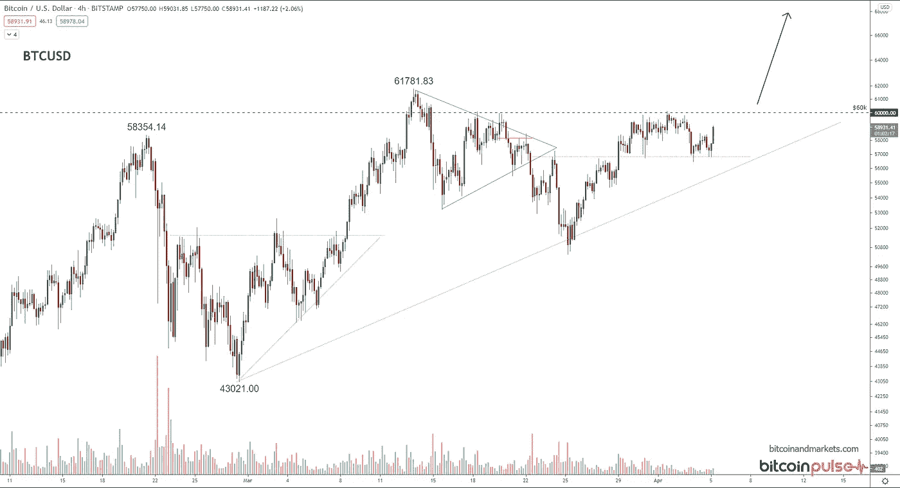
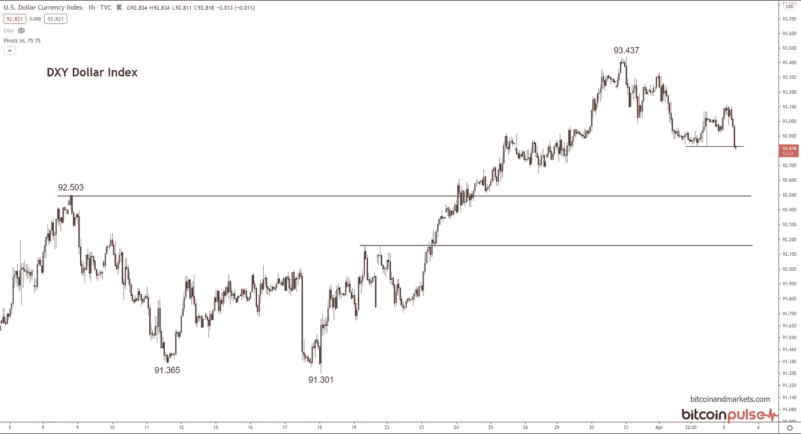
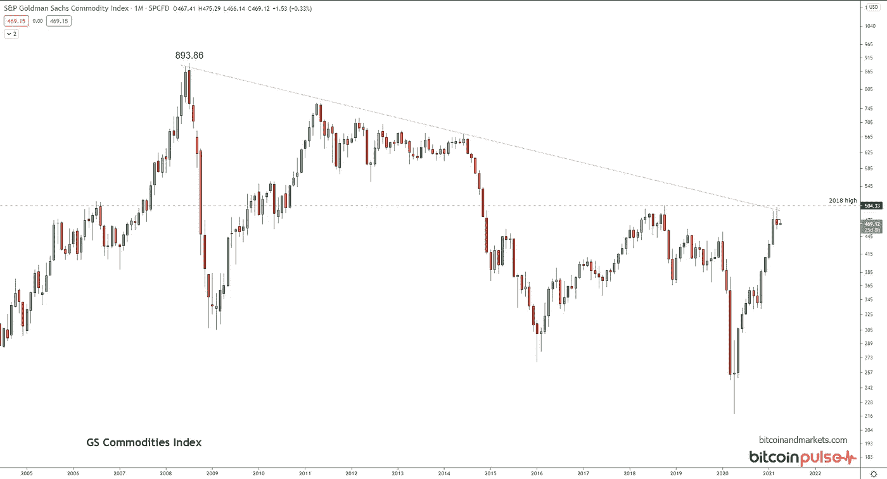
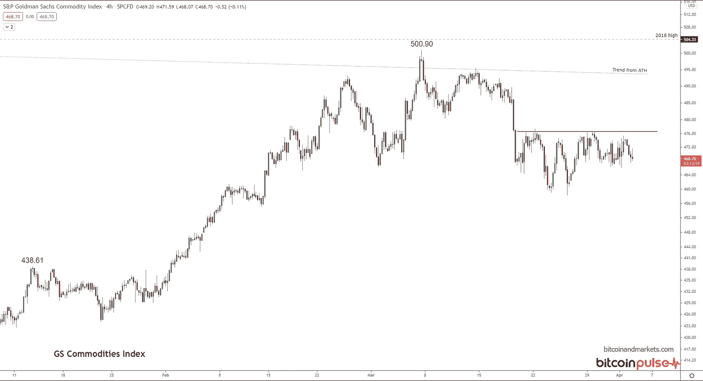
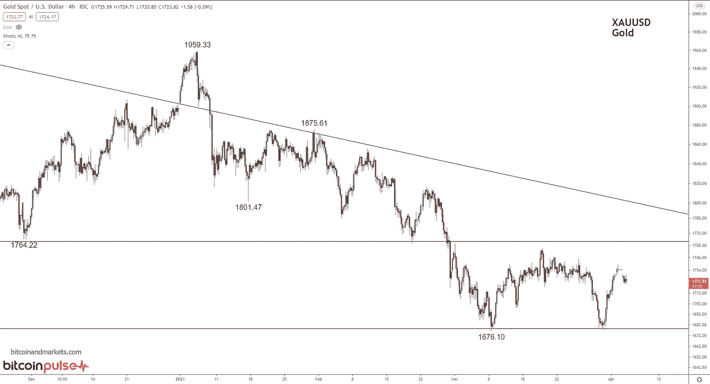
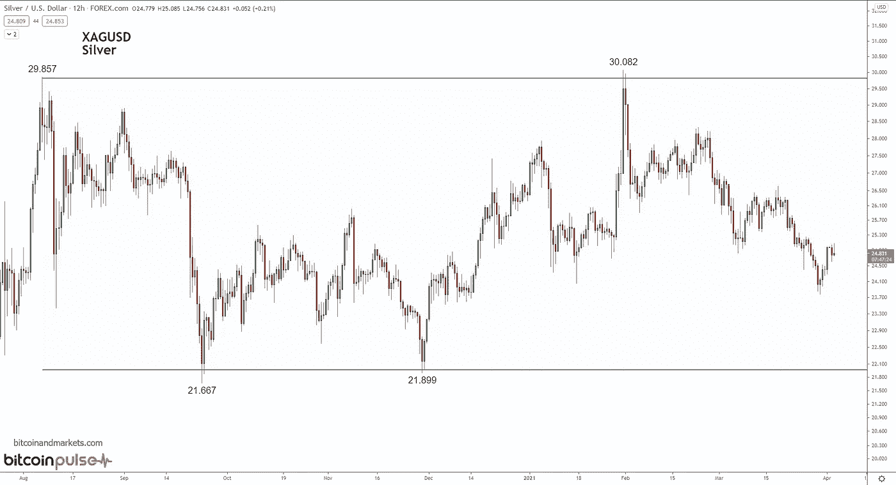
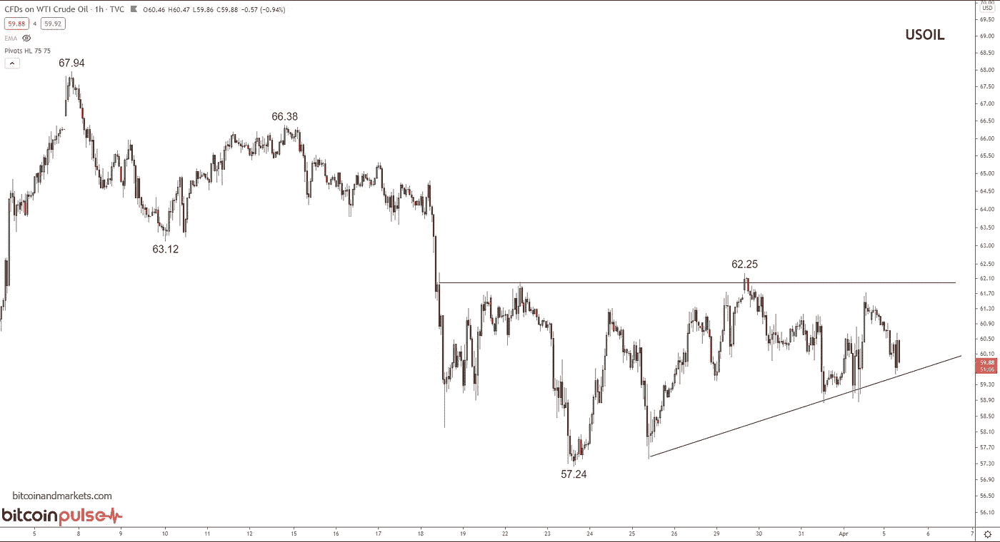
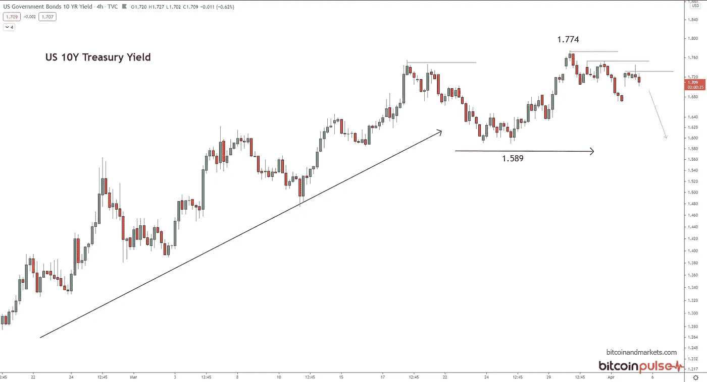

# 2021 年 4 月 5 日图表纲要——比特币、美元、大宗商品、黄金、白银、石油和利率

> 原文：<https://medium.com/coinmonks/chart-rundown-for-4-5-2021-bitcoin-dollar-commodities-gold-silver-oil-and-interest-rates-87394dc65787?source=collection_archive---------6----------------------->

欢迎回到 BTCM 研究，请考虑[订阅](https://btcm.co/subscribe/)直接接收这些文章到你的收件箱。我们所有的内容仍然是免费的。我们暂时推迟了对这一重要内容收费的计划。

这是新的一周，也是我们所有图表的新更新。上周之后提出了一些问题，关于我们的总体论文，你可以在这里找到我们的[框架大纲](https://btcm.co/thesis-framework/)。总结一下，1)现有美元体系的终极通缩，2)比特币向传统法定体系的扩张，3)中国奇迹的终结，4)去中心化技术的传播，5)看空欧盟。

现在来看图表…

# 比特币

比特币的价格看起来非常强劲。我想鼓励任何阅读这篇文章的人，如果他们想要对比特币产生的宏观话题进行更详细的分析，包括美元、黄金、其他货币和全球市场，请查看我的会员信，名为*比特币脉冲*。本周新一期即将发行，我将在其中讨论比特币的许多技术指标，以及重要基本面的概要。我也给比特币下一步走势一个价格目标。你可以在 bitcoinandmarkets.com 报名。

正如你在这里看到的，比特币正在逼近历史高点，并准备爆发。从历史上看，当比特币处于类似模式时，爆发的可能性很大。

# 美元指数

快速跳到美元，我们可以看到价格在 4 月 2 日低点以下的短期崩溃。然而，在测试左边的 3 月高点之前，有足够的空间和支撑。我上周确定的水平，阻力在 94.5 左右，当它突破 95 以上时，一个大规模的叫醒电话仍然存在。然而，美元看起来想要慢慢达到这些水平。

# 商品

我们听到很多关于大宗商品超级周期变得看涨的说法，但这方面的证据仍然很少。在 2020 年的通缩冲击以及随之而来的供应冲击之后，我们预计大宗商品价格将像目前一样反弹，因为供应下降速度快于需求。但是，为了大宗商品可持续的长期牛市转变，全球经济必须是增长的，而不是萎缩的。

高盛商品指数(GSCI)的月线图(下图)提醒我们:

GSCI 是我们拥有的最广泛的大宗商品指数，如下图所示，4 小时图显示，它甚至没有达到 2018 年的高点。最近的价格走势看起来是在 476 的阻力位盘整。随着美元继续走强，以及全球经济在 2021 年重新陷入严重衰退的风险，我们应该会看到大宗商品下跌。

# 金色的

黄金继续挣扎，但已经形成了一个漂亮的双底。趋势仍然较低，多头有很多东西要证明。也就是说，在进一步下跌之前，我不会对涨到 1780 美元感到惊讶。我仍将 1500-1600 美元区间视为未来几个月的最终底部，然后反弹至新高。

黄金还没有完全消亡，但我不会用它来代替比特币。

# 银

白银价格在 21 美元到 30 美元之间波动。这是一个非常大的百分点范围，使得白银非常不稳定。我没有算过这些数字，但它看起来比比特币更不稳定。与黄金相比，我更不看好作为货币金属的白银，但我认为，在反弹中，白银可以轻松跑赢黄金，因为它的市场流动性更差。短期来看，我对白银没有强烈的信心，但在未来一两年内，我预计它将接近 100 美元/盎司。

# 油

我以前写过，60 美元是美国页岩生产的关键价格。在这个价格下，大多数运营都是有利可图的，2020 年离线的产能将慢慢开始恢复在线。因此，我预测油价很难长期保持在 60 美元。

换句话说，如果全球石油供应链保持稳定，原油价格将在今年剩余时间里温和下跌。我之所以这么说，是因为知道石油市场的稳定是不可能的，尤其是在美国收回其作为全球警察的影响力之际。今年将会出现剧烈的动荡，这将给全球油价增加一些上行压力，就像最近苏伊士运河的崩溃，集装箱船 Ever Green 阻止了 10%的全球石油配送。尽管出现了这种混乱，油价在此期间仍温和下跌。

我预测今年年底油价将达到 50 美元/桶，如果不是更低的话。本周我会写一篇关于石油的大文章，所以请留意。

# 利率

最后，我将简要介绍一下美国国债利率的最新情况。10 年期美国国债收益率上周在我发布图表纲要的当天见顶。自那以来，收益率一直疲软，意味着 10 年期国债价格走强。上升趋势可能正在改变，因为收益率上升的陡度已经停滞了 2 周，可能会在我们说话的时候滚动。

随着全球美元短缺再次抬头，较低的收益率符合我们的论点。

收益率曲线目前的表现没有什么异常。它已经反弹，但所有许多十年之久的趋势仍然完好无损。没有迹象表明，利率飙升或美元金融体系面临危险迫在眉睫。

比特币进入美元的领地不会让美元膨胀。随着比特币吞噬市场份额，发行的美元信贷将减少，这意味着基于美元的增长将受到影响，全球美元供应将萎缩。

这就是这周的内容。请订阅分享。

*最初发表于 2021 年 4 月 5 日《比特币与市场研究》。*

> 加入 Coinmonks [电报集团](https://t.me/joinchat/Trz8jaxd6xEsBI4p)，了解加密交易和投资

## 另外，阅读

*   [什么是融资融券交易](https://blog.coincodecap.com/margin-trading)
*   最好的[密码交易机器人](/coinmonks/crypto-trading-bot-c2ffce8acb2a) | [网格交易](https://blog.coincodecap.com/grid-trading)
*   [3 商业评论](/coinmonks/3commas-review-an-excellent-crypto-trading-bot-2020-1313a58bec92) | [Pionex 评论](/coinmonks/pionex-review-exchange-with-crypto-trading-bot-1e459d0191ea) | [Coinrule 评论](/coinmonks/coinrule-review-2021-a-beginner-friendly-crypto-trading-bot-daf0504848ba)
*   [AAX 交易所评论](/coinmonks/aax-exchange-review-2021-67c5ea09330c) | [德里比特评论](/coinmonks/deribit-review-options-fees-apis-and-testnet-2ca16c4bbdb2) | [FTX 交易所评论](/coinmonks/ftx-crypto-exchange-review-53664ac1198f)
*   [n ave 零点回顾](/coinmonks/ngrave-zero-review-c465cf8307fc) | [Phemex 回顾](/coinmonks/phemex-review-4cfba0b49e28) | [PrimeXBT 回顾](/coinmonks/primexbt-review-88e0815be858)
*   [Bybit Exchange 审查](/coinmonks/bybit-exchange-review-dbd570019b71) | [Bityard 审查](/coinmonks/bityard-review-7d104239be35) | [CoinSpot 审查](https://blog.coincodecap.com/coinspot-review)
*   [3 commas vs crypto hopper](/coinmonks/3commas-vs-pionex-vs-cryptohopper-best-crypto-bot-6a98d2baa203)|[赚取加密利息](/coinmonks/earn-crypto-interest-b10b810fdda3)
*   最好的比特币[硬件钱包](/coinmonks/the-best-cryptocurrency-hardware-wallets-of-2020-e28b1c124069?source=friends_link&sk=324dd9ff8556ab578d71e7ad7658ad7c) | [BitBox02 回顾](/coinmonks/bitbox02-review-your-swiss-bitcoin-hardware-wallet-c36c88fff29)
*   [莱杰 vs n ave](/coinmonks/ledger-vs-ngrave-zero-7e40f0c1d694)|[莱杰 nano s vs x](/coinmonks/ledger-nano-s-vs-x-battery-hardware-price-storage-59a6663fe3b0)
*   [密码本交易平台](/coinmonks/top-10-crypto-copy-trading-platforms-for-beginners-d0c37c7d698c) | [Coinmama 审核](/coinmonks/coinmama-review-ace5641bde6e)
*   [CoinLoan 评论](/coinmonks/coinloan-review-18128b9badc4) | [YouHodler 评论](/coinmonks/youhodler-4-easy-ways-to-make-money-98969b9689f2) | [BlockFi 评论](/coinmonks/blockfi-review-53096053c097)
*   最好的[加密税务软件](/coinmonks/best-crypto-tax-tool-for-my-money-72d4b430816b) | [CoinTracking 评论](/coinmonks/cointracking-review-a-reliable-cryptocurrency-tax-software-5114e3eb5737)
*   最佳[加密借贷平台](/coinmonks/top-5-crypto-lending-platforms-in-2020-that-you-need-to-know-a1b675cec3fa) | [杠杆代币](/coinmonks/leveraged-token-3f5257808b22)
*   [block fi vs Celsius](/coinmonks/blockfi-vs-celsius-vs-hodlnaut-8a1cc8c26630)|[Hodlnaut 审核](/coinmonks/hodlnaut-review-best-way-to-hodl-is-to-earn-interest-on-your-bitcoin-6658a8c19edf)
*   [Bitsgap 审查](/coinmonks/bitsgap-review-a-crypto-trading-bot-that-makes-easy-money-a5d88a336df2) | [Quadency 审查](/coinmonks/quadency-review-a-crypto-trading-automation-platform-3068eaa374e1) | [Bitbns 审查](/coinmonks/bitbns-review-38256a07e161)
*   [埃利帕尔泰坦评论](/coinmonks/ellipal-titan-review-85e9071dd029) | [赛克斯斯通评论](/coinmonks/secux-stone-hardware-wallet-review-15-discount-coupon-2020-7577032faa6e)
*   [本地比特币审核](/coinmonks/localbitcoins-review-6cc001c6ed56) | [加密货币储蓄账户](https://blog.coincodecap.com/cryptocurrency-savings-accounts)
*   最佳[区块链分析](https://bitquery.io/blog/best-blockchain-analysis-tools-and-software)工具| [赚比特币](/coinmonks/earn-bitcoin-6e8bd3c592d9)
*   [加密套利](/coinmonks/crypto-arbitrage-guide-how-to-make-money-as-a-beginner-62bfe5c868f6)指南| [如何做空比特币](/coinmonks/how-to-short-bitcoin-568a2d0b4ae5)
*   最佳[加密制图工具](/coinmonks/what-are-the-best-charting-platforms-for-cryptocurrency-trading-85aade584d80) | [最佳加密交易所](/coinmonks/crypto-exchange-dd2f9d6f3769)
*   [如何在印度购买比特币？](/coinmonks/buy-bitcoin-in-india-feb50ddfef94) | [WazirX 评论](/coinmonks/wazirx-review-5c811b074f5b)
*   [印度比特币交易所](/coinmonks/bitcoin-exchange-in-india-7f1fe79715c9) | [比特币储蓄账户](/coinmonks/bitcoin-savings-account-e65b13f92451)
*   [CoinDCX 评论](/coinmonks/coindcx-review-8444db3621a2) | [加密保证金交易交易所](https://blog.coincodecap.com/crypto-margin-trading-exchanges)