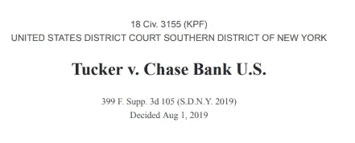

# 大通银行在联邦法庭上辩称，购买加密货币是类似现金的交易

> 原文：<https://medium.com/coinmonks/chase-bank-argues-in-federal-court-that-cryptocurrency-purchases-are-cash-like-transactions-2945d8cd0e94?source=collection_archive---------1----------------------->

## 塔克诉大通银行美国案的律师解释，北美(2019) 399 F. Supp. 3d 105

2017 年 9 月，摩根大通首席执行官杰米·戴蒙(Jamie Dimon)称比特币为“欺诈”，并表示他将解雇任何被抓到交易比特币的人。任何关注比特币和加密货币有一段时间的人都知道，自那次评论以来，我们已经看到摩根大通对比特币和加密货币的立场发生了相当大的转变。但是如果你拿着你的大通银行信用卡去买比特币，会发生什么呢？那时，Chase 会说你用它来取现。但是，用比特币购买加密货币是在你的信用额度上提取预付款吗？

嗯，我最近碰到一个有趣的案例，涉及到这个有趣的问题:这是 ***塔克诉大通银行美国，N.A.* ，(2019) 399 F. Supp. 3d 105。**

布雷迪·塔克、瑞安·希尔顿和斯坦顿·史密斯(“原告”)是大通银行的客户，他们在上次牛市中使用大通信用卡购买了各种加密货币。从 2017 年到 2018 年，大通根据所有原告签署的信用卡协议，将收购加密货币归类为“购买”。通过将这些交易指定为*购买*，这些交易的利率比大通将这些交易归类为“预付现金”时的利率要低。"*根据信用卡协议，预付现金需要支付更高的利率和交易费用。然而，从 2018 年 1 月 23 日到 2 月 2 日，大通开始将原告的加密货币收购归类为*现金垫款*。*

原告对大通提起诉讼，声称大通违反了合同。原告辩称，从大通开始将他们的加密货币收购归类为*现金垫款*的那一刻起，它就违反了信用卡协议的条款。

在我们进入法院对本案的分析之前，有必要注意一下法院认为重要的信用卡协议的一些重要方面。原告签订的信用卡协议将*购买*定义为用于“购买商品和服务”的交易关于*预借现金，*协议明确说明:

> *“您可以从银行的自动柜员机或使用【大通银行签发的】预支现金支票获得现金。除非我们[大通]另有规定，否则支付给现金或您本人的余额转账支票或促销支票将被视为预支现金。我们将某些其他交易视为预付现金。参见上述重要定义[部分]下的'****'部分。”***

**该协议规定了具体的类似现金的交易**

> ***”。。。购买旅行支票、外币、汇票、电汇或类似的现金交易；购买彩票、赌场游戏筹码、赛马赌注或类似的投注交易；并使用第三方服务进行支付。”***

**大通的立场是，根据信用卡协议，*类似现金的交易*将被指定为*预付现金*，并被分配适当的利率。(利息更高)**

**在裁决此案时，受联邦管辖的纽约南区法院必须首先确定加密货币的收购是否不能归类为大通信用卡协议含义内的*现金垫款*。这是原告索赔的关键。大通辩称，根据协议条款，收购加密货币是一项类似现金的交易。这场纠纷最终归结为纽约联邦法院如何解释本协议中的术语*类似现金交易*。**

**因为协议规定特拉华州法律将有效，纽约法院在解释该术语时转向了特拉华州法律。根据特拉华州法律，原告必须证明(1)合同的存在，(2)违反了合同，(3)因此遭受了损失。在解释合同义务是否被违反时，法院将通过审查相关协议来寻找双方的共同意图。如果一个术语是清楚的，不含糊的，法院必须注意这个术语的“通常意义”。当这个术语的含义如此普遍，以至于处于任何一方地位的一个通情达理的人都不会有与它不同的期望时，这个普通的含义起着支配作用。因此，当一个通情达理的人的解释与通常的含义一致时，仅仅因为当事人可能对一个术语有不同意见并不一定意味着该术语是模糊的。当双方当事人就他们对合同条款的意图提出主观的争论时，法院经常使用合理的人标准来创造一个客观的标准。**

**最终，它归结为:如果大通能够证明加密货币收购符合协议下的*类似现金交易*，并且这是该条款的唯一合理解释，那么原告的案件必须被驳回。然而，如果原告能够证明他们有理由相信*类似现金的交易*排除了加密货币，那么他们可以继续向大通提出索赔。**

**大通在法庭上辩称，加密货币交易显然是类似现金的交易，应该被视为合同项下的预付现金。Chase 认为,*类似现金的交易*应该用这个术语的简单含义来解释。他们请法院参考字典中对“现金”的定义:**

> ***“‘现金’一词通常被理解为‘钱’的意思，而‘钱’反过来又是‘被普遍接受的交换媒介、价值尺度或支付手段’”(Def。大不列颠的 11(引用韦氏词典在线词典对“钱”的定义))；***

**因此，Chase 认为类似现金的交易是购买任何被接受为支付手段的物品。当我读的时候，我不得不承认我很惊讶。比特币到底是不是“诈骗”？**

**另一方面，原告认为“现金”一词指的是实物、政府发行的(“法定”)货币。他们用信用卡协议中大通自己的语言来反驳他们，指出其中一节说:**

> ***“您可以从银行的自动柜员机或使用【大通银行签发的】预支现金支票获得现金。”***

**因此，在双方签订协议时，双方将*现金*理解为法定货币。基于这种解释，原告认为术语*类似现金交易*仅代表法定货币的索赔，如支票、汇票和电汇。你应该记得，协议中的定义是“购买旅行支票、外币、汇票、电汇或类似的现金交易”**

**原告律师援引了一条广为人知的法律解释规则，即 *ejusdem generis* 。我知道…律师喜欢拉丁语，这是他们获得报酬的方式。 *Ejusdem generis* 是一个在解释解释松散的法规时通常使用的原则。它指出，当一般语言列出特定类别的人或事物，然后以一般方式提及它们时，一般陈述仅适用于在它之前具体列出的同类人或事物。因此，原告认为术语*类似现金交易*应该被理解为仅限于在信用卡协议中出现的词语:(”。。。购买旅行支票、外币、汇票、电汇或类似的现金交易)在本声明中，类似现金交易之前的词语有一个共同点:它们都是具有货币价值的金融工具，创造了对法定货币的法律要求。因此，*类似的现金交易*可能是合理限定的货币价值，这就产生了对法定货币的合法主张。在本案中，法院最终站在原告一边，同意因为。。。加密货币并不赋予其持有者对任何政府发行的货币的合法权利，加密货币的收购不能被归类为类似现金的交易。**

**我们能从这个案例中学到什么？首先，我不会再尝试这种说法，因为大通银行无疑从这个错误中吸取了教训，并重新编写了他们信用卡协议的语言来反映这一点。在我看来，信用卡协议不是重点。对我来说，更有趣的是它为大通如何开始看待加密货币开创了先例。当你拥有世界上最大的银行之一时，一家母公司两年前曾称比特币为“欺诈”，在联邦法官面前辩称购买加密货币就是购买现金，这就是进步。这将是一个有趣的案例，因为法院根据一个理性的人如何看待两者来定义术语*加密货币*和*现金*的交叉。但最终，这是朝着正确方向迈出的一步。事实上，不只是一步…一个飞跃。**