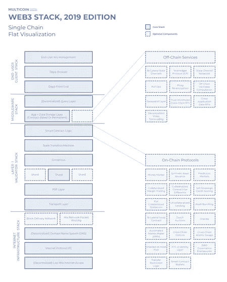
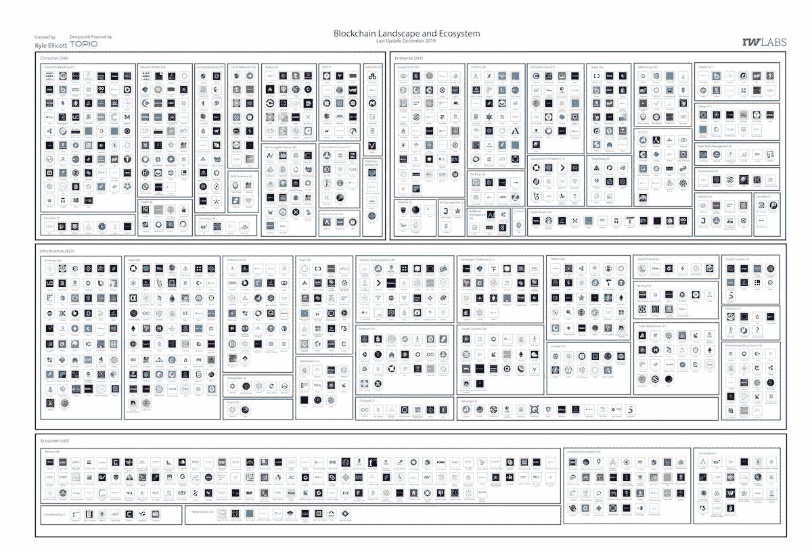

# 中国区块链的世界领导者/ Nike Tokenizing 鞋/ Anthem 使用区块链处理 4000 多万会员数据

> 原文：<https://medium.com/coinmonks/china-blockchains-world-leader-nike-tokenizing-shoes-anthem-using-blockchain-for-40m-member-d71401a7427?source=collection_archive---------3----------------------->

Photo by [Luke Paris](https://unsplash.com/@paradoxis?utm_source=unsplash&utm_medium=referral&utm_content=creditCopyText) on [Unsplash](https://unsplash.com/s/photos/digital?utm_source=unsplash&utm_medium=referral&utm_content=creditCopyText)

*2019 年 12 月 18 日*

*本周的版本充满了节日的欢乐，因为我们看到了两张新的行业版图——区块链(2019 年第四季度)和 DApps。随着* ***中国*** *有望成为区块链世界的领导者，我们也看到了更多来自亚洲的消息。* ***耐克*** *准备标记鞋子，而****Anthem****已经开始使用区块链技术帮助其 4000 多万患者安全地访问和共享他们的医疗数据。****Gartner****发布报告称，美国 75%的物联网技术采用者已经采用或计划在 2020 年底前采用区块链。又到了 2020 年预测的时间了，还有年底的报告，我们已经从****Messari*******区块链资本*** *等等。**

**In the DApps landscape, we kick off with* ***Multicoin Capital’s*** *2019 Edition of their view on the* ***Web3*** *stack, aiming to show Web3 stack as a set of interoperable networks. We also have 2020 predictions on the DApps ecosystem, along with* ***Flexa’s*** *mainnet launched, the latest on* ***nodes****,* ***storage,*** *and* ***WebAssembly****. We even found room to cram in plenty of research (*[*Q4 2019 Blockchain Landscape*](https://www.topionetworks.com/markets/blockchain-landscape-5bf43854b9abe4633c1f87da) *&* [*DApps Landscape*](https://www.topionetworks.com/markets/dapps-stack-landscape-5de8d07eb9abe453e04203f8)*) & books (on* [*Digital Assets*](https://www.scribd.com/document/430637579/Current-Market-Overview-of-Digital-Assets) *&* [*Enterprise Blockchain*](https://www.amazon.com/dp/B07Z3LJCHW/ref=cm_sw_r_tw_dp_U_x_C6iSDbACJJN2Z)*) along with insights on venture capital (new funds!!), infrastructure, DApps, Bitcoin, Economics, Exchanges, and Stablecoins. For MORE and to keep you up to speed, here’s a snapshot of the top stories this week around the industry.**

## *🇨🇳 [China looks to become blockchain world leader with Xi Jinping backing](https://www.cnbc.com/2019/12/16/china-looks-to-become-blockchain-world-leader-with-xi-jinping-backing.html)*

*China is poised to take the lead in blockchain after it was given strong backing by the country’s leader President Xi Jinping. The move could allow the world’s second-largest economy to control the development of the nascent technology in the absence of competition from other regions like Europe and the U.S…[read more](https://www.cnbc.com/2019/12/16/china-looks-to-become-blockchain-world-leader-with-xi-jinping-backing.html)*

## *📖 [Nike receives patent to tokenize shoes on Ethereum](https://www.theblockcrypto.com/linked/49958/nike-receives-patent-to-tokenize-shoes-on-ethereum)*

*在美国专利和商标办公室发布的一份文件中，耐克表示，它提议为一些鞋子生成唯一的 id 并创建 ERC 721 令牌。人们可以通过购买实物鞋来解锁这些代币，然后这些代币可以与唯一的所有者 id 相关联，以表示所有权。该公司表示，我们正在使用以太坊区块链来标记鞋子……[阅读更多信息](https://www.theblockcrypto.com/linked/49958/nike-receives-patent-to-tokenize-shoes-on-ethereum)*

## *📈 [Anthem 将在三年内使用区块链保护其 4000 万会员的医疗数据](https://www.forbes.com/sites/leahrosenbaum/2019/12/12/anthem-says-its-40-million-members-will-be-using-blockchain-to-secure-patient-data-in-three-years/)*

*总部位于美国的健康保险公司 Anthem 已经开始使用区块链技术来帮助患者安全地访问和共享他们的医疗数据。该公司计划推出这项功能，目前正处于试点测试阶段。Anthem 的首席数字官 Rajeev Ronanki 说，我们已经以多种方式使用区块链，更多的程序仍在开发中……[阅读更多](https://www.forbes.com/sites/leahrosenbaum/2019/12/12/anthem-says-its-40-million-members-will-be-using-blockchain-to-secure-patient-data-in-three-years/)*

## *📖 [Saga 推出 SGA 令牌，与脸书的天秤座加密货币竞争](https://www.cnbc.com/2019/12/10/saga-launches-sga-token-to-rival-facebooks-libra-cryptocurrency.html)*

*总部位于英国的区块链公司 Saga 推出了一种名为 Saga (SGA)的新令牌，它可能是脸书陷入困境的 Libra stablecoin 的下一个大竞争对手。该公司的创始人表示，我们将专注于推出一种完全认可的货币，并依靠合作伙伴关系和协作来管理和支付解决方案……[阅读更多信息](https://www.forbes.com/sites/billybambrough/2019/12/01/jack-dorseys-future-defining-plan-to-bring-bitcoin-to-12-billion-people/#196465d24f6f)*

## *📖[2020 年 10 大区块链预测有哪些？](https://www.forbes.com/sites/biserdimitrov/2019/12/11/what-are-the-top-10-blockchain-predictions-for-2020/)*

*《福布斯》杂志指出，他们有几个主要线索需要关注，2020 年已经成为主要区块链协议和数字资产在使用、指标和采用率方面继续增长的一年。他们看到了新联盟的诞生，新的加密货币交易产品，比特币和以太坊在熊市中幸存下来，以及大量区块链协议的成熟和增长。诸如 Quorum、Besu、Fabric 和 Corda 等主要区块链协议之间的差异仍然很大。尽管如此，对于不同链上的资产如何共存的合作和研究仍有一个开放的对话… [阅读更多](https://www.forbes.com/sites/biserdimitrov/2019/12/11/what-are-the-top-10-blockchain-predictions-for-2020/)*

## *📖 [Celcius 首席执行官称整个互联网将成为区块链上的一个应用](https://cointelegraph.com/news/celcius-ceo-says-entire-internet-will-become-an-application-on-the-blockchain)*

*[Alex Mashinsky](https://medium.com/u/5d291010601c?source=post_page-----d71401a7427--------------------------------),[Celsius Network](https://medium.com/u/c09fb7bc863a?source=post_page-----d71401a7427--------------------------------)的首席执行官最近表示，集中式和分散式网络之间正在酝酿一场战争。集中式社交媒体网络的兴起增加了假新闻，造成了关于问题和事件基本事实的大量混乱。他提到一个基于区块链的数据平台是唯一能够打击假新闻的解决方案… [阅读更多](https://cointelegraph.com/news/celcius-ceo-says-entire-internet-will-become-an-application-on-the-blockchain)*

## *📖如果你建一个区块链，会有人来吗？*

*今天，大多数公司仍然依赖点对点的消息传递，如通过电子邮件发送电子表格来管理他们的共享操作。区块链承诺实现公司之间的协作，以标准化、结构化和安全的方式在整个生态系统中共享事实数据和业务逻辑。然而，到目前为止，企业将自己限制在这种技术的一种简化的初学者模型，这种方法的局限性开始显现… [阅读更多信息](https://www.theblockcrypto.com/post/50065/if-you-build-a-blockchain-will-anyone-come)*

## *📖 [75%的物联网公司希望加入区块链:调查](https://www.coindesk.com/75-of-iot-firms-want-to-add-blockchain-survey)*

*根据 Gartner 的调查，美国 75%的物联网技术采用者已经采用了区块链，或者计划在 2020 年底之前在 500 多家美国公司中采用它。根据调查，区块链技术可以为虚拟渠道或设备之间的数据传输创建一个可信的生态系统，同时提高这种交换的效率……[阅读更多](https://www.coindesk.com/75-of-iot-firms-want-to-add-blockchain-survey)*

# *本周阅读的研究:*

*随着我们进入 2019 年和十年的最后几天，本周我们发布了一些杰出的研究/报告。我期待在接下来的日子里会有更多的消息。现在，请欣赏来自[的瑞安·塞尔基斯](https://medium.com/u/6ea4a7e0c022?source=post_page-----d71401a7427--------------------------------)和[区块链资本](https://medium.com/u/9737c5ab2ab1?source=post_page-----d71401a7427--------------------------------)的[迈萨里](https://medium.com/u/7cf93d3c3400?source=post_page-----d71401a7427--------------------------------)的研究。*

# *本周的更多内容:*

*📖[企业区块链的采用取决于用例的适合度](https://www.ciodive.com/news/enterprise-blockchain-adoption-hinges-on-use-case-fit/567642/?_lrsc=affe4b08-f15c-4ce5-872c-736d675d5318)*

*📖 [Chainlink 将自身定位于 DeFi 生态系统的深处](/@The_Crypto_Oracle/chainlink-positioning-itself-deep-within-the-defi-ecosystem-35b90a9e219f)*

*📖[2020 年十大叙事](https://messari.io/article/top-10-narratives-for-2020)作者[瑞安·塞尔克斯](https://medium.com/u/6ea4a7e0c022?source=post_page-----d71401a7427--------------------------------) & [梅萨里](https://medium.com/u/7cf93d3c3400?source=post_page-----d71401a7427--------------------------------)*

*📖[对 2019 年](https://www.forbes.com/sites/samantharadocchia/2019/12/18/reflections-on-the-state-of-crypto-entrepreneurship-in-2019/#6d44412d39f9)加密创业状态的思考 [Samantha Radocchia](https://medium.com/u/a33e9ef2e10a?source=post_page-----d71401a7427--------------------------------)*

*📖[布莱斯·马斯特斯回来了……在一个新的 4.73 亿美元的私募股权基金](https://www.forbes.com/sites/michaeldelcastillo/2019/12/17/blythe-masters-is-backat-a-new-473-million-private-equity-fund/#4d1c652f5cc0)*

*🎄 [Crypto 圣诞礼物指南 2019](https://decrypt.co/11903/crypto-christmas-gift-guide-2019) 由[解密](https://medium.com/u/54b61e1b74da?source=post_page-----68bcdd528bfe----------------------)*

*💰[非洲第一枚稳定币建立在币安链上](https://bitcoinist.com/africa-first-stablecoin-built-on-binance-chain/)*

*💰[中国海南省推出 1.42 亿美元区块链补贴基金](https://news.8btc.com/chinas-hainan-province-unveils-142m-blockchain-subsidy-fund)*

*📖[分散金融(DeFi):你需要知道什么？](/@philippsandner/decentralized-finance-defi-what-do-you-need-to-know-9cd5e8c2a48)作者[菲利普·桑德纳](https://medium.com/u/fb810e5f73b7?source=post_page-----d71401a7427--------------------------------)*

*📖[数字资产的当前市场概述](https://www.scribd.com/document/430637579/Current-Market-Overview-of-Digital-Assets)作者 [David Nage](https://medium.com/u/b23d2fb9948a?source=post_page-----b48e000a0f21----------------------)*

# *分散式应用程序手表*

## *📖[web 3 栈 2019 版](https://multicoin.capital/2019/12/13/the-web3-stack-2019-edition/)*

**

*[Multicoin Capital](https://medium.com/u/1ac059405a76?source=post_page-----d71401a7427--------------------------------) 发布了 2019 年版的 Web3 堆栈视图，旨在将 Web3 堆栈展示为一组可互操作的网络。关于 Web3 栈最不可思议的事情是它在没有任何集中协调的情况下聚集在一起。开发本身是分散的。没有建筑大师。这与地球上几乎所有其他的开发栈形成了鲜明的对比……[阅读更多](https://multicoin.capital/2019/12/13/the-web3-stack-2019-edition/)和更多来自[凯尔·萨马尼](https://medium.com/u/2e8de4ec5cc0?source=post_page-----d71401a7427--------------------------------)*

## *📖[2020 年的 DApps，我们将走向何方](https://cryptonews.com/news/dapps-in-2020-where-are-we-heading-5315.htm)*

*在未来，分散式应用程序(DApps)将处理日常生活的许多方面，削减成本，并消除第三方。这些发明将使点对点互动变得可行，并淘汰垄断性的商品和服务提供商。然而，在这种去中心化的乌托邦成为现实之前，2020 年，我们应该会看到更多的 DApps 发布，这将加剧对网络审查的抵制……[阅读更多](https://cryptonews.com/news/dapps-in-2020-where-are-we-heading-5315.htm)*

## *📖[节点之战:英勇之歌](/elrondnetwork/battle-of-nodes-songs-of-valor-6fcb6a45cc2e)*

*为了模拟残酷的区块链空间中的真实环境，也就是定义上的敌对环境，[埃尔隆德](https://medium.com/u/6fa1f4ff263b?source=post_page-----d71401a7427--------------------------------)构思了一个以战斗为主题的事件，在这个事件中，节点操作员是为了最高奖励而相互争斗的敌人。它被命名为“节点之战”，表示攻击、竞争行为，甚至旨在测试彼此信任并可能产生戏剧效果的任务。… [阅读更多信息](/elrondnetwork/battle-of-nodes-songs-of-valor-6fcb6a45cc2e)*

*📖[第二种状态由](/wasm/second-state-releases-webassembly-for-the-server-side-7e9187d2968f) [Vivian Hu](https://medium.com/u/543f108fef74?source=post_page-----d71401a7427--------------------------------) 发布服务器端的 WebAssembly*

*📖[霓虹灯区令牌模型](/blockadegames/the-neon-district-token-model-8a0d5896a8e9)由[霓虹灯区](https://medium.com/u/9c59515ce072?source=post_page-----d71401a7427--------------------------------)组成*

*📖 [Flexa 网络奖励现由](/flexa/flexa-network-rewards-are-now-live-8ee4ff3f1d7a) [Flexa](https://medium.com/u/b170d306deb0?source=post_page-----d71401a7427--------------------------------) 推出*

*📖[这就是 dApps 转向 WAX 并离开 EOS 的原因](https://blockchainwire.io/press-release/here%E2%80%99s-why-dapps-are-moving-to-wax-and-leaving-eos)*

# *📺收听:*

*本周，我收听了 Block 最近的采访 Tom Jessop，他是 Fidelity Digital Assets 的总裁，他们讨论了当没有成熟的市场结构时，即使是最好的技术也可能失败。*

* [## 独家新闻-街区

### 听听 Spotify 上的独家新闻。由弗兰克·恰帕罗领导的布洛克团队得出了最新、最深刻的见解…

open.spotify.com](https://open.spotify.com/show/7qwrgTJ5CYDXAaVILNZuEd)* 

> **👉下载新版* [*区块链用于基础设施景观*](https://www.topionetworks.com/events/5d79268b78e00230faba6f77) *Q4 2019 版&* [*DApps“栈”景观*](https://www.topionetworks.com/markets/dapps-stack-landscape-5de8d07eb9abe453e04203f8)*

**

***Q4 2019 Edition** of the Blockchain for Infrastructure & Ecosystem Landscape*

*不想等到下周，[现在就订阅](http://click1.m.readwritelabs.com/xsdqkbbrgsdtqkmntpjlstcnkytvpvphsnhsqlvbrhhd_yfqbfcmslnskglmckvqv.html?source=post_page---------------------------)📥有关区块链、DApps 等的实时行业见解！*

> *[直接在您的收件箱中获得最佳软件交易](https://coincodecap.com/?utm_source=coinmonks)*

****