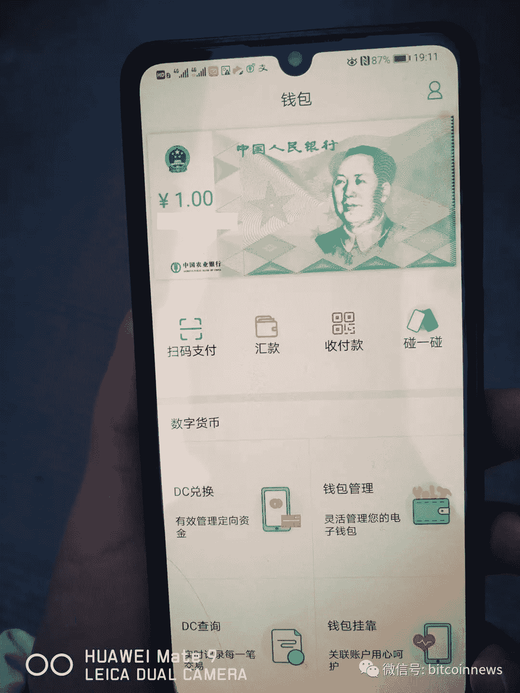

# 中国于 4 月 25 日推出区块链网络，目前正在测试数字货币/特斯拉完成区块链试点/游戏玩家正在紧张 MSFT Azure 区块链

> 原文：<https://medium.com/coinmonks/china-launching-blockchain-network-april-25th-now-testing-digital-currency-tesla-completes-883720c4e3bc?source=collection_archive---------1----------------------->

*2020 年 4 月 16 日*

*本周，随着* ***中国*** *将于周三(4 月 22 日)推出其*区块链服务网络(BSN) *用于国内商业用途，并于 2020 年 4 月 25 日在全球推出。此外，* ***中国*** *已经开始与* ***中国农业银行*** *(ABC)测试该国央行数字货币(CBDC)的测试接口。如果这两项举措都获得成功，这个行业将永远改变，我们可能会看到一场更加积极的创新竞赛。被隔离的游戏玩家正在为其区块链即服务(BaaS)培训* ***微软的 Azure*** *云平台和骨干。* ***特斯拉*** *与* ***上港集团*** *合作完成一个区块链试点向中国提速的进口流程。35 家跨国公司，包括* ***微软*** *，* ***沃尔玛*** *，* **万事达** *，* ***索尼*** *和* ***英特尔*** ***Dapper Labs****宣布与****Libra****达成技术共享合作关系，作为 Dapper 的* ***Flow 区块链*** *将采用 Libra 的 Move 作为其虚拟机(VM)。* ***天秤座*** *确认转向多币种模式。安德里森·霍罗威茨(Andre essen Horowitz)**(A16z)为一个新的加密基金设定了 4.5 亿美元的目标。此外，来自 Dappreview 和 DApps 的 Q1 2020 DApps 报道，Web 3.0 的鸿沟，大量的播客等等。祝你一周愉快！尽情享受吧！*

***奖金*** *:我最近发布了最新的 Q1 2020 版 my* [*区块链版图*](https://www.linkedin.com/posts/kyleellicott_q12020-blockchain-landscapekyleellicotttopionetworks-activity-6638879840634310656-UNtB) *(包含在下面供下载)，它提供了一个行业概述，突出了 900 多家全球公司、风险基金和工作组。如果这是你看到的第一个版本，就把它当作你在这个行业中进一步导航的路线图。在这里获得高分辨率的免费！*

## 🇨🇳 [了解中国推动全球采用区块链的计划](https://www.coindesk.com/inside-chinas-plan-to-power-global-blockchain-adoption)

在国家信息中心的领导下，区块链服务网络(BSN)准备于 2020 年 4 月 25 日在国内和全球推出商业应用。如果它像预想的那样工作，公司和软件开发商将能够接入 BSN，像组装乐高玩具一样容易地构建基于区块链的应用程序。“随着 BSN 在世界各国站稳脚跟，它将成为唯一一个由中国创新的全球基础设施网络，其网关接入由中国控制，”由政府机构、几家国有实体和区块链公司领导的 BSN 联盟撰写的最新白皮书宣称……[阅读更多](https://www.coindesk.com/inside-chinas-plan-to-power-global-blockchain-adoption)

*相关:🇨🇳*

Source: [Twitter — Nathaniel Whittemore](https://twitter.com/nlw/status/1250137202836848648/photo/1)

## 🇨🇳 [中国国有银行为央行数字货币提供测试接口](https://www.coindesk.com/chinese-state-owned-bank-offers-test-interface-for-pboc-central-bank-digital-currency)

中国四大国有银行巨头之一的中国农业银行(ABC)正在测试该国央行数字货币(CBDC)的测试界面。中国农业银行开发的一款内部移动应用的截屏显示，这家银行业巨头已经开发了一个用户可以如何与中国 CBDC 互动的前端界面，也称为 DC/EP… [阅读更多信息](https://www.coindesk.com/chinese-state-owned-bank-offers-test-interface-for-pboc-central-bank-digital-currency)

*相关:🇨🇳* [*华为、腾讯、JD.com*](https://thedailychain.com/blockchain-tech-in-china-gets-a-boost-as-huawei-tencent-jd-com-join-new-committee/)助力中国区块链科技

## 🎮[被隔离的游戏玩家正在给基于微软 Azure 的区块链平台带来压力](https://cointelegraph.com/news/quarantined-gamers-are-straining-microsoft-azure-based-blockchain-platform)

被隔离的游戏玩家正在给微软的 Azure 云平台带来压力，该平台是该公司区块链即服务(BaaS)产品的支柱。该公司承认，在某些地区，“某些计算资源类型的部署低于我们通常的 99.99%的成功率”。此外，微软证实“Xbox Live 对 Azure 的整体容量造成了压力:”该公司没有被迫改变其优先标准，仍然优先考虑紧急服务… [阅读更多信息](https://cointelegraph.com/news/quarantined-gamers-are-straining-microsoft-azure-based-blockchain-platform)

*相关:🎮* [*区块链游戏平台金恩提前更新钱包*](https://www.coindesk.com/blockchain-gaming-platform-enjin-updates-wallet-ahead-of-china-expansion)

## 📖[特斯拉完成区块链试点，加快中国进口进程](https://www.coindesk.com/tesla-completes-blockchain-pilot-to-speed-up-china-imports-process)

特斯拉正在与上港集团(Shanghai Port Group)合作，测试区块链方面能否让中国的商品进口流程变得更容易。特斯拉和中国货船运营商中远集团(COSCO)测试了一款区块链应用，该应用缩短了货物放行时间，让特斯拉的物流团队在货物卸载后更容易获得货物的所有权。试点公告的完成并没有说明试点中使用的区块链的类型，也没有说明特斯拉进口到中国的产品种类……[阅读更多信息](https://www.coindesk.com/tesla-completes-blockchain-pilot-to-speed-up-china-imports-process)

*相关:*[📖特斯拉和宝马如何通过区块链引领供应链复兴](https://www.forbes.com/sites/biserdimitrov/2020/04/14/how-tesla-and-bmw-are-leading-a-supply-chain-renaissance-with-blockchain/#1e4a6d3e62ed)*by*[*Biser Dimitrov*](https://medium.com/u/f91a4cb3fbb7?source=post_page-----883720c4e3bc--------------------------------)

## 📖[索尼等主要跨国公司 2020 年在中国申请 212 项区块链专利](https://cointelegraph.com/news/sony-and-other-major-multinationals-file-212-blockchain-patents-in-china-in-2020)

《环球时报》的最新报告显示，截至 2020 年 3 月底，包括微软、沃尔玛、万事达、索尼和英特尔在内的 35 家跨国公司共申请了 212 项区块链专利。在所有在中国拥有区块链专利的外国公司中，万事达以 46 项专利高居榜首。诺基亚、英特尔和甲骨文紧随其后，在中国分别拥有 13、12 和 9 项区块链专利。尽管这些公司正在中国申请区块链专利，但他们都还没有在中国开展与区块链相关的业务……[阅读更多](https://cointelegraph.com/news/sony-and-other-major-multinationals-file-212-blockchain-patents-in-china-in-2020)

## 🇨🇳 [区块链将对来自中国的应对冠状病毒的 KN95 口罩进行认证](https://cointelegraph.com/news/blockchain-to-authenticate-coronavirus-response-kn95-face-masks-from-china)

4 月 3 日，FDA 宣布批准 KN95 口罩在国内使用。与 N95 口罩不同，KN95 口罩受中国政府监管。FDA 的一位发言人表示，KN95 口罩没有被列入其最初的 FDA 紧急使用授权，因为来自中国的进口“在确定真实性方面存在挑战”。Real Items 正与中国和华盛顿州西雅图的生产工厂直接合作，以确保 KN95 口罩的包装盒上贴有包含双重认证二维码的标签，二维码是区块链 [VeChain 基金会](https://medium.com/u/27b156c1d5f3?source=post_page-----883720c4e3bc--------------------------------)和星际文件系统([IPFS](https://medium.com/u/30a067dbeb93?source=post_page-----883720c4e3bc--------------------------------))……[阅读更多信息](https://cointelegraph.com/news/chinas-2nd-largest-courier-using-blockchain-to-deliver-key-supplies-amid-pandemic)

## 📖 [Cardano 与南非区块链联盟合作促进采用](https://cointelegraph.com/news/cardano-partners-with-south-african-blockchain-alliance-to-boost-adoption)

Cardano 将与南非区块链联盟(SANBA)合作，探索进一步加强技术在南非的采用的方法。通过 SANBA，政府可以将 Cardano 的技术用于多个领域，例如提高治理透明度以减少欺诈、为市政服务建立数字身份，以及通过 ADA 等虚拟货币支持发展中经济体……[阅读更多信息](https://cointelegraph.com/news/cardano-partners-with-south-african-blockchain-alliance-to-boost-adoption)

## 📖 [Dapper Labs 宣布与 Libra 建立技术共享合作关系](https://cointelegraph.com/news/dapper-labs-announces-tech-sharing-partnership-with-libra)

Dapper Labs 的 CTO Dieter Shirley 透露，Dapper 的[流](https://medium.com/u/22ac47d15ea7?source=post_page-----883720c4e3bc--------------------------------)区块链将采用 Libra 的举措作为其虚拟机(VM)，而 Libra 将在技术共享合作伙伴关系中利用 Dapper 的智能合约编程语言 [Cadence](https://cointelegraph.com/news/cryptokitties-dieter-shirley-on-breaking-ethereum-and-nfts) 。雪莉表示，Flow 将受益于 Move 的性能效率，而 Libra 将受益于 Cadence 的开发人员友好型设计。… [阅读更多](https://cointelegraph.com/news/blockchain-project-says-5-gb-block-size-will-eliminate-congestion-issue)由[衣冠楚楚的实验室](https://medium.com/u/6544777e30d2?source=post_page-----883720c4e3bc--------------------------------)

*相关:💸* [*Libra 确认转向多货币模式，点支持央行数字货币*](https://www.theblockcrypto.com/post/62095/libra-multi-currency-shift-central-bank-digital-currencies)

# 本周的更多内容:

📈[区块链技术用于追踪 Target 出售的道德鸡蛋](https://cointelegraph.com/news/blockchain-tech-used-to-trace-ethical-eggs-sold-at-target)

📈美国和印尼之间 1200 万美元的小麦贸易已经通过区块链结算

📈[维奈·古普塔的伟大构想:为你的东西添加一个身份层](https://www.coindesk.com/vinay-guptas-big-idea-an-identity-layer-for-your-things)

📈[灰度报告记录 2020 年以太坊流入](https://decrypt.co/25853/grayscale-reports-record-ethereum-inflows-in-2020)

📈[据报道，安德森·霍洛维茨为新的加密基金筹集了高达 4 . 5 亿美元的资金](https://www.theblockcrypto.com/linked/61824/a16z-crypto-fund-report-raising)

📖[跨越鸿沟到 Web 3.0 的桥梁](/northzone/bridges-across-the-chasm-to-web-3-0-f8a75b5d870e)作者 [Wendy Xiao Schadeck](https://medium.com/u/45a7ac03a0c?source=post_page-----883720c4e3bc--------------------------------)

📖你认为隐私法会阻止监控资本主义吗？你不知道谷歌由[两院制风险投资](https://medium.com/u/2e1d9bbe8764?source=post_page-----883720c4e3bc--------------------------------)

📖[加密的下一个大催化剂:印度](https://www.delphidigital.io/so/41N5rIbSs?cid=ad252c45-ef98-4f67-a7a1-db01253f0a7c#/main)

📖[区块链初创公司希望将女性带入科技圈](https://www.bloomberg.com/news/articles/2020-04-07/blockchain-startup-wants-to-bring-women-into-the-technology-fold)

🎙️ [与](https://youtu.be/46qQ9v3VuM0) [的任意提问(AMA)会话均衡 _EOSDT](https://medium.com/u/5db4a8782ba2?source=post_page-----883720c4e3bc--------------------------------)

💸 [Crypto 的本意是让金融民主化，现在终于要实现了](https://www.nasdaq.com/articles/crypto-was-meant-to-democratize-finance-and-its-finally-about-to-2020-04-06)

📖 [Status 想成为世界上最私密的即时通讯应用](https://decrypt.co/25629/status-wants-to-be-the-worlds-most-private-instant-messaging-app)

# 分散式应用程序手表

## 📖[DAP preview 发布的 2020 年 Q1 Dapp 市场报告](/dappreview/2020-q1-dapp-market-report-by-dappreview-478ac0c2194c)

2020 年 3 月，随着冠状病毒在全球范围内迅速蔓延，加密市场连续两天大幅下挫。报告对 2020 年 Q1 DApps 市场的分析可以突出显示，13 个区块链的总交易额为 79 亿美元，比 2019 年 Q1 增长了 82.2%。在本季度，推出了 254 个新的 dapps，比 Q1 2019 低 60%。活跃地址排名前三的行业是博彩、交易所和赌场……[阅读更多](https://www.coindesk.com/blockstack-wins-patent-for-its-dapp-single-sign-on-product)和更多来自 [DappReview](https://medium.com/u/e3c4c144d5cc?source=post_page-----883720c4e3bc--------------------------------)

*相关:📖* [*季度 Dapp 市场报告 2020 年*](/dapp-com/quarterly-dapp-market-report-q1-2020-6af546821b32) *作者:*

## *📖 [Crypto 的商业模式大家都很熟悉。什么不是谁受益](https://a16z.com/2020/04/08/crypto-network-effects/)*

*许多企业家和投资者认为加密项目不能获取价值，因为它们是基于开源代码的，所以有人会过来复制它，引诱走商业用户和任何潜在的收入。但加密网络的主要创新在于，它们能够通过让用户分享他们创造的价值来扩大网络效应。它还坚持可持续的商业模式，对于那些了解有价值的 Web 2.0 市场背后的动态的人来说，它将很快为人所熟悉……[阅读更多](https://a16z.com/2020/04/08/crypto-network-effects/)作者:杰西·瓦尔登[作者:安德森·霍洛维茨](https://twitter.com/jessewldn)*

*📖[福布斯区块链 50 强产品数据深度挖掘](https://blog.blockdata.tech/2020/04/forbes-blockchain-50-products-data-deep-dive/) by [BLOCKDATA](https://medium.com/u/279c07ad0b4d?source=post_page-----883720c4e3bc--------------------------------)*

*📖[任生态系统更新](/renproject/ren-ecosystem-update-7a8943df88d2)作者[迈克尔·伯吉斯](https://medium.com/u/39f49ab17428?source=post_page-----883720c4e3bc--------------------------------)*

*📖[梦幻足球创业公司 Sorare 正在将区块链带给大众](https://cryptonewmedia.press/2020/04/16/fantasy-football-startup-sorare-is-bringing-blockchain-to-the-masses/)*

*📖 [FireChat 通过](https://blog.blockstack.org/firechat-integrates-blockstack-login/) [Blockstack](https://medium.com/u/19349106268a?source=post_page-----883720c4e3bc--------------------------------) 集成 Blockstack 登录*

# *🎙️谈论开放金融与东京金融科技播客:*

**最近，我加入了东京金融科技播客* [*诺伯特·盖尔克*](https://medium.com/u/6a0f4b766479?source=post_page-----883720c4e3bc--------------------------------) *，就金融科技和开放金融生态系统在过去十年中的发展、金融知识针对性努力的案例以及对可靠数字身份的迫切需求进行了深入而广泛的讨论。* [*Part 1*](https://podcasts.apple.com/us/podcast/episode-23-kyle-ellicott-topio-networks-part-i/id1497776730?i=1000471070577) *和*[*Part 2*](https://podcasts.apple.com/us/podcast/episode-24-kyle-ellicott-topio-networks-part-ii/id1497776730?i=1000471392682)*现已直播！**

*🎙️ [*看看新推出的挑衅播客*](https://anchor.fm/camila-russo/episodes/Decentralized-Money-Shouldnt-be-Traded-on-Centralized-Exchanges-Loopring-Founder-Daniel-Wang-ecqnm0) *作者* [*卡米拉·鲁索*](https://twitter.com/CamiRusso)*

*🎙️ [马克·库班谈他当总统会做什么](https://www.youtube.com/watch?v=Dz0uoaqyx44&feature=youtu.be)*

*🎙️[2 万美元的人类首次公开募股&其他 5 个与新冠肺炎无关的故事](http://nlwcrypto.libsyn.com/the-20000-human-ipo-5-other-stories-that-have-nothing-to-do-with-covid-19)纳撒尼尔·惠特莫尔*

# *🎙️区块链工业状况 2020 年第一季度:*

**现已发售，下载你的高清副本****【Q1】2020****版* [*区块链景观图*](https://www.linkedin.com/posts/kyleellicott_q12020-blockchain-landscapekyleellicotttopionetworks-activity-6638879840634310656-UNtB) *。这是我现在发布的第五版景观，包括****747****家公司(* ***900 多家独特公司*** *包括更广泛的关键生态系统参与者)和超过***2010 年至 2020 年在整个景观中筹集的超过 220 亿美元资金**——自 2010 年以来投资超过 180 亿美元—出现明显的循环，并有完整的分解。***

***一个完整的 60 分钟的景观概述视频现在可以在* [*这里*](https://www.topionetworks.com/markets/blockchain-landscape-5bf43854b9abe4633c1f87da) *免费获得。在视频中，我对 2020 年的前景进行了细分，提供了 2019 年的总结、2020 年的新兴趋势、DeFi、Libra、CDBCs、Stablecoins、DApps 等等！***

****

**Source: [Topio Networks](https://www.topionetworks.com/markets/blockchain-landscape-5bf43854b9abe4633c1f87da)**

> ***👉下载新的* [*区块链基础设施景观 Q1 2020*](https://s3.amazonaws.com/spoke-profiles-prod-assets/uploads/d21d960161f92e629f68bf78b3d148743e4b3f49/original/Blockchain_Landscape_Q1_Feb2020_KyleEllicott.pdf?utm_source=pdf&utm_medium=email&utm_campaign=kyle) *版，了解关于 DeFi、DApps、基础设施、数字货币等的见解！***

**不想等到下周，[现在就订阅](http://click1.m.readwritelabs.com/xsdqkbbrgsdtqkmntpjlstcnkytvpvphsnhsqlvbrhhd_yfqbfcmslnskglmckvqv.html?source=post_page---------------------------)📥有关区块链、DApps 等的实时行业见解！**

****

> **[直接在您的收件箱中获得最佳软件交易](https://coincodecap.com/?utm_source=coinmonks)**

****