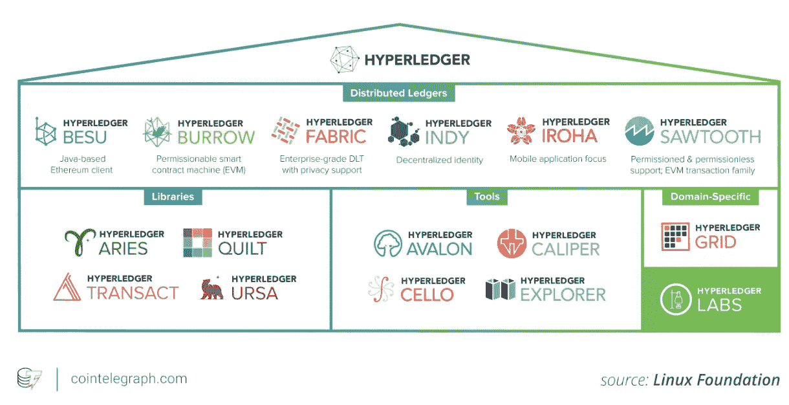
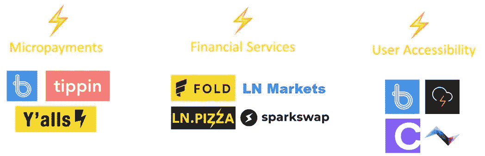
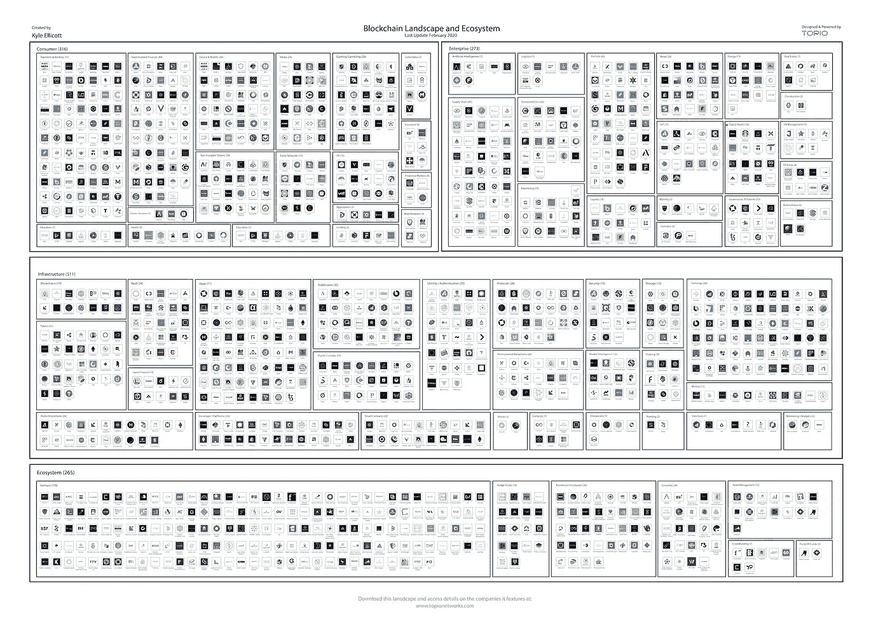

# 中国本周推出国家区块链/脸书 Libra 重新设计/企业区块链准备好供政府使用？/第二层投资的状态

> 原文：<https://medium.com/coinmonks/china-launching-nation-blockchain-this-week-facebook-libra-gets-redesigned-enterprise-147027803f3a?source=collection_archive---------1----------------------->

*2020 年 4 月 22 日*

*本周景观……在我们等待本周即将到来的* ***中国*** *区块链服务网络(BSN)启动之际，我们接到通知，区块链现已与人工智能、物联网等其他主要技术一起正式纳入中国科技战略。* ***脸书天秤座*** *进行了重新设计，以符合规定，包括提供单一货币稳定硬币和多货币硬币——但仍被视为一种证券。IEEE***联合发布了一项评估，评估四个区块链平台如何符合美国联邦政府***的安全要求，其中只有一个平台通过了测试。与此同时，* ***币安*** *正在建造一个更像以太坊的区块链。韩国政府表示，区块链市场对该国来说是一个“黄金机会”。亚航* *推出了一个名为 Freightchain 的区块链货运预订系统。* ***电力台账*** *在西澳推出基于区块链的太阳能交易。* ***怀俄明*** *普炭郡迁其地的记载上有一个区块链。****Token Daily****为我们提供了对 L2 (Layer-2)投资状况的深入了解，****SPiCE VC****分享了他们对不断发展的区块链应用前景的看法，****Messari****发布了他们对 Q1 2020 年的回顾和展望祝你一周愉快！尽情享受吧！***

*****奖金*** *:我最近发布了最新的 Q1 2020 版 my* [*区块链版图*](https://www.linkedin.com/posts/kyleellicott_q12020-blockchain-landscapekyleellicotttopionetworks-activity-6638879840634310656-UNtB) *(包含在下面供下载)，它提供了一个行业概述，突出了 900 多家全球公司、风险基金和工作组。如果这是你看到的第一个版本，就把它当作你在这个行业中进一步导航的路线图。在这里获得高分辨率的免费！***

## **🇨🇳 [区块链现在正式成为中国科技战略的一部分](https://www.coindesk.com/blockchain-now-officially-part-of-chinas-technology-strategy)**

**国家发展和改革委员会(NDRC)周一告诉记者，未来几年，区块链将加入云计算、人工智能(AI)和物联网(IoT)等其他新兴技术，支撑中国用于管理信息流的系统。在谈到包括区块链在内的新技术将如何整合时，高科技总监吴昊表示，NDRC 将“与相关部门合作，研究并发布相关指导意见，以促进新基础设施的发展，并修改和完善有利于新兴产业持续健康发展的准入规则。”… [阅读更多信息](https://www.coindesk.com/blockchain-now-officially-part-of-chinas-technology-strategy)**

***相关:🇨🇳* [*中国的权力全球计划内参*](https://www.coindesk.com/inside-chinas-plan-to-power-global-blockchain-adoption)**

## **📖[脸书天秤座重新设计:新系统和加密货币符合规定](https://news.bitcoin.com/facebook-libra-new-cryptocurrency/)**

**在强大的监管压力下，脸书支持的 Libra 加密货币项目经历了四次重大变化，以符合监管要求。这些变化引入了一个强大的合规框架来提高安全性，开发了一个无需许可的系统，同时保持了其重要的经济属性，在 Libra Reserve 的设计中建立了强大的保护措施，并在多币种硬币之外提供了单币种稳定硬币……[阅读更多信息](https://news.bitcoin.com/facebook-libra-new-cryptocurrency/)**

***相关:📖* [*天秤座虽然改头换面*](https://decrypt.co/26127/libra-is-still-a-security-despite-its-revamp-says-congresswoman) 但依然是安全的**

## **📖[以太坊、织物、绳索和多链。只有一个是政府准备好的——新报告](http://Ethereum, Fabric, Corda, And Multichain. Only One Is Government Ready - New Report)**

**电气和电子工程师协会(IEEE)共同发布了一份[评估](https://papers.ssrn.com/sol3/papers.cfm?abstract_id=3381692)，评估四个区块链平台如何符合美国联邦政府严格的安全要求，根据该报告，只有一个平台通过了测试。《2002 年联邦信息安全管理法案》( FISMA)要求所有使用区块链的新联邦 IT 项目和现代化工作都要符合国家标准与技术研究所(NIST)的加密标准。如果技术不能满足他们，那么联邦政府就不能使用这项技术……[阅读更多](https://www.forbes.com/sites/benjessel/2020/04/21/ethereum-fabric-corda-and-multichain-only-one-is-government-readynew-report/#adedac7263b1)本杰明·杰塞尔[的文章](https://medium.com/u/6c3f9db6aa31?source=post_page-----147027803f3a--------------------------------)**

## **🇨🇳 [华为、腾讯对中国区块链全国委员会](https://www.cnbc.com/2020/04/15/huawei-tencent-on-china-blockchain-national-committee.html)**

**中国正在召集其科技巨头和金融巨头，如华为、百度和蚂蚁金服，成立一个区块链委员会，主要目标是为该国采用区块链教制定标准。名为“全国区块链和分布式记账技术标准化技术委员会”的委员会还将代表来自地方政府、国家主导的智库、大学和超级计算中心的 70 名研究人员和专家……[阅读更多](https://www.cnbc.com/2020/04/15/huawei-tencent-on-china-blockchain-national-committee.html)**

***相关:🇨🇳* [*中国为 2022 年冬奥会准备数字元*](https://decrypt.co/26216/china-readies-digital-yuan-for-2022-beijing-winter-olympics)**

## **📖[韩国政府给区块链贴上黄金机遇标签](https://cointelegraph.com/news/south-korean-government-labels-blockchain-a-golden-opportunity)**

**韩国政府表示，区块链市场对该国来说是一个“黄金机会”。战略和财政部副部长 Koo Yun-Cheol 召开了一次关于区块链技术的会议，聚集了许多私营行业的专家。同一次会议敦促韩国政府在未来的太空中发挥积极作用。韩国政府没有透露加强该国区块链产业的具体预算……[阅读更多](https://cointelegraph.com/news/south-korean-government-labels-blockchain-a-golden-opportunity)**

## **📖[新创业公司旨在证明区块链对金融来说足够快](https://www.bloomberg.com/news/articles/2020-04-17/new-startup-aims-to-prove-blockchain-is-fast-enough-for-finance)**

**艾娃的目标是让区块链的金融速度足够快，这样它就可以在处理速度上超过 Visa 和 Mastercard 的集中支付系统。开发的技术将允许开发者隔离区块链的一部分，例如使服务仅在美国可用，进一步使其不同于其他区块链网络，并吸引必须满足不同司法管辖区监管条件的金融公司… [阅读更多信息](https://www.bloomberg.com/news/articles/2020-04-17/new-startup-aims-to-prove-blockchain-is-fast-enough-for-finance)**

## **🇨🇳 [百度旗下的视频流媒体巨头爱奇艺利用区块链上市提升业绩](https://www.coindesk.com/baidu-owned-video-streaming-giant-iqiyi-taps-public-blockchain-for-performance-boost)**

**爱奇艺正在与 NKN 的区块链整合，利用其“微托管网络管理”来部署和管理在该平台上运行的第三方内容交付网络(CDN)软件。在试验过程中，团队注意到缓存节省显著增加，便于日后检索。NKN 的区块链使用一种中继证明(PoR)挖掘算法，在将数据发送给其他节点进行支付和奖励之前，随机选择少量固定数据包作为“证明”。根据协议，爱奇艺将使用新型网络(NKN)的点对点基础设施，以帮助提高缓冲速度，减少能耗和网络拥塞……[阅读更多](https://www.coindesk.com/baidu-owned-video-streaming-giant-iqiyi-taps-public-blockchain-for-performance-boost)**

## **📖[利用 Hyperledger 结构—企业区块链释放出可行的解决方案](https://cointelegraph.com/news/leveraging-hyperledger-fabric-enterprise-blockchain-unleashes-viable-solutions)**

****

**Source: [Cointelegraph](https://cointelegraph.com/news/leveraging-hyperledger-fabric-enterprise-blockchain-unleashes-viable-solutions)**

**Hyperledger Fabric 旨在作为使用模块化架构开发应用程序或解决方案的基础。它允许共识和成员服务等组件即插即用。Hyperledger Fabric 已被主要的云服务提供商采用，包括阿里巴巴、亚马逊网络服务、微软 Azure、百度、谷歌、华为、IBM、甲骨文、SAP 和腾讯。另一方面，Hyperledger Sawtooth 提供了一个灵活的架构，将组织的核心系统与其应用程序域分离开来。这允许智能合同为应用程序指定业务规则，而无需… [阅读更多](https://cointelegraph.com/news/leveraging-hyperledger-fabric-enterprise-blockchain-unleashes-viable-solutions)**

***相关:⚡* [*电力台账在西澳推出区块链太阳能交易*](https://cointelegraph.com/news/power-ledger-rolls-out-blockchain-based-solar-energy-trading-in-western-australia)**

## **📖[主要航空公司亚航推出区块链驱动的货物预订系统](https://cointelegraph.com/news/major-airline-airasia-launches-blockchain-driven-cargo-booking-system)**

**主要航空公司亚航的物流部门 Teleport 已经推出了一个位于区块链的名为 Freightchain 的货物预订系统。根据 4 月 16 日的公告，Freightchain 是“世界上第一个在区块链运营的数字航空货运网络”该网络今天启动，允许托运人或货运代理人即时预订和确认亚航的 247 架飞机中的任何一架来运输货物。… [阅读更多信息](https://cointelegraph.com/news/major-airline-airasia-launches-blockchain-driven-cargo-booking-system)**

# **本周的更多内容:**

**📈[寻找下一个角色的加密人才【列表】](https://docs.google.com/spreadsheets/d/1AGvKTRKAoSO1X8AmcqohMa7xaHFH1W9xRpjnvwNpP94/edit#gid=0) —作者[琳达·谢](https://medium.com/u/514b75d4b762?source=post_page-----147027803f3a--------------------------------)**

**📈[怀俄明州的碳县将其土地记录转移到区块链上](https://cointelegraph.com/news/wyomings-carbon-county-to-move-its-land-records-on-blockchain)**

**📈[首只获批加密基金寻求 1 亿美元目标](https://cointelegraph.com/news/hong-kongs-first-approved-crypto-fund-seeks-100m-target)**

**📈[塑造 Q1 20 年的趋势和我们对今年的展望](https://messari.io/article/trends-that-shaped-q1-20-and-our-outlook-for-the-year) — [梅萨里](https://medium.com/u/7cf93d3c3400?source=post_page-----147027803f3a--------------------------------)**

**🇨🇳 [中国将于下周推出其国家区块链平台](https://www.theblockcrypto.com/post/61920/blockchain-china-platform-launch-next-week)**

**📖[币安正在建造一个更像以太坊的区块链](https://decrypt.co/25904/binance-is-building-a-blockchain-thats-more-like-ethereum)**

**📖[俄工信部将 Waves 企业区块链平台加入官方注册表](https://cointelegraph.com/news/russian-ministry-adds-waves-enterprise-blockchain-platform-to-official-registry)**

**📖[以太坊 2.0 测试网仅在两天内就接触了近 20，000 名验证者](https://decrypt.co/26100/ethereum-2-0-testnet-reaches-almost-20000-validators-in-just-two-days)**

**📖[密码出借人达摩现在允许向任何 Twitter 账号汇款](https://www.theblockcrypto.com/linked/62665/crypto-lender-dharma-now-allows-sending-money-to-any-twitter-handle)**

**🎙️ [AMA 与 Alex Melikhov](/equilibrium-eosdt/ama-session-with-alex-melikhov-53b1b499574a) 的会议[平衡 _EOSDT](https://medium.com/u/5db4a8782ba2?source=post_page-----147027803f3a--------------------------------)**

**💸[天秤座协会增加旨在结束世界饥饿的非营利组织为最新成员](https://www.theblockcrypto.com/post/62454/libra-association-adds-nonprofit-aimed-at-ending-world-hunger-as-latest-member)**

# **分散式应用程序手表**

## **📖[L2 投资状况](https://www.tokendaily.co/blog/the-state-of-l2-investments)**

****

**Source: [Token Daily](https://www.tokendaily.co/blog/the-state-of-l2-investments)**

**L2 只需要对共识层做很小的改动，避免了基础层协议的集中化。这些解决方案包括比特币的闪电网和以太坊的雷电，可谓是真正的 L2 解决方案，还有比特币的 RSK、[以太坊](https://medium.com/u/d626b3859bc9?source=post_page-----147027803f3a--------------------------------)的等离子链等侧链。随着市场状况在 2019 年第三季度&第四季度开始改善，人们对 L2 解决方案的兴趣越来越大——既有对可能导致拥堵的新一轮牛市的预期，也有对基础层协议增加隐私等功能的预期……[阅读更多](https://www.tokendaily.co/blog/the-state-of-l2-investments) &更多来自 [Mohamed Fouda](https://medium.com/u/71db1014568a?source=post_page-----147027803f3a--------------------------------)**

***相关:📖* [*区块链应用景观*](/spicevc/blockchain-applications-landscape-137215f4cda9) *—由* [*塔尔·伊利亚舍夫*](https://medium.com/u/8a845109e676?source=post_page-----147027803f3a--------------------------------)*[*SPiCE VC*](https://medium.com/u/a23443abbc57?source=post_page-----147027803f3a--------------------------------)***

## **📖[地位想成为世界上最私密的即时通讯应用](https://decrypt.co/25629/status-wants-to-be-the-worlds-most-private-instant-messaging-app)**

**在普华永道的一项调查中，全球 85%的受访者表示，他们希望有更多的公司可以信任他们的数据。Status 是一个 Android 和 iOS 应用程序，它将点对点即时消息与加密钱包和 Web3 浏览器结合在一起。Status 与其他即时通讯应用的不同之处在于，它包含一个 ERC-20 钱包和 DApps，可以通过应用内浏览器访问。Status 的区块链应用程序使用户能够控制对其数据的访问。通过状态浏览器可以获得的 DApps 包括各种收藏品，如 [CryptoKitties](https://medium.com/u/c8b1419b5d28?source=post_page-----147027803f3a--------------------------------) 和游戏，如 Etheremon 和[分散市场](https://medium.com/u/98348dd48afe?source=post_page-----147027803f3a--------------------------------)市场……[阅读更多信息](https://decrypt.co/25629/status-wants-to-be-the-worlds-most-private-instant-messaging-app)**

**📖[云 3.0 —去中心化服务市场](/the-liquidapps-blog/cloud-3-0-decentralized-service-marketplaces-f6e5eef1c0f5) —由[liquid PPS](https://medium.com/u/111b26bf40a9?source=post_page-----147027803f3a--------------------------------)**

**📖[当你添加一个文件到](/textileio/whats-really-happening-when-you-add-a-file-to-ipfs-ae3b8b5e4b0f) [IPFS](https://medium.com/u/30a067dbeb93?source=post_page-----147027803f3a--------------------------------) 时，实际上发生了什么？——作者[卡森·法默](https://medium.com/u/adda52ceb6bc?source=post_page-----147027803f3a--------------------------------)**

**📖[使用 Embark 子空间和 Infura 的实时前端数据](https://blog.infura.io/frontend-dapp-development-2/)**

# **🎙️谈论开放金融与东京金融科技播客:**

***最近，我加入了东京金融科技播客* [*诺伯特·盖尔克*](https://medium.com/u/6a0f4b766479?source=post_page-----883720c4e3bc----------------------) *，就金融科技和开放金融生态系统在过去十年中的发展、金融知识针对性努力的案例以及对可靠数字身份的迫切需求进行了深入而广泛的讨论。* [*Part 1*](https://podcasts.apple.com/us/podcast/episode-23-kyle-ellicott-topio-networks-part-i/id1497776730?i=1000471070577) *和*[*Part 2*](https://podcasts.apple.com/us/podcast/episode-24-kyle-ellicott-topio-networks-part-ii/id1497776730?i=1000471392682)*现已直播！***

**🎙️ [从健康证明到 UBI:新冠肺炎事件后一切是如何改变的，壮举。乔·麦肯](https://www.coindesk.com/from-proof-of-health-to-ubi-how-everything-changes-post-covid-19-feat-joe-mccann)——[纳撒尼尔·惠特莫尔](https://medium.com/u/1b4838316374?source=post_page-----147027803f3a--------------------------------)**

**🎙️EY 全球区块链峰会:第一天—区块链商业应用— [Paul Brody](https://medium.com/u/275d4a02c655?source=post_page-----147027803f3a--------------------------------)**

# **🎙️区块链工业状况 2020 年第一季度:**

***现已发售，下载你的高清副本****Q1 2020****版* [*区块链景观图*](https://www.linkedin.com/posts/kyleellicott_q12020-blockchain-landscapekyleellicotttopionetworks-activity-6638879840634310656-UNtB) *。这是我发布的第五版景观，包括****747****家公司(* ***900+总独特公司*** *包括更广泛的关键生态系统参与者)和超过***220 亿美元的资金，从 2010 年到 2020 年，整个景观筹集了超过 180 亿美元的投资—出现明显的循环，并有完整的分解。****

***一个完整的 60 分钟的景观概述视频现在可以在***这里免费观看。在视频中，我对 2020 年的前景进行了细分，提供了 2019 年的总结、2020 年的新兴趋势、DeFi、Libra、CDBCs、Stablecoins、DApps 等等！****

****

**Source: [Topio Networks](https://www.topionetworks.com/markets/blockchain-landscape-5bf43854b9abe4633c1f87da)**

> ***👉下载新的* [*区块链基础设施景观 Q1 2020*](https://s3.amazonaws.com/spoke-profiles-prod-assets/uploads/d21d960161f92e629f68bf78b3d148743e4b3f49/original/Blockchain_Landscape_Q1_Feb2020_KyleEllicott.pdf?utm_source=pdf&utm_medium=email&utm_campaign=kyle) *版，了解关于 DeFi、DApps、基础设施、数字货币等的见解！***

**不想等到下周，[现在就订阅](http://click1.m.readwritelabs.com/xsdqkbbrgsdtqkmntpjlstcnkytvpvphsnhsqlvbrhhd_yfqbfcmslnskglmckvqv.html?source=post_page---------------------------)📥有关区块链、DApps 等的实时行业见解！**

****

> **[直接在您的收件箱中获得最佳软件交易](https://coincodecap.com/?utm_source=coinmonks)**

****