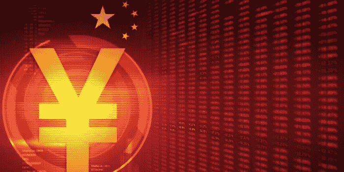
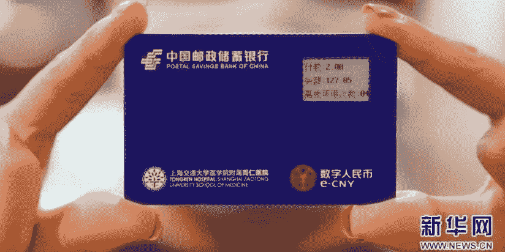
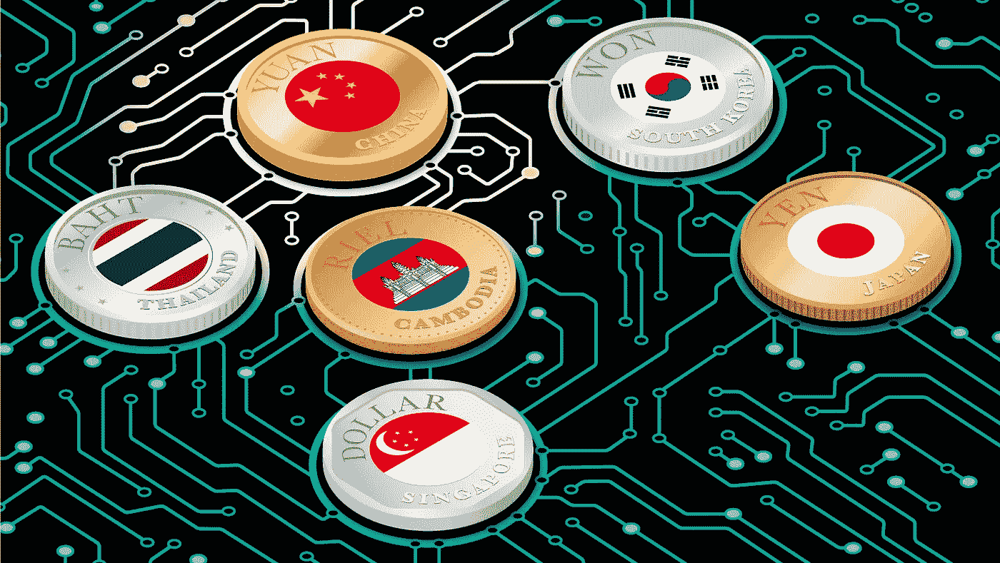

# 中国:对加密货币的压力——推广数字人民币

> 原文：<https://medium.com/coinmonks/china-pressure-on-crypto-money-promoting-the-digital-yuan-20ef37e68847?source=collection_archive---------14----------------------->

## 优先事项的改变

一种超级独立的数字货币对国家构成了威胁。政府早就决定了主要方向:中国需要一个数字元。

## **2011–2021 年趋势**

2011 年，第一个密码交易所 **BTC China** 在中国上线，2013 年，最大的采矿设备制造商**比特大陆**诞生。

随之而来的是新的密码交易所和采矿场的出现。在中国，他们非常熟悉电子支付手段，这要归功于腾讯的 q 币。它在二级市场上升值了，人们以相当真实的人民币转卖它。

在 2017 年第一次加密货币热潮之前，中国已成为该行业非常有影响力的参与者，成为比特币开采和直接开采设备的贸易和生产中心。然而，该国领导层很快就决定了最终立场:政府不打算使用分散和匿名的加密货币。

去年秋天，第一枚数字人民币出现在普通市民的钱包里。作为最大规模测试的一部分，该国 5 万名公民每人分发了 200 元人民币(约 30 美元)。

他们可以在一个特殊的应用程序中获得，该应用程序的下载链接由政府通过短信发送。在这个应用程序的屏幕上，人们能够看到令人垂涎的金额，这在当时只能在连接到测试的三千个点(商店，咖啡馆，出租车)上支付。

> 今年夏天，**报道了 2000 万个数字元**钱包，到 11 月，交易总额达到**97 亿美元**，技术上能够使用数字元的网点数量已经增长到 160 万家。

同时，这些钱包不仅是智能手机上的一个应用程序，也是手表和手环形式的可穿戴设备。随着技术的引进，当预计会有大量外国人涌入时，中国正急于举办冬季奥运会。

## 数码元

它就像一张普通的纸币，但只有数字代码。现有的现阶段流行的加密货币不仅仅是虚拟货币，而是一种资产，其价值的衡量标准因有限的发行和供求机制而不断变化。

数字元和纸币的价格一样。它也容易引起通货膨胀，同样由中国中央银行发行，同样在一般货币供应中流通。央行将数字元归类为货币总量 M0——现金(类似于经济中流通的标准硬币和纸币)。

数字货币的每一个单位都是唯一标识的，具有高度的防伪性，但没有具体体现——事实上，它存储在中央银行的数据库中，那里记录着它的所有者。

这让她类似于银行账户里的非现金货币。但是，非现金可以随时兑换成实体纸张，有商业银行对你的账户安全负责。

> 数字元有一个关键优势，可以使它更具吸引力:它可以在没有任何互联网连接的情况下离线使用。

作为其中一个测试阶段的一部分，一些华为和 T2 智能手机的用户通过一个离线支付的特殊应用程序拥有离线钱包功能。如果没有连接，这个应用程序不需要通过后端系统执行操作。

相反，交易的参与者必须验证交易双方的身份，确认交易信息，并通过钱包支付。

此外，用户可以使用离线二维码支付，基于短距离通信技术的离线点对点支付，或通过电子商务平台的在线支付。

甚至还有将人民币嵌入芯片的钱包实物。这种设备是由中国邮政储蓄银行开发的。它是一张卡，右上角有一个黑白小屏幕，显示资金余额。

## 任命

数字人民币似乎符合当前中国加强对主要科技巨头监控的政策。

> 根据一些估计，近 20 万亿美元通过**支付宝**支付系统，互联网巨头如**阿里巴巴**控制着巨大的资金流动、贸易、内容、数亿用户的数据，并变得越来越有影响力。

中国希望重新获得对支付的控制，这些支付越来越多地隐藏在私有企业的移动应用程序中。长期以来，北京一直以密切关注市民生活而闻名。因此，数字元将与另一种监测人口的方式联系在一起。

加密货币和数字人民币的本质区别不仅在于国家负责发行数字人民币，还在于人民币将只具有一种“可控匿名性”。

启动钱包，只需要一个手机号。诚然，要得到它，你需要提供你所有的护照数据，所以“匿名”真的是虚幻的。
数字人民币的加速发展与加密货币面临的威胁有关。这就是为什么最近几年，中国首先禁止了加密交易，然后矿商们自己也受到了攻击。

此外，数字元的流通将降低发行纸币和相关操作(收款、ATM 网络)的成本，计算税收减免和向公民发放奖励将更加方便。

此外，数字货币可以降低交易费用，因为当前的支付系统(例如，Visa 或 Mastercard)可以从每笔交易中获得奖励。

## 全局向量

10 月，尼日利亚中央银行的数字货币试点项目 **eNaira** 启动，8 个月前，加密货币在该国被禁止。

**尼日利亚中央银行**有一个集中的区块链分类账，记录与尼日利亚国家银行的所有交易。它补充，但不会取代该国的纸币。

> 总共发行了 5 亿埃纳拉，大约相当于 121 万美元。它们与法定货币挂钩，并得到国家现金储备的支持。

虽然尼日利亚的国家货币不是特别受信任。自疫情开始以来，它已经下跌了 12.5%，因此许多公民都使用加密货币来保存自己的资金和支付。

尼日利亚被认为是世界上第六个加密分发的国家，这对国内的国家货币构成了严重的挑战。

**巴西中央银行**也即将推出其数字现金替代品，经过四年的研究，**挪威主要银行**将开始测试。

2021 年，**瑞典央行**开始测试与商业银行的数字货币交易。

**保持更新。**

 [## 保险中的区块链

### 认可，相关性

digitaltime.medium.com](https://digitaltime.medium.com/blockchain-in-insurance-6e59c5a8544f) 

## 另外，阅读

*   [加拿大最佳加密交易机器人](https://blog.coincodecap.com/5-best-crypto-trading-bots-in-canada) | [赌注加密](https://blog.coincodecap.com/staking-crypto)
*   [如何在印度购买比特币？](/coinmonks/buy-bitcoin-in-india-feb50ddfef94) | [瓦济克斯审查](/coinmonks/wazirx-review-5c811b074f5b)
*   [最佳网上赌场](https://blog.coincodecap.com/best-online-casinos) | [硬件钱包](/coinmonks/hardware-wallets-dfa1211730c6)
*   如何在 WazirX 上购买柴犬(SHIB)硬币？
*   [比特币主根](https://blog.coincodecap.com/bitcoin-taproot) | [前 6 名比特币信用卡](/coinmonks/bitcoin-credit-card-bc8ab6f377c6)
*   [最佳免费加密信号](https://blog.coincodecap.com/free-crypto-signals) | [YoBit 评论](/coinmonks/yobit-review-175464162c62) | [Bitbns 评论](/coinmonks/bitbns-review-38256a07e161)
*   [huo bi 的加密交易信号](https://blog.coincodecap.com/huobi-crypto-trading-signals) | [BitMEX 评论](https://blog.coincodecap.com/bitmex-review)
*   [如何购买 Monero](https://blog.coincodecap.com/buy-monero) | [IDEX 评论](https://blog.coincodecap.com/idex-review) | [BitKan 交易机器人](https://blog.coincodecap.com/bitkan-trading-bot)
*   如何在 Bitbns 上购买柴犬(SHIB)币？ | [币安](https://blog.coincodecap.com/binance-in-india)
*   [币安 vs 比特邮票](https://blog.coincodecap.com/binance-vs-bitstamp) | [比特熊猫 vs 比特币基地 vs Coinsbit](https://blog.coincodecap.com/bitpanda-coinbase-coinsbit)
*   [如何购买 Ripple (XRP)](https://blog.coincodecap.com/buy-ripple-india) | [非洲最好的加密交易所](https://blog.coincodecap.com/crypto-exchange-africa)
*   [非洲最佳加密交易所](https://blog.coincodecap.com/crypto-exchange-africa) | [胡交易所评论](https://blog.coincodecap.com/hoo-exchange-review)
*   [eToro vs robin hood](https://blog.coincodecap.com/etoro-robinhood)|[MoonXBT vs by bit vs Bityard](https://blog.coincodecap.com/bybit-bityard-moonxbt)
*   [Stormgain 回顾](https://blog.coincodecap.com/stormgain-review) | [Bexplus 回顾](https://blog.coincodecap.com/bexplus-review) | [币安 vs Bittrex](https://blog.coincodecap.com/binance-vs-bittrex)
*   [Bookmap 评论](https://blog.coincodecap.com/bookmap-review-2021-best-trading-software) | [美国 5 大最佳加密交易所](https://blog.coincodecap.com/crypto-exchange-usa)
*   [如何在 FTX 交易所交易期货](https://blog.coincodecap.com/ftx-futures-trading) | [OKEx vs 币安](https://blog.coincodecap.com/okex-vs-binance)
*   [如何在势不可挡的域名上购买域名？](https://blog.coincodecap.com/buy-domain-on-unstoppable-domains)