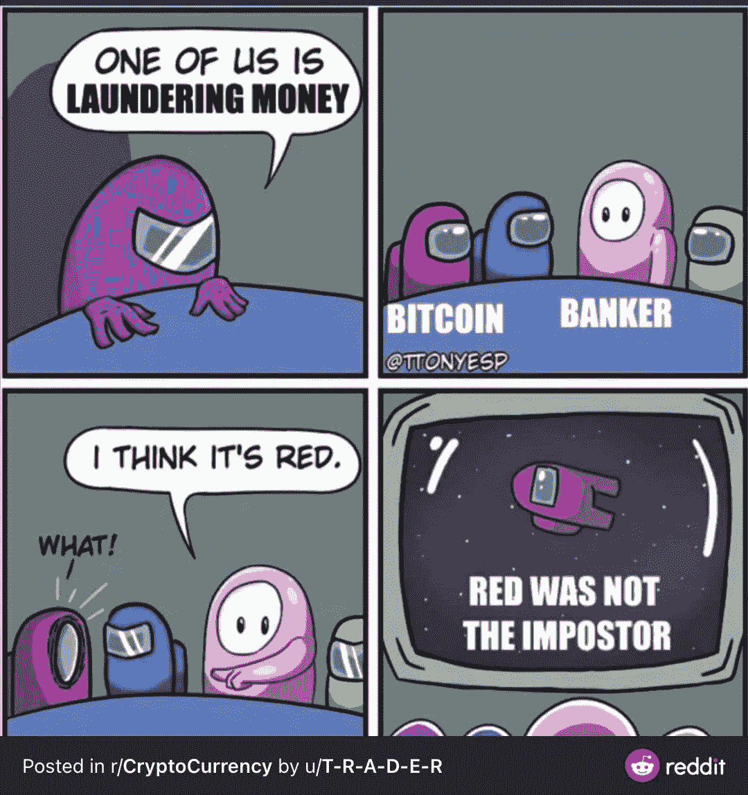
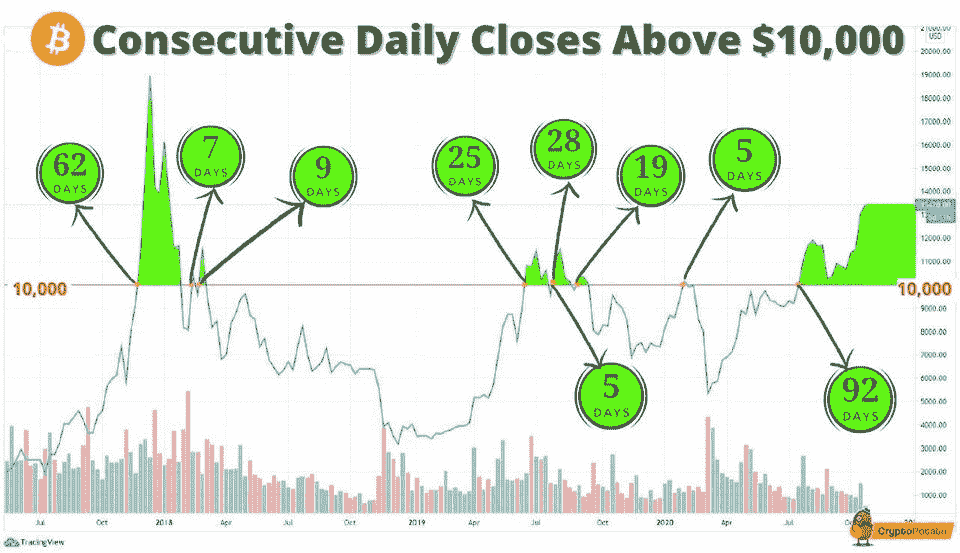
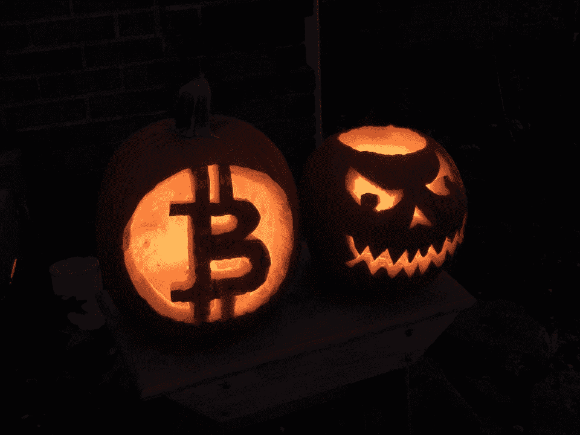
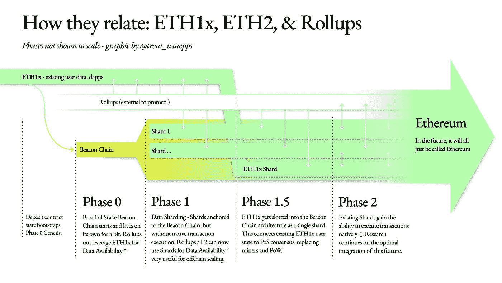

# 中国成功试用数字人民币/ PayPal 将密码购买限额提高到 1.5 万美元

> 原文：<https://medium.com/coinmonks/china-runs-a-successful-digital-yuan-trials-paypal-raises-crypto-buying-limit-to-15k-bc84abebaf30?source=collection_archive---------3----------------------->

## 泄露的“太极”文件揭示币安逃避监管/比特币白皮书 12 周年/华为 Mate 40 智能手机内置硬件钱包

[Source](https://www.reddit.com/r/CryptoCurrency/comments/jki9fx/pink_sus/)

*   比特币社区[庆祝](https://bitcoinist.com/bitcoin-to-celebrate-12-years-from-whitepaper-with-crucial-close-above-12k/)第 12 个白皮书周年。
*   中国人民银行行长易纲表示[在四个城市推出数字货币的试点项目](https://www.bloomberg.com/news/articles/2020-11-02/pboc-governor-says-4-million-transactions-so-far-in-digital-yuan?srnd=premium-asia)进展顺利。
*   华为 Mate 40 智能手机配有一个用于中国数字货币的[内置钱包](https://decrypt.co/46706/new-huawei-smartphone-includes-a-hardware-wallet-for-the-digital-yuan)。
*   PayPal 的加密货币服务将在 2021 年迅速扩张，高管们在支付巨头周一晚上的第三季度收益电话会议上表示。
*   **Celo Grants 第三波开放**！在过去的两次浪潮中，Celo 基金会已向团队提供了 180 万美元的资金，以推进其建立一个为所有人创造繁荣条件的开放金融体系的使命。 [**此处适用**](https://celofoundation.submittable.com/submit) 。

## [数量不足](https://quadency.com/?r=ea20aa360c45d1f5ad47a19a)

试试 [Quadency](https://blog.coincodecap.com/go/quadency) ，这是一个为交易者构建的交易终端，用于自动化他们的加密交易。阅读我们的[季度回顾](/coinmonks/quadency-review-a-crypto-trading-automation-platform-3068eaa374e1)。

## 最新消息📰

*   中国人民银行行长称“成功的”数字人民币试验已经交易了 2 . 99 亿美元
*   TRON [Mainnet 遭受攻击](https://cryptobriefing.com/tron-mainnet-suffers-attack-brings-block-production-halt/)，导致批量生产停止
*   [新的华为 Mate 40 手机](https://decrypt.co/46706/new-huawei-smartphone-includes-a-hardware-wallet-for-the-digital-yuan)包括用于数字元的硬件钱包
*   以太坊上现在有一个巨大的[20 亿美元的比特币](https://decrypt.co/46626/a-whopping-2-billion-in-bitcoin-is-now-on-ethereum)
*   两代情[授予银行执照](https://avantibank.com/bank-charter-granted/)并批准数字资产托管和美元令牌化的业务计划
*   秘密执行官霍比被捕的谣言不属实
*   DeFi [交易应用达摩](https://www.coindesk.com/defi-trading-app-dharma-now-connects-directly-to-us-bank-accounts)现在直接连接到美国银行账户
*   美联社将利用以太坊来[报道美国总统](https://developer.ap.org/ap-elections-api/)选举。
*   泰国暹罗商业银行深究赤字
*   [泄露的“太极”文件](https://www.forbes.com/sites/michaeldelcastillo/2020/10/29/leaked-tai-chi-document-reveals-binances-elaborate-scheme-to-evade-bitcoin-regulators/?sh=740c266f2a92)揭露币安规避比特币监管者的精心策划
*   PayPal 将“急切”客户的加密购买限额提高到每周 15000 美元
*   闪电池[开始营业](https://lightning.engineering/posts/2020-11-02-lightning-pool/):租赁流动资金，赚取回报，积累 sat
*   伊朗[修改法律](https://www.coindesk.com/iran-amends-law-to-allow-imports-to-be-funded-with-cryptocurrency)允许进口用加密货币支付

> *买一个* [***硬件钱包***](/coinmonks/the-best-cryptocurrency-hardware-wallets-of-2020-e28b1c124069)*[*保护你的加密货币*](/coinmonks/how-to-prevent-cryptocurrency-hacking-and-theft-from-your-wallet-65c8ff767766) *。**

**

*[Source](https://www.reddit.com/r/CryptoCurrency/comments/jj66kz/in_its_10year_history_this_is_the_longest_time/)*

## *好的读物📑*

*   *[12 点的比特币](/@nic__carter/bitcoin-at-12-f6fce39cb9bb)*
*   *[SushiSwap](https://research.nansen.ai/sushiswap-farming/) 农业分析*
*   *[匿名黑客](https://weijiek.medium.com/deanonymising-the-kucoin-hacker-418fa5e9911d)*
*   *2020 年第三季度*
*   *[分析](https://bitquery.io/blog/dex-blockchain-explorer)分散交换*
*   *[自主](https://openlawesq.medium.com/autonomous-lawyering-using-openlaw-dad9c604975b)使用 OpenLaw 的律师服务*
*   *[我们的网络](https://ournetwork.substack.com/p/issue-45):以太坊规模的报道*
*   *[气太他妈的](/pooltogether/the-gas-is-too-damn-high-understanding-transaction-fees-b3274e7fd228)高(理解交易费)*
*   *分散加密基金的比较*
*   *平衡器智能池的[终极指南](https://bankless.substack.com/p/the-ultimate-guide-to-balancer-smart)*
*   *为什么我们容忍 T21 的审查制度？*
*   *Argent 的 10 个安全秘密(2 个额外奖励)*
*   *投资者提出为什么比特币可能达到 100 万美元并超过黄金的市值*
*   *银色的 10 个[安全秘密](https://www.argent.xyz/blog/10-security-secrets/) ( & 2 奖励)*

**

*[Source](https://www.reddit.com/r/CryptoCurrency/comments/jkd9f5/just_looking_out_for_you/)*

## *开发商*

*   *闪电池:一次技术性的深潜*
*   *智能合同[模糊化](/coinmonks/smart-contract-fuzzing-d9b88e0b0a05)*
*   *[重入错误](http://www.blockchainthings.io/article.aspx?i=12)*
*   *[快速贷款](https://forum.makerdao.com/t/urgent-flash-loans-and-securing-the-maker-protocol/4901)和保护制造商协议*
*   *[xDai 和 Gnosis](https://dxdao.medium.com/xdai-mainnet-step-by-step-guide-e61b2d50d64) Mainnet 分步指南*
*   *最新[eth 2 中的新功能](https://hackmd.io/@benjaminion/eth2_news/https%3A%2F%2Fhackmd.io%2F%40benjaminion%2Fwnie2_201031)*
*   *ETH—[MAC OS 以太坊开发的备忘单](/coinmonks/eth-cheat-sheet-for-macos-ethereum-development-804f1f77b09b)*
*   *一个[潜入以太坊](/coinmonks/a-dive-into-ethereum-transaction-details-d62b3bb3c7a1)交易详情*
*   *Medalla Testnet 上的 Armiarma [指标](https://github.com/leobago/BSC-ETH2/blob/master/Armiarma/Armiarma.md)*
*   *以太坊层 2s 的[通用桥](/the-ethereum-name-service/a-general-purpose-bridge-for-ethereum-layer-2s-e28810ec1d88)*
*   *建立一个 [DeFi 看涨期权交易所](https://blog.chain.link/defi-call-option-exchange-in-solidity/)与 Chainlink 价格馈送*
*   *[好主意，坏设计](https://blog.trailofbits.com/2020/10/30/good-idea-bad-design-how-the-diamond-standard-falls-short/):钻石标准是如何落空的*
*   *最新消息[eth 2 中的新功能](https://hackmd.io/@benjaminion/eth2_news/https%3A%2F%2Fhackmd.io%2F%40benjaminion%2Fwnie2_201031)*

**

*[Source](https://www.reddit.com/r/Bitcoin/comments/jlr9o6/happy_14k_halloween_loved_making_these/)*

## *多方面的*

*   *[file.video](https://file.video/)*
*   *在线[获奖者](https://twitter.com/ETHGlobal/status/1321898728198934528)和[投稿](https://hack.ethglobal.co/ethonline/showcase)*
*   *实度 [0.8.x 预览版](https://solidity.ethereum.org/2020/10/28/solidity-0.8.x-preview/)发布*
*   *使用反应-使用-工作流运行多步[工作流](https://omarish.com/2020/10/28/react-workflow.html)*
*   *Web3j — [OpenAPI](https://blog.web3labs.com/web3j-open-api)*
*   *介绍新的[ethereum.org 开发者](https://blog.ethereum.org/2020/10/22/introducing-the-new-developer-portal/)门户网站*
*   *介绍 [Proto RAI](/reflexer-labs/introducing-proto-rai-c4cf1f013ef)*
*   *[海洋 V3](https://blog.oceanprotocol.com/ocean-v3-is-now-live-b47c0e73f52a) 现已上线*
*   *[计算历史性](https://twitter.com/realmubaris/status/1322654784596275200?s=20)非永久性损失的工具*

## *播客和视频💽*

*   *为初学者介绍 [Eth2 &赌注](https://www.youtube.com/watch?v=tpkpW031RCI)*
*   *[DeFi 区块空间](http://podcast.banklesshq.com/36-the-defi-blockspace-cycle-nic-carter)循环| Nic Carter*
*   *我[不是超级看好 DeFi](https://anchor.fm/thedefiant/episodes/Im-Not-Super-Bullish-on-DeFi--Were-Using-This-Tech-to-Enrich-a-Small-Group-of-People-James-Prestwich-eljokb) 。我们用这项技术来丰富一小部分人的生活*

## *黑客马拉松、活动和峰会*

*   *你好世界！由波尔卡多特*
*   *【2020 年流动性*
*   *[Seed 俱乐部](https://gitcoin.co/hackathon/seed-club-hacks/onboard)黑客马拉松*
*   *[投资](https://events.bizzabo.com/invest-ethereum-economy)以太坊*
*   *[Hackatom](https://hackatomv.devpost.com/)*

## *加密交易和折扣🔖*

*   *当你加入[***mud rex***](https://mudrex.com/signup?referral_code=COIN3566)时，获得 25 美元的信用点数，可以用来支付费用*
*   **在*[***Botsfolio***](/coinmonks/botsfolio.com/?coupon=gaure27)*上打八五折使用此* [*链接*](/coinmonks/botsfolio.com/?coupon=gaure27) *。**
*   **试用*[***Altrady***](https://app.altrady.com/?a=COINMONKS)*并使用优惠券代码****coin monks***获得 40%的折扣*

## *产品评论和其他加密软件📙*

*   *[block fi vs Celsius](/coinmonks/blockfi-vs-celsius-vs-hodlnaut-8a1cc8c26630)vs Hodlnaut*
*   *2020 年五大[密码借贷平台](https://blog.coincodecap.com/top-5-crypto-lending-platforms)*
*   *2020 年最佳加密交易机器人*
*   *[莱杰 vs 特雷佐](/coinmonks/ledger-nano-s-vs-x-battery-hardware-price-storage-59a6663fe3b0)*
*   *[n 零复习](/coinmonks/ngrave-zero-review-c465cf8307fc)*
*   *[莱杰 Nano S vs X](/coinmonks/ledger-nano-s-vs-x-battery-hardware-price-storage-59a6663fe3b0)*
*   *[十大密码本交易平台](/coinmonks/top-10-crypto-copy-trading-platforms-for-beginners-d0c37c7d698c)*
*   *[莱杰纳米 S vs 特雷佐 one vs 特雷佐 T vs 莱杰纳米 X](https://blog.coincodecap.com/ledger-nano-s-vs-trezor-one-ledger-nano-x-trezor-t)*
*   *最好的[加密税务软件](/coinmonks/best-crypto-tax-tool-for-my-money-72d4b430816b)*
*   *[最佳加密交易平台](/coinmonks/the-best-crypto-trading-platforms-in-2020-the-definitive-guide-updated-c72f8b874555)*
*   *Bitmex 的[保证金交易指南](/coinmonks/the-idiots-guide-to-margin-trading-on-bitmex-dbbd7742c6fc?source=friends_link&sk=7bfa99d2a181142510c8442c8ddb0786)*
*   *[Bitmex 高级保证金交易指南](/coinmonks/bitmex-advanced-margin-trading-guide-2270c195ce25?source=friends_link&sk=1d986cca731f5084b9a2db4a4bc4a7ad)*

*想让我们展示你的产品吗？请在 [Twitter @coinmonks](https://twitter.com/coinmonks) 上联系我们*

## *照片说明了一切📷*

**

*ETH2.0 roll up — [source](https://twitter.com/trent_vanepps/status/1321936246332104705/photo/1)*

## *乔布斯👷*

*   *[mStable](https://twitter.com/mstable_) 寻找有经验的[智能合约/协议开发](https://cryptocurrencyjobs.co/engineering/mstable-protocol-developer-defi/)*
*   *Bitquery 正在招聘 [Ruby 开发者](https://angel.co/company/bitquery/jobs)*
*   *Celer 雇佣可靠性和 Go devs。电子邮件:hiring@celer.network*
*   *高级前端工程师*
*   *MyCrypto —高级前端工程师*
*   *Celo 正在雇佣数据领导者*
*   *a16z 正在[招聘](https://a16z.com/about/jobs/?gh_jid=4167628003)一名数据科学家*
*   *Livepeer 正在招聘[区块链社区营销+运营负责人](https://angel.co/company/livepeer/jobs/874811-blockchain-public-network-community-marketing-associate)*
*   *作为营销总监[与 Chainlink 令人难以置信的生态系统合作](https://chainlinklabs.com/careers#job-492239)*
*   *小道消息招聘精英[区块链安全工程师](https://jobs.lever.co/trailofbits/4f459855-3299-462f-9e73-299a840d5baf) & [app 安全](https://jobs.lever.co/trailofbits/8b7f7fc1-efb0-4e89-b406-784c3a2d77e4)*
*   *DeFi devs！Yield 正在招聘可靠的前端人员—联系@yield.is*
*   *0x 正在招聘开发人员！[全栈、后端、前端或可靠性](https://0x.org/about/jobs)*
*   *Nexus Mutual: [经历过 Solidity dev](https://angel.co/company/nexus-mutual-1/jobs/967538-smart-contract-engineer)；首选欧洲时区*
*   *[Devops 或 SRE](https://authenticjobs.com/job/3006/textile-devops-or-sre/) :纺织品，遥控。*
*   *[分布式系统工程师](https://jobs.lever.co/3box):3 框*
*   *[前端显影剂](https://twitter.com/ceramicnetwork/status/1305886402886995968):陶瓷*
*   *[远程高级软件工程师](https://jobs.lever.co/audius):奥迪斯，远程*
*   *[UI 工程师](https://textile.breezy.hr/p/2efb847aca79-ui-engineer):纺织，远程*

## *在 Coinmonks 上发布*

*如果你喜欢在 crypto/区块链空间上写教育文章，并且想在 Coinmonks 出版物上发表。就在**【gaurav@coincodecap.com】***给我发邮件或者 DM 我**[***推特***](https://twitter.com/coinmonks)**

> **[直接在您的收件箱中获得最佳软件交易](https://coincodecap.com?utm_source=coinmonks)**

****