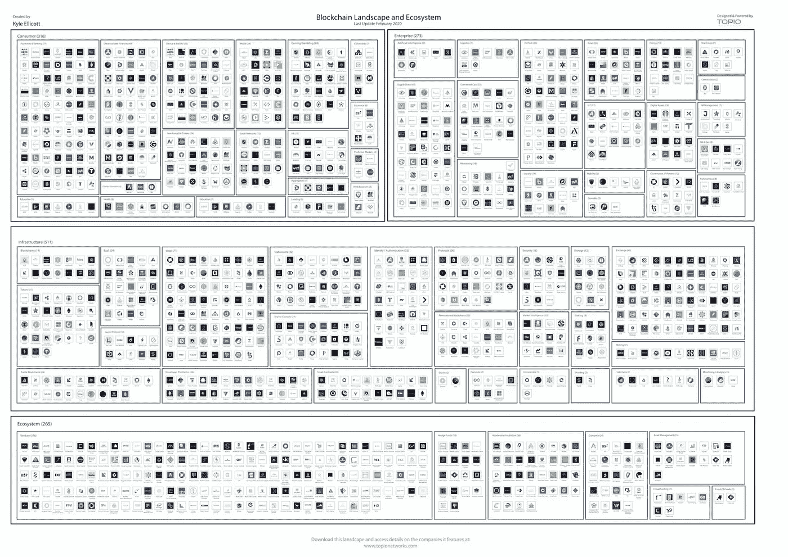

# 中国区块链到 2023 年将激增 27 亿美元/ Q1 2020 区块链格局更新/瑞典测试数字现金

> 原文：<https://medium.com/coinmonks/chinas-blockchain-2-7-391250b15c19?source=collection_archive---------0----------------------->

*2020 年 2 月 27 日*

*我们从我每周定期发布的景观回顾中休息了一天，这是有充分理由的——今天早上我发布了我的最新版本的* [*区块链景观*](https://www.topionetworks.com/markets/blockchain-landscape-5bf43854b9abe4633c1f87da) *(包含在下面以供下载)，它提供了该行业的概述，重点介绍了 900 多家全球公司、风险基金和工作组。如果这是你看到的第一个版本，就把它当作你在这个行业中进一步导航的路线图。*

现在开始本周的深潜。 ***比特币*** *带动一半* ***Square 的*** *现金 App 收入(2019 年第 4 季度)。瑞典中央银行已经开始测试其数字版的现金——克朗。新的伙伴关系旨在将 NFTs 带到美国国家橄榄球联盟(NFL)******MLB*******足球*******方程式 1*** *和 *UFC* *(* 区块链创业公司突然变得很酷，了解原因。国际数据公司(IDC)预测，到 2023 年，中国公司将向区块链技术领域投资 27 亿美元。***南韩的中央银行正在为债券市场建立新的区块链系统。****liquid PPS****发布可定制的企业区块链。****Unikrn****正在把赛马场 NFTs 放到以太坊上。一家 DeFi 保险公司 Nexus Mutual 在遭受袭击后，已经支付了第一笔赔款，涉及两笔索赔，价值约 31，000 美元。******

***我甚至在大量的研究中找到了临时抱佛脚的余地(*[*【Q1】2020 区块链景观*](https://www.topionetworks.com/markets/blockchain-landscape-5bf43854b9abe4633c1f87da) *(新&更新)&* [*DApps 景观*](https://www.topionetworks.com/markets/dapps-stack-landscape-5de8d07eb9abe453e04203f8) *) &书籍(关于* [*数字资产*](https://www.scribd.com/document/430637579/Current-Market-Overview-of-Digital-Assets)*&*[*企业区块链*](https://www.amazon.com/dp/B07Z3LJCHW/ref=cm_sw_r_tw_dp_U_x_C6iSDbACJJN2Z) *)！)、基础设施、DApps、比特币、经济学、交易所和 Stablecoins。为了了解更多信息，让你跟上时代的步伐，这里有一张本周业内热门新闻的快照。***

## **📈[摩根大通称区块链为数字货币奠定基础](https://www.bloomberg.com/news/articles/2020-02-21/jpmorgan-says-blockchain-is-laying-foundation-for-digital-money)**

**摩根大通(JPMorgan Chase & Co .)表示，像区块链这样的链接数据库的出现为数字货币奠定了基础，从而实现了支付行业的现代化。但挑战随着快速采用而出现，如脸书的 Libra 由于短期流动性问题未能达到规模。尽管如此，对于银行和金融机构来说，区块链可能是一项很有前途的技术，如果在有计划的结构下实施……[阅读更多信息](https://www.bloomberg.com/news/articles/2020-02-21/jpmorgan-says-blockchain-is-laying-foundation-for-digital-money)**

## **📖[瑞典目前正在测试其电子版现金——克朗](https://www.technologyreview.com/f/615266/sweden-riksbank-ekrona-blockchain/)**

**瑞典中央银行启动了为期一年的试点项目，开始测试其电子版现金 e-krona。与咨询巨头埃森哲合作，该项目将使用分布式账本技术进行，该技术受运行加密货币的区块链的启发。银行仍在审查发行现金数字补充的可能性，这也需要瑞典公众的参与……[阅读更多](https://www.technologyreview.com/f/615266/sweden-riksbank-ekrona-blockchain/)**

## **📖[区块链如何改变足球的面貌](https://decrypt.co/19935/how-blockchain-is-changing-the-face-of-soccer)**

**区块链在足球中发挥着重要作用，尽管听起来可能有些矛盾，但区块链技术将帮助足球回到传统的根源。一些足球俱乐部正在利用区块链平台吸引世界各地的球迷。Socios 是一个平台，向支持者出售数量有限的区块链球迷代币，以换取在俱乐部的发言权……[阅读更多信息](https://decrypt.co/19935/how-blockchain-is-changing-the-face-of-soccer)**

## **📈[新的合作伙伴关系旨在将区块链体育代币引入 MLB NFL](https://cointelegraph.com/news/new-partnership-aims-to-bring-blockchain-sports-tokens-to-the-nfl-mlb)**

**区块链体育公司 Chiliz 与营销机构 Lagardere Sports and Entertainment 合作，这将允许美国体育迷通过使用区块链的令牌与他们喜欢的球队互动。总部位于区块链的平台 Socios 将在美国国家橄榄球联盟(NFL)和美国职业棒球大联盟(MLB)等主要体育联盟中实施，平均团队估值为数十亿美元。此次合作将有助于 Chiliz 首次留下自己的足迹，并带来进一步的业务拓展机会……[阅读更多信息](https://cointelegraph.com/news/new-partnership-aims-to-bring-blockchain-sports-tokens-to-the-nfl-mlb)**

## **📖[什么变了？企业区块链创业公司突然很酷](https://www.forbes.com/sites/biserdimitrov/2020/02/19/what-changed-enterprise-blockchain-startups-are-all-of-a-sudden-cool/)**

**从 2019 财年开始，区块链行业已经看到了令人兴奋的新技术创新、合作伙伴关系以及大量投资区块链企业的公司和机构的上升趋势。一些专家仍然认为区块链空间太新，或者它没有解决真正的问题，但是从像谷歌、三星、富国银行和 Salesforce 这样的大玩家那里得到的认可大声说话… [阅读更多](https://www.forbes.com/sites/biserdimitrov/2020/02/19/what-changed-enterprise-blockchain-startups-are-all-of-a-sudden-cool/)**

## **💰[中国区块链产业到 2023 年将繁荣至 27 亿美元](https://decrypt.co/19828/china-blockchain-industry-to-boom-to-2-7-billion-by-2023)**

**国际数据公司(IDC)预测，到 2023 年，中国公司将向区块链技术领域投资 27 亿美元。这比 IDC 在 11 月份做出的预测高出 70 万美元，当时 IDC 预测中国公司同期将在区块链投资 20 亿美元，复合年增长率为 65.7%。其他预测包括，到 2023 年，10%的中国城市将采用基于区块链的数字货币，40%的中国金融机构将从 SWIFT(由美国主导的国际支付系统)和央行基础设施转移到基于区块链的跨境支付系统……[阅读更多信息](https://decrypt.co/19828/china-blockchain-industry-to-boom-to-2-7-billion-by-2023)**

## **📈[区块链的现状:专家评估世界各地的采用情况](https://cointelegraph.com/news/the-state-of-blockchain-experts-weigh-in-on-adoption-around-the-world)**

**区块链利用正在广泛引爆。无论如何，尽管创新有众多的口头支持者，但创新的传播从来都不是一个永无止境的点。国际数据公司(International Data Corporation)的区块链负责人拉多斯拉夫·德拉戈夫(Radoslav Dragov)澄清说，从投资到人才，各种变量都可以创造理想的条件，然而，在监管出台之前，政府对这项技术的整体态度可能会减缓它的采用。IDC 预计 2019 年区块链的支出将达到 27 亿美元，比 2018 年增长 80%……[了解更多](https://cointelegraph.com/news/the-state-of-blockchain-experts-weigh-in-on-adoption-around-the-world)**

# **🚨Q1 2020 区块链景观发布🚨**

**今天我发布了[区块链景观](https://www.topionetworks.com/markets/blockchain-landscape-5bf43854b9abe4633c1f87da)的 **Q1 2020** 版。这是我发布的第五版景观，包括 **747** 家公司( **900 多家独特公司**包括更广泛的关键生态系统参与者)和从 2010 年至 2020 年在整个景观中筹集的超过**220 亿美元的资金**——自 2017 年以来投资超过 180 亿美元！—出现明显的循环，并有完整的分解。**

**祝贺[港湾](https://medium.com/u/3d4192241ca8?source=post_page-----391250b15c19--------------------------------)(被 [BitGo](https://www.linkedin.com/company/bitgo-inc/) 收购)[Copper.co](https://www.linkedin.com/company/copperco/)，[闪电 Labs⚡️](https://medium.com/u/c235aa1f632c?source=post_page-----391250b15c19--------------------------------) ， [PoolTogether](https://www.linkedin.com/company/pooltogether/) ， [Authereum](https://medium.com/u/63ea5a2e7844?source=post_page-----391250b15c19--------------------------------) ， [SIMBA Chain](https://www.linkedin.com/company/simbachain/) ，以及 [Paystand](https://www.linkedin.com/company/paystand/) 最近的筹款。该领域的主要风投是[数字货币集团](https://medium.com/u/a6be2334cd52?source=post_page-----391250b15c19--------------------------------)的 47 项投资、[潘迪拉资本](https://medium.com/u/d25fb22875fb?source=post_page-----391250b15c19--------------------------------)的 27 项投资、[区块链资本](https://medium.com/u/9737c5ab2ab1?source=post_page-----391250b15c19--------------------------------)的 22 项投资，以及[安德里森·霍洛维茨](https://medium.com/u/df45fd4a749d?source=post_page-----391250b15c19--------------------------------)和 20 项投资——可提供投资组合分类。**

**此外，将于今年晚些时候发布的完整音频概述将在[此处](https://www.topionetworks.com/markets/blockchain-landscape-5bf43854b9abe4633c1f87da)免费提供，其中我涵盖了 2019 年的总结、2020 年的新兴趋势、DeFi、Libra、CDBCs、Stablecoins、DApps 等等！**

# **本周的更多内容:**

**📈[摩根大通全球研究:区块链、数字货币、&加密货币](https://www.linkedin.com/posts/blockdata_jp-morgan-perspectives-activity-6637693653362057216-DagX)来自 [BLOCKDATA](https://medium.com/u/279c07ad0b4d?source=post_page-----391250b15c19--------------------------------) 团队**

**📖[云巨头微软 Azure 拥抱商业区块链](https://cointelegraph.com/news/cloud-giant-microsoft-azure-embraces-commercial-blockchain)**

**📖 [Loopring 推出 ZK roll up Exchange:loop ring . io](/loopring-protocol/loopring-launches-zkrollup-exchange-loopring-io-d6a85beeed21)**

**📖[复合治理](/compound-finance/compound-governance-5531f524cf68)由[罗伯特·莱什](https://medium.com/u/54f6f223cd12?source=post_page-----391250b15c19--------------------------------)**

**📖[得益于 Celer Network](https://cointelegraph.com/news/polkadot-will-feature-layer-two-scaling-thanks-to-celer-network) ，Polkadot 将实现第二层扩展**

**📖[区块链的现状:专家评估世界各地的采用情况](https://cointelegraph.com/news/the-state-of-blockchain-experts-weigh-in-on-adoption-around-the-world)**

**📖 [2019 Q4 基金会报告](/theoan/2019-q4-foundation-report-b3a38a28d2b1)由[开放应用网](https://medium.com/u/26219f78865e?source=post_page-----391250b15c19--------------------------------)**

**💰[韩国央行正在为债券市场构建新的区块链系统](https://www.coindesk.com/south-koreas-central-bank-is-building-a-new-blockchain-system-for-the-bond-market)**

**📖[蒂姆·德雷珀向阿拉贡·区块链项目投资 100 万美元创建数字法庭](https://techcrunch.com/2020/02/19/tim-draper-puts-1m-into-the-aragon-blockchain-project-to-create-digital-courts/)**

**📖 [6 个问题，问洛里的奥布里·斯特罗贝尔](https://magazine.cointelegraph.com/2020/02/21/6-questions-for-aubrey-strobel-of-lolli/)**

# **分散式应用程序手表**

## **📖[未来应用&以太坊上的产品](/ideo-colab/future-applications-products-on-ethereum-d63d85d6ed43)**

**50 多名企业家和经验丰富的产品负责人聚集在 IDEO CoLab(T1)，集思广益，研究可以在 T2 以太坊(T3)上开发的未来应用和产品。讨论的重点是分散融资(DeFi)的机会&使用可组合支付流的 DeFi-adjacent，以及使用隐私工具进行会员证明……[阅读更多信息](/ideo-colab/future-applications-products-on-ethereum-d63d85d6ed43)**

## **📖[为什么分散的土地不仅仅是拥有加密技术的《我的世界》](https://decrypt.co/20141/why-decentraland-is-more-than-just-minecraft-with-crypto)**

**[分散地](https://medium.com/u/98348dd48afe?source=post_page-----391250b15c19--------------------------------)的法力加密货币于 2 月 20 日公开发售，现在可以用来购买游戏中 10x10m 的地块(土地)。基于以太坊的法力令牌最初筹集了 2070 万美元，在五分钟内销售一空。在这种兴奋的推动下，用户在土地拍卖中花费了 1.61 亿美元购买虚拟地块，价值约为今天的 880 万美元。通过此次发布，任何代理都无权修改软件规则、管理土地内容、更改魔法经济学、升级土地智能合同或阻止他人访问世界……[阅读更多信息](https://decrypt.co/20141/why-decentraland-is-more-than-just-minecraft-with-crypto)**

## **📖[liquid PPS 发布可定制的企业区块链专用解决方案:LiquidChains](https://www.cryptoninjas.net/2020/02/20/liquidapps-releases-customizable-enterprise-blockchain-specific-solution-liquidchains/)**

**[DAPP 网络的创建者 liquid PPS](https://medium.com/u/111b26bf40a9?source=post_page-----391250b15c19--------------------------------)宣布发布一款名为 LiquidChains 的可定制企业区块链专用解决方案。该解决方案将帮助企业和 dApps 在部署关键任务区块链应用时，跨越公共、许可和私有区块链；这项技术将允许任何人在几分钟内建立一个可定制的链，并将其连接到公共账本以进行透明的记录……[阅读更多](https://decrypt.co/20141/why-decentraland-is-more-than-just-minecraft-with-crypto)**

**📖[仍然是首选:BitTorrent Speed 在 dApps 平台上保持领先](https://www.btcnn.com/still-the-top-choice-bittorrent-speed-maintains-its-lead-on-dapps-platform/)**

**💰[“沙盒”游戏以太坊出售价值 20.6 万美元的土地](https://cointelegraph.com/news/sandbox-game-from-ethereum-sells-206-000-worth-of-land)**

**📖[假马，真赌注:Unikrn 正在以太坊进行赛马场 NFTs】](https://www.coindesk.com/fake-horses-real-bets-unikrn-is-putting-racetrack-nfts-on-ethereum)**

**📖[域名初创公司在以太坊上建立了一个不受审查的互联网](https://www.coindesk.com/the-domain-startups-building-an-uncensorable-internet-on-top-of-ethereum)**

# **🎧区块链行业状况 Q1 2020:**

***今日起，《区块链产业的* [*状态 Q1 2020*](https://www.topionetworks.com/markets/blockchain-landscape-5bf43854b9abe4633c1f87da) *版。在本次活动中，我将概述 2019 年是区块链/DLT 格局的决定性一年，深入分析 Q1 2020 年和不断变化的格局，并详细介绍基础设施、分散化应用(DApps) &金融(DeFi)、2020 年计划的重大发布(Libra、数字货币、协议等)。)，并为您提供成功驾驭快速崛起的去中心化未来的路线图。***

**

Source: [Topio Networks](https://www.topionetworks.com/markets/blockchain-landscape-5bf43854b9abe4633c1f87da)** 

> **👉下载新的[区块链基础设施景观 Q1 2020](https://www.topionetworks.com/markets/blockchain-landscape-5bf43854b9abe4633c1f87da) 版，了解关于 DeFi、DApps、基础设施、数字货币等的见解！**

**不想等到下周，[现在就订阅](http://click1.m.readwritelabs.com/xsdqkbbrgsdtqkmntpjlstcnkytvpvphsnhsqlvbrhhd_yfqbfcmslnskglmckvqv.html?source=post_page---------------------------)📥有关区块链、DApps 等的实时行业见解！**

> **[直接在您的收件箱中获得最佳软件交易](https://coincodecap.com/?utm_source=coinmonks)**

********