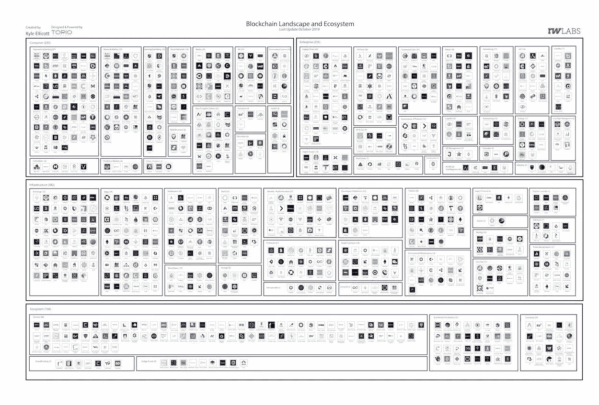

# 中国的区块链计划正在取得胜利/五个值得关注的 2020 区块链趋势/ Cardano 扩展到 54 个非洲国家

> 原文：<https://medium.com/coinmonks/chinas-blockchain-plan-is-winning-five-2020-blockchain-trends-to-watch-cardano-extends-to-54-68bcdd528bfe?source=collection_archive---------0----------------------->

Photo by [Robynne Hu](https://unsplash.com/@robynnexy?utm_source=unsplash&utm_medium=referral&utm_content=creditCopyText) on [Unsplash](https://unsplash.com/s/photos/future?utm_source=unsplash&utm_medium=referral&utm_content=creditCopyText)

2019 年 11 月 27 日

*让我们直接进入感恩节周版本*🦃*对那些继续不知疲倦地推动这个行业向前发展并为后来者公开分享他们的经验教训的人，致以衷心的感谢。现在来看本周的完整版——****中国最新公布的*** *区块链政策以及 17 个金融科技类别的标准——美国需要注意。2020 年，我们有五个* ***区块链趋势*** *值得关注。* ***卡尔达诺*** *将区块链服务扩展至 54 个非洲国家。既然软件吃了天下，就该轮到区块链介入了，洞察上* ***涟漪下的*** *涌浪发布会，概述去中心化****Shopify****替代，以及 stablecoins 市场对比。*

*在 DApps 版图中，我们说的是* ***分布式存储(* gWASM** ) ***，新协议*** *和* ***开发工具，数据令牌/ NFTs，Klaytn，& Algorand。*** *Plus 更新自****DappRadar****关于* ***DeFi、Gaming*** *DApps、****arc block****发布 2.0 版本首开此类分散身份之先河。我们甚至在大量的研究(* [*Q3 2019 区块链格局*](https://www.topionetworks.com/events/5d79268b78e00230faba6f77) *) &书籍(关于* [*数字资产*](https://www.scribd.com/document/430637579/Current-Market-Overview-of-Digital-Assets)*&*[*企业区块链*](https://www.amazon.com/dp/B07Z3LJCHW/ref=cm_sw_r_tw_dp_U_x_C6iSDbACJJN2Z) *)以及对风险投资的见解(新基金！！)、基础设施、DApps、比特币、经济学、交易所和 Stablecoins。为了了解更多信息，让你跟上时代的步伐，这里有一张本周业内热门新闻的快照。*

## 🇨🇳 [为什么中国的区块链计划会成功，美国应该关注](https://www.forbes.com/sites/biserdimitrov/2019/11/25/why-china-blockchain-plan-is-winning-and-the-us-should-pay-attention/#541b4d9e5e7e)

中国新公布的区块链政策是有意义的，因为它建立了区块链标准，而且中国将在与美国的贸易战中获得优势。新的进步将来自中国，而不是通常的区块链生产区，如纽约和三藩市，最后，它们不会开源，也不会为世界所用……[阅读更多](https://www.forbes.com/sites/biserdimitrov/2019/11/25/why-china-blockchain-plan-is-winning-and-the-us-should-pay-attention/#541b4d9e5e7e)

## 📈[2020 年区块链:值得关注的 5 大趋势](https://enterprisersproject.com/article/2019/11/blockchain-2020-5-trends-watch)

据 [George Spasov](https://medium.com/u/cb10eef693b3?source=post_page-----68bcdd528bfe--------------------------------) 报道，区块链建筑师和 [LimeChain](https://medium.com/u/85f25135ff7a?source=post_page-----68bcdd528bfe--------------------------------) 的联合创始人表示，2019 年继续了 2018 年开始的事情——企业在区块链中进行试验。他指出，大多数公司只是在测试区块链水域，这符合一些早期的数据点，大约在 2018 年底，表明大多数首席信息官并没有积极寻求区块链项目。此外，根据 Chris Broderson 的说法，德勤美洲区块链实验室负责人表示，从企业的角度来看，“区块链旅游”阶段已经过去，公司不再[简单地]认为需要了解底层的技术细节，他进一步指出，根据德勤 2019 年全球区块链调查，高管们表示，他们预计采用区块链的常见障碍(如安全威胁、实施难题或监管问题)将显著减少… [阅读更多信息](https://enterprisersproject.com/article/2019/11/blockchain-2020-5-trends-watch)

## 📖 [Cardano 将区块链服务扩展至 54 个非洲国家](https://www.cryptoknowmics.com/news/cardano-extends-blockchain-service-to-54-african-countries)

卡达诺基金会正在将其服务扩展到其他 54 个非洲国家，以整合区块链治理，旨在帮助非洲国家以负责任和透明的方式提高其立法和商业标准，从而创造就业机会，同时确保可持续增长。该基金会希望与不同国家的政府携手合作，发展区块链治理，以确保未来非洲的经济发展……[阅读更多信息](https://www.cryptoknowmics.com/news/cardano-extends-blockchain-service-to-54-african-countries)

## 📖[脸书的天秤座发射“愚蠢至极”，区块链老板说](https://markets.businessinsider.com/currencies/news/facebook-libra-launch-ridiculously-stupid-r3-blockchain-david-rutter-2019-11-1028707191)

R3(R3 团队)首席执行官 David Rutter 表示，脸书发布其提议的 Libra 加密货币非常幼稚，并且缺乏理解。由于 libra 已经接受了政府监管机构的严格审查，促使包括 Visa、Mastercard 和 PayPal 在内的合作伙伴收回了支持……[阅读更多](https://markets.businessinsider.com/currencies/news/facebook-libra-launch-ridiculously-stupid-r3-blockchain-david-rutter-2019-11-1028707191)

## 📖[可扩展性问题可能最终通过重新设计区块链架构来解决](https://insidebitcoins.com/news/scalability-problem-may-finally-be-solved-by-redesigning-blockchain-architecture/242827)

区块链项目 [ILCoin](https://ilcoincrypto.com/) 有可能彻底改变区块链网络的运作方式。该项目发明了一种称为 RIFT 的新协议，它利用了两层块。简而言之，伊尔克因的区块链有两种街区类型——标准街区和迷你街区，标准街区和迷你街区非常相似……[阅读更多信息](https://insidebitcoins.com/news/scalability-problem-may-finally-be-solved-by-redesigning-blockchain-architecture/242827)

## 📖[神话游戏通过“玩家所有的经济”为区块链游戏筹集了 1900 万美元](https://venturebeat.com/2019/11/20/mythical-games-raises-19-million-for-blockchain-based-games-with-player-owned-economies/)

[神话游戏](https://medium.com/u/3635f2e837f?source=post_page-----68bcdd528bfe--------------------------------)已经为其游戏工作室筹集了 1900 万美元，该工作室将制作基于区块链的游戏，玩家可以通过数字所有权赚钱。 [Javelin 副总裁](https://medium.com/u/fdd3ad7f3b04?source=post_page-----68bcdd528bfe--------------------------------)与其他新投资者一起牵头投资雅芳风险投资公司、[校友风险投资公司](https://medium.com/u/92f7e09a0def?source=post_page-----68bcdd528bfe--------------------------------)和 Hashed。随着这笔资本的到来，公司还增加了亚历克斯·古列维奇(Javelin Venture Partners)和独立董事雷希托·鸠山由纪夫(前三丽鸥全球首席运营官，Hello Kitty)，他们将加入现有董事会成员[银河数码的山姆·恩格勒巴特](https://medium.com/u/47d90f0933c5?source=post_page-----68bcdd528bfe--------------------------------)、约翰·林登和杰米·杰克逊……[阅读更多信息](https://venturebeat.com/2019/11/20/mythical-games-raises-19-million-for-blockchain-based-games-with-player-owned-economies/)

## 🇨🇳 [中国央行将为包括区块链在内的 17 个金融科技类别制定标准](https://www.coindesk.com/china-central-bank-to-set-standards-for-17-fintech-categories-including-blockchain)

中国人民银行(PBoC)计划在包括区块链在内的整个金融领域制定行业标准。根据中国人民银行副行长的说法，范一飞区块链是新标准下监管的 17 类金融技术之一，包括云服务和人工智能……[阅读更多](https://www.coindesk.com/china-central-bank-to-set-standards-for-17-fintech-categories-including-blockchain)

## 📖[从摧毁我汽车的掉落树枝中，我了解到我们多么需要区块链](https://www.forbes.com/sites/davidblack/2019/11/21/i-learned-how-much-we-need-blockchain-from-a-falling-branch-destroying-my-car/#5b4170516d52)

这个令人震惊的事件有几个好的结果。首先，我最终租了一辆漂亮的新车。第二个结果是一些很难获得的教育，并且具有严重的影响——我了解到区块链技术在帮助协调我的汽车保险公司、修理店和汽车租赁公司的信息和工作方面有多么重要，这些公司为我提供汽车，直到我可以得到一辆新车……[阅读更多信息](https://www.forbes.com/sites/davidblack/2019/11/21/i-learned-how-much-we-need-blockchain-from-a-falling-branch-destroying-my-car/#5b4170516d52)

## 📖[加密货币不会消亡](https://www.gq.com/story/cryptocurrency-will-not-die)

钱就是命。对这个星球上的几乎每一个人来说，它比孩子、母亲、艺术等等都重要。严格来说，这是付款记录。它可以是一种货币，但不一定是。对于一个抽象的概念来说，无论是真实的还是不真实的，金钱都是有形的。钱意味着你的孩子要么吃饭，要么挨饿。金钱能让一袋纸换来一屋子的电器。金钱可以是性。金钱可以谋杀……[阅读更多](https://www.gq.com/story/cryptocurrency-will-not-die)

# 本周阅读的研究:

## 📖[区块链上的蛮战](https://research.tokendata.io/2019/11/24/barbarians-on-the-blockchain/)

[Source](https://research.tokendata.io/2019/11/24/barbarians-on-the-blockchain/)

虽然加密货币行业仍处于起步阶段，但涉及加密公司的并购活动已经有所增加。然而，除了轶事，新闻稿和高水平的总结，没有任何彻底的或前瞻性的分析，直到现在。自 2013 年以来，已经发生了 350 起涉及加密货币和区块链公司的收购。M&A 的活动在 2018 年达到顶峰，有超过 160 笔交易，我们估计 2019 年有 90-100 笔交易……[阅读更多](https://research.tokendata.io/2019/11/24/barbarians-on-the-blockchain/)和更多 by [令牌数据](https://medium.com/u/624e32513002?source=post_page-----68bcdd528bfe--------------------------------)

# 本周的更多内容:

📖[金融科技:第四平台——第一部分](https://www.forbes.com/sites/matthewharris/2019/11/19/fintech-the-fourth-platform-part-one/)

📖[软件吃了世界。现在轮到区块链了](https://tbtech.co/software-ate-the-world-now-its-blockchains-turn/)

📖[OAN 投资隐私](/theoan/the-oan-invests-in-privacy-1f9d71937893)由[阿里沙里夫](https://medium.com/u/7f69d4be1e5f?source=post_page-----68bcdd528bfe--------------------------------) & [开放应用网络](https://medium.com/u/26219f78865e?source=post_page-----68bcdd528bfe--------------------------------)

📖[泰勒·罗尔夫](/kadena-io/the-complete-crypto-wallet-user-guide-fca88e56a31b)[撰写的《完全加密钱包用户指南](https://medium.com/u/90e66c91725c?source=post_page-----68bcdd528bfe--------------------------------)

📖[由尼克·波尔登](/originprotocol/built-on-origin-a-decentralized-shopify-alternative-888adc4198b0)[创作的《建立在起源上:一个分散的购物选择](https://medium.com/u/917ab3f96fd7?source=post_page-----68bcdd528bfe--------------------------------)

🎄 [Crypto 圣诞礼物指南 2019](https://decrypt.co/11903/crypto-christmas-gift-guide-2019) 由[解密](https://medium.com/u/54b61e1b74da?source=post_page-----68bcdd528bfe--------------------------------)

💰[maker Dao 和 Equilibrium_EOSDT 有什么区别？](https://defiprime.com/makerdao-compared-to-equilibrium)

💰[隐私&加密货币，第四部分:Stablecoins —黑名单&可追溯性](/human-rights-foundation-hrf/privacy-and-cryptocurrency-part-iv-stablecoins-for-human-rights-blacklists-and-traceability-6d74ee17c25d)作者[埃里克·沃尔](https://medium.com/u/bdd9bfe4b591?source=post_page-----68bcdd528bfe--------------------------------)

💰[汇丰明年将在区块链上追踪 200 亿美元资产](https://www.coindesk.com/hsbc-to-track-20-billion-in-assets-on-a-blockchain-next-year)

💰 [EOSIO 资源分配由](/@bytemaster/eosio-resource-allocation-reimagined-f219e8d489c)[丹尼尔·拉里默](https://medium.com/u/1d906c7421de?source=post_page-----68bcdd528bfe--------------------------------)重新构想

📖[当前数字资产市场概述](https://www.scribd.com/document/430637579/Current-Market-Overview-of-Digital-Assets)作者[大卫·内奇](https://medium.com/u/b23d2fb9948a?source=post_page-----b48e000a0f21----------------------)

# 分散式应用程序手表

## 📖[algrand 升级旨在开发 Dapp 的协议](https://www.enterprisetimes.co.uk/2019/11/25/algorand-upgrades-protocol-aimed-at-dapp-development/)

阿尔格兰德基金会宣布推出协议升级版。这将支持经济高效的证券交易基础设施，并使 [Securitize.io](https://medium.com/u/4181e01aabf0?source=post_page-----68bcdd528bfe--------------------------------) 能够为客户提供高效版本的合规层……[阅读更多信息](https://www.enterprisetimes.co.uk/2019/11/25/algorand-upgrades-protocol-aimed-at-dapp-development/)

## 📖[使用 gWASM 构建您的分散式应用](https://blog.golemproject.net/build-your-decentralized-applications-with-gwasm/)

[假人项目](https://medium.com/u/8b0d088e8160?source=post_page-----68bcdd528bfe--------------------------------)团队发布了最新的元用例 gWASM，代表假人上的 WebAssembly。它旨在成为应用程序和可扩展基础设施之间的桥梁。它让您的应用或服务能够轻松访问外部和分散的计算能力……[阅读更多信息](https://blog.golemproject.net/build-your-decentralized-applications-with-gwasm/)

## 📖[来自 DappRadar 的新数量统计显示 DeFi 被低报](https://cryptobriefing.com/volume-statistics-dappradar-show-defi-underreported/)

根据行业文章，除了游戏、交易所和其他行业，以太坊一直是最近 Defi 上涨的主要受益者，据信这是一个快速增长但仍可与所有其他行业相媲美的行业。此外，虽然许多人认为 dex 是以太坊链上活动的来源，但添加令牌数据表明，基于赌注的 DeFi 应用程序值得同样多的信任。作为市场上最古老、最成熟的智能合约平台，以太坊提供多种 dApp 类别… [阅读更多信息](https://cryptobriefing.com/volume-statistics-dappradar-show-defi-underreported/)

## 📖[数据令牌 2:从不可替代到可替代和可组合的数据令牌](https://blog.oceanprotocol.com/data-tokens-2-fungible-composable-54b6e0d28293)

[海洋协议](https://medium.com/u/1e7ff6f6df18?source=post_page-----68bcdd528bfe--------------------------------)旨在启动一个开放的数据经济。数据令牌是一个关键部分。本系列的第 1 部分描述了不可替代的数据令牌来对数据访问控制进行令牌化，这提供了一种使用加密钱包进行数据保管的新方法。本文就是建立在这个基础上的。它问——可替换数据令牌的驱动用例是什么？我们将如何实现它们？推动分层组织(可组合)数据令牌用例的是什么？我们将如何实施它们？。… [阅读更多信息](https://blog.oceanprotocol.com/data-tokens-2-fungible-composable-54b6e0d28293)

📖[霓虹区:未来。已编辑。](/blockadegames/neon-district-the-future-edited-3d87aa11dc6e)由[霓虹区](https://medium.com/u/9c59515ce072?source=post_page-----68bcdd528bfe--------------------------------)

📖 [ArcBlock 发布了首个此类分散身份的 2.0 版本](https://finance.yahoo.com/news/arcblock-releases-2-0-version-020010587.html)

📖[klay TN Mainnet 推出 5 个月了…Klaytn BApps 变得强大](/klaytn/5-months-since-klaytn-mainnet-launch-klaytn-bapps-going-strong-64c14258262)由 [Klaytn](https://medium.com/u/2cd1485f110a?source=post_page-----68bcdd528bfe--------------------------------)

# 📺收听:

本周，我得到了最新一集的 Jay Kim Show ,他正在重新报道新加坡 Ripple 的 2019 年 Swell 会议。杰伊采访了 Ripple 的四位高管——首席执行官、[布拉德·加林豪斯](https://www.linkedin.com/in/bradgarlinghouse/)；首席技术官[大卫·施瓦茨](https://www.linkedin.com/in/sjoelkatz/)；客户成功的 SVP[马库斯·崔彻](https://www.linkedin.com/in/marcus-treacher-b8387b5/)；还有全球运营部的 SVP，[埃里克·范·米尔滕堡](https://www.linkedin.com/in/vanmiltenburg/)——[调进来](https://www.jaykimshow.com/podcast/138-ripple/)！

 [## Jay Kim Show:创业|投资|初创公司:Ripple 的 2019 年 Swell 会议…

### 在 iTunes 上听这一集，你对本周这一集最大的感悟是什么？在评论里让杰伦知道…

podcasts.apple.com](https://podcasts.apple.com/ph/podcast/ripples-2019-swell-conference/id1195300022?i=1000457763186) 

> *👉下载最新* [*区块链用于基础设施景观*](https://www.topionetworks.com/events/5d79268b78e00230faba6f77) *Q3 2019 版*

Q3 2019 Edition of the Blockchain for Infrastructure & Ecosystem Landscape

不想等到下周，[现在就订阅](http://click1.m.readwritelabs.com/xsdqkbbrgsdtqkmntpjlstcnkytvpvphsnhsqlvbrhhd_yfqbfcmslnskglmckvqv.html?source=post_page---------------------------)📥有关区块链、DApps 等的实时行业见解！

> [直接在您的收件箱中获得最佳软件交易](https://coincodecap.com/?utm_source=coinmonks)

