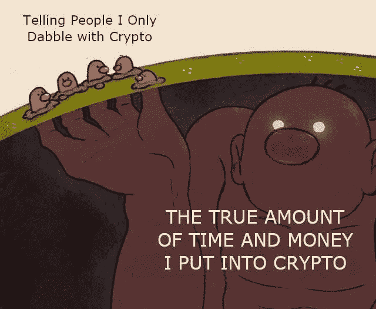
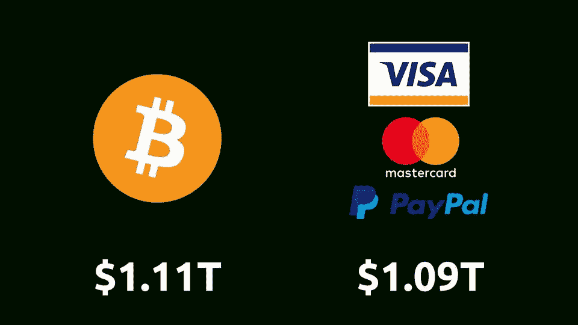

# 中国的数字货币不是匿名的|摩根士丹利提供比特币基金

> 原文：<https://medium.com/coinmonks/chinas-digital-currency-is-not-anonymous-morgan-stanley-offers-bitcoin-fund-2f602510c1fa?source=collection_archive---------5----------------------->

[Source](https://www.reddit.com/r/Bitcoin/comments/m71eoe/time_to_get_back_to_some_of_the_og_meme_roots/)

## CFTC 指控比特币基地进行洗钱交易|以太坊基金会宣布柏林授权

*   中国人民银行(PBoC)的一名官员表示，基于国际共识，“完全匿名的央行数字货币(CBDC)不是一个选项”。
*   4 月，以太坊下一个硬分叉要激活了。对于外行人来说，这些变化看起来相当神秘。广泛期待但也有争议的更新 EIP 1559 仍然在外面——目前。
*   美国商品期货交易委员会(Commodity Futures Trading Commission)发布命令，对比特币基地数字资产交易所(digital asset exchange)提起诉讼并达成和解，指控该公司不计后果地发布虚假、误导或不准确的报告，以及一名前员工在比特币基地 GDAX 平台上进行清洗交易。
*   摩根士丹利成为第一家向富裕客户提供比特币资金的美国大银行

> *我闹着玩复制交易，尝试过不同的专业交易者，但最终与一位交易者达成一致，阅读* [*我的复制交易经验*](/coinmonks/my-experience-with-crypto-copy-trading-d6feb2ce3ac5) *。*

## [Pionex](http://blog.coincodecap.com/go/pionex)

试试专业的加密交易所 Pionex，它有免费的加密交易机器人，可以让你的交易自动化。阅读我们的 [Pionex 评论](/coinmonks/pionex-review-exchange-with-crypto-trading-bot-1e459d0191ea)并查看我们的 [**加密交易机器人**](/coinmonks/crypto-trading-bot-c2ffce8acb2a) 列表。

> [Bitgaps](https://blog.coincodecap.com/go/bitsgap) lacuched **期货交易机器人**。

## 最新消息📰

*   中国人民银行官员称“完全匿名的 CBDC 不是一个选项”
*   以太坊基金会[宣布柏林硬叉子](/coinmonks/ethereum-foundation-announces-berlin-hardfork-603773bbc2aa)
*   一份[FATF 2021 年草案快速分析](https://www.coincenter.org/a-quick-analysis-of-fatfs-2021-draft-cryptocurrency-guidance/)
*   BitMEX 创始人亚瑟·海斯打算下个月以 1000 万美元的保释金自首
*   纽约男子以 85 美元的价格出售屁，利用 NFT 热大捞一笔
*   主播[目标 20%固定稳定收益](https://thedefiant.io/anchor-targets-20-fixed-stablecoin-yield/)
*   摩根士丹利[成为第一家为其富有客户提供比特币资金的美国大银行](https://www.cnbc.com/2021/03/17/bitcoin-morgan-stanley-is-the-first-big-us-bank-to-offer-wealthy-clients-access-to-bitcoin-funds.html)
*   [CFTC 命令比特币基地公司](https://www.cftc.gov/PressRoom/PressReleases/8369-21)为虚假、误导或不准确的报告和清洗交易支付 650 万美元
*   怀俄明州的“道法”在州参议院以 28 票对 2 票通过
*   北海巨妖明年可能通过直接上市的方式上市

> *报税季即将到来，使用最好的* [***加密报税软件***](/coinmonks/best-crypto-tax-tool-for-my-money-72d4b430816b) *来申报你的加密报税吧。*

[Source](https://www.reddit.com/r/CryptoMarkets/comments/m7wfh4/anyone_else/)

> BlockFi 首次推出加密奖励信用卡。在日常购物中获得 1.5%的比特币奖励。[现在加入等候名单](http://blog.coincodecap.com/go/blockfi)。

## 好的读物📑

*   [区块大小战争](/@nic__carter/the-blocksize-war-review-487c18f42c86)回顾
*   比特币作为[电池](https://www.nickgrossman.xyz/2021/bitcoin-as-battery/)
*   [洋葱对 NFTs 的指南](https://www.theonion.com/the-onion-s-guide-to-nfts-1846489288)
*   [从山寨币中赚取比特币](/coinmonks/earning-bitcoin-from-altcoins-the-little-old-lady-strategy-refined-bdc8438d914e)—“小老太太-策略”提炼
*   我们承担[数字资产的流动性](/coinmonks/our-take-on-liquidity-of-digital-assets-667c22c09e20)
*   [任分析](/coinmonks/ch-3-ren-pt-1-qualitative-d742c6c9947f) —第一部分—定性
*   我[想了解一下比特币](/coinmonks/i-want-to-learn-about-bitcoin-but-i-dont-know-where-to-start-3047a7b27a28)，但是不知道从何入手！
*   什么是[多签名钱包](https://blog.coincodecap.com/multi-signature-wallet)？
*   [债务，通货膨胀](/coinmonks/debt-inflation-money-printing-af572dad8f57)，&印钞
*   比特币基地的[悖论](https://generalist.mirror.xyz/Zgfy7QpX2YR8wAKSlkyEP2MK4qL86fcbbKiqgcuCuMY)
*   [终结美联储](https://nakamotoinstitute.org/mempool/end-the-fed-hoard-bitcoins/):囤积比特币
*   [alt coin Waves](/coinmonks/altcoin-waves-a-linear-combination-for-altcoin-season-modeling-7c0b13bcabed):alt coin 季节建模的线性组合
*   比特币[退出策略](/coinmonks/bitcoin-exit-strategy-ff176d81d261)
*   为什么[NFT 很难](/@nic__carter/why-nfts-are-hard-to-explain-48f0ab0a35bf)解释
*   比特币作为[测量棒](/coinmonks/baams-bitcoin-as-a-measuring-stick-e88e6a3f17f4)
*   可怜的沃杰克的年鉴
*   [DeFi 协议生态系统中的参与者](https://vadymnesterenko.medium.com/participants-in-a-defi-protocol-ecosystem-c0fcc40e033d)
*   暗礁 VS 阿拉米达
*   我们的[设计架构](https://www.immutable.com/blog/design-architecture)如何驱动 NFTs 的未来。
*   比特币及其[能耗](/coinmonks/bitcoin-and-its-energy-consumption-ed0b27017345)
*   什么是[融资融券交易](https://blog.coincodecap.com/margin-trading)？
*   多亏了 DeFi，以太坊现在不可避免了
*   [比特币 vs 以太坊](/coinmonks/bitcoin-vs-ethereum-what-are-the-differences-and-how-do-nfts-fit-in-ed46a0648bfe) —有什么区别，NFT 如何融入？

> *买一个* [***硬件钱包***](/coinmonks/the-best-cryptocurrency-hardware-wallets-of-2020-e28b1c124069)*[*保护你的加密货币*](/coinmonks/how-to-prevent-cryptocurrency-hacking-and-theft-from-your-wallet-65c8ff767766) *。**

**

*[Source](https://www.reddit.com/r/Bitcoin/comments/kmof53/the_8_laws_of_bitcoin_updated/)*

> *Eth2 核心团队在线[研讨会](https://hackmd.io/@hww/workshop_feb_2021)，2021 年 2 月*

## *开发商*

*   *[eth2 更新](https://bisontrails.co/eth2/012/) 012*
*   *以太坊[开发者](https://ethereum.org/en/developers/)资源*
*   *我是如何在 Reach 中写出我的第一个 [dApp 的？](/coinmonks/how-did-i-write-my-first-dapp-in-reach-9aa235ab4c90)*
*   *孩子为父母买单( [CPFP](https://bitcoinops.org/en/topics/cpfp/) )*
*   *如何[在 VeChain 上创建 NFT 合同](/coinmonks/how-to-create-nft-contracts-on-vechain-quick-e9fd0003a4a4)*
*   *[坚固性原则](/coinmonks/solidity-principles-f3adb7289085)*
*   *使用 NFTs、以太坊和 [AWS 来重新定义](/coinmonks/using-nfts-ethereum-and-aws-to-re-define-the-receivables-market-3c3a3d7e74f)应收账款市场*
*   *[CoviDapp](/coinmonks/covidapp-with-tezos-blockchain-80d89fba88db) 采用 Tezos 区块链*
*   *[通过计算比特币与股票&黄金的相关性来学习编码](/coinmonks/learn-to-code-by-calculating-bitcoins-correlation-to-stocks-gold-be1cdecc3dfd)*
*   *可靠性:到底谁是[消息发送者](/coinmonks/solidity-who-the-heck-is-msg-sender-de68d3e98454)？*
*   *以太坊[国家规模管理](https://twitter.com/lakshmansankar/status/1372645109414563840)在以太坊*
*   *[气体令牌的基本原理](https://blog.openzeppelin.com/fundamentals-of-gas-tokens/)*
*   *[不可替代令牌 API](https://bitquery.io/blog/nft-apis)(NFT API)*
*   *建立一个可扩展的自动化做市商(AMM)*
*   *修复一直在出售的数码艺术品的故事*
*   *如何[创建和部署 ERC-721](https://www.quiknode.io/guides/solidity/how-to-create-and-deploy-an-erc-721-nft) (NFT)*
*   *[量化](https://hackmd.io/IGlkjRDrTmSJf_MM_f2Bcg)实现的可提取价值*

> *想成为一名以太网和 **Web3 开发者**？[从这里开始](http://blog.coincodecap.com/go/learn)。*

## *多方面的*

*   *[$ 3000+](/opyn/3-000-opyn-meme-challenge-40fa93ab6219)Opyn Meme 挑战赛！*
*   *基于浏览器的 [ETh2 轻型客户端](/chainsafe-systems/a-lodestar-for-eth2-da9e1a1ea8f2)*
*   *[Safe snap](https://blog.gnosis.pm/introducing-safesnap-the-first-in-a-decentralized-governance-tool-suite-for-the-gnosis-safe-ea67eb95c34f):Gnosis Safe 的第一个去中心化治理工具套件*
*   *[Flashbots](/flashbots/flashbots-transparency-report-february-2021-8ac45b467d0a) 透明度报告*

## *🎙播客和视频*

*   *[超](https://shows.banklesshq.com/p/-ultra-sound-money-justin-drake)音钱*
*   *[机构的密码](https://capitalallocatorspodcast.com/2021/03/17/cfi4paul-2/)*

**

## *加密交易和折扣🔖*

*   *注册参加[**by bit**](/coinmonks/bybit-exchange-review-dbd570019b71)exchange，赢取高达 625 美元的奖金。*
*   *在 [**Bityard**](https://blog.coincodecap.com/go/bityard) 获得 258 美元的交易费折扣*

## *产品评论和其他加密软件📙*

*   *最佳密码交易所*
*   *[最佳密码借贷平台](/coinmonks/top-5-crypto-lending-platforms-in-2020-that-you-need-to-know-a1b675cec3fa)*
*   *[如何在印度购买比特币](https://blog.coincodecap.com/buy-bitcoin-india)*

*想让我们展示你的产品吗？请通过 [Twitter @coinmonks](https://twitter.com/coinmonks) 联系我们*

**

## *乔布斯👷*

*   *现金正在寻找一个技术内容作家，邮件:你好*
*   *附近正在寻找一名 [EVM 互通工程师](https://boards.greenhouse.io/near/jobs/4844647002)*
*   *MetaMask 正在招聘工程师。在这里使用。*
*   *ethereum.org 正在[招聘一名前端开发人员](https://ethereum.bamboohr.com/jobs/view.php?id=32)*
*   *用[链锁](https://chainsafe.io/careers/openpositions)建造区块链。加入我们吧！[铁锈](https://chainsafe.io/careers/openpositions/rust-developer)、[戈朗](https://chainsafe.io/careers/openpositions/lead-golang-developer)、[坚实度](https://chainsafe.io/careers/openpositions/solidity-engineer)、 [TS](https://chainsafe.io/careers/openpositions/ethereum-typescript-developer)*
*   *初级开发人员:尼瑟明正在寻找[初级可靠性、数据分析师、节点开发人员](https://twitter.com/nethermindeth/status/1371830788329779210)*
*   *Nomic Labs 正在招聘一名高级开发人员和一名工程经理*
*   *新的 DeFi 协议 Tokemak 寻找[可靠性](https://opolist.opolis.co/opps/8/)和[前端](https://opolist.opolis.co/opps/9/)设备。有吸引力的公司*
*   *Powerloom 协议正在班加罗尔寻找[分布式系统工程师](https://angel.co/company/powerloom/jobs)*
*   *Switchain 正在寻找一名[业务发展副总裁](https://cryptocurrencyjobs.co/sales/switchain-vp-of-business-development/)。远程，全职*
*   *小道消息是找一位[区块链的安全工程师](https://jobs.lever.co/trailofbits/4f459855-3299-462f-9e73-299a840d5baf)*

## *在 Coinmonks 上发布*

*如果你喜欢在 crypto/区块链空间上写教育文章，并且想在 Coinmonks 出版物上发表。只需在***【gaurav@coincodecap.com】****或者 DM 我**[【*推特*](https://twitter.com/coinmonks)**